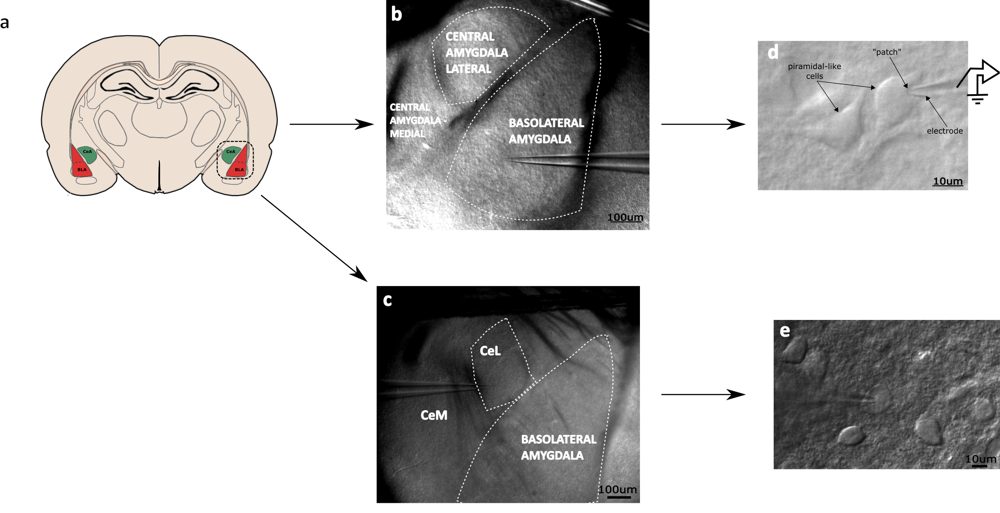
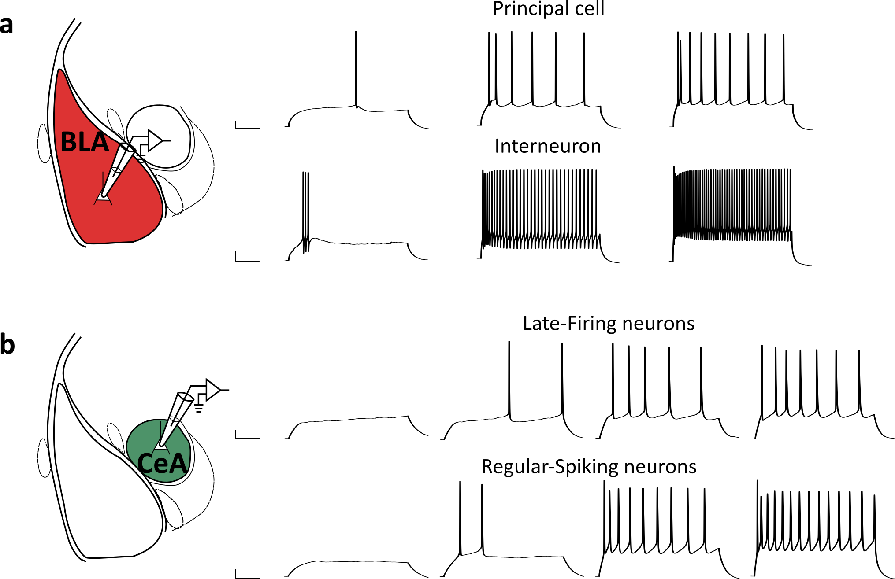

# Keywords

chemokines, chemokine receptors, central nervous system

<!--chapter:end:index.Rmd-->

# Abstract

Chemokines are emerging as key players in a broad array of biological
responses in the brain under physiological, non-inflammatory conditions.
They can be found in all brain cells - from brain-blood barrier
endothelium, through all types of glia, to neurons and neural stem
cells. Neuron-glia crosstalk is also suggested to be modulated by
chemokines. It should be noted that glial cells not only express
chemokine receptors but also can dynamically release them, thus
influencing the activity of neurons or other brain cells. This
orchestration of neuron-glia communication is believed to be essential
in maintaining brain homeostasis. Among them, CX3CL1 and CXCL12 have
attracted much attention by demonstrating their role in such phenomena
as neurogenesis, neuroprotection, as well as modulation of synaptic
transmission and
plasticity.<!-- this PhD dissertation will mainly focus on two chemokines, CX3CL1 and CXCL12, together with their corresponding receptors, CX3CR1 and CXCR4, as they are widely distributed in the CNS under non-inflammatory, physiological conditions and involved in an increasing array of functions, such as neurogenesis, neuroprotection, synaptic transmission, synaptic plasticity and behavior//// Among them, CX3CL1 and CXCL12 are particularly important in this regard, as they are constitutively and widely expressed in the CNS, where they act on cellular, synaptic, network, and behavioral levels. // Two of them, CX3CL1 and CXCL12, have particularly received much attention due to their constitutive and widely distributed expression in the CNS, along with their well-documented impact on neurodevelopment, neuroprotection, synaptic transmission, synaptic plasticity, and behavior.-->
The relatively high expression of their receptors, i.e., CX3CR1 and
CXCR4, in limbic brain structures supports the association between them
and neuropsychiatric diseases, such as anxiety or depression.
Consistently, the impairment of CX3CL1/CX3CR1 and/or CXCL12/CXCR4
signaling led to behavioral of neurobiological consequences, such as
impaired learning or anxiety. Despite this, mechanisms of chemokines in
the regions involved in anxiety (such as the amygdala) remain largely
unknown. It would provide critical insight into the physiological
mechanisms underlying neuroimmunological interactions in the amygdala.

The aim of this study was to dissect the underlying mechanisms and
effects of activation of CX3CR1 and CXCR4 receptors on synaptic
transmission and electrophysiological property of neurons in two nuclei
of the amygdala - basolateral (BLA) - the main input nucleus, and
central (CeA) - the main output nucleus.

To this end, by using a combination of electrophysiological and
pharmacological approaches, the actions of two chemokines (CX3CL1 and
CXCL12) on neuronal properties as well as synaptic transmission were
determined. Moreover, the involvement of microglia or astrocytes was
measured by using minocycline or fluorocitrate,
respectively.<!-- mechanisms of chemokine-regulated neuron–glia communication in the context of synaptic transmission.-->
In order to confirm the neuronal expression of CX3CR1,
immunohistochemical staining was used.

In the BLA, CX3CL1 increased the threshold for spike generation,
reducing the neuronal excitability of principal cells (PCs). This effect
was accompanied by the impaired LTP at cortico-BLA synapses and
attenuated GABAergic transmission manifested as a decreased frequency of
spontaneous inhibitory synaptic currents (sIPSCs). These effects were
blocked in the presence of the CX3CR1 antagonists, AZD8797. The
treatment of the inhibitor of microglial activity, minocycline,
eliminated the CX3CL1-triggered effects. These results suggest that the
CX3CR1 activation might modulate the memory and emotional processing
*via* its involvement in the GABAergic transmission and the attenuation
of the PCs firing and synaptic plasticity.

In the CeA, CX3CL1 decreased the input resistance of Regular-Spiking
neurons (RS), resulting in the attenuation of their spiking. The firing
reduction of RS neurons consequently reduced the frequency of sIPSCs in
Late-Firing cells (LF). Those effects were eliminated in the presence of
the antagonist of the CX3CR1 receptor, AZD8797, or minocycline, the
inhibitor of microglial activity. Thus, the network activity in the CeA
is suggested to be, at least in part, modulated by the CX3CR1
activation.

The treatment of CXCL12 in the BLA triggered a nonsignificant increase
in the PCs excitability and dual changes in the inhibitory synaptic
transmission.<!-- Regarding CXCL12, despite a trend towards the increase in the excitability and complex modulation of GABAergic transmission, this chemokine did not exert any statistically significant effects in the BLA.-->
These changes are in line with the CXCL12-induced increase in
glutamatergic transmission observed by other group.

CXCL12 enhanced firing in both types of CeA neurons. The application of
this chemokine facilitated the sEPSCs frequency preferentially onto
Regular-Spiking neurons. Those effects were eliminated in the presence
of the CXCR4 antagonist, AMD3100. The CXCR4 activation triggered an
increased frequency of sIPSCs onto Regular-Spiking neurons, whereas the
amplitude of these events in Late-Firing neurons was reduced. Those
effects were blocked in the presence of a CXCR4 receptor antagonist and
by inhibition of astrocytic activity by fluorocitrate.

Altogether, findings from this study highlight the neuromodulatory role
of CX3CL1 and CXCL12 in both nuclei of the amygdala, which is a
consequence of their regulation of local neuron-glial communication.
Further investigation in this area will lead to a better understanding
of neuroimmunological mechanisms in the amygdala and provide novel
insights into neuro-immune mechanisms in the amygdala and yield new
targets for developing treatments of amygdala-related disorders.

<!--chapter:end:00-0-abstract.Rmd-->

# Streszczenie

Coraz więcej badań wskazuje na rolę chemokin w szeregu biologicznych
odpowiedzi w warunkach fizjologicznych. Obecność chemokin wykazano we
wszystkich komórkach mózgowych - od komórek śródbłonka bariery
krew-mózg, przez wszystkie typy komórek glejowych, po neurony i nerwowe
komórki macierzyste. Sugeruje się także, że komunikacja pomiędzy
neuronami a komórkami glejowymi jest również modulowana przez chemokiny.
Należy podkreślić, że komórki glejowe nie tylko wykazują obecność
receptorów chemokinowych ale także potrafią w sposób dynamiczny uwalniać
poszczególne typy chemokin, tym samym wpływając na aktywność neuronów
lub innych komórek w mózgu. Przypuszcza się, że te interakcje są jednym
z kluczowych czynników odpowiedzialnych za utrzymanie w szerokim
rozumieniu homeostazy OUN. Dwie z chemokin, CX3CL1 i CXCL12, wzbudziły
zainteresowanie przez ich szczególnie istotną rolę w modulacji
neurogenezy, neuroprotekcji, a także modulacji transmisji synaptycznej
oraz
plastyczności.<!-- Przypuszcza się, że chemokiny mogą oddziaływać na przekaźnictwo między komórkami nerwowymi oraz procesy plastyczności synaptycznej.// Uważa się, że szczególnie dwie z nich, chemokina CX3CL1 i CXCL12 pełnią szczególnie istotną rolę w koordynacji ww. komunikacji. -->
Szczególnie wysoka ekspresja receptorów dla tych dwóch chemokin, tj.
CX3CR1 i CXCR4, w obszarach limbicznych sugeruje związek pomiędzy nimi a
chorobami psychicznymi, takimi jak lęk czy depresja. Potwierdzają to
badania w których wykazano, że zablokowanie sygnalizacji CX3CL1/CX3CR1
i/lub CXCL12/CXCR4 prowadzi w testach behawioralnych na zwierzętach do
upośledzenie uczenia się oraz nasilenia reakcji lekowych. Mimo to
mechanizm działania chemokin w obszarach mózgu związanymi z zaburzeniami
lękowymi (ciało migdałowate) pozostaje w zasadzie niezbadany. Określenie
wpływu chemokin na regulację aktywności struktur ciała migdałowatego
wniosłoby znaczący wkład w dalsze zrozumienie powiązania pomiędzy
układem nerwowym a odpornościowym.

Celem przeprowadzonych badań, było określenie mechanizmów i efektów
aktywacji receptorów CX3CR1 i CXCR4 na przekaźnictwo nerwowe oraz
właściwości elektrofizjologiczne neuronów w dwóch jądrach ciała
migdałowatego - w podstawnobocznym (BLA) - głównym wejściu oraz
środkowym (CeA) - głównym wyjściu z obszaru kompleksu jąder
migdałowatych.

Dzięki połączeniu elektrofizjologicznych i farmakologicznych metod, te
efekty zostały zbadane. Co więcej, wpływ mikrogleju i astrocytów był
zmierzony przez użycie minocykliny lub fluorocytrynianu. W celu
określenia neuronalnej lokalizacji receptora CX3CR1 wykonano także
barwienia immunohistochemiczne.

W BLA, podanie chemokiny CX3CL1 zwiększyło prąd progowy, prowadząc tym
samym do zmniejszonej pobudliwości neuronów głównych (ang. *principal
cells*, PCs). Temu efektowi towarzyszyła osłabiona plastyczność
synaptyczna w synapsach korowo-podstawnobocznych oraz zmniejszona
częstotliwość spontanicznych hamujących prądów postsynaptycznych
(sIPSCs). Efekty te blokowane były w obecności antagonisty receptora
CX3CR1, AZD8797. Również zastosowanie inhibitora aktywności mikrogleju,
minocykliny, blokowało efekty podania chemokiny CX3CL1. Uzyskane wyniki
mogą sugerować, że aktywacja receptorów CX3CR1 poprzez wpływ na
przekaźnictwo GABArgiczne oraz osłabienie pobudliwości komórek
podstawowych i procesów plastyczności synaptyczej może modulować pamięć
i reakcję emocjonalną.

W CeA, CX3CL1 zmniejszała oporność błony komórkowej neuronów regularnie
wyładowujących się (ang. *Regular-Spiking neurons*; RS), co skutkowało
spadkiem ich pobudliwości. Spadek aktywności tych neuronów spowodował
zmniejszenie sIPSCs rejestrowanych w neuronach o późnym początku
wyładowania (ang. *Late-Firing neurons*; LF). Efekty te były blokowane w
obecności w obecności antagonisty receptorów CX3CR1 AZD8797 lub po
zahamowaniu aktywności komórek mikroglejowych minocykliną. Sugeruje to,
że aktywność sieciowa CeA jest przynajmniej w części modulowana przez
aktywację receptorów CX3CR1.

Podanie chemokiny CXCL12 w BLA wywoływało nieznaczny wzrost pobudliwości
PCs oraz dwukierunkowe zmiany w hamującej transmisji synaptycznej,
chociaż oba te efekty nie uzyskały istotności statystycznej. Kierunek
zarejestrowanych efektów aktywacji receptora CXCR4 jest zgodny wynikami
uzyskanymi przez inną grupę badawczą, która wykazała wzrost
przekaźnictwa pobudzającego w BLA po podaniu CXCL12.

Podanie CXCL12 zwiększyło pobudliwość zarówno neuronów RS jak i LF w
CeA. Podanie tej chemokiny nasilało również częstotliwość spontanicznych
pobudzających prądów synaptycznych rejestrowanych z neuronów RS. Efekty
te blokowane były przez antagonistę receptora CXCR4, AMD3100. Aktywacja
receptorów CXCR4 zwiększała także częstotliwość sIPSCs rejestrowanych z
neuronów RS. Natomiast rejestracja z neuronów LF wykazała hamujące
działanie CXCL12 na amplitudę prądów GABAergicznych. Efekty te były
blokowane przez antagonistę receptora CXCR4, jak i przez zablokowanie
aktywności astrocytów podaniem fluorocytrynianu. Podsumowując, uzyskane
wyniki sugerują neuromodulacyjną rolę chemokin w obu badanych jądrach
obszaru ciała migdałowatego, co wynika z ich regulacji komunikacji
pomiędzy neuronami a komórkami glejowymi. Dalsze badania w tym zakresie
mogą prowadzić do lepszego zrozumienia mechanizmów neuroimmunologicznych
w ciele migdałowatym i dostarczyć nowych kandydatów dla rozwoju leczenia
zaburzeń związanych z funkcjami tej struktury.

<!--chapter:end:00-1-streszczenie.Rmd-->

# Acknowledgments

Składam serdeczne podziękowania **mojemu promotorowi, Panu prof. dr hab.
Krzysztofowi Tokarskiemu** za opiekę i pomoc naukową podczas moich
studiów doktoranckich, zaangażowanie, przekazaną wiedzę, a także cenne
wskazówki i sugestie udzielone mi w czasie realizacji niniejszej pracy.

Dziękuję również opiekunowi mojego grantu Preludium, **Panu prof. dr
hab. Grzegorzowi Hessowi**, za pomoc oraz cenne uwagi podczas
wykonywanej przeze mnie pracy naukowej.

Dziękuję także **koleżankom i kolegom z Zakładu Fizjologii**, zawsze
chętne udzielanie mi pomocy i tworzenie miłej atmosfery w pracy.
Szczególnie chciałabym podziękować **dr Bartoszowi Bobuli** za wykonanie
zewnątrzkomórkowych rejestracji elektrofizjologicznych oraz **dr
Magdalenie Kusek** za cenne sugestie przy pisaniu pracy.

Bardzo dziękuję **Pani dr Izabeli Figiel-Ożóg i Panu prof. dr hab.
Jakubowi Włodarczykowi z Pracowni Biofizyki Komórki Instytut Nenckiego w
Warszawie** za wykonanie barwień na obecność receptora CX3CR1 w
pierwotnych hodowlach neuronalnych ciała migdałowatego.

W sposób szczególny chciałabym podziekować **moim najbliższym,
szczególnie moim Rodzicom, Bartkowi, oraz mojemu bratu** za
niewyczerpane pokłady wsparcia, cierpliwości i wiary we mnie. Byliście
przez te lata niczym najlepsza motywacyjna grupa couchów i bez Was ta
praca by nie powstała.

<!--chapter:end:00-2-acknowledgements.Rmd-->

# Abbreviations

<!-- \renewcommand{\nompreamble}{\vspace{0.25in}} -->
<!-- \makenomenclature -->
<!-- \renewcommand{\nomname}{LIST OF ABBREVIATIONS} -->
<!-- \item[ACSF] artificial cerebrospinal fluid -->
<!-- \item[AMPA] alpha-amino-3-hydroxy-5- methyl-4-isoxazilepropionate  -->
<!-- \item [BLA] basolateral nucleus of the amygdala -->
<!-- \item [CeA] central nucleus of the amygdala -->
<!-- \item [CNS] central nervous system  -->
<!-- \item [DIC] differential interference contrast -->
<!-- \item [GPCR] G-protein-coupled receptor -->
<!-- \item [ICM] intercalated cell masses  -->
<!-- \item [LHA] lateral hypothalamus area -->
<!-- \item [mEPSC] miniature excibitory post-synaptic currents -->
<!-- \item [mIPSC] miniature inhibitory post-synaptic currents -->
<!-- \item [NDS] normal donkey serum -->
<!-- \item [NMDA] N-methyl-aspartate  -->
<!-- \item [NTS] nucleus of the solitary tract -->
<!-- \item [PVN] paraventricular nucleus  -->
<!-- \item [sEPSC] spontaneous excibitory post-synaptic currents -->
<!-- \item [sIPSC] spontaneous inhibitory post-synaptic currents -->

| Abbreviation | Explanation                                                     |
|:-------------|:----------------------------------------------------------------|
| 5-HT         | serotonin                                                       |
| A1R          | adenosine A1 receptor                                           |
| A2AR         | adenosine A2A receptor                                          |
| A2CR         | adenosine A2C receptor                                          |
| A3R          | adenosine A3 receptor                                           |
| AAA          | anterior amygdala area                                          |
| ACKRs        | atypical chemokine receptors                                    |
| ACSF         | artificial cerebrospinal–fluid                                  |
| AHA          | amygdalo-hippocampal area                                       |
| AIS          | axon initial segment                                            |
| AKT          | protein kinase B                                                |
| AMPAR        | *α*-amino-3-hydroxy-5-methyl-4-isoxazolepropionic acid receptor |
| AraC         | cytarabine                                                      |
| B            | basal amygdala                                                  |
| BLA          | basolateral complex of the amygdala                             |
| BMA          | basomedial nucleus                                              |
| BNST         | bed nucleus of the stria terminalis                             |
| CaMKII       | calcium/calmodulin-dependent protein kinase II                  |
| cAMP         | cyclic adenosine monophosphate                                  |
| CatS         | cathepsin S                                                     |
| CB           | calbindin                                                       |
| CCK          | cholecystokinin                                                 |
| CeA          | central complex of the amygdala                                 |
| CeC          | capsular part of the central amygdala                           |
| CeI          | intermediate part of the central amygdala                       |
| CeL          | lateral part of the central amygdala                            |
| CeM          | medial part of the central amygdala                             |
| CKRs         | chemokine receptors                                             |
| CNS          | central nervous system                                          |
| CR           | calretinin                                                      |
| CRF          | corticotropin-releasing factor                                  |
| CS           | conditioned stimulus                                            |
| Cx43         | connexin-43                                                     |
| D1           | dopamine type-1 receptor                                        |
| DA           | dopamine                                                        |
| DAG          | diacyl glycerol                                                 |
| DG           | dentate gyrus                                                   |
| DIC          | differential interference contrast                              |
| DMSO         | dimethyl sulfoxide                                              |
| DRN          | dorsal raphe nucleus                                            |
| DVC          | dorsal vagal complex                                            |
| E/I          | excitatory/inhibitory                                           |
| eEPSC        | evoked excitatory postsynaptic current                          |
| ENK          | enkephalin                                                      |
| EPM          | elevated-plus maze                                              |
| EPSPs        | excitatory postsynaptic potentials                              |
| ERK½         | extracellular signal-regulated kinase                           |
| fEPSPs       | field excitatory postsynaptic potentials                        |
| FPs          | field potentials                                                |
| GAGs         | glycosaminoglycans                                              |
| GFP          | green fluorescent protein                                       |
| GLT-1        | glutamate transporter 1                                         |
| GPCRs        | G-protein-coupled receptors                                     |
| GRKs         | G-protein coupled receptor kinases                              |
| HCN          | hyperpolarization-activated cyclic nucleotide-modulated channel |
| i.c.v        | intracerebroventricularly                                       |
| i.p          | intraperitoneally                                               |
| IP3          | inositol 1,4,5-trisphosphate                                    |
| ITC          | intercalated cell clusters                                      |
| JAKs         | janus kinases                                                   |
| LA           | lateral amygdala                                                |
| LC           | locus coeruleus                                                 |
| LF           | Late-Firing                                                     |
| LH           | lateral hypothalamus                                            |
| LHA          | lateral hypothalamus area                                       |
| LPS          | lipopolysaccharide                                              |
| LTD          | long-term depression                                            |
| LTP          | long-term potentiation                                          |
| MAPK         | mitogen-activated protein kinase                                |
| MCH          | melanin-concentrating hormone                                   |
| MeA          | medial nucleus of the amygdala                                  |
| mEPSCs       | miniature excitatory postsynaptic currents                      |
| mGluR1*α*    | metabotropic glutamate receptors 1*α*                           |
| mIPSCs       | miniature inhibitory postsynaptic currents                      |
| MMP          | matrix metalloproteases                                         |
| NA           | nucleus accumbens                                               |
| NE           | noradrenergic                                                   |
| NF-*κ*B      | nuclear factor-*κ*B                                             |
| NMDA         | N-Methyl-D-aspartate                                            |
| NMDAR        | N-Methyl-D-aspartate receptor                                   |
| NTS          | nucleus of the solitary tract                                   |
| OR           | oxytoxin receptors                                              |
| PAG          | periaqueductal gray                                             |
| PBN          | parabrachial nucleus                                            |
| PBS          | phosphate-buffered saline                                       |
| PCs          | principal cells                                                 |
| PFC          | prefrontal cortex                                               |
| PI3K         | phosphatidylinositol-3-OH kinase                                |
| PIP2         | phosphatidylinositol 4,5-bisphosphate                           |
| PKC          | protein kinase C                                                |
| PKC*δ*       | protein kinase C*δ*                                             |
| PLC          | phospholipase C                                                 |
| PPR          | paired-pulse ratio                                              |
| PTMs         | post-translational modifications                                |
| PV           | parvalbumin                                                     |
| PVN          | paraventricular nucleus                                         |
| PVT          | paraventricular nucleus of the thalamus                         |
| RS           | Regular-Spiking                                                 |
| RT           | room temperature                                                |
| sEPSCs       | spontaneous excitatory postsynaptic currents                    |
| SGZ          | subgranular zone                                                |
| sIPSCs       | spontaneous inhibitory postsynaptic currents                    |
| SN           | substantia nigra                                                |
| SOM          | somatostatin                                                    |
| SVZ          | subventricular zone                                             |
| TBS          | theta burst stimulation                                         |
| TNF*α*       | tumour necrosis factor*α*                                       |
| TTX          | tetrodotoxin                                                    |
| US           | unconditioned stimulus                                          |
| VIP          | vasoactive intestinal peptide                                   |
| VTA          | ventral tegmental area                                          |

<!-- "AHP", "afterhyperpolarization",
    "mPFC", "medial part of prefrontal cortex",
    "MGN", "the medial geniculate nucleus",
    "AC", "the auditory cortex",
    "STATs", "signal transducers and activators of transcription",

    "ECM", "extracellular matrix",
    "GIRK", "inward rectifier potassium currents",
    "AVP", "arginine–vasopressin",
    "DRG", "dorsal horn of the spinal cord",
    "SLMVs", "synaptic-like microvesicles",
    "VGLUTs", "vesicular glutamate transporters", -->
<!--chapter:end:00-3-abreviations.Rmd-->

# 1 Introduction

## 1.1 Chemokines

### 1.1.1 Brief history of chemokines

Chemokines (chemotactic cytokines) are a family of small (7-11 kDa)
secreted proteins with chemoattractant and regulatory activities. They
were originally identified as key regulators of both the peripheral and
central immune response, serving chemotactic function on immune cells in
late 1980 (Yoshimura *et al.*, 1987). However, a decade later, the first
reports revealed the prominent expression of chemokines and their
receptors in the central nervous system (CNS) (Meucci *et al.*, 1998).
Why do cells (neurons, astrocytes, and microglia) in CNS express
chemokines and chemokine receptors, and what is the neurophysiological
relevance of chemokines in the CNS? The explanation is that they control
neuroinflammation, for example, by driving leukocyte trafficking and
activation into the CNS, facilitating the immune responses, targeting
cells of the innate and adaptive immune system (Williams *et al.*,
2014). However, chemokine expression in the CNS is not only related to
pathological conditions. It is now clear that all types of brain cells
synthesize distinct chemokines and might respond to chemokine
stimulation *via* their cognate receptor expression, also under
physiological conditions, suggesting their brain-specific functions.
Indeed, mounting evidence illustrates that chemokine can act on cellular
(e.g., inducing neuroprotective signaling pathways), synaptic (e.g.,
modulating synaptic transmission), network (e.g., regulating synaptic
potentiation), and behavioral levels (e.g., impairing memory; for a
comprehensive review: Sowa & Tokarski (2021)). Moreover, the complex
cellular patterns of chemokine/chemokine receptor expression lead to
intricate cell-to-cell communications. Thus, of particular interest is
now the idea that CNS chemokines are not only mediators of
neuroinflammation but also orchestrators of neuron-glia crosstalk, which
is essential in maintaining brain homeostasis (Trettel *et al.*, 2020).

This PhD dissertation will mainly focus on two chemokines, CX3CL1 and
CXCL12, together with their corresponding receptors, CX3CR1 and CXCR4,
as they are widely distributed in the CNS under non-inflammatory,
physiological conditions and involved in an increasing array of
functions, such as neurogenesis, neuroprotection, synaptic transmission,
synaptic plasticity and behavior (Réaux-Le Goazigo *et al.*, 2013;
Trettel *et al.*, 2020; Sowa & Tokarski, 2021).

### 1.1.2 Classification, structure, and signaling of the chemokine system

Chemokines are small proteins consisting of 60 to 100 amino acids with
20 to 90% homology in their sequences. Their molecular weight varies
from 8 to 14 kDa. To date, 53 human chemokines and 23 chemokine
receptors have been cloned or characterized (Hughes & Nibbs, 2018). All
chemokine family members share a similar tertiary structure: a flexible
N-terminus and N-terminal loop, followed by a three-stranded
antiparallel β-sheet on which a C-terminal α-helix is folded (for
review: Miller & Mayo (2017)). Although N-terminus is widely
acknowledged as pivotal for receptor activation, it is not sufficient in
this regard. Notably, several additional regions of both chemokine and
chemokine receptor were identified as critical for their binding and
signal transduction, including N-loop, or highly conserved GP
(glycine-proline) motif (for review: Kleist *et al.* (2016)). Thus,
these data illustrate that subtle structural changes in a chemokine or
chemokine receptor domain may significantly alter the receptor
activation, resulting in unique functional outcomes for
chemokine-receptor pairs.

Chemokines were initially named according to their function or from the
cell type that produced them. However, a systematic nomenclature was
introduced in 2000, based on the spacing of the first two cysteine
residues closest to the N‐terminus. It consists of the subfamily
designation (XC, CC, CXC, CX3C), followed by the letter “L” (denoting
“ligand”), and the number according to when the gene was first isolated
(Zlotnik & Yoshie (2000), see Figure <a href="#fig:family">1.1</a>).
Specifically, one amino acid separates the first two cysteine residues
in the CXC subclass (also known as α, see Figure
<a href="#fig:family">1.1</a>, part a). Chemokines containing the first
two cysteine residues adjacent to each other are classified into the CC
subclass (also known as β, see Fig. <a href="#fig:family">1.1</a>, part
b). C chemokines (also known as γ, see Figure
<a href="#fig:family">1.1</a>, part c) are characterized by the presence
of only two cysteine residues. The CX3C (also known as δ) chemokine
subfamily currently represents only a single member, CX3CL1 (also called
fractalkine). It is characterized by the presence of three amino acids
between the first two cysteine residues, as well as a transmembrane and
mucin-like domain (see Figure <a href="#fig:family">1.1</a>, part d).

<div class="figure" style="text-align: center">


<p class="caption">
Figure 1.1: **Classification of chemokines and chemokine receptors**.
**(a)** Chemokines are classified into four distinct subclasses: C, CC,
CXC, and CX3C according to the number and spacing of their cysteine
residues in their N-terminus. Cys – cysteine residue, X – amino acid
residue, disulfide bridges are shown as dotted lines. Receptors for the
CXC family are shown in violet, whereas receptors for the CC family are
depicted in blue. In addition, the receptor for the C family is
presented in yellow and the receptor for the CX3R family is shown in
red. **(b)** Atypical chemokine receptors, their initial names, ligand
selectivity, and crosstalk with classical chemokine receptors. ACKR1 and
ACKR2 bind a broad spectrum of chemokines, whereas ACKR3 and ACKR4 bind
a more limited number of chemokines.
</p>

</div>

Chemokines exert their biological effects through cell surface chemokine
receptors (CKRs), which can be divided into two families: conventional
chemokine receptors and atypical chemokine receptors (ACKRs).
Conventional receptors belong to the classic G-protein-coupled receptors
(GPCR) family, consisting of seven transmembrane helices connected by
several intra- and extracellular loops, N-terminal extracellular, and
C-terminal intracellular domains. The N-terminal extracellular domain is
considered essential for chemokine binding and receptor activation,
while the C-terminal end is coupled to G-proteins and is vital for
receptor signaling upon chemokine binding. Based on the subfamily of
chemokine ligand they bind, CKRs are named following the same principle
as the chemokines but replacing “L” with “R,” which denotes “receptor”
(see: Figure <a href="#fig:family">1.1</a>). Most of these receptors
belong to the CCR and CXCR classes, with 10 and 6 members, respectively,
while there is only one CX3CR and one XCR (Hughes & Nibbs, 2018).

Chemokine receptors typically signal through canonical G protein
pathways and couple either to the G<sub>αi</sub> subunit following
inhibition of the adenylyl cyclase activity to reduce the intracellular
cyclic adenosine monophosphate (cAMP) levels or G<sub>αq</sub> that
activates phospholipase C, leading to the formation of diacylglycerol
and inositol 1,4,5-triphosphate with a subsequent increase in a protein
kinase C (PKC) activity and transient elevations of cytosolic
Ca<sup>2+</sup> levels. However, mounting evidence describes the
involvement of other intracellular signaling cascades, including
distinct G protein subtypes (G<sub>11</sub> or G<sub>α12/13</sub>), or
alternative signaling targets, such as mitogen-activated protein kinase
(MAPK), extracellular signal-regulated kinase (ERK)½, Janus kinases
(JAKs), and nuclear factor-κB (NF-κB) (for reviews: Allen *et al.*
(2007), Rostène, Guyon, *et al.* (2011)).

ACKRs, a small subset of proteins with at least four representatives
(Bachelerie *et al.*, 2014; Salvi *et al.*, 2017), structurally resemble
conventional chemokine receptors: ACKR1 (Duffy antigen/receptor for
chemokines (DARC)), ACKR2 (D6), ACKR3 (CXCR7), and ACKR4 (chemocentryx
chemokine receptor (CCX-CKR)). They bind a wide variety of chemokine
ligands, with up to 18 ligands for ACKR1, and signal predominantly
through β-arrestins (Hughes & Nibbs, 2018). Due to their inability to
activate typical G protein-signaling pathways and thereby induce
chemotactic activity, they were initially thought to scavenge chemokine
ligands or function as co-receptors and thus regulate inflammation or
chemokine gradient formation (Nibbs & Graham, 2013; Bachelerie *et al.*,
2014; Bonecchi & Graham, 2016). However, recent data cast a new light on
the complexity of the ACKRs role as regulating components of chemokine
networks in a wide range of developmental, physiological, and
pathological contexts (for review: Salvi *et al.* (2017)). Regarding the
CNS, the knowledge about the role of ACKRs is started to accumulate.

#### 1.1.2.1 Chemokine system expression and signaling

As chemokines constitute one of the most tightly regulated systems,
their signaling is modulated *via* a broad array of factors, which we
are now beginning to appreciate (see for reviews: Eiger *et al.* (2021);
Hughes & Nibbs (2018); Zweemer *et al.* (2014)). Figure
<a href="#fig:chemmechanisms">1.2</a> illustrates most of these
mechanisms, focusing on CXCL12/CXCR4/ACKR3 as well as CX3C1/CX3CR1 axes.
These processes include redundancy, post-translational modifications,
dynamic chemokine-receptor interactions, atypical chemokine receptors,
dimerization, interactions with other proteins on the membrane surface,
and biased signaling.

Firstly, the regulation of chemokines and their receptors may be
controlled by post-translational modifications (PTMs), the chemical
modification of a protein after its translation, such as citrullination
or cleavage by several proteases (Hughes & Nibbs (2018), see: Fig.
<a href="#fig:chemmechanisms">1.2</a>, part a). These changes profoundly
affect chemokine system activity, including chemokine
activation/inactivation, the change in binding affinity, or even
switching from a receptor agonist to an antagonist (Hughes & Nibbs,
2018).

Another essential aspect of chemokine-induced signaling is their rich
repertoire of ligand-receptor relationships (for reviews: Zlotnik &
Yoshie (2000), Hughes & Nibbs (2018), Fig.
<a href="#fig:chemmechanisms">1.2</a>, part b). It is widely accepted
that most chemokines may bind to several different receptors, whereas
nearly all of CKRs may recognize various chemokine ligands. However, it
becomes increasingly evident that the interactions between chemokines
and CKRs are far more restricted, complex, and less redundant than
previously thought, as further addressed in this section. Consequently,
each chemokine/CKR pair interaction depends, for example, upon the
simultaneous spatial and temporal expression of both molecules (Zweemer
*et al.*, 2014).

Most CKRs, like many GPCRs, constitutively exist as dimers
(heterodimers/homodimers) or oligomers, thereby modifying ligand binding
properties or activating different signaling pathways (Salanga & Handel,
2011). Heterodimers, as they are formed with other GPCRs families (e.g.,
with opioid receptors), underlie the synergistic or antagonistic
activity of various chemokine pairs (Kleist *et al.*, 2016). Moreover,
increasing data shows that dimer formation is regulated by other
factors, such as glycosaminoglycans (GAGs).

GAGs, polysaccharides present at the cell surface and within
extracellular matrices, bind chemokines and thereby immobilize and
accumulate them. It is an essential step for the chemokine function, as
it regulates their local concentration and availability for their
receptors. Considering GAGs cell-, tissue- and developmental-specific
expression (Lortat-Jacob, 2009), along with their selective binding of
certain chemokines, GAGs-chemokine interactions are regarded as yet
another mechanism contributing to chemokines orchestration of
cell-to-cell communication.

Biased signaling, also known as functional selectivity, is another
feature specific for GPCR receptors (Zweemer *et al.* (2014), Kleist *et
al.* (2016), see: Fig <a href="#fig:chemmechanisms">1.2</a>, part d).
Three types of biased signaling can be distinguished. Ligand bias occurs
when specific chemokines, although binding to the same receptor, could
preferentially activate one of the intracellular pathways, either
G-protein or β-arrestin, and their downstream elements, according to
cell-specific differences. Another type of bias signaling, receptor
bias, occurs when a specific receptor, which typically binds multiple
chemokine ligands, preferentially couples to a particular chemokine.
Finally, cellular or tissue bias occurs when the same chemokine–receptor
pair leads to activation of distinct signaling cascades or cellular
responses in different spatial contexts. This type of bias is a
consequence of differential expression or function of receptor and
transducer elements, including every element of the signal transduction
cascade, from proximal effectors (e.g., G proteins and β-arrestins), to
all of the downstream signal transduction machinery (e.g., ERK½ or MAPK)
in different cells and tissue during different developmental stages.
Thus, the final cellular behavior of chemokine receptor activation
highly depends on the ligand, the receptor, and the spatiotemporal
context.

In summary, CKRs are a subgroup of GPCRs that impacts many crucial
functions, such as homeostasis, development, and immune regulation, to
list a few. A signaling network underlying such a range of fundamental
cellular processes must be finely modulated, and this is achieved, among
others, by these multifaceted, highly interconnected, tightly regulated
mechanisms enabling quick response to the dynamic microenvironment with
possible myriad functionally diverse outcomes.

<div class="figure" style="text-align: center">


<p class="caption">
Figure 1.2: **Molecular mechanisms of the chemokine system in the CNS.**
**(a)** Post-translational modifications exemplified by CX3CL1
transmembrane form cleavage by ADAM10 and ADAM17 proteases into its
soluble variant. **(b)** The chemokine family redundancy is exemplified
by ACKR3, an atypical chemokine receptor, which binds two chemokines,
CXCL11 and CXCL12. Besides the ACKR3 receptor, these two chemokines
activate other chemokine receptors, namely CXCR3 and CXCR4,
respectively. **(c)** Most chemokine receptors can form homo- and
hetero-dimers. It is exemplified by the well-known CXCR4-ACKR3 complex.
CXCR4 receptor is a classical chemokine receptor, which activates G
alphaq/i signaling pathways, including PKC or (ERK)1/2. As an atypical
receptor, ACKR3 alone activates beta-arrestin-mediated pathways, leading
to receptor internalization or scavenging. However, after
heterodimerization with CXCR4, it can modify ligand binding properties
and receptor signaling as well as intracellular trafficking. **(d)**
Chemokine bias signaling occurs when specific chemokines could
preferentially activate different intracellular pathways, either
G-protein or beta-arrestin, although binding to the same receptor. It
can be due to a specific ligand or receptor, as exemplified here, due to
a specific cell. As suggested recently, when ACKR3 is activated on
neurons, it signals through beta-arrestin-mediated pathways. Still, when
it is activated on astrocytes, it recruits beta-arrestin-mediated
pathways.
</p>

</div>

The two members of the chemokine family, i.e., CX3CL1 and CXCL12, have
attracted much researchers’ attention due to their wide distribution in
the CNS under physiological conditions and involvement in an increasing
array of functions. In addition to their broad expression in the
periphery, which is beyond the scope of this dissertation, chemokines
and CKRs are also expressed by healthy neurons, microglia, astrocytes,
oligodendrocytes, and endothelial cells (for a comprehensive review,
see: Sowa & Tokarski (2021)).

#### 1.1.2.2 CX3CL1/CX3CR1 pair structure, expression, and signaling

CX3CL1, also known as fractalkine or neurotactin, is a unique chemokine
on many levels. First of all, to date, it is the only known member of
the CX3C chemokine δ family (Pan *et al.*, 1997). In humans, the full
length of CX3CL1 consists of 397 amino acids, whereas in mice, 395 amino
acids (Bazan *et al.*, 1997; Pan *et al.*, 1997). Thus, it is also
larger than most other chemokines, whose most common size is around
70–80 amino acids (Zlotnik & Yoshie, 2012). CX3CL1 is comprised of an
extracellular 76-amino acid N-terminal domain, a 241-amino acid
glycosylated mucin-like stalk, an 18-amino acid transmembrane helix, and
a short acid cytoplasmic C-terminal domain. Like CXCL16, fractalkine is
present in two different forms: a membrane-anchored form tethered to
cell membranes by a mucin-line stalk (approximately 95 kDa) and a
shorter soluble form released upon proteolytic cleavage of its
N-terminal chemokine domain (approximately 70 kDa) *via* the action of
several proteases (Bajetto *et al.* (2001); Schulte *et al.* (2007), see
Section <a href="#chemokinessignal">1.1.2.1</a>). These enzymes are
metalloproteinases (enzymes containing a disintegrin and
metalloproteinase domain) such as ADAM10, ADAM17, or cysteine protease
Cathepsin S (CatS), acting both in the periphery and the CNS (Garton *et
al.*, 2001; Hundhausen *et al.*, 2003; Clark *et al.*, 2007; Cook *et
al.*, 2010; Jones *et al.*, 2013). While soluble CX3CL1 acts as a
conventional chemokine, promoting migration and chemotaxis of
CX3CR1-expressing cells, mostly monocytes, membrane-bound CX3CL1 actions
are similar to those of an adhesion molecule, mediating leukocyte
capture and infiltration (Ransohoff, 2009). Some important molecular
pathways implicated in CX3CL1/CX3CR1 signaling are summarized on Fig.
<a href="#fig:cx3cr1signal">1.3</a>.

Both forms of CX3CL1 interact with the same affinity with CX3CR1, a
G<sub>i</sub>-protein-coupled receptor (Imai *et al.*, 1997). The
subunit G<sub>i</sub> inhibits the production of cAMP, inducing a
variety of intracellular second messengers, including phosphoinositide
3-kinase (PI3K), protein kinase B (AKT), and nuclear factor
kappa-light-chain-enhancer (NFκB) (Al-Aoukaty *et al.*, 1998;
Chandrasekar *et al.*, 2003). These molecules are known to regulate a
wide range of cellular functions, including apoptosis, proliferation,
and transcription.

<div class="figure" style="text-align: center">


<p class="caption">
Figure 1.3: **CX3CL1-CX3CR1 signaling.** CX3CR1, which is G
protein-coupled and transduces several well-characterized signaling
pathways leading to activation of transcription factors, including NFkB
and CREB. Gi, heterotrimeric G protein-coupled to Gi protein; PI3K,
phosphatidylinositide 3-kinases; Ras/Raf small GTPases; PLC,
phospholipase C; PKC, protein kinase C; Akt, serine/threonine-specific
protein kinase; MEK, mitogen-activated protein kinase; MEKK, MAP3
kinase; p38, p38 mitogen-activated protein kinase; IkB, an inhibitor of
kappa B; IKK, an inhibitor of kB kinase; ERK, extracellular
signal-regulated kinases; JNK, c-Jun N-terminal kinase; NFkB, nuclear
factor kB; CREB, cAMP response element-binding protein.
</p>

</div>

<!--CX3CR1, which is G protein-coupled and transduces several well-characterized signaling pathways leading to activation of transcription factors, including NFkB and CREB. Gi, heterotrimeric G protein-coupled to Gi protein; PI3K, phosphatidylinositide 3-kinases; Ras/Raf small GTPases; PLC, phospholipase C; PKC, protein kinase C; Akt, serine/threonine-specific protein kinase; MEK, mitogen-activated protein kinase; MEKK, MAP3 kinase; p38, p38 mitogen-activated protein kinase; IkB, an inhibitor of kappa B; IKK, an inhibitor of kB kinase; ERK, extracellular signal-regulated kinases; JNK, c-Jun N-terminal kinase; NFkB, nuclear factor kB; CREB, cAMP response element-binding protein.// https://www.researchgate.net/publication/322645691_Microglia_and_aging_The_role_of_the_TREM2-DAP12_and_CX3CL1-CX3CR1_Axes/figures?lo=1 -->

In the brain, CX3CL1 and its receptor, CX3CR1, are widely distributed in
the CNS, including the hippocampus, amygdala, cerebral cortex, globus
pallidus, striatum, and thalamus (Harrison *et al.*, 1998; Tarozzo *et
al.*, 2003). Besides the well-documented neuronal expression of CX3CL1,
a handful of studies also revealed its presence in astrocytes, albeit at
lower levels (for instance: Sunnemark *et al.* (2005)). However, the
expression pattern of CX3CL1 receptor, CX3CR1, in the CNS, remains
controversial: some reports confine the localization of CX3CR1 microglia
(Tarozzo *et al.*, 2003; Cardona *et al.*, 2006), whereas several lines
of biochemical, immunohistochemical, and electrophysiological evidence
documented the presence of the functional CX3CR1 receptor also in
hippocampal, hypothalamic, cerebral, striatal, and dorsal raphe nucleus
(DRN) neurons (Meucci *et al.*, 1998, 2000; Maciejewski-Lenoir *et al.*,
1999; Hatori *et al.*, 2002; Hughes *et al.*, 2002; Tarozzo *et al.*,
2003; Verge *et al.*, 2004; Limatola *et al.*, 2005; Zhuang *et al.*,
2007; Heinisch & Kirby, 2009; Ruchaya *et al.*, 2012, 2014). Thus,
although predominantly expressed by microglia, CX3CR1 is also documented
to be present on neuronal membranes, at least in pathological
conditions.

#### 1.1.2.3 CXCL12/CXCR4/ACKR3 trio structure, expression, and signaling

On the other hand, CXCL12, also known as the stromal cell-derived factor
1α, is another chemokine yet belonging to the CXC subfamily. In humans,
CXCL12 precursor mRNA precursor yields the expression of six isoforms
(α, β, γ, δ, ε, φ), ranging in size from 10 to 16 kDa (Yu *et al.*,
2006). The α product of alternative splicing is the smallest and most
abundant one (Yu *et al.*, 2006). Hence, as used here, the term “CXCL12”
refers to the α isoform, which is the main focus of the presented PhD
dissertation. It consists of 89 amino acids, including a signaling
peptide of 19 amino acids, which is cleaved to generate the mature
protein. However, other isoforms are also likely to play a key role in
physiologic and pathological processes (for a review: Britton *et al.*
(2021)). CXCL12 is comprised of a three-stranded β-sheet held in close
apposition to an α-helix, which are essential for CXCR4 activation
(Murphy *et al.*, 2007; Wu *et al.*, 2010). CXCL12 signal through its
canonical CXCR4 receptor and atypical ACKR3 receptor, previously known
as CXCR7. All three molecules are well-conserved across the vertebrate
species (Nomiyama *et al.*, 2013; Nomiyama & Yoshie, 2015).
Surprisingly, the binding affinity between CXCL12 and ACKR3 is roughly
ten times higher than those between CXCL12 and CXCR4 (Balabanian *et
al.*, 2005).

CXCL12, along with their receptors CXCR4 and ACKR3, is constitutively
expressed and widely distributed in the CNS, both during
neurodevelopment and adulthood (Banisadr *et al.*, 2002; Stumm *et al.*,
2002, 2003; Schönemeier *et al.*, 2008). Moreover, these molecules are
present in nearly all CNS cell types, including endothelial, glial, and
notably neuronal cells. Specifically, both CXCL12 and CXCR4 are
co-localized with many neuropeptides, for example, in dopaminergic
neurons in the substantia nigra (SN) and the ventral tegmental area
(VTA)(Guyon *et al.*, 2006). Furthermore, ACKR3 and CXCR4 are
co-expressed in the same neuronal (Shimizu *et al.*, 2011) and
astrocytic populations (Odemis *et al.*, 2010). In neurons, prominent
cytoplasmic expression of ACKR3 was demonstrated, whereas CXCR4 was
found on the cell membrane (Shimizu *et al.*, 2011), suggesting that
ACKR3 may affect CXCR4 trafficking and/or coupling to other proteins
(Shimizu *et al.*, 2011). Consistently, ACKR3 up-regulation was shown to
enhance heterodimer formation with CXCR4, which further resulted in its
internalization and degeneration (Uto-Konomi *et al.*, 2013). Moreover,
as described in detail in Section Biased signaling (see Section:
<a href="#chemokinessignal">1.1.2.1</a>), there is a possibility that
CXCL12 might trigger different ACKR3- or CXCR4- signaling in certain
cellular contexts, which could lead to either G protein-dependent or
-independent biased response.

Following CXCL12 binding to CXCR4, in addition to the enhancement of
receptor-ligand binding, there is a subsequent GDP exchange for GTP, and
the trimeric G<sub>i</sub>-protein dissociates into its constituent
parts, G<sub>αi</sub> and G<sub>βγ</sub> (Ganju *et al.* (1998); see
Fig. <a href="#fig:cxcl12sig">1.4</a>). These molecules activate several
intracellular signaling cascades, specifically phosphatidylinositol-3-OH
kinase (PI3K), phospholipase C (PLC), and integrins (for a review:
Britton *et al.* (2021), Ward (2006)). PLC hydrolyses phospholipid
phosphatidylinositol 4,5-bisphosphate (PIP2) into diacylglycerol (DAG)
and inositol 1,4,5-trisphosphate (IP3). IP3 production leads to
increased intracellular calcium from the endoplasmic reticulum, while
DAG activates protein kinase C (PKC). Both intracellular free calcium
and PKC promote the activation of mitogen-activated protein kinase
(MAPK) pathways, leading to cell migration, growth, and proliferation.
In parallel, the α<sub>i</sub> subunit inhibits adenylate cyclase and a
consequent cAMP production and activates the Ras/Raf/MEK/ERK pathway,
resulting in cell cycle entry and proliferation (Cheng *et al.*, 2015).
In addition to the well-characterized coupling to G<sub>αi</sub>,
convincing evidence illustrates that CXCR4 can also bind to other
G<sub>α</sub> proteins such as G<sub>αq</sub>, G<sub>αo</sub>, and
G<sub>αs</sub> (for a comprehensive review: Pozzobon *et al.* (2016);
see Fig. <a href="#fig:cxcl12sig">1.4</a>). For example, by binding to
G<sub>α12/13</sub>, CXCR4 leads to Rho activation, whereas
G<sub>αq</sub> signal through Rac activation. Moreover, it is well
documented that CXCR4 can trigger a G-protein-independent signal
pathway. Following CXCR4 activation, G-protein coupled receptor kinases
(GRKs) are also activated, inducing the intracellular C-terminal domain
phosphorylation, which, in turn, results in β-arrestins recruitment.
These molecules lead to the uncoupling of CXCR4 from G protein and
subsequent receptor internalization. Moreover, β-arrestins were reported
to induce clathrin-mediated endocytosis of CXCR4, leading to receptor
downregulation and trafficking to endosomal compartments (DeNies *et
al.*, 2019).

CXCL12 second receptor, ACKR3, like other ACKR receptors, contains a
modified typical DRY motif in the second intracellular loop (DRYLAIV), a
highly conserved region within the second loop of GPCRs (Thelen &
Thelen, 2008). The modification of this motif is believed to disable the
activation of G proteins and subsequent Ca<sup>2+</sup>-induced
chemotaxis (Burns *et al.*, 2006; Levoye *et al.*, 2009; Rajagopal *et
al.*, 2010). Thus, for a long time, as a member of the atypical
chemokine receptor family, ACKR3 was thought to share some peculiar
characteristics, such as the inability to induce canonical G protein
signaling in response to ligand stimulation, which leads to a decrease
in the extracellular chemokine concentration (Naumann *et al.*, 2010).
However, it was later discovered that despite being a decoy receptor,
ACKR3 could also signal *via* the β-arrestin pathway (Rajagopal *et
al.*, 2010; Wang *et al.*, 2011). Moreover, although the same ligand
activates CXCR4 and ACKR3, they signal through different pathways
(β-arrestin vs. G-coupled). Thus, relative to CXCR4, ACKR3 acts as a
β-arrestin biased receptor (see Section
<a href="#chemokinessignal">1.1.2.1</a>). Nonetheless, more recently, it
was shown that ACKR3 has functionality independent of the β-arrestins.
Specifically, Montpas *et al.* (2018) demonstrated that both small
interfering RNA knockdown of β-arrestin1 and or β-arrestin2 in HEK293
cells do not affect ACKR3-mediated scavenging of either of ACKR3’s
ligands (i.e., CXCL11 and CXCL12). In addition, the following studies
further complicate this issue by illustrating that application of CXCL12
results in elevated astrocytic intracellular Ca<sup>2+</sup> levels
following the activation of Pertussis Toxin-sensitive G<sub>i/o</sub>
proteins, leading to proliferation or differentiation of astrocytes
(Odemis *et al.*, 2010). Although these events were previously reported
to be mediated by CXCR4 (for example: Bajetto *et al.* (2001)), a recent
report has challenged this view by demonstrating that these
CXCL12-dependent outcomes persist when CXCR4 receptor is blocked or
depleted from astrocytes but are prevented in astrocytes with depleted
or blocked ACKR3 receptor (Odemis *et al.*, 2012). These findings
suggest that ACKR3 activates classical G-protein signaling pathways in
those cells. Hence, it is likely that ACKR3 functions as a ligand-biased
receptor in astrocytes, as CXCL11, another ACKR3 agonist (Burns *et
al.*, 2006), resulted in activation of β-arrestin2 signaling in the same
experimental setting (Odemis *et al.*, 2012). Therefore, it is
speculated that depending on the cell type, ACKR3 acts either as an
atypical, arrestin-coupled scavenger chemokine receptor or as a
classical, G protein-activating GPCR. However, due to contradictory
results from previous studies, this issue warrants further
clarification.

Additionally, it was recently demonstrated that following CXCL12
treatment, ACKR3 impairs astrocytic gap-junctional communication by
inducing a Connexin-43 (Cx43) internalization in a β-arrestin2-dependent
manner (Fumagalli *et al.*, 2020). In contrast, CXCR4 leads to NF-κβ
activation with consequent Tumour Necrosis Factor α (TNF-α) and
glutamate release from these cells (Bezzi *et al.*, 2001; Calì *et al.*,
2008; Calì & Bezzi, 2010). Therefore, these data suggest that CXCR4 and
ACKR3 may serve distinct functions *via* different signaling pathways in
astrocytes, indicating that, in particular cellular contexts, ACKR3
might trigger G protein-dependent or -independent signaling (Heuninck
*et al.*, 2019).

<div class="figure" style="text-align: center">


<p class="caption">
Figure 1.4: **A schematic of the CXCL12/CXCR4 intracellular signal
transduction pathways.** Gi, heterotrimeric G protein-coupled to Gi
protein; cAMP, cyclic adenosine monophosphate; PKA, protein kinase A;
PI3K, phosphatidylinositide 3-kinases; Akt, serine/threonine-specific
protein kinase; NFkB, nuclear factor kB; Ras/Raf small GTPases; ERK,
extracellular signal-regulated kinases; PIP2, phosphatidylinositol
4,5-bisphosphate; PLC, phospholipase C; DAG, diacylglycerol; IP3,
inositol 1,4,5-trisphosphate; PKC, protein kinase C; MAPK,
mitogen-activated protein kinase.
</p>

</div>

<!--chapter:end:01-00-Introduction.Rmd-->

### 1.1.3 Chemokines actions in the CNS

Over the past two decades, mounting evidence has illustrated that
chemokines are also essential players in the CNS during neurodevelopment
and in the adult brain beyond their well-known immunological role.
Accordingly, the neuroanatomical distributions of several chemokines and
their corresponding receptors, including the described above
CX3CL1/CX3CR1 and CXCL12/CXCR4/ACKR3 axes, overlap in many regions in
the healthy CNS, suggesting their involvement in local communication,
especially crosstalk between neurons and glia.

Recently, in the light of the “glial revolution,” our long-held views of
the functions of these cells have been completely challenged.
Astrocytes, previously considered supporting and nourishing neurons, are
now known as the highly heterogeneous group of active players in complex
brain functions, such as synaptic transmission, synaptic plasticity,
network oscillations, and behavior (Perea *et al.*, 2009; Mederos &
Perea, 2019). Being organized into microdomains and coupled into
multicellular astrocytic networks *via* gap junctions, they are highly
specialized cells (for a review: Khakh & Sofroniew (2015)). Furthermore,
astrocytes tightly enwrap neuronal cell bodies, axons, dendrites, and
synapses. For example, it is estimated that a single cortical astrocyte
makes contact from 20,000 to 120,000 synapses in rodents and up to
2,000,000 synapses in humans (Oberheim *et al.*, 2009), suggesting
bidirectional communication. Indeed, they are endowed with a great
variety of ion channels and receptors (Olsen *et al.*, 2015; Seifert *et
al.*, 2018; Kofuji & Araque, 2021) to react to a changing
microenvironment, while they can release a substantial set of
gliotransmitters (Araque *et al.*, 2014; Covelo & Araque, 2018;
Savtchouk & Volterra, 2018). Ca<sup>2+</sup> levels are particularly
relevant in astrocyte signaling, as their elevated Ca<sup>2+</sup>
levels are thought to induce gliotransmission and facilitate synaptic
transmission. Thus, astrocytic intracellular Ca<sup>2+</sup> elevations
are of specific spatial and temporal properties, and this topic has been
extensively discussed in several excellent reviews (Araque *et al.*,
2014; Bazargani & Attwell, 2016; Guerra-Gomes *et al.*, 2017).

Microglia are the resident immune cells of the CNS, constituting about
5–12% of total CNS cells in the healthy brain and the spinal cord
(Szepesi *et al.*, 2018). They are derived from the myeloid precursor
cells and colonize the immature brain during early embryonic development
(for a review, see: Prinz & Mildner (2011)). These glial cells are also
broadly distributed throughout the CNS, albeit their density and
functions may differ based on spices and specific brain regions (for a
review, see: Szepesi *et al.* (2018)). Although microglia have long been
recognized as “guardians of the brain,” regulating inflammatory
responses in the CNS, it is becoming increasingly evident that their
functions are much more diverse, particularly in the healthy brain
during both development and adulthood. Being equipped by highly motile
processes, microglia are dynamic and plastic cells that constantly
monitor the microenvironment to sense local perturbation. Moreover,
similar to astrocytes, microglia also express numerous cell surface ion
channels and receptors of neurotransmitters and neuromodulators, as well
as signaling molecules.

Hence, both astrocytes and microglia are emerging as highly dynamic and
heterogeneous cells. Notably, those rich repertoires of expressed
surface and signaling molecules include a set of chemokines and their
receptors. Thus, glial cells can both react to and release chemokines
(for example: Dorf *et al.* (2000), McKimmie & Graham (2010); Sowa *et
al.* (2017)). Given constant glial monitoring of brain parenchyma, these
immune molecules might orchestrate neuron-glia actions, linking the
influence of the environment to brain function, from cellular to
synaptic, network, and finally behavioral levels.

The first discoveries regarding CX3CL1 and CXCL12 non-inflammatory roles
were studies showing their influence on the reduction of neurotoxicity,
mainly by activating neuroprotective pathways, such as Akt
phosphorylation or activation of MAP kinases (p-38, ERK½)
(Maciejewski-Lenoir *et al.*, 1999; Meucci *et al.*, 2000).
Specifically, CXCL12 (Meucci *et al.*, 1998) and then CX3CL1 (Meucci *et
al.*, 2000) were reported to reduce the apoptotic death of hippocampal
neurons induced by gp120 or glia deprivation. Later, more studies
further documented that both CX3CL1 and CXCL12 are neuroprotective
against glutamate-induced and NMDA-induced neurotoxicity in neuronal
cultures from either rodents or humans (Deiva *et al.*, 2004; Limatola
*et al.*, 2005; Nicolai *et al.*, 2010).

Moreover, the binding of CX3CL1 to microglial CX3CR1 was shown to
restrain LPS-induced microglia activation (Mizuno *et al.* (2003);
Zujovic *et al.* (2000), for a review: Biber *et al.* (2007)), leading
to the initial presumption that CX3CL1 maintains microglia in a
‘‘resting” or ‘‘off” state. However, further studies illustrated that
microglia activation is not an all or none event, but rather a continuum
of progressive stages depending on the balance between pro-inflammatory
and anti-inflammatory cues in the local environment, which, in turn,
change their phenotype and functional activity (Crain *et al.* (2013);
Lively & Schlichter (2013); for a review: Masuda *et al.* (2020) and Tan
*et al.* (2020)).

Nevertheless, following the CX3CL1 application, microglia was reported
to release soluble factors that promote neuroprotection, including
adenosine (Lauro *et al.*, 2008, 2010). It is an endogenous modulator of
brain functions, binding to its GPCR presynaptic receptor subtypes
(adenosine A1 receptor, adenosine A2A receptor, adenosine A<sub>2C</sub>
receptor, and adenosine A<sub>3</sub> receptor - A<sub>1</sub>R,
A<sub>2A</sub>R, A<sub>2C</sub>, and A<sub>3</sub>R, respectively). It
was shown that adenosine modulates CX3CL1 neuroprotection *via*
A<sub>1</sub>R (Lauro *et al.*, 2008, 2010). This receptor, expressed on
microglia, was also reported to be required for CX3CL1 increase in
glutamate transporter 1 (GLT-1) activity in astrocytes, resulting in
higher glutamate removal from the extracellular space, and thereby
neuroprotective action (Catalano *et al.*, 2013). Thus, these data
nicely illustrate the CX3CL1-regulated local communication between
microglia, astrocytes, and neurons, leading to neuroprotection.

The next milestone in neuroimmunology was observations that CX3CL1 and
CXCL12 with their corresponding receptors exhibit the highest expression
during neurodevelopment, indicating their crucial functions during this
period. Indeed, it has become increasingly evident that both
CX3CL1/CX3CR1 and CXCL12/CXCR4/ACKR3 axes are crucial players in
regulating cell proliferation, migration, and survival in this period.
For instance, during hippocampal development, CX3CR1<sup>-/-</sup>
deficient microglia showed impaired migration (Paolicelli *et al.*,
2011; Pagani *et al.*, 2015). This observation was associated with their
delayed synaptic pruning, reflected as a transient reduction of synaptic
density and excitatory synaptic transmission in neurons compared to
their wild-type littermates, indicating immature synaptic properties
(Paolicelli *et al.*, 2011). Precisely, these changes were observed
during the early postnatal stage (P8-P28) and then returned to baseline.
Importantly, these mice were also tested in similar experimental
settings in their adulthood (P40) (Zhan *et al.*, 2014). Although
dendritic spine density remained unchanged, neurons from
CX3CR1<sup>-/-</sup> mice still displayed a lower frequency of miniature
and spontaneous excitatory postsynaptic currents (mEPSCs and sEPSCs,
respectively) than their wild-type littermates, illustrating that a
transient reduction in microglial synaptic pruning during development is
sufficient to induce the long-term deficit in synaptic transmission
despite unchanged the number of excitatory synapses (Zhan *et al.*,
2014).

On the other hand, those neurodevelopmental processes regulated by
CX3CL1 and CXCL12 (i.e., proliferation, migration, and survival) are
also present in the adult brain. Accordingly, CX3CL1 and CXCL12 are
associated not only with developmental neurogenesis (Tran *et al.*,
2004; Pujol *et al.*, 2005; Lysko *et al.*, 2011), but also adult
neurogenesis, which is restricted to two neurogenic regions, i.e., the
subventricular zone (SVZ) lining the lateral ventricles and the
subgranular zone (SGZ) near the dentate gyrus (DG) of the hippocampus.
For example, both CXCR4 and CX3CR1 receptors are expressed on neural
stem cells (Ji *et al.*, 2004). In addition, it is well established that
CXCL12 is responsible for the generation and positioning of new neurons
within these niches, as well as their axonal and dendritic outgrowth and
branching (Abe *et al.*, 2015, 2018; Zhu *et al.*, 2017). Moreover,
similar to what was observed during the neurodevelopment, in
CX3CR1<sup>-/-</sup> knockout mice, adult-born granule neurons in the DG
also displayed a reduced number of dendritic spines with additionally
observed morphological changes, such as enlargement and shortening
(Bolós *et al.*, 2018). Besides being ultrastructurally enlarged,
synapses at both afferent and efferent levels were depleted of synaptic
vesicles, suggesting impaired functionality.

Given their previously mentioned inhibition of both glutamate and
N-Methyl-D-aspartate (NMDA)-mediated neurotoxicity, together with their
influence on neuronal processes outgrowth, branching, and synaptic
pruning, one could speculate that CXCL12 and CX3CL1 could modulate
electrophysiological properties in the CNS. Indeed, accumulating data
reveals that these chemokines modulate neuronal electrical activity
through both postsynaptic (e.g., changes in Ca<sup>2+</sup> transients
or intrinsic membrane properties by activation/inactivation of
particular channels/receptors following CKRs activation) and presynaptic
(i.e., including presence in synaptic vesicle and (co-)release of
neuropeptides/neurotransmitters/gliotransmitters) mechanisms (for a
review: Rostène *et al.* (2007) and Sowa & Tokarski (2021)). For
example, in the hippocampus, CX3CL1 was demonstrated to reduce
spontaneous glutamate release and the postsynaptic glutamate currents
(Meucci *et al.*, 1998; Limatola *et al.*, 2005; Ragozzino *et al.*,
2006; Lauro *et al.*, 2008). Importantly, further investigations
revealed that CX3CL1 might not exclusively act on postsynaptic neurons
but also activated microglia, which in turn, released adenosine
(Piccinin *et al.*, 2010). Similarly, one of the adenosinergic
receptors, the A<sub>2A</sub>R, together with D-serine release from
glial cells, is also required for CX3CL1 regulation of NMDA receptor
function (Scianni *et al.*, 2013).

Moreover, CX3CL1 and CXCL12 impact adult neurogenesis along with
synaptic transmission in the hippocampus, which are believed to affect
synaptic plasticity, memory, and learning. Accordingly, both
CX3CL1/CX3CR1 and CXCL12/CXCR4 axes were reported to be upregulated
following learning (Rogers *et al.*, 2011; Su *et al.*, 2012). In
addition, several lines of evidence illustrated that CX3CL1 modulates
synaptic plasticity in this region (Bertollini *et al.*, 2006; Ragozzino
*et al.*, 2006; Maggi *et al.*, 2009, 2011; Paolicelli *et al.*, 2011;
Rogers *et al.*, 2011) and regulates learning and memory (Maggi *et
al.*, 2011; Rogers *et al.*, 2011; Serchov *et al.*, 2015; Reshef *et
al.*, 2017).

Chemokines’ regulation of synaptic plasticity is not restricted to the
hippocampus. Briefly, both CX3CL1 and CXCL12 molecules were shown to
affect synaptic plasticity in the cerebellum (Giovannelli *et al.*,
1998; Ragozzino *et al.*, 2002), and mice with CX3CR1<sup>-/-</sup>
receptor deletion were characterized by the long-term potentiation (LTP)
in the spinal cord (Bian *et al.*, 2015). These findings may be
associated with CX3CL1-mediated behavioral consequences regarding motor
coordination and pain (Verge *et al.*, 2004; Rogers *et al.*, 2011). It
also should be noted that another form of synaptic plasticity, i.e.,
synaptic scaling, is widely accepted to be mediated by TNFα (Bezzi *et
al.*, 2001), which is mainly expressed by astrocytes, for example, *via*
CXCR4 activation (Stellwagen & Malenka, 2006). Therefore, by modulating
TNFα levels, CXCL12/CXCR4 axis, by acting on glia, may participate in
homeostatic activity-dependent regulation of synaptic plasticity
(Stellwagen & Malenka, 2006).

In addition, mounting evidence shows interactions between the chemokine
system and “classical” neurotransmitters or neuromodulators. For
instance, CXCL12 was shown to increase glutamate and GABA release in the
SN, the cerebellum, the hypothalamus, and the DRN (Ragozzino *et al.*,
1998; Guyon, Banisadr, *et al.*, 2005; Guyon *et al.*, 2006; Heinisch &
Kirby, 2010). By acting on the presynaptic site, CXCL12 affects the
activity of serotoninergic (5-HT), dopaminergic (DA), and
melanin-concentrating hormone (MCH)-containing neurons, thereby
modulating the release of neuroactive molecules (Guyon, Banisadr, *et
al.*, 2005; Guyon *et al.*, 2006; Heinisch & Kirby, 2010). Moreover,
CXCL12 is packed in small dense vesicles in the nerve terminals of these
neurons, which are then released from neuronal cell bodies and terminal
nerve endings in a calcium-dependent manner (for example: Bhattacharyya
*et al.* (2008)). However, as CXCL12 and/or CXCR4 are often co-localized
with neurons releasing these signaling molecules (e.g., vasopressin,
MCH, and DA), postsynaptic mechanisms are also suggested to be involved
in this phenomenon. For example, in MCH neurons, CXCR4 was described to
directly modulate several voltage-dependent channels, including
Na<sup>+</sup> and K<sup>+</sup> channels of the action potential
(Guyon, Banisadr, *et al.*, 2005), or tetrodotoxin-sensitive sodium
currents (Guyon, Rovère, *et al.*, 2005). These results suggest that
CXCL12 signaling may be involved in neuroendocrine functions, including
water/food intake, metabolism, and stress. In line with this notion,
CXCL12/CXCR4/ACKR3 signaling dysfunctions are associated with feeding
disorders, such as anorexia. Not only a high-fat diet was reported to
increase the expression of CXCL12, its receptors, and neuropeptides
(e.g., enkephalin, galanin, orexin, and MCH) in the paraventricular
nucleus (PVN) and lateral hypothalamus (LH), but also an
intracerebroventricular injection of CXCL12 was shown to mimic the
effects of the high-fat diet in the hypothalamus (Poon *et al.*, 2016).
These findings point to a vital role of the CXCL12/CXCR4/ACKR3 axis in
feeding behavior.

Similarly, the dopaminergic neurons in the SN are also the target of
both pre- and postsynaptic actions of CXCL12. CXCL12 was reported to
enhance the frequency of spontaneous and miniature inhibitory
postsynaptic currents (sIPSCs and mIPSCs, respectively) in this region,
indicating presynaptic mechanisms, which is in line with the documented
presence of CXCR4 on the GABAergic neurons (Guyon *et al.*, 2006). In
addition, it was demonstrated that CXCL12 could act directly as a
neuromodulator of dopaminergic neuronal electrical activity through the
modulation of high voltage activated calcium currents (Guyon *et al.*,
2008). Consistent with this data, by using unilateral intranigral or
intracerebroventricular injections of CXCL12, a further study has
illustrated that this chemokine triggered contralateral turns in
circling behavior (Skrzydelski *et al.*, 2007). Of note, considering
that both CXCL12 and CXCR4 are co-expressed in dopamine neurons, this
chemokine is speculated to act in an autocrine manner (Guyon *et al.*,
2008). Importantly, some CXCL12-induced increase in an inward current is
suggested to be induced from glutamate release from astrocytes (Guyon
*et al.*, 2006).

<!--chapter:end:01-01-cx3cl1.Rmd-->

Finally, over the last decade, the notion that dysfunctions in the
chemokine system lead to neuropsychiatric diseases has attracted much
attention (for a review Stuart *et al.* (2015)). Broadly, dysfunctions
in the CXCL12/CXCR4 and CX3CL1/CX3CR1 pairs are similar to “sickness
behavior.” It is a physiological and psychological state characterized
by decreased mood, anorexia, and fatigue, due to immune activation
during infection, primarily mediated by peripherally released
proinflammatory cytokines (Dantzer, 2001; Dantzer & Kelley, 2007). Given
the described above, modulation of the release of serotonin in the DRN
as well as involvement in feeding behavior and learning by CX3CL1 and
CXCL12 may affect mood and lead to depression (Maes *et al.*, 1998).
Accordingly, the link between those chemokines and chronic stress is
well-documented (Zhan *et al.*, 2014; Sowa *et al.*, 2017; Piirainen *et
al.*, 2021).

Interestingly, initial behavioral evidence is starting to elucidate the
possible mediation of those chemokines in anxiety-related behavior (Yang
*et al.*, 2016; Bolós *et al.*, 2018; Schubert *et al.*, 2018). Those
types of behavior are widely accepted to be due to dysfunctions in the
functioning of the amygdala. Consistently, this region was reported to
display relatively high expression of CX3CR1 and CXCR4 (Nishiyori *et
al.*, 1998; Tarozzo *et al.*, 2003), strongly suggesting functional
roles of these receptors in the amygdala.

Moreover, findings from many animal and human studies indicate that
peripheral activation of the immune system engages the amygdala (Frenois
*et al.*, 2007; Harrison *et al.*, 2009; Engler *et al.*, 2011). In
addition, activation of the immune system by injection of
lipopolysaccharide (LPS) was reported to induce anxiety-like behaviors
in rodents, as measured, for example, by elevated plus-maze test (EPM),
a test assessing amygdala-mediated functions (for example: Yang *et al.*
(2016)). Mounting evidence also illustrated many similarities between
dysfunctions of amygdala function and chemokine signaling, pointing to
the possibility that their mechanisms may overlap at least in part.
These involve anxiety and stress-related neuropsychiatric disorders
(Tovote *et al.*, 2015; Yang *et al.*, 2016; Girgenti *et al.*, 2017),
epilepsy (Fabene *et al.*, 2010; Roseti *et al.*, 2013; Tian *et al.*,
2017; Suleymanova, 2021), obesity (Guillemot-Legris & Muccioli, 2017;
Kawamura *et al.*, 2021), pain (Old & Malcangio, 2012; Mélik
Parsadaniantz *et al.*, 2015; Paretkar & Dimitrov, 2019; Yuan *et al.*,
2020), drug dependence (mainly alcohol and opioid; Coller & Hutchinson
(2012), Freeman *et al.* (2012), Jacobsen *et al.* (2016); Wang *et al.*
(2012)). Despite those similarities, still little is known about immune
modulation in the amygdala.

Finally, recent studies demonstrated glial mediation in behavior,
including in the amygdala (Martin-Fernandez *et al.*, 2017; Althammer
*et al.*, 2020). Considering the crucial role of chemokines in glia
signaling, these immunomodulators may, at least, partly contribute to
those behaviors.

Thus, given our evolving understanding of how CXCL12/CXCR4 or
CXCL12/ACKR3 are involved in the control of intercellular communication
between brain cells, as well as in synaptic transmission, plasticity,
and behavior, further mechanistic and theoretical understanding of their
actions will undoubtedly be of great basic and translational benefit.

<!--chapter:end:01-02-cxcl12.Rmd-->
<!-- ####  CXCL12- and CX3CL1-induced regulation of neuron-astrocyte-microglia communication {#example}

Here, I will introduce a simplified model of coordinated actions of neuron-glia interactions fine-tuned by chosen chemokines and gliotransmitters. 

As mentioned above, CX3CL1 is the most widely studied chemokines in relation to neuron–microglia crosstalk and regulation of microglial activity. 
Accumulating evidence illustrates that many environmental triggers can up-regulate CX3CL1 expression, including an insult [@hughes_2002], learning [@sheridan_2014], or the presence of another chemokine, CXCL12, *via* its action on neuronal ADAM17 [@cook_2010] (Fig....).

CX3CL1 was shown to exert neuroprotective actions against  Glu-induced  excitotoxicity, with  mechanisms  fully  dependent  on  A~1~R  [@lauro_2008; @lauro_2010] and at least partially dependent on  A~3~R  [@rosito_2012; @rosito_2014].
In contrast, NMDA-induced toxicity, mainly mediated by NR2B-containing extrasynaptic  NMDARs, was reported to require A~2A~R and the presence  of D-serine [@scianni_2013; @lauro_2014].
These results highlight that modulation of glial function by adenosine is essential in the context of neuroprotection, as both microglia and astrocytes release it as a gliotransmitter.

Additionally, it is well-established that astrocytes might also exert a neuroprotective role upon brain insult by buffering extracellular Glu [@blanger_2009]. 
Evidence illustrated that CX3CL1, acting on microglia, induced the production and release of adenosine that exerted their effects on astrocytes by binding to A~1~R (Fig. 3D), and consequently inducing the up-regulation of the astrocytic GLT-1 transporter (Fig. 3E, @catalano_2013).
Microglia can also release CXCL12, which then acts, for example, *via* astrocytic CXCR4 and, in turn, produces TNFα, leading to remyelination (see Fig...; @bezzi_2001, @cunha_2020).

To sum up, the  mentioned above findings strongly support the concept that, in the CNS, chemokines are key communicating molecules between neurons and glia cells aimed at preserving brain functions.
Please note that this is a simplification of neuron-microglia-astrocyte cross-talk in the context of neuroprotection, and many other factors and connections are omitted for the sake of clarity. -->
<!--### Chemokines modulates behavior {#behavior}

Since mounting evidence supports the notion that chemokines coordinate several brain circuits of behavioral relevance, including hippocampus, DRN, SN, hypothalamus, it may indicate their contribution to these behaviors.
Consistent with this idea, disturbances of several chemokines/chemokine receptor axes were implicated in the pathophysiology of neurobiological disorders [@paolicelli_2014; @poon_2016; @stuart_2015].
Moreover, despite increasing evidence about the chemokine system's role in mediating homeostatic brain functions, the mechanisms underlying chemokines regulation of behavior under physiological conditions remains largely unknown. 
Hence, here I discuss a handful of studies on the regulation of chemokines on various types of behavior, such as learning and memory, social interactions, locomotor activity, anxiety. 
Results from those studies are summarized in Table 3. 

To sum up, these findings reinforce the idea that chemokines and their receptors are involved in higher brain functions regulating many types of behavior, including cognitive, motor, and emotional behavioral effects.
However, to date, very little is known about their cellular, molecular, and electrophysiological profile with regard to potential interaction with glia to put these results in a broader context. // and glial-mediated mechanisms to put these results in a broader context.///

// dobre połączenie z AMYGDALA///
Although many brain regions have been found to participate in anxiety regulation it is commonly accepted that among them the amygdala plays a prominent role (Canteras et al., 2010; Davis and Whalen, 2001; Ehrlich et al., 2009; Engin and Treit, 2008; Everitt et al., 2003; Herry et al., 2010; LeDoux, 2000, 2007; McNally et al., 2011; Pape and Paré, 2010; Paré et al., 2004; Pérez de la Mora et al., 2008, 2010; Roozendaal et al., 2009).

Several behavioral comorbidities, such as anxiety, depression, and other mood disorders, commonly occur in mice with CX3CR1 deletion. -->
<!-- 
All neuronal circuits of higher animals comprise excitatory and inhibitory neurons forming intense feed-forward and feedback connections [@mohler_1990, @ferrante_2009, @roth_2012].
However, the precise control of network operations would not be possible without interneurons.
Although they constitute only 20-30% of all cells in cortical circuits, this small, diverse group of inhibitory neurons enables higher brain functions, such as working memory, cognitive flexibility, attention, or social interaction (for a review: @mederos_2019). 
Through inhibition, GABAergic interneurons can shape the circuit activity controlling (1) frequency of surrounding pyramidal neurons, (2) network excitation level by feed-forward mechanism, and (3) synchronized oscillation events [@mederos_2019]. 
The importance of interneurons in relation to network functioning illustrates the highly controlled manner by which interneurons connect with other neurons [@tremblay_2016]. 

##### Synaptic scaling {#scal}

In order to prevent the destabilizing component of Hebbian plasticity in network function, neurons are able to sense their excitability and trigger negative-feedback homeostatic mechanisms to counteract perturbations in synaptic activity and restrain it within a dynamical but physiological range [@field_2020]. 
Recent accumulating data also highlight the essential role of glial cells, as they are equipped with, for instance, glutamate transporters to control the concentration of glutamate and other neurotransmitters in the microenvironment. 
Importantly, stable but flexible neural activity is fundamental for proper brain function and support of animal behavior, depending on a dynamic interface between homeostatic synaptic  plasticity  mechanisms  and  Hebbian  forms  of plasticity [@field_2020; @tremblay_2016].-->
<!-- neuroactive substances-->
<!--chapter:end:01-03-behaviour.Rmd-->

## 1.2 Amygdala

The amygdala is a brain structure located in the medial temporal lobe
associated with a broad array of behaviors, such as learning, fear,
anxiety, reward, and addiction (LeDoux, 2000; Ehrlich *et al.*, 2009;
Roozendaal *et al.*, 2009; Herry *et al.*, 2010). Surprisingly, despite
this variety of functions, the amygdala is well-conserved throughout
evolution. Even non-mammalian species such as reptiles, birds, and
fishes have counterparts with similar circuits and functions to the
amygdala in mammals (for a review: Janak & Tye (2015)). It is speculated
that this may be due to the adaptive context of those phenomena. In
order to survive when confronted with particular events, animals must
discriminate and learn specific environmental stimuli that predict
potentially life-threatening or sustaining events so that they can
mobilize adaptive responses to those stimuli in the future. For example,
during fear conditioning, a neutral stimulus, such as an acoustic tone
(i.e., the conditioned stimulus \[CS\]), that predicts an aversive
outcome, for example, a footshock (i.e., the unconditioned stimulus
\[US\]), results in defensive responses, including freezing behavior
(LeDoux, 2000; Janak & Tye, 2015). Analogously, reward-induced
conditioning responses lead to a cue-triggered behavior (Tye *et al.*,
2008; Clem & Huganir, 2010; Johansen *et al.*, 2010). Thus, both
learning about danger and potential rewards are adaptive and engage the
amygdala (Janak & Tye, 2015).

These distinct behaviors are believed to be reflected by widespread
amygdalar connections with an array of other brain regions, from the
prefrontal cortex to the brainstem (for reviews: Duvarci & Pare (2014);
Pape & Pare (2010); Sah *et al.* (2003)) as well as is complex inner
structure. This limbic region is comprised of a heterogeneous collection
of nuclei, which can be distinguished based on their different
connectivity, immunohistochemical and cytoarchitectural profiles (for a
review, see: Duvarci & Pare (2014)). Historically, amygdala nuclei are
divided into three groups: (1) the deep or basolateral group, which
includes the lateral nucleus, the basal nucleus, and accessory basal
nucleus; (2) the superficial or cortical-like group, which includes the
cortical nuclei and nucleus of the lateral olfactory tract; and (3) the
centromedial group composed of the medial and central nuclei, such as
the medial nucleus of the amygdala (MeA), the anterior amygdala area
(AAA), and the amygdalo-hippocampal area (AHA) (McDonald, 1998; Sah *et
al.*, 2003). Here, the following classification will be used: the
basolateral complex of the amygdala (BLA), the central amygdala (CeA),
and intercalated cell (ITC) masses, based on many excellent papers
(Bocchio *et al.* (2016); Duvarci & Pare (2014); Ehrlich *et al.*
(2009); Pape & Pare (2010); Spampanato *et al.* (2011), see Fig.
<a href="#fig:amygdalastr">1.5</a>). Nuclei that do not fall into any of
these categories are beyond the scope of this dissertation and are
described elsewhere (Pitkänen *et al.*, 1997; Sah *et al.*, 2003).

<div class="figure" style="text-align: center">


<p class="caption">
Figure 1.5: **Physiological and morphological properties of amygdalar
neurons** BMA, basomedial nucleus; B, basal nucleus; LA, lateral
nucleus; CeL, lateral subdivision of the central nucleus; CeM, medial
subdivision of the central nucleus; ITC, intercalated cell.
</p>

</div>

Recent technological advances, such as optogenetics and chemogenetics,
in conjunction with a battery of behavioral tests and electrophysiology,
have been dissecting how genetically targeted cellular activity within
the amygdala could contribute to each of these distinct processes (for
example, Lalumiere (2014)). Here, I summarize the current state of
knowledge of the amygdala’s role, anatomy, and physiology. The
physiological and morphological properties of neurons in relation to
specific nuclei are shown in Fig. <a href="#fig:amygdalastr">1.5</a>,
whereas simplified illustrations of their main inputs, outputs, and
intra-connectivity are depicted in Fig.
<a href="#fig:amygdalaconnect">1.6</a>.

### 1.2.1 The basolateral complex of the amygdala (BLA)

The basolateral complex is anatomically divided into the lateral nucleus
(LA), the basal nucleus (B), and the basomedial nucleus (BMA), the
latter also known as the accessory basal nucleus (Krettek & Price
(1978), see Fig. <a href="#fig:amygdalastr">1.5</a>). All these nuclei
are often referred to as the basolateral nucleus (BLA), and hereafter
this term will be used. The BLA is considered the main input nuclei of
the amygdala (for reviews: Duvarci & Pare (2014); Lalumiere (2014); Sah
& Lopez De Armentia (2003)). Briefly, multisensory and highly processed
information derived from all modalities (e.g., olfactory, somatosensory,
gustatory, visceral, auditory, and visual) converges in the BLA. It is
carried by inputs from higher-order thalamic nuclei, sensory,
associative cortices, and the hippocampus, entering the amygdala *via*
the external or internal capsules (for reviews: Hájos (2021); Sah *et
al.* (2003)). A large body of evidence highlights the role of these
terminals in the acquisition of fear and appetitive conditioning, which
is associated with synaptic potentiation in the BLA (Blanchard &
Blanchard, 1972; LeDoux *et al.*, 1990; Tye *et al.*, 2008; Clem &
Huganir, 2010; Johansen *et al.*, 2010). In addition, this nucleus is
strongly innervated by a wide array of neuromodulators (see Fig.
<a href="#fig:amygdalaconnect">1.6</a>, part a). Specifically, this
region receives: (1) noradrenergic (NE; norepinephrine) innervation from
the locus coeruleus (LC) and nucleus of the solitary tract (NTS), (2)
serotonergic projections originating from the DRN, (3) dense
dopaminergic innervation from the VTA and the SN, and (4) projections
from the basal forebrain (Prager *et al.* (2016) and references
therein).

This amygdalar complex displays cortical-like characteristics based on
its developmental origin and structural organization (Waclaw *et al.*,
2010), although BLA neurons do not exhibit a laminar organization (Sah
*et al.*, 2003). Within the BLA, approximately 80% of all neurons are
glutamatergic pyramidal-like principal cells, and the remaining 20%
belong to a heterogeneous group of interneurons (McDonald & Augustine,
1993; Spampanato *et al.*, 2011; Duvarci & Pare, 2014). Accordingly,
both principal cells (PCs) and interneurons show many morphological and
electrophysiological characteristics similar to their cortical and
hippocampal counterparts.

Morphologically, PCs are characterized by a large triangle-shaped soma,
spiny complex dendritic trees, and the presence of a thicker apical
dendrite (McDonald (1982a), see Fig.
<a href="#fig:amygdalastr">1.5</a>). Considering electrophysiological
properties, PCs show spike frequency adaptation in response to
depolarizing somatic current injections (Faber *et al.* (2001); Paré *et
al.* (1995), see Fig. <a href="#fig:amygdalastr">1.5</a>). The degree of
this adaptation forms a continuum: at one end, cells fire two to three
spikes only and show marked spike frequency accommodation, whereas, at
the other end, their firing is repetitive throughout the current
injection with little accommodation (Funahashi *et al.*, 2000; Faber *et
al.*, 2001).

On the other hand, BLA interneurons are a highly heterogeneous
subpopulation, forming functional classes based on a large array of
parameters, which is a subject of many excellent reviews (Spampanato *et
al.*, 2011; Prager *et al.*, 2016; Hájos, 2021). Analogous to their
counterparts in the neocortex and hippocampus, interneurons in the BLA
can be characterized by their calcium-binding protein and peptide
contents, forming at least four distinct subpopulations: (1)
parvalbumin+/calbindin+ (PV+/CB+) neurons (around 40% of BLA
interneurons), (2) somatostatin+/calbindin+ (SOM+/CB+) neurons (about
17%), (3) large multipolar cholecystokinin+ (CCK+) neurons that are
often calbindin+, constituting 7% of whole BLA interneuronal population,
and (4) a family of small bipolar and bitufted interneurons expressing
calretinin (CR), CCK, and vasoactive intestinal peptide (VIP),
accounting for 35% of BLA interneurons (Kemppainen & Pitkänen, 2000;
McDonald & Betette, 2001; McDonald & Mascagni, 2001; McDonald &
Mascagni, 2002; Muller *et al.*, 2003).

In contrast to principal cells, BLA interneurons show no apparent spike
frequency adaptation in response to a prolonged depolarizing current
injection, their action potentials have a shorter duration (half-width
0.7 ms), and they fire spontaneously *in vivo* at high frequencies
(10-15 Hz) (Paré *et al.*, 1995; Spampanato *et al.*, 2011). Consistent
with the notion that the BLA is a cortical-like structure, these firing
properties resemble those found in cortical interneurons (Group *et
al.*, 2008) but not those of GABAergic neurons in the CeA (Dumont *et
al.*, 2002; Lopez de Armentia & Sah, 2004). Among BLA interneurons,
further electrophysiological analyses have identified a plethora of
firing patterns (Spampanato *et al.*, 2011). Some evidence has
distinguished the difference among interneuronal subtypes, such as a
generation of short-duration action potentials with no adaptation by
PV-expressing cells (Rainnie *et al.* (2006); Woodruff & Sah (2007a),
see Fig. <a href="#fig:amygdalastr">1.5</a>), whereas CB-immunopositive
neurons produce broad spikes with clear adaptation (Jasnow *et al.*,
2009). However, the role of this electrophysiological heterogeneity is
still unclear. Nevertheless, it is speculated that neurons with
disparate electrophysiological properties have distinct
afferent/efferent connections and modulate local circuits differently
(for reviews: Spampanato *et al.* (2011), Tremblay *et al.* (2016)).

Also, contrary to principal cells, interneurons have smaller cell
bodies, and their axon collaterals are restricted to the BLA (McDonald &
Betette, 2001; McDonald & Mascagni, 2002; McDonald & Mascagni, 2004).
Their dendritic trees could be subdivided into multipolar, bitufted,
bipolar, and chandelier cells (McDonald (1982a); Woodruff *et al.*
(2010), see Fig. <a href="#fig:amygdalastr">1.5</a>). Moreover, although
most BLA interneurons have aspiny dendrites, those protuberances of some
interneurons show a more spine-sparse morphology (Klenowski *et al.*,
2015). It should also be noted that BLA interneuron axons branch
sparingly, forming dense terminals and collaterals with principal
neurons.

<div class="figure" style="text-align: center">


<p class="caption">
Figure 1.6: **A schematic illustrating (a) amygdala inputs, (b) amygdala
outputs (c) intracellular connectivity.** PFC, prefrontal cortex; DRN,
dorsal raphe nucleus; PVT, paraventricular nucleus of the thalamus ; SN,
substantia nigra; VTA, ventral tegmental area; LC, locus coeruleus; NST,
nucleus of the solitary tract; LH, lateral hypothalamus; BNST, bed
nucleus of the stria terminalis; PAG, periaqueductal gray, NAc, nucleus
accumbens core; vHPC, ventral hippocampus; BMA, basomedial nucleus; B,
basal nucleus; LA, lateral nucleus; CeL, lateral subdivision of the
central nucleus; CeM, medial subdivision of the central nucleus; ITC,
intercalated cell; PV, parvalbumin, CCK; cholecystokinin; CB, calbindin;
PKCdelta, protein kinase C, SOM, somatostatin.
</p>

</div>

Principal cells are densely interconnected between subdivisions of the
BLA complex by sending long-distance collaterals (Sah *et al.* (2003);
Smith *et al.* (2000), see Fig. <a href="#fig:amygdalaconnect">1.6</a>,
part c). PCs from the lateral part send many projections onto their
counterparts in the basal nuclei (B) (Krettek & Price, 1978; Pitkänen
*et al.*, 1997; Duvarci & Pare, 2014), displaying preferential
lateromedial directionality of those connections. In addition, principal
cells also form more local synapses with surrounding interneurons
(Szinyei *et al.* (2000), see Fig.
<a href="#fig:amygdalaconnect">1.6</a>, part c).

BLA interneurons reciprocally innervate principal cells, providing their
primary source of GABAergic inputs (Bienvenu *et al.* (2012); Muller *et
al.* (2006); Rainnie *et al.* (2006); Woodruff & Sah (2007b), see Fig.
<a href="#fig:amygdalaconnect">1.6</a>, part c).

Principal neurons form complex dendritic arborizations, with distal
dendrites receiving high levels of excitatory synaptic inputs from
outside and within the BLA (Brinley-Reed *et al.*, 1995; Farb & LeDoux,
1997; Farb & Ledoux, 1999) and proximal dendrites and soma being densely
covered with GABAergic synapses (Klenowski *et al.*, 2015). However,
further ultrastructural analyses revealed that distinct subtypes of
interneurons also present minor differences in their subcellular target
of PCs. Specifically, axonal arborizations of PV- and CCK-expressing
interneurons were shown to target perisomatic regions of principal
cells, including their soma, proximal dendrites, and the axon initial
segment (AIS; McDonald & Betette (2001), Muller *et al.* (2005), Muller
*et al.* (2006)). Given that the perisomatic region generates
sodium-mediated action potentials, those strategically positioned
inhibitory synapses are thought to strongly regulate PCs’ spiking output
and timing (Woodruff *et al.*, 2006). In contrast, somatostatin-positive
interneurons predominantly target distal dendrites and spines of these
pyramidal-like neurons (Muller *et al.* (2007), see Fig.
<a href="#fig:amygdalaconnect">1.6</a>, part c). Since these parts of
dendrites are also a destination of extensive excitatory inputs, these
GABAergic synapses influence how excitatory postsynaptic potentials
(EPSPs) travel along the dendritic arbor, summating and activating
voltage-gated conductances. Therefore, inhibitory synapses from
SOM-containing interneurons may influence such phenomena as a generation
of calcium-dependent dendritic action potentials, dendritic integration,
glutamatergic synaptic plasticity, and back-propagation of action
potentials from somata to dendrites (for a comprehensive review, see:
Tremblay *et al.* (2016)).

Like excitatory input, monoaminergic projections form synapses in the
BLA, primarily with distal dendritic shafts and spines. Thus, all these
complex connectivity patterns are additionally submerged in a rich
cocktail of neuromodulators, influencing the activity of both excitatory
and inhibitory cell types within the BLA. The regulation of the BLA
network by neuromodulatory systems is comprehensively reviewed by Prager
*et al.* (2016), as it is beyond the topic of this dissertation.

In addition to their strong regulation of PCs’ activity, BLA
interneurons form local networks consisting of a high number of
interneuron-interneuron contacts. Electron microscopy analyses revealed
that those connections are both chemical and electrical synapses, the
latter being mediated by gap junctions (Muller *et al.*, 2005). While
pyramidal cells do not show electrical coupling in mature animals, the
electrical connection probability among BLA interneurons remains high,
but mainly within the same subtype (Muller *et al.*, 2005; Woodruff &
Sah, 2007b). This notion was further supported by a study using a
conjunction of optogenetics, electrophysiology, and high-resolution
microscopy, which distinguished two parallel networks of PV- or
CCK-containing interneurons, each coupled by chemical and electrical
synapses (Andrási *et al.* (2017), see Fig.
<a href="#fig:amygdalaconnect">1.6</a>, part c).

Moreover, BLA interneuronal subpopulations differ in efficacy, kinetics,
and short-term dynamics of synaptic inputs and outputs due to, for
example, different subunit compositions of GABA receptors. In general,
activation of interneurons in the BLA generates inhibitory synaptic
potentials with fast, GABA<sub>A</sub>-receptor-dependent, and slow,
GABA<sub>B</sub>-receptor-dependent components (Washburn & Moises,
1992a). Electrophysiological evidence demonstrated that these inhibitory
components originate from distinct subpopulations of interneurons
(Sugita *et al.*, 1992).

The abovementioned differences in subcellular targeting domain,
connectivity, synaptic kinetics, and intrinsic membrane properties
contribute to a highly specific and precise spatiotemporal inhibitory
control, leading to tremendous consequences on cellular and network
computations and flow of information. These are often thought to be
comprised of feedback inhibition (Smith *et al.*, 2000; Unal *et al.*,
2014), feedforward inhibition (Lang & Paré, 1997; Popescu & Paré, 2011;
Bazelot *et al.*, 2015), and disinhibition (Bienvenu *et al.*, 2015)
(for a comprehensive review: Tremblay *et al.* (2016); Woodruff & Sah
(2007a)). Moreover, activation of the GABAergic system is regarded as
critical for synchronizing spiking activity within BLA. Indeed,
accumulating evidence indicated that synchronized oscillations at theta
and gamma frequencies in local ensembles of projection neurons have
emerged as a key element of emotional learning in the BLA (McDonald &
Mascagni, 2004; Pelletier & Paré, 2004; Bauer *et al.*, 2007; Klenowski
*et al.*, 2015). Furthermore, these oscillatory activities can
coordinate and enhance the effects of input signals and BLA projections,
thereby modulating several behavioral responses (Bauer *et al.*, 2007;
Bienvenu *et al.*, 2012; Courtin *et al.*, 2014; Davis *et al.*, 2017;
Zheng *et al.*, 2017).

It should also be noted that despite being the main input of the
amygdaloid complex, the BLA sends a few projections. Despite its
reciprocal connections with the prefrontal cortex (PFC) and the
hippocampus, predominantly unidirectional outputs of the BLA include the
nucleus accumbens (NA), indicated as crucial in reward-seeking behavior
(Stuber *et al.*, 2011; Namburi *et al.*, 2015; Beyeler *et al.*, 2016).
Nevertheless, the BLA predominantly projects to the extended amygdala
(see Section <a href="#CeA">1.2.3</a>), the bed nucleus of the stria
terminalis (BNST) and the CeA (see Fig.
<a href="#fig:amygdalaconnect">1.6</a>, parts b and c). Those
connections are associated with anxiety and social interactions (Tye *et
al.*, 2011; Felix-Ortiz *et al.*, 2013; Felix-Ortiz & Tye, 2014;
Felix-Ortiz *et al.*, 2016). Notably, the CeA can be innervated by BLA
principal cells either directly by forming glutamatergic synapses onto
CeA neurons (Krettek & Price (1978), Lopez de Armentia & Sah (2004) or
indirectly *via* GABAergic ITCs neurons, leading to feedforward
inhibition (Jüngling *et al.* (2008); Royer *et al.* (1999), see Fig.
<a href="#fig:amygdalaconnect">1.6</a>, part b).

### 1.2.2 Intercalated cell masses

Intercalated cells (ITCs), a network of interconnected GABAergic
neurons, do not form a compact nucleus but rather gather in numerous
small densely packed clusters distributed in the main fiber bundles
found in and around the BLA. Based on their location, the ITC clusters
are often divided into (1) lateral intercalated cell cluster
(ITC<sub>L</sub>), bordering on the lateral part of the BLA within the
external capsule (2) the medial paracapsular intercalated cluster
ITC<sub>MP</sub>, localized within the intermediate capsule, which
separates the BLA from the CeA, and (3) the biggest cluster among ITCs,
located ventro-medially to the BLA (ITC<sub>VM</sub>) (Mańko *et al.*
(2011); Millhouse (1986), <a href="#fig:amygdalastr">1.5</a>).

Within each cluster, at least two types of neurons can be distinguished:
interneurons with small (10–15 µm) ovoid cell bodies and spiny,
flattened, long, dendritic trees restrained within the fiber bundle
(Nitecka & Ben-Ari, 1987; McDonald & Augustine, 1993), and larger
(&gt;50 µm) interneurons with long, thick, aspiny dendrites and highly
branched, long-range axonal projections, innervating neurons in the BLA
or areas outside the amygdala, such as the perirhinal, entorhinal, and
endopiriform cortices (Bienvenu *et al.*
(2015),<a href="#fig:amygdalastr">1.5</a>). Moreover, ITCs express the
highest density of µ-opioid and dopamine type-1 receptor (D1) in the
whole amygdala (Marowsky *et al.*, 2005; Jacobsen *et al.*, 2006; Pape &
Pare, 2010; Palomares-Castillo *et al.*, 2012), indicating the possible
modulation of amygdala activity by opioid and dopaminergic systems.
Larger interneurons additionally show strong expression of metabotropic
glutamate receptors 1α (mGluR1α), GABA<sub>A</sub> receptors α1 subunit,
and PV (Bienvenu *et al.*, 2015). Electrophysiologically, both types of
cells share similar features, including lower membrane capacitance,
higher membrane resistance, and firing frequency than BLA and CeA
interneurons (Royer *et al.*, 2000; Geracitano *et al.*, 2007; Busti *et
al.*, 2011; Mańko *et al.*, 2011).

Moreover, intercalated neurons are interconnected not only within each
cluster but also between clusters. For example, ITC<sub>L</sub>
interneurons receive convergent auditory cortical and thalamic inputs
(Strobel *et al.*, 2015), thereby providing feedforward inhibition to
BLA principal neurons (Marowsky *et al.*, 2005). On the other hand, the
BLA mainly targets more ventrally located ITCs and the CeA, forming an
inhibitory interface between the BLA and CeA (Busti *et al.* (2011);
Marowsky *et al.* (2005); Royer *et al.* (2000), see Fig.
<a href="#fig:amygdalaconnect">1.6</a>, part b). Hence, intercalated
cell clusters are parts of feedforward, feedback, and disinhibiting
inhibitory circuits and modulate amygdala-related behaviors, especially
by gating CeA output.

### 1.2.3 The central amygdala

The central amygdala (CeA) is a GABAergic nucleus comprised of capsular
(CeC), lateral (CeL), medial (CeM), and intermediate (CeI) divisions
(McDonald, 1982b; Jolkkonen & Pitkänen, 1998; Sah *et al.*, 2003).
Importantly, the CeL and CeC are often considered together as CeL
(Duvarci & Pare, 2014). Of note, in some papers, CeA, together with the
BNST and nucleus accumbens shell, is also considered to be a part of the
extended amygdala due to their similar neuronal phenotypes and
inter-connectivity patterns with other brain regions, along with their
dense intra-connectivity (Krettek & Price (1978) and for a review: Fox
*et al.* (2015), Gilpin *et al.* (2015), Sah *et al.* (2003)). However,
here we focus mainly on the CeA.

Contrary to the BLA, CeA is considered the main output nucleus (Ciocchi
*et al.*, 2010; Haubensak *et al.*, 2010; Hou *et al.*, 2016). However,
similar to the BLA, there are also exceptions from this oversimplified
model, and both CeM and CeL receive direct projections outside the
amygdala (see Fig. <a href="#fig:amygdalaconnect">1.6</a>, part a)).
Among others, neurons from the paraventricular nucleus of the thalamus
(PVT, Do-Monte *et al.* (2015), Penzo *et al.* (2015)), the BNST (Gungor
*et al.*, 2015), parabrachial nucleus (PBN; Carter *et al.* (2013)) or
oxytocinergic neurons from the hypothalamus (Knobloch *et al.*, 2012)
sends projections to this region, influencing diverse set of behaviors.

Neurons within this nucleus are a diverse group of GABAergic
interneurons, forming functional subclasses based on their
morphological, electrophysiological, and neurochemical features, as well
as connectivity and *in vivo* patterns of activity. Morphologically,
they are reminiscent of striatal medium spiny neurons (McDonald &
Augustine, 1993; Sun & Cassell, 1993), further supporting the notion of
different developmental origins of the BLA and the CeA (Medina *et al.*,
2004; Waclaw *et al.*, 2010). More precisely, CeL neurons mainly have
similar medium spiny neuron-like morphology (i.e., a small soma and
numerous branches with a high density of dendritic spines), whereas CeM
neurons have a large soma and dendrites with few branches and a low
density of dendritic spines (Cassell & Gray (1989); McDonald (1982b),
see Fig. <a href="#fig:amygdalastr">1.5</a>). Based on neuronal
electrophysiological firing profiles, two major types have been
described in the CeA: (1) late-firing neurons (LF), with a pronounced
delay before the onset of the first action potential (100-200 ms) in
response to depolarizing somatic current injections (Hou *et al.*,
2016), and (2) regular-spiking neurons (RS), generating repetitive
firing spikes (Dumont *et al.*, 2002; Lopez de Armentia & Sah, 2004).
Both of these types account for nearly 90% of all neurons in this
region. The remaining types do not exceed more than 10% of the whole CeA
neuronal population and are classified as (3) fast-spiking cells and (4)
low-threshold bursting cells (Martina *et al.*, 1999). The latter is
characterized by a high input resistance and action potential frequency
(&gt;40 Hz) with no accommodation (Dumont *et al.*, 2002), as their
counterparts in the cortex, the hippocampus, or the BLA. Moreover, their
action potentials are significantly briefer with a half-width of around
0.6 ms compared with &gt; 1 ms in other cell types in CeA (Dumont *et
al.*, 2002). The fourth, low-threshold bursting neuron type, is endowed
with T-type calcium channels, which are thought to contribute to
characteristic spike bursts or spike doublets generation in response to
depolarizing current pulses as well as rebound spikes when
hyperpolarizing current pulses are applied (Dumont *et al.*, 2002; Hou
*et al.*, 2016).

Neuronal cells in CeA also express a wide selection of neuropeptides and
markers, including SOM, protein kinase Cδ (PKCδ),
corticotropin-releasing factor (CRF), oxytocin receptors (OR),
enkephalin (ENK), and others (Cassell & Gray, 1989; Haubensak *et al.*,
2010). Although there are some links between peptidergic phenotypes in
CeA and electrophysiological and behavioral outputs, the peptidergic
subpopulations in CeA are not entirely mutually exclusive.

Generally, the CeL microcircuit contains diverse GABAergic neuronal
subpopulations with different functional and molecular features (Cassell
& Gray, 1989; Martina *et al.*, 1999; Lopez de Armentia & Sah, 2004;
Ciocchi *et al.*, 2010; Haubensak *et al.*, 2010; Li *et al.*, 2013; Hou
*et al.*, 2016). PKCδ-expressing neurons form a relatively homogeneous
group, comprised mainly of late-firing cells (∼85%; Haubensak *et al.*
(2010)). The remaining small fraction was identified as RS neurons
(Haubensak *et al.*, 2010). Functionally, following fear-conditioning,
these neurons display a reduced firing and thus are often referred to as
CeL<sub>OFF</sub> cells (Ciocchi *et al.*, 2010; Haubensak *et al.*,
2010). Moreover, almost half of the PKCδ neurons co-express ENK or OR,
which has been linked to the inhibitory gating of CeM (Huber *et al.*,
2005; Haubensak *et al.*, 2010; Viviani *et al.*, 2011).

On the contrary, most cells absent of the PKCδ marker express SOM
(Haubensak *et al.*, 2010; Li *et al.*, 2013). Those cells display
heterogeneous electrophysiological properties, where about 60% of all
SOM-immunopositive neurons belong to the RS type, while the remaining
40% are classified as LF (Li *et al.*, 2013). Moreover, during
fear-conditioning, SOM-containing neurons respond with an increase in
their activity, whereas their selective inhibition markedly impairs fear
memory (Ciocchi *et al.*, 2010; Haubensak *et al.*, 2010; Li *et al.*,
2013; Hou *et al.*, 2016). Importantly, sole activation of those neurons
is sufficient to induce freezing in control freely moving mice (Li *et
al.*, 2013). Therefore, they have often been termed CeL<sub>ON</sub>
neurons. Many findings documented that, in CeL, approximately half of
SOM-expressing neurons are also immunoreactive for CRF (Pomrenze *et
al.*, 2015; McCullough *et al.*, 2018). Accordingly, as PKCδ and CRF- or
SOM-immunopositive neurons belong to non-overlapping neuronal
populations, it is plausible that they fulfill different functional
roles.

CeL neurons are mutually connected; however, they prefer to form
synapses with the different electrophysiological and/or neurochemical
subtypes (Fig. <a href="#fig:amygdalaconnect">1.6</a>, part c). For
example, synapses formed between LF→RS and RS→LF neurons were reported
to have greater density and efficacy than those between cells of the
same class (Hou *et al.*, 2016).

It is widely accepted that following fear conditioning, neuronal
activity of the CeL is required for fear acquisition, whereas activity
in the CeM is required for the expression of conditioned fear responses
(Ciocchi *et al.*, 2010). Moreover, CeM activation alone is
well-documented to be sufficient to induce unconditioned freezing
(LeDoux *et al.*, 1988), whereas CeL neurons were revealed to tonically
inhibit CeM output (Ciocchi *et al.*, 2010; Gozzi *et al.*, 2010).
Precisely, activation of SOM-expressing CeL neurons results rather in
local inhibition within CeL, especially inhibiting PKCδ-expressing cells
than inhibition of CeM neurons, as they do not send noticeable
projections to the CeM (Li *et al.*, 2013). In contrast, the
PKCδ-containing CeL neurons strongly project to and inhibit CeM neurons
(Haubensak *et al.* (2010); Li *et al.* (2013), Fig.
<a href="#fig:amygdalaconnect">1.6</a>, part c). Hence, during the
presence of fearful stimuli, CeL projection neurons are tonically
inhibited by CeL<sub>ON</sub>, SOM-immunopositive neurons (Gozzi *et
al.*, 2010), leading to disinhibition of CeM neurons and the induction
of freezing. However, when SOM-containing neurons are silenced,
PKCδ-expressing CeL<sub>OFF</sub> projection neurons become active,
inhibiting brainstem-projecting CeM output. Therefore, the balance
between the activation of these two parallel CeA subpopulations greatly
impacts the behavioral output of this region.

CeA projections are illustrated in Figure
<a href="#fig:amygdalaconnect">1.6</a>, part b. Broadly, both CeM and
CeL neurons send substantial projections, especially to the
periaqueductal gray (PAG), but also the BNST and LC, affecting fear- and
anxiety-related behaviors, such as freezing (Asok *et al.*, 2018;
Paretkar & Dimitrov, 2018). Moreover, in addition to its well-known role
in generating freezing behavior, PAG is also a crucial component of the
pain pathway (Paretkar & Dimitrov, 2019). Reward-related behaviors are
modulated not only by CeA projections to the SN, the VTA, and the LH
(Tsumori *et al.*, 2006; Reyes *et al.*, 2011; Pomrenze *et al.*, 2015)
but also CeM neurons were reported to innervate PFC (Seo *et al.*,
2016), which stimulation was shown to mediate brain reward function. CeM
cells projecting to the dorsal vagal complex (DVC) are also implicated
in autonomic regulation (Viviani *et al.*, 2011).

### 1.2.4 Summary

Taken together, each nucleus receives a unique set of multiple inputs
from distinct brain regions. These combinations of connections between
BLA and CeA, including the feedforward inhibition generated by
intercalated neurons, enable increasing or decreasing the amplitude of
the CeA responses depending on which set of amygdala nuclei are
activated and in what sequence. Thus, the CeA output depends not only on
the nature and intensity of received inputs but also on their timing and
origin. All of these may enable the amygdala complex to play a crucial
role in surprisingly diverse functions, including emotional memory
formation, social interactions, affective and parental behavior, and
homeostatic control. Considering this diversity, it is not surprising
that the disruption of the amygdala functioning is associated with many
disorders, including alcoholism and other reward-related disorders,
anxiety, posttraumatic stress disorder, and stress-related disorders,
autism, obesity, epilepsy, pain, just to list a few. Thus, the amygdala
functions as an integrative hub that converts emotionally relevant
sensory information about the external and internal environment into
behavioral and physiologic responses, playing a crucial role in
homeostasis. Finally, as amygdalar circuitry and function are
well-conserved across evolution (Jarvis *et al.*, 2005), better
understanding the complexity of this circuit using animal models has the
potential to be directly relevant to humans.

<!--chapter:end:01-3-Amygdala.Rmd-->

# 2 Aim of the study

Considering described evidence, this dissertation aimed to investigate
the modulation of two amygdalar subdivisions, namely BLA and CeA, by two
chosen chemokines. I focused on CXCL12 and CX3CL1, as they, together
with their receptors, were implicated in neurodevelopmental processes,
synaptic transmission, neuroimmune responses, and glial regulation.
Moreover, the amygdala is involved in the pathophysiology of several
neurological diseases, including neuropathic pain, epilepsy, and
anxiety, in which both CX3CL1/CX3CR1 and CXCL12/CXCR4 pairs are thought
to play an important role. To better understand chemokines’ modulation
at the network level of the whole complex of the amygdala, both the main
input nucleus (the basolateral complex) and the main output nucleus (the
central complex) were investigated.

Previous studies have demonstrated complex electrophysiological effects
of CXCL12 and CX3CL1, which differ between, among others, brain regions
or neuronal populations (see Section:
<a href="#chemointheCNS">1.1.3</a>). Receptors of CXCL12 and CX3CL1
chemokines are also located in the amygdala (see Sections:
<a href="#CX3CL1str">1.1.2.2</a> and <a href="#CXCL12str">1.1.2.3</a>);
however, little is known about their functional consequences. Thus, the
aim of this dissertation was to investigate the electrophysiological
role of chosen chemokines and their receptors in the BLA and the CeA.

Moreover, at least some chemokine-triggered actions were mediated by
glial cells. Accordingly, this dissertation further aimed to dissect the
complex mechanisms underlying bidirectional crosstalk between neurons
and glial cells (i.e., astrocytes and microglia) regarding its
regulation of membrane properties and synaptic transmission in the
amygdala.

The central hypotheses of the research presented here are:

1.  Chemokines and chemokine receptors are expressed in the BLA and/or
    CeA in both neuronal and glial cells.

2.  Chemokines directly and/or indirectly *via* glial modulation alter
    neuronal membrane properties and synaptic transmission in the
    basolateral and/or central nuclei of the amygdala.

Therefore, this project can be sub-divided into four separate but
physiologically and functionally related parts.

1.  Investigation of electrophysiological actions of CX3CL1 and its
    receptor, CX3CR1, in the rat basolateral nucleus of the amygdala.

2.  Investigation of electrophysiological actions of CX3CL1 and its
    receptor, CX3CR1, in the rat central nucleus

3.  Investigation of electrophysiological actions of CXCL12 and their
    receptor, CXCR4, in the rat basolateral nucleus

4.  Investigation of electrophysiological actions of CXCL12 and their
    receptor, CXCR4, in the rat central nucleus

To address these issues, a whole-cell patch-clamp technique,
supplemented with pharmacological approach, was employed. Precisely, to
examine the membrane properties and synaptic transmission of BLA and CeA
neurons in brain slices and their sensitivity to chosen chemokine
treatment, *in vitro* whole-cell patch-clamp recordings were performed
in rat brain slices containing the amygdala. BLA or CeA neuron membrane
properties, spontaneous and miniature excitatory and inhibitory synaptic
transmission (sEPSCs/mEPSCs/sIPSCs/mIPSCs) were collected before and
after bath application of chosen chemokines. Notably, to verify whether
astrocytes or microglia are involved in observed effects, in subsets of
experiments, recordings were made in the presence of either astrocytic
toxin (i.e., fluorocitrate) or the inhibitor of microglial activity
(i.e., minocycline). To gain additional insights into the role of
CX3CL1/CX3CR1 signaling in the amygdala, additional experiments were
made to measure their potential modulation of synaptic plasticity. The
co-localization of CX3CR1 expression with neuronal markers such as MAP2
or CAMKIIα was also examined by using immunohistochemistry.

<!--```{r design, fig.cap='**A schematic illustrating experimental designs of presented PhD dissertation** ', fig.align = 'center', echo = FALSE, message= FALSE }
knitr::include_graphics("images/design.png")
```-->
<!-- library(elektroasia)

-->
<!--chapter:end:02-Aim.Rmd-->

# 3 Materials and methods

## 3.1 General

### 3.1.1 Ethic approval

All procedures were conducted in accordance with the directive
2010/63/EU of the European Parliament and of the Council of 22 September
2010 on the protection of animals used for scientific purposes.
Procedures in immunostaining and patch-clamp experiments were
additionally conducted in accordance with the Polish Act on the
Protection of Animals Used for Scientific or Educational Purposes of 15
January 2015, and approved by the 2nd Local Ethics Commissions on Animal
Research (Krakow, Poland). All efforts were made to minimize suffering
and to reduce the number of animals used.

### 3.1.2 Animals

Male Wistar rats (50-180g on arrival) were purchased from Charles River
Laboratories (Research Models and Services;
Germany).<!-- Po dostawie zwierzęta przechodziły kilkudniową adaptację do warunków pomieszczenia hodowlanego -->
Four to five animals were housed per polypropylene cage (55x35x20 cm)
lined with wooden bedding in a controlled environment (22 ± 1°C, 45 ± 5
% relative humidity, 12:12 h light/dark cycle, lights on at 7:00 a.m.)
with commercial food and fresh water *ad libitum*. Animals were
acclimated to the housing environment for at least four days before the
beginning of the experiments. For patch-clamp experiments, rats weighing
180-300g (5-10 weeks of age) were used. For immunostaining experiments,
rats weighing 300-350 g were used. <!--zwierzęta na hodowle--> Animals
at this age are considered young adults. The age of the animals for each
experiment was determined to assure credible and interpretable results.

### 3.1.3 Reagents

In electrophysiological experiments, all reagents used for preparing
ACSF and internal solution were purchased from Roth (Carl Roth GmbH,
Germany) and bath-applied by a peristaltic pump, unless stated
otherwise.<!--All other chemicals were purchased from Sigma–Aldrich (St. Louis, MO).  czy na pewno? --><!-- Details regarding the primary and secondary antibodies used in our immunohistochem istry experiments are provided in Table 2 - 1. --><!-- All reagents for phosphate-buffered saline solution (PBS), artificial cerebrospinal fluid and intrapipette solution (ACSF) were purchased from Sigma-Aldrich (Darmstadt, Germany), apart from single biocytin batches purchased from Tocris Bioscience (Bristol, UK, Cat No. 3349). Pertussis toxin was purchased from Invitrogen, Thermo Fisher (Waltham, Massachusetts, USA, Cat No. PHZ1174). -->
<!-- The time necessary for the solution to flow from the stopcocks to the slice was approximately 15 s. -->

Other electrophysiological reagents suppliers and used doses were as
follows: 500 nM tetrodotoxin (TTX, a voltage-gated sodium channel
blocker from Tocris Bioscience, UK), 100 μM picrotoxin (a
GABA<sub>A</sub> receptor antagonist from Tocris Bioscience, UK),  
10 μM CGP52432 (a GABA<sub>B</sub> receptor antagonist from Tocris
Bioscience, UK).

Chemokines (CX3CL1 and CXCL12) were purchased from R&D Systems. All
peptides were dissolved in sterile PBS, aliquoted, and stored at -20°C,
unless stated otherwise. Concentrations for both chemokines were 2 and
5nM.

For blocking CX3CL1 and CXCL12 receptors, highly selective antagonists
(AZD8797 and AMD3100) were used, respectively. AZD8797 was obtained from
Axon Medchem, The Netherlands, and dissolved in dimethyl sulfoxide
(DMSO) and used at the concentration of AZD8797 was 10μM. AMD3100 was
purchased from Sigma-Aldrich, and its final concentration was 1μM.

For microglia and astrocytes inhibition, the minocycline and
fluorocitric acid were used, respectively. Both reagents were obtained
from Sigma Aldrich. Minocycline was freshly dissolved in ACSF at the
final concentration (20μM) before recordings. Fluorocitric acid was used
at concentration 100μM.

The determination of the doses for CX3CL1, CXCL12, AZD8797, AMD3100,
minocycline, and fluorocitric acid was based on previous studies
(Heinisch & Kirby, 2009; Heinisch & Kirby, 2010; Scianni *et al.*, 2013;
Sheridan *et al.*, 2014; Yang *et al.*, 2016; Baxter *et al.*, 2021).

All drugs were dissolved in deionized water, aliquoted, and stored at
-20°C, unless stated otherwise. The drugs were diluted to the final
concentration in the recording ACSF just before use.

## 3.2 Electrophysiological recordings in acute brain slices

### 3.2.1 Tissue preparation for electrophysiological experiments

Male Wistar (6-7-week-old) rats were anesthetized with isoflurane
(AErrane, Baxter, Poland) and decapitated between 07:00 and 09:00 a.m.
Brains were collected in ice-cold, low-sodium, high-magnesium ACSF
(artificial cerebrospinal–fluid), containing (in mM): 65 sucrose, 76
NaCl, 25 NaHCO<sub>3</sub>, 1.4 NaH<sub>2</sub>PO<sub>4</sub>, 25
glucose, 2.5 KCl, 7 MgCl<sub>2</sub>, 0.4 Na-ascorbate, and 2
Na-pyruvate (bubbled with 95% O<sub>2</sub>/5% CO<sub>2</sub>), pH 7.4;
osmolarity 290–300 mOsmol kg<sup>−1</sup>) and cut into 300 μm thick
coronal sections for patch-clamp experiments and 400 μm thick coronal
sections for extracellular recordings on a Leica VT 1000 vibrating
microtome (Leica Instruments, Germany). After slicing, brain slices
containing the amygdala were transferred and held in an incubation
chamber filled with carbogenated ACSF, containing (in mM): 92 NaCl, 30
NaHCO<sub>3</sub>, 2.5 KCl, 1.2 NaH<sub>2</sub>PO<sub>4</sub>, 2
CaCl<sub>2</sub>, 20 HEPES, 2 MgSO<sub>4</sub>, and 25 glucose, 5
Na-ascorbate, 2 thiourea, 3 Na-pyruvate, pH = 7.35; osmolarity 290–300
mOsmol kg<sup>−1</sup>). Slices were incubated at 31–33°C for 20 min and
then allowed to equilibrate for at least 1h at room temperature (RT).
After this recovery period, individual slices were transferred to a
recording chamber placed on a fixed stage of a Zeiss Axioskop 2 (Zeiss,
Germany) upright microscope, where the tissue was perfused (1-2 ml/min)
with carbogenated, warm (32°C) ACSF containing (in mM): 124 NaCl, 30
NaHCO<sub>3</sub>, 2.5 KCl, 1.2 NaH<sub>2</sub>PO<sub>4</sub>, 2
CaCl<sub>2</sub>, 5 HEPES, 2 MgSO<sub>4</sub> and 10 glucose, pH = 7.35;
osmolarity 290–300 mOsmol kg<sup>−1</sup>).

### 3.2.2 Whole-cell patch-clamp recordings and data acquisition

Neurons were identified based on their location and somatic
morphological characteristics under infrared differential interference
contrast (DIC). The image from the microscope was enhanced using a CCD
camera and displayed on a computer monitor. The border of the
basolateral and central amygdala was identified based on visual control
by low magnification objective (2.5 x) and referenced to the Paxinos
Atlas (Paxinos & Watson, 2007), corresponding to -1.92 mm -3.12 caudal
to bregma (see Figure: <a href="#fig:methodpatch">3.1</a>). Neurons with
a healthy appearance presented a smooth surface, and the cell body and
parts of the dendrites could be clearly seen. Cells were approached
under visual control with a patch pipette using a three-dimensional
micromanipulator (uMp micromanipulator system, Sensapex, Finland).
Recording micropipettes were fabricated from borosilicate glass
capillaries (3–6 MΏ; Sutter Instruments, USA) using a horizontal puller
(Sutter Instruments P–97) and filled with the following solutions.

<div class="figure" style="text-align: center">


<p class="caption">
Figure 3.1: **(a)** A schematic of the brain slice containing the
amygdala **(b, c)** Photographs from the recording microscope under 10x
optics showing areas of recordings: BLA and CeA, respectively **d,e**
Photographs from the recording microscope under 40x DIC optics showing
morphologies from BLA principal cells and CeL neurons
</p>

</div>

<!--uzupełnić zdjęcia o CeA + LTP? // (A) Schematic shows the location of the basolateral amygdala (BLA) in an oblique-horizontal brain slice and placement of the recording electrode. The photograph below shows electrode placement to record the local field potential (LFP) in the BLA. L and R mark lateral and rostral directions. Traces on the right sho w the LFP recorded in wide band (0.1–1 kHz, top), following low pass (1–20 Hz) and high band pass (100–300 Hz) filtering. Inset shows averaged SW in the three frequ ency domains at a higher temporal resolution showing sharp wave envelope (middle) and occasionally coupled ripples (bottom).-->
<!--  (A) Drawing of a mouse brain sagittal section showing the location of stimulating and recording electrodes for corticostriatal fPSC recordings (adapted from Paxinos Mouse Brain Atlas).-->

For experiment measuring excitatory synaptic transmission and
excitability, the intrapipette solution contained (in mM): 130 potassium
gluconate, 5 NaCl, 0.3 CaCl<sub>2</sub>, 2 MgCl<sub>2</sub>, 5
Na<sub>2</sub>ATP, 0.4 Na<sub>3</sub>GTP, 1 EGTA, 10 HEPES, pH 7.35,
osmolarity 290-300 mOsmol kg<sup>−1</sup>) and biocytin (0.1%, for
subsequent immunofluorescent identification of recorded neurons). For
experiment measuring inhibitory synaptic transmission, the solution
contained 122 Cs-gluconate, 10 CsCl, 10 HEPES, 0.3 EGTA, 10
phosphocreatine-Na<sub>2</sub>, 5 Mg-ATP, 0.4 Na-GTP, pH = 7.35;
osmolarity 280-290 mOsmol kg<sup>−1</sup>.

The pipette was positively pressurized to help prevent contamination of
the tip and to blow aside surrounding tissue and lowered to the vicinity
of the membrane, keeping a positive pressure. After forming a
high-resistance seal (&gt; 1 GΏ, cell-attached configuration) between
the recording pipette and cell membrane by applying negative pressure,
the second pulse of negative pressure was used to break the patch of
membrane enclosed with the pipette’s tip and access inside of the
neuron. Electrical contact between the cytoplasm and a patch electrode
was established (whole-cell configuration). After break-in, cells
stabilized for 5 min, during which intracellular solution slowly
diffuses from the pipette into the cytoplasm. Ground electrode, which
was chloride-coated silver wire in a chamber filled with bath solution,
kept the electrical potential of the outer side of the cell membrane at
0 mV. The electrical potential of the inner side of the cell membrane
was controlled through a patch electrode filled with the intrapipette
solution with chlorided silver wire connected to headstage (CV-4
Headstage, Axon Instruments, USA) and Axopatch 1D amplifier (Axon
Instrument, USA). Signals were low-pass filtered at 3 kHz, digitized at
20kHz, and sampled through an analog-to-digital converter (Digidata
1440, Molecular Devices, USA). Data were stored on a computer disk and
analyzed offline using Clampfit 10.2 software (Molecular Devices, USA).
All membrane potentials were corrected for the liquid junction potential
(estimated as ∼12 mV). The access resistance was monitored throughout
each experiment. Only recordings with stable access resistance lower
than 20 MΏ were considered acceptable for analysis. All drugs were
delivered *via* a bath perfusion system.<!-- antibodies? -->
<!--  Neurons firing at less than 0.1 Hz were considered ‘silent neurons’ and excluded from analysis.// The sole criterion for selection of recorded cells was the absence of an apical dendrite.-->

#### 3.2.2.1 Recording protocols, data analysis, and statistics

Whole-cell patch-clamp can detect transmembrane currents under
voltage-clamp configuration or measure membrane voltages under
current-clamp configuration. Hence, to measure the effects of chemokines
(CX3CL1/CXCL12) on intrinsic membrane properties, the experiments were
recorded in the whole-cell patch-clamp under the current-clamp
configuration. The measured features are illustrated in Fig.
<a href="#fig:methodIV">3.2</a>. First, 10 minutes after breaking into
the cell, the resting membrane potential (RMP) was recorded. Then,
several membrane parameters were assessed based on neuronal voltage
responses from -65 mV holding potential to hyper- and depolarizing
current pulses (500 ms, 10 or 5pA increments), and analyzed using custom
scripts.<!-- In order to characterize the behavior of recorded neurons, 22 electrophysiological parameters were measured-->
An input resistance (R<sub>m</sub>), a membrane time constant
(τ<sub>m</sub>), and membrane capacitance (C<sub>m</sub>) were
determined in response to hyperpolarizing current pulses eliciting
voltage shifts whose amplitude was 10–20 mV negative to
rest.<!-- (Kawaguchi 1993) // inne cytowanie--> R<sub>m</sub> was
measured following Ohm’s law (R<sub>m</sub> =
$\\frac{dV\~m\~}{I}$)<!--(R~m~ = dV~m~/ I)-->, where dV<sub>m</sub> is
the change in membrane potential in response to - 20 pA (500 ms) current
injection (I). τ<sub>m</sub> was determined at the beginning of the
voltage response and computed by fitting it to a single exponential.
C<sub>m</sub> calculated according to the equation C<sub>m</sub>=
$\\frac{\\tau\~m\~}{R\~m\~}$).

Cell excitability was determined by analyzing the number of action
potentials evoked by current steps of increasing amplitude and fitting a
linear regression model (see Fig. <a href="#fig:methodIV">3.2</a>, parts
a and b). A gain (slope) and a threshold current/rheobase (minimal
current necessary to fire the first action potential) were determined
for further analysis. An action potential threshold corresponding to the
voltage threshold of the first action potential elicited by a current
step was defined as the voltage at which the time derivative of
V<sub>m</sub>($\\frac{\\partial V}{\\partial t}$) is 20 V
s<sup>−1</sup>. The spike latency (often referred to as onset or delay)
was measured from the start of square depolarizing current pulse
injection to the peak of the first action potential evoked by the
rheobase. The amplitude of the first action potential (AP; measured from
the threshold to the positive peak of the rheobase) and AP width
(measured at half-amplitude) were also analyzed. The maximal firing rate
(F<sub>max</sub>) was defined as the trace with the largest number of
action potentials. The first interspike interval (ISI<sub>first</sub>,
in ms) was defined as the time interval between the threshold of the
first action potential and the threshold of the second action potential
in response to a 500-ms depolarizing current
injection.<!--należałoby dodać threshold--> The last interspike interval
(ISI<sub>last</sub>, in ms) was defined as the time interval between the
threshold of the penultimate action potential and the threshold of the
last action potential in response to a 500-ms depolarizing current
injection. The spike adaptation ratio was regarded as the ratio of
ISI<sub>first</sub> to ISI<sub>last</sub>.

In some cases, especially in the CeL neurons, the sag, post-inhibitory
rebound spikes, or spontaneous firing were present. However, these
features were scarce and were not considered in further analysis due to
the possibility of inconsistent results.

<div class="figure" style="text-align: center">


<p class="caption">
Figure 3.2: **Electrophysiological analysis of action potential
properties of neurons in the amygdala**. **(a)** Schematic of the
recorded neuron. **(b)** Exemplary traces of evoked action potentials to
hyperpolarizing and depolarizing current injections. APs were elicited
from a membrane potential of -65 mV. **(c)** The frequency-current (F/I)
relationship of a representative neuron determined by analyzing the
number of action potentials (APs) evoked by current steps of increasing
amplitude. **(d)** Exemplary zoomed trace of voltage waveform to
hyperpolarizing current injection, showing measured Rm, Cm, and tau.
**e** Exemplary waveform of a single, evoked action potential
illustrating several measured properties. Numbers correspond to features
described in the text.
</p>

</div>

In another set of experiments, the aim was to investigate the influence
of either CX3CR1 or CXCR4 receptors activation on
sEPSCs/mEPSCs/sIPSCs/mIPSCs, performed in normal ACSF and ACSF
containing TTX (500 nM), respectively in the voltage-clamp configuration
(see Fig. <a href="#fig:methodsEPSCsIPSC">3.3</a>). The details of
additional experimental conditions are provided in Results (Chapter
<a href="#results">4</a>).
<!-- wytlumaczyć skróty podobnie jak chemokiny (sEPSC/mEPSC/sIPSC/mIPSC)-->
<!-- The calculated reversal potential for Cl- currents in these patch-clamp recordings equalled -90.51 mV, pominąć raczej -->
At holding potential of -70mV, inward events represented excitatory
postsynaptic currents (Fig. <a href="#fig:methodsEPSCsIPSC">3.3</a>a),
whereas to record inhibitory postsynaptic currents, neurons were
voltage-clamped at 0 mV and represented as outward events (Fig.
<a href="#fig:methodsEPSCsIPSC">3.3</a>b). After 10 min of the
stabilization period, the baseline postsynaptic currents activity was
recorded. The action of chosen chemokine was measured before (baseline)
and during 15 min of chemokine superfusion. For analysis, the
4-minute-long recordings from baseline and after 15 minutes of chemokine
application were
selected.<!--The nature of postsynaptic currents was verified using glutamate (10 μM CNQX, 50 μM DL-AP5 and GABA (20 μM bicuculline) receptor antagonists (Fig. M2 B, C)  chyba mam tylko bicuculine... może jakaś zamykająca się komórka...? albo któryś z fluorocitrate? albo jakaś tomkowa, ktora nic nie ma? -->
From detected events, their median frequency, amplitude, rise time, and
decay time were measured (see Fig.
<a href="#fig:methodsEPSCsIPSC">3.3</a>). These parameters were
statistically tested (baseline versus chemokine application). Group data
for excitatory or inhibitory synaptic transmission are reported as
median±SD.

At first, postsynaptic currents were detected using Mini Analysis
(Synaptosoft Inc., USA) or TaroTools toolbox for Igor Pro
(<https://sites.google.com/site/tarotoolsregister>, v8.0.4, USA).
However, these software required subjective selection of the threshold
amplitude of events and visual inspection of the researcher to prevent
the inclusion of false data. It leads to a semi-automatic approach,
which might be prone to error and researcher bias. Thus, a machine
learning-based approach was used. To this end, Eventer (Winchester *et
al.*, 2020) software allowed training a model to implement consistent
selection criteria across data sets without bias. The same traces were
analyzed using all of these software and selection based on models
trained in Eventer was the most rigorous, thereby the occurrence of
false positive events is less likely. Importantly, the differences
between the control and experimental conditions remained unchanged (data
not shown). Hence, the synaptic transmission data presented in this
dissertation was done using a machine-learning approach in Eventer
software.

All statistical tests and plotting were done using 3.6.1 (R Core Team,
2021), with mainly the dplyr (v0.8.3; Wickham *et al.* (2021)), and the
ggplot2 (v3.2.1; Wickham (2016)) packages. To compare membrane
properties and synaptic transmission between different groups, they were
analyzed using paired t-test. For non-normally distributed data, the
Wilcoxon Signed Rank Test was used.
<!-- Statistical comparisons were conducted using Repeat-measure, two-way and one-way ANOVA followed Tukey's HSD test using SPSS 20.0 (SPSS Inc., Chicago, IL, USA). Differences were considered to be statistically significant at p < 0.05.-->

<div class="figure" style="text-align: center">


<p class="caption">
Figure 3.3: **Analysis of postsynaptic currents from neurons in the
amygdala** **(a)** An exemplary trace of spontaneous inhibitory synaptic
currents (sIPSCs, red arrows) recorded from a representative cell from
the amygdala in voltage-clamp at 0 mV holding potential (left) and
depictured other analyzed parameters. **(b)** A schematic illustrating a
recorded neuron with its synaptic contacts. **c** An exemplary trace of
spontaneous excitatory synaptic currents (sEPSCs, red arrows) recorded
from representative cell from the amygdala in voltage clamp at -70 mV
holding potential (left) and depictured other analyzed parameters.
</p>

</div>

#### 3.2.2.2 Electrophysiological identification and classification of neurons in the BLA and CeA

Once the whole-cell recording was obtained, the cell’s characteristics
were recorded using current-clamp techniques. Neurons were identified by
location, the shape of a cell body, and morphology, but mainly by
specific firing properties (see Fig.
<a href="#fig:methodpatch">3.1</a>).

##### 3.2.2.2.1 Electrophysiological identification of principal cells in the BLA

Principal neurons were identified based on their unique set of features
(see section Amygdala <a href="#BLA">1.2.1</a>).

The classification was made using criteria derived from other
morphological and electrophysiological studies (Washburn & Moises,
1992b; Paré *et al.*, 1995; Faber & Sah, 2002; Sosulina *et al.*, 2006;
Jasnow *et al.*, 2009; Popescu & Paré, 2011).<!-- perumal_2021 --> In
addition to their pyramidal-like soma shape, these cells were
distinguished from a heterogeneous group of interneurons based on such
firing properties: (a) their prominent spike adaptation ratio, (b) low
excitability (around 6-20 Hz), (c) absence of spontaneous firing, (d)
low input resistance (50-100 MΩ), and (e) comparatively long duration of
action potential (&lt; 0.8 ms at half-amplitude). Considering the
heterogeneity of principal cells, especially with regard to adaptation
ratio, the more reliable criteria were the action potential duration,
the first inter-spike interval, and low input. Thus, neurons whose
action potential was wider than 0.8 ms, first ISI exceeded 20ms and
showing input resistance larger than 150 MΩ were excluded from further
analysis.

Given that principal cells constitute around 90% of the whole neuronal
population in the BLA, by chance alone, a sample of BLA neurons should
mainly comprise this class of neurons. Hence, by applying these strict
criteria, the probability of including interneurons in the further
analysis<!--misclassification interneurons as principal cells--> was
much lowered.

##### 3.2.2.2.2 Electrophysiological identification of neurons in the CeA

Neurons in the CeL display heterogeneous intrinsic excitability (Amano
*et al.* (2012); Haubensak *et al.* (2010); Hou *et al.* (2016); Hunt
*et al.* (2017); Lopez de Armentia & Sah (2004); Martina *et al.*
(1999); Sah & Lopez De Armentia (2003); see chapter Amygdala
<a href="#CeA">1.2.3</a>).<!--Chieng et al., 2006 ; Chiang et al., 2015,-->
Based on their response to somatic current injections, the majority of
them (\~96%) exhibit either the Regular-Spiking or the Late-Firing
phenotype in response to depolarizing current steps. The remaining 4%
comprise other types of CeL neurons (often designated as fast-spiking
and low-firing); however, they were encountered too infrequently (3.5
and 1.5%, respectively) to allow reliable quantitative analyses. Thus,
they were excluded from further analysis.

The Late-Firing neurons show a significant delay before the onset of the
first action potential (∼100–200 ms). During this delay, the membrane
potential depolarized slowly in such a way there is a depolarizing ramp
(see Fig. <a href="#fig:methodsBLACeAIVrep">3.4</a>b, upper trace).
Little or no spike-frequency adaptation was seen in these neurons. The
Regular-Spiking neurons, also described as Early-Spiking, exhibit
shorter AP onset, ∼50 ms, and a more prominent adaptation ratio.

However, similar to what was observed by Hunt *et al.* (2017), the AP
onset highly varied in recorded cells regardless of their type. Given
that the classification based on the presence of spike frequency
accommodation was reported to be reliable (Hou *et al.*, 2016; Hunt *et
al.*, 2017), the classification was based on both the AP onset and the
presence of spike frequency adaptation.<!--okropne zdanie...--> In
addition, regarding experiments measuring inhibitory synaptic
transmission, the cesium-based internal solution was used, which
significantly altered the action potential properties of neurons shortly
after the beginning of the recordings (Golding *et al.*, 1999). The
identification of CeL neurons included in the present study was
therefore achieved immediately after rupture of the Gigaseal by
evaluating the firing response to the injecting of depolarizing current.
Additional verification was also the observation that even during
long-lasting recordings, Late-Firing neurons exhibited the presence of
the depolarizing ramp at subthreshold current step.

<div class="figure" style="text-align: center">


<p class="caption">
Figure 3.4: **Classification of types of neurons in the amygdala**
**(a)** An exemplary traces of firing patterns of BLA neurons. The
presented traces were injected with the currents that evoked the first
action potential, the next one around 300pA, and the next being 400pA.
**(b)** An exemplary traces of firing patterns of CeA neurons. Note the
depolarizing voltage at subthreshold current in Late-Firing neurons.
Scale bars: 10mV, 100ms
</p>

</div>

<!-- According to this criterion following neurons were included in the study on chemokines signaling in the amygdala (only one neuron per slice was subjected to drug administration experiment): /// nie wiem czy to dodawać bo musiałabym obliczyć ;P patrz: ALAN dla reszty gdybym się jednak zdecydowała-->

### 3.2.3 Extracellular recordings, data acquisition, and statistics

*Extracellular recordings and analysis was done by Bartosz Bobula, PhD,
from the Department of Physiology, Maj Institute of Pharmacology, Polish
Academy of Sciences*

As the BLA is widely known to be involved in emotional learning and
memory, and mounting evidence points to CX3CL1 as a crucial player in
these phenomena, additional experiments investigating the role of CX3CL1
in the BLA LTP was performed. Slices containing the BLA were transferred
to an interface recording chamber and perfused at 2 ml/min with a
recording ACSF (33.5 ± 0.5°C), the same as for patch-clamp recordings.
Recordings began approx. 1.5 h after slice preparation.

For field potentials (FPs) recording, a bipolar stimulating electrode
and a recording electrode were visually positioned under a dissecting
microscope in the external capsule and the basolateral region of the
amygdala, respectively, as shown in Fig.
<a href="#fig:methodpatch">3.1</a> A Pt-Ir electrode (CBARC85, FHC, USA)
was used for stimulation, whereas recordings were made using ACSF-filled
glass micropipettes (1–2 MΩ), pulled from borosilicate capillaries using
a List-Medical L/M 3P-A micropipette puller. The recording electrode was
placed in the slice in the area corresponding with the BLA. Stimuli
(duration: 0.2 ms) were applied at 0.016 Hz using a constant-current
stimulus isolation unit (WPI). Signals<!--FPs--> were amplified
(Axoprobe 1A, Axon Instruments, USA), filtered (1-500 Hz), A/D converted
at 10 kHz and stored using the Micro1401 interface and SIGAVG 4 software
(CED, UK). A stimulus–response (input–output) curve was obtained for
each slice. For that purpose, stimulation intensity was progressively
elevated step-wise (21 steps; 0–100 μA, with 5 μA increments). In all
experiments, baseline responses were established by delivering a
stimulation of sufficient intensity<!--(300 e 800mA)--> to elicit a
response representing 30% of the maximal amplitude of the evoked field
potentials, which was fixed at this level throughout all experiments.
Stimulus-response curves were fitted with the Boltzmann equation:
V<sub>i</sub>= V<sub>max</sub> /(1 + exp((u-uh)/-S)), where
V<sub>max</sub> is the maximum FP amplitude; u—stimulation intensity;
uh—stimulation intensity evoking the FP of half-maximum amplitude;
S—factor proportional to the slope of the curve.

To measure the short-term plasticity, the paired-pulse stimulation
protocol was used (duration—0.2 ms, inter-stimulus interval ISI—50ms).
The paired-pulse ratio (PPR) was expressed as the ratio of the amplitude
of the second FP to the amplitude of the first FP.

After 15 minutes of baseline recording, the LTP was induced using theta
burst stimulation (TBS). It consisted of 10 trains of stimuli at 5 Hz,
repeated five times every 15 s. Each train consisted of five pulses at
100 Hz. During TBS, pulse duration was extended to 0.3 ms. Field
excitatory postsynaptic potentials (fEPSPs) were recorded at 0.016 Hz
for another hour. The amount of LTP was determined as an average
increase in the amplitude of FPs recorded between 45 and 60 min after
TBS, relative to baseline. The health of the slice was monitored by
continuously recording extracellular field potentials throughout
experiments. Slices displaying unstable baseline recording were
discarded. Data are presented as group means ± SEM. Statistical
significance was evaluated using the Kruskal-Wallis test or ANOVA with
post hoc Tukey’s test for multiple comparisons. Data were analyzed using
GraphPad Prism v9.0.0 (GraphPad Software, USA).

## 3.3 Immunohistochemistry

### 3.3.1 Immunohistochemistry in primary neuronal cultures from amygdala

*The preparation of neuronal cultures and imaging was done by Izabela
Figiel-Ożóg, PhD and Prof. Jakub Włodarczyk from Laboratory of Cell
Biophysics, Nencki Institute, Warsaw.*

Primary cultures of amygdala neurons were prepared from postnatal day 0
(P0) Wistar rats. Animals were decapitated, and the amygdala was removed
and immersed in ice-cold dissection buffer (DB) containing: 120 mM NaCl,
5 mM KCl, 25 mM HEPES, and 9 mM D-glucose. Amygdala tissue was sliced
and then enzymatically digested with a mixture of protease A (P5147,
Sigma-Aldrich) and thermolysin (P1512, Sigma-Aldrich) in DB at room
temperature for 30 minutes. The cells were then dissociated by
triturating with pasteur pipette in Hanks’ Balanced Salt Solution (HBSS,
14175095, ThermoFisher Scientific) supplemented with 80 µg/ml DNase
(DN25, Sigma-Aldrich) and centrifuged for 3 minutes at 250 x g.
Resulting cell pellet was suspended in plating media consisting of:
Neurobasal A (10888022, ThermoFisher Scientific), B27 supplement
(17504044, ThermoFisher Scientific), Glutamax (35050061, ThermoFisher
Scientific), Penicillin-streptomycin (15140122, ThermoFisher
Scientific), and 5% fetal bovine serum (16140071, ThermoFisher
Scientific). Cells were plated at density 50,000 cells per 13 mm
diameter coverslips coated with 50 µg/ml poly-D-lysine (P7886,
Sigma-Aldrich) and 2.5 µg/ml laminin. Next day a medium was exchanged
for maintenance medium (Neurobasal A, B27 supplement, Glutamax, and
Penicillin-streptomycin). The cultures were kept in a humidified
incubator at 37°C and 5% CO2, and medium was changed every 5 days.

After 2 weeks in vitro, the cultures were used for immunofluorescence
staining. The cells were fixed in a mixture of 4% (wt/vol)
paraformaldehyde (PFA)/4% (wt/vol) sucrose/PBS for 6 min at room
temperature. After nonspecific binding sites were blocked with 5% bovine
serum albumin (BSA)/PBS for 1 h, the cells were incubated with rabbit
anti-CX3CR1 (1:250) diluted in 2% BSA/PBS at 4°C overnight. Following
washing with PBS, a secondary anti-rabbit antibody conjugated with Alexa
Fluor 555 was applied for 1 h 1 h at room temperature. The cells were
washed again with PBS, permeabilized with 0.1% Triton X-100 in PBS
(PBST) for 5 min, and incubated with chicken anti-MAP2 antibody (1:10
000), followed by incubation with secondary anti-chicken Alexa Fluor 488
antibody. After washing with PBS, the coverslips were mounted in an
anti-quenching medium (Fluoromount) and subjected to imaging analysis.
The images were acquired under a Zeiss LSM 780 confocal microscope (63×
objective, 1.4 NA).

### 3.3.2 Immunohistochemistry on brain slices

Rats (n = 6) were deeply anesthetized with sodium pentobarbital (100
mg/kg, i.p) and transcardially perfused with 0.9% NaCl followed by 4%
paraformaldehyde in 0.1 M phosphate-buffered saline (PBS) as described
in the study by Maćkowiak *et al.* (2011). After a post-fixation period
of 12 h, 50μm-thick sections of the brain were cut in the coronal plane
using a vibrating microtome (Leica VT1000).

To analyze co-localization of CX3CR1 with
neurons<!--inaczej to ująć bo nie tylko neurons--> in the BLA or CeA,
slices containing amygdala were initially washed in PBS (3 × 10 min
each) and then blocked for 1 h (10% normal goat serum, 0.1% BSA, 0.05%
Triton X-100 in PBS). CX3CR1 localization to neurons was determined by a
sequential incubation of brain slices with a rabbit anti-CX3CR1 antibody
(1:100; Torrey Pines Biolabs, USA) with a mouse anti-CAMKIIα (1:1000;
Invitrogen, USA). Antibody incubations were conducted overnight at 4°C,
and slices were kept in the dark following the addition of the mouse
antibodies. Immunohistochemical labeling was visualized with an Alexa
647-conjugated donkey anti-rabbit secondary antibody (1:200; Jackson
ImmunoResearch, USA) and an Alexa 555-conjugated donkey anti-mouse
secondary antibody (1:200; Jackson ImmunoResearch, USA) for 1 h at room
temperature in the dark.

Next, brain sections were then washed in PBS (3 × 10 min each) and
placed in a cocktail of Alexa Fluor 647- conjugated donkey anti-goat
secondary antibody (1:200; Molecular Probes) to detect CXCR4 and CX3CL1,
and Alexa Fluor 488-conjugated donkey anti-rabbit secondary antibody
(1:200; Molecular Probes) to detect CXCL12 and CX3CR1, for 1 h at room
temperature in the
dark.<!-- zmienić ...// Slices were then washed in PBS (3 × 10 min each) and incubated for 2 h in secondary antibody solution (Alexa Fluor-568 goat anti-rabbit; 1:500 dilution; Invitrogen A-11011). -->
Sections were washed in PBS three more times before sections were
mounted on Superfrost Plus slides (Fisher Scientific, Pittsburgh, PA)
and cover slipped with Prolong Gold
Antifade.<!-- zmienić // Sections were washed in PBS three more times before the slides were cover slipped with Vectashield with DAPI.--><!-- mounted onto glass slides. -->
The specificity of the staining or antibodies was tested in previous
studies (Erondu & Kennedy, 1985; Verge *et al.*,
2004).<!--na razie tylko CX3CR1 i CAMKII-->

<!-- table caption The table provides information about the primary antibodies used in our immunolabeling studies including the primary antibody species, clonality, dilution, and catalog number. The secondary antibody used to detect the primary antibody is listed and specifics regarding the secondary antibody species and dilution are provided. SC, Santa Cruz; TP, Torrey Pines; T, Sigma; MAB and CBL, Millipore -->
<!-- when writing about validation??? CHEMOKINE INTERACTIONS WITH THE SEROTONIN AND OPIOID SYSTEMS: ANATOMICAL AND ELECTROPHYSIOLOGICAL STUDIES IN THE RAT BRAIN
A polyclonal goat antibody prepared against a synthetic peptide corresponding to 19 amino acids in the C-terminus of SDF-1? of human origin was obtained from Santa Cruz Biotechnology, Inc. (Santa Cruz, CA). Western blot analysis with the polyclonal goat antibody from Santa Cruz recognized a single band (Miller et al., 2005; Tan et al., 2007), corresponding to the 10 kD molecular weight of SDF-1? (De et al., 2004; Kryczek et al., 2005). Preabsorption of the SDF-1? antibody with a tenfold excess of the immunogenic peptide (sc-6193P, Santa Cruz Biotechnology, Inc.) eliminated any specific staining (Figure 2-1), confirming preabsorption controls for this antibody (Banisadr et al., 2003; Miller et al., 2005). Furthermore, immunolabeling with this antibody produced a localization profile corresponding with in situ hybridization for SDF-1α mRNA in neurons in the cerebral cortex, hippocampal formation, and amygdala (Lu et al., 2002; Stumm et al., 2002; Stumm et al., 2007). The immunolocalization of SDF-1α in brain slices was consistent with previous studies in the cerebral cortex, hippocampus, substantia innominata, globus pallidus, paraventricular and supraoptic hypothalamic nuclei, lateral hypothalamus, substantia nigra, and oculomotor nuclei using the Santa Cruz SDF-1α antibody (Banisadr et al., 2003; Miller et al., 2005; Callewaere et al., 2006) as well as other SDF-1α antibodies (Stumm et al., 2002)./// To detect CXCR4-immunoreactivity in the rat brain, we used a polyclonal goat antibody prepared from a 20 amino acid peptide to the C-terminus of CXCR4 receptor of human origin obtained from Santa Cruz Biotechnology, Inc. (Santa Cruz, CA). In western blot analysis, the antibody revealed a 45 kD band in both cultured neurons and rat brain samples, corresponding to the expected molecular mass for CXCR4 (Pujol et al., 2005). Preincubation of the polyclonal goat CXCR4 antibody overnight with a tenfold excess of the immunogenic peptide (sc-6190P, Santa Cruz Biotechnology, Inc.), eliminated specific staining (Figure 2-1), confirming preabsorption controls for this antibody (Banisadr et al., 2002a). Furthermore, immunolabeling with this antibody produced a localization profile matching in situ hybridization for CXCR4 mRNA in neurons within the ventricular ependyma, olfactory bulb, cerebral cortex, hippocampus, amygdala, caudate putamen, and cerebellum (Lu et al., 2002; Stumm et al., 2002; Stumm et al., 2007). The immunolocalization of CXCR4 within brain slices was consistent with previous studies in the cerebral cortex, caudate putamen, globus pallidus, substantia innominata, supraoptic and paraventricular hypothalamic nuclei, ventromedial thalamic nucleus, substantia nigra, and hippocampus using the Santa Cruz CXCR4 antibody (Banisadr et al., 2002a; Baudouin et al., 2006) as well as other CXCR4 antibodies (Stumm et al., 2002). /// The polyclonal goat fractalkine antibody obtained from Santa Cruz Biotechnology, Inc. (Santa Cruz, CA) was directed against a synthetic peptide corresponding to 20 amino acids in the C-terminal domain of fractalkine of human origin. Western blot analysis detected a single band with a molecular size of approximately 95 kD, which was consistent with the previously described size of glycosylated fractalkine (Muehlhoefer et al., 2000). Preabsorption of the fractalkine antibody with a tenfold excess of the immunogenic peptide (sc-7225P, Santa Cruz Biotechnology, Inc.) eliminated any specific staining (Figure 2-1), confirming preabsorption controls for this antibody in non-neuronal cells (Habasque et al., 2003). Fractalkine detection on immune cells by immunohistochemistry using this antibody was also confirmed by single cell RT- PCR (Nanki et al., 2002). Furthermore, the Santa Cruz antibody, which was directedagainst the C-terminus of fractalkine, offered the same staining patterns in brain tissue as another antibody, which was directed against the N-terminus of fractalkine, in the cytoplasm of neurons located in the hippocampus, spinal cord, and dorsal root ganglia (Hughes et al., 2002; Verge et al., 2004; Lindia et al., 2005; Zhuang et al., 2007). A polyclonal rabbit CX3CR1 antibody raised against E. coli expressed rat CX3CR1 mapping to amino acids 2-22 in the N-terminal domain was obtained from Torrey Pines Biolabs (East Orange, NJ). Western blot analysis revealed a specific band at approximately 40 kD corresponding to the molecular weight of CX3CR1 (Meucci et al., 2000; Zhuang et al., 2007). The specificity of the immunohistochemical staining of the CX3CR1 antibody was tested in previous preabsorption studies (Meucci et al., 2000; Moon et al., 2006; Furuichi et al., 2006) and by our preabsorption experiments in brain slices using a tenfold excess of the immunogenic peptide (Figure 2-1). Staining patterns with a CX3CR1 antibody from Torrey Pines Biolabs corresponded with in situ hybridization studies for the mRNA of CX3CR1 in the rat spinal cord and dorsal root ganglia (Verge et al., 2004). The staining of brain sections with this antibody produced a pattern of CX3CR1 immunoreactivity that was consistent with previous labeling of neurons and microglia in the hippocampus, cortex, thalamic nuclei, spinal cord, and dorsal root ganglia (Hughes et al., 2002; Verge et al., 2004; Zhuang et al., 2007). - - PHD thesis ///
The staining pattern and specificity of the TPH, NeuN, and CD11b antibodies we used in our studies are well established in the rat brain. When brain tissue was stained with these antibodies (Table 2-1), it produced a pattern that was identical to previously published reports for TPH (Pelaez et al., 2002), NeuN (Lindia et al., 2005; Karuppagounder et al., 2007; Cheng et al., 2004) and CD11b (Karuppagounder, 2007).-->

Furthermore, additional tests for secondary antibody specificity were
conducted on brain slices with the omission of primary antibodies, and
no specific staining was detected (data not shown).<!-- Appendix? -->

### 3.3.3 Image analysis

In order to address the co-localization between cell type markers and
chemokines/CKRs of interest, fluorescent images (z-stacks) have been
acquired using a Zeiss Axio Imager.Z2 fluorescence microscope equipped
with the Apotome.2 optical sectioning module (Carl Zeiss) 63x/1.4 oil
immersion plan apochromatic
objective.<!-- dodać, że niektóre 20x? // Briefly,  stacks of 20 images were obtained under a LSM710 Zeiss confocal microscope (63x Oil immersion objective, Z-axis interval: 0.4 mm, XY dimensions: 79.38 mm).-->
Three-channel images were acquired DAPI, CX3CR1, and CAMKIIα.
<!--For each image, a fixed value threshold was applied to the Iba1 channel, and then the threshold image was converted in a Selection.
A Mean filter (2 pixels) was applied in order to delete precipitates of the secondary antibody. 
The selection was then loaded in the CD68 channel. 
Selections were inverted in both channels, and the exterior of the cells was filled with black paint.  -->

All image analysis, cell counts, and fluorescence measurements were
performed “off-line” on captured images taken from stained sections
using open-source Fiji<!--citation?--> imaging
software.<!-- Image analysis has been performed using open source Fiji32 and QuPath33 imaging software. -->
<!-- For fluorescent images, z-stacks were collapsed to a maximum intensity projection and the number of cells was quantified using the Fiji cell counter plugin. -->
The total number of positively identified cells expressing CX3CR1 was
counted manually in individual brain
sections.<!-- from 3 rats in each treatment group. --> The number of
cells was counted in the basolateral amygdala. All DAPI-labeled cells
expressing markers (CAMKIIα) were counted in the BLA or CeA and
subsequently classified as “total CAMK+-labeled” cells. The percentage
of marker-labeled neurons that express CX3CR1 in the BLA was calculated
as the percentage of the number of double-labeled cells over that of
specific marker-positive cells.

## 3.4 Statistical analysis - general information

Statistical significance was set at p = 0.05. “n” represents the number
of neurons/slices used in each group, whereas “N” represents the number
of rats per group.

<!-- were analyzed by comparing pre- and post-application values using a paired Student’s t-test or Wilcoxon Signed Rank Test for non-normally distributed data.-->
<!-- ładne zdania

We employed the rabbit anti-SDF-1α antibody (1:100; Torrey Pines Biolabs) to avoid species cross-reactivity during the combined application of SDF-1α and CXCR4 antibodies.

We characterized mouse visual cortex neurons with a uniform experimental protocol and developed an unsupervised classification scheme of cell types based on electrophysiology and morphology.
Every aspect of the pipeline, from slice preparation, recording, and stimulation, to staining, imaging, reconstruction, and mapping of cells to a reference atlas, employed highly standardized and quality-controlled methodology. 

Extracellular recordings from the LA and CA1 region were made in parallel in different slices. /// analogous

Since the LA does not have a clear architecture like the hippocampus and TBS only induces a weak LA-LTP (Drephal, Schubert, & Albrecht, 2006), we adjusted the stimulus to elicit a field potential at 50% of the maximal response and used high frequency stimulation (HFS, 2 × 100 Hz, duration 1 s, 30 s apart) to induce LA-LTP in most cases. 

Although such experiments were not performed until now in the CA1 region the TBS protocol seems to be suited to apply in this experiment on the basis of the laminated structure of the CA1 region. 

Therefore, we decided to apply HFS in the LA and TBS in the CA1 region after induction of LTD to maximize the potentiation levels and enhance the chance to detect differences between the groups. 

That mGluR-GABA interactions were not explored in current studies might limit the applicability of the proposed mechanism to in vivo or clinical conditions. 

The HFS paradigm was chosen because theta burst stimulation did not produce consistent and reliable induction of LA-LTP.
-->
<!-- The green and red fluorescence images were collected sequentially to avoid the possibility of bleed-through. The Alexa 488 dye was excited using the 488-nm line of the 4-line argon ion laser and fluorescence between 500 nm and 540 nm was collected. The Cy3 dye was excited at 543 nm using the green HeNe laser and fluorescence greater than 560 nm in wavelength was collected. For each area of interest, a z -series of 40 μ min thickness was collected using a z -step of 1.2 μ m. Adobe photoshop (Adobe Systems Incorporated, San Jose, CA) was used to add scale bars, and Canvas (ACD Systems of America Inc. Miami, FL) was used to add lettering and arrows. Cell counts were analyzed and graphed using Excel (Microsoft Corporation, Redmond, WA).-->
<!--chapter:end:03-Methods.Rmd-->

# 4 Results

## 4.1 CX3CL1/CX3CR1 signaling in the basolateral nucleus of the amygdala

### 4.1.1 CX3CR1 activation reduces the excitability of principal neurons in the rat BLA

First, the intrinsic firing properties of principal cells, the most
numerous neurons in the BLA, were assessed through whole-cell
patch-clamp recordings, evoking action potentials in response to somatic
current injection.

The analysis revealed that following CX3CL1 treatment, the action
potential’s threshold was significantly more depolarized, as compared to
baseline (from -35.68 ± 1.38 to -33.28 ± 1.12 mV, n = 8, N = 5, t =
-2.96, df = 7, p = 0.021, paired t-test, see Fig.
<a href="#fig:CX3CL1BLAexcitabilityfrak">4.1</a>b). Hence, a higher
current injection is needed to induce neuronal firing, suggesting that
pyramidal-like neurons may be less excitable in the presence of CX3CL1.
As shown in Fig. <a href="#fig:CX3CL1BLAexcitabilityfrak">4.1</a>d1),
the gain (slope) remained unchanged (baseline = 0.04 ± 0.006,
CX3CL1(2nM) = 0.04 ± 0.006, see Fig.
<a href="#fig:CX3CL1BLAexcitabilityfigall1">7.1</a> and
<a href="#fig:CX3CL1BLAexcitabilityfigall2">7.2</a> in the Appendix
<a href="#CX3CL1membraneappendix">7.1.1.1</a>).

Similar effects were observed in higher dose (baseline = -36.72 ± 0.96,
CX3CL1(5nM) = -34.21 ± 1.12 mV, n = 14, N = 6, t = -5.08, df = 13, p =
0.0002, paired t-test, see Fig.
<a href="#fig:CX3CL1BLAexcitabilityfrak">4.1</a>b). The two approaches
were used to confirm whether CX3CL1-induced reduction in excitability is
dependent on the CX3CL1 receptor, CX3CR1. First, before recordings, a
subset of slices was incubated with antibodies against CX3CR1 (2ng/ml).
Under such experimental conditions, the CX3CL1-induced reduction in
principal cells’ excitability was not statistically significant;
however, there still was a proportion of neurons responding with an
increased action potential threshold (Fig.
<a href="#fig:CX3CL1BLAexcitabilityfrak">4.1</a>b). Notably, slices used
in this study were 300 μm thin, and the antibody penetration was limited
to (∼ 50 μ, Fogarty *et al.* (2013)). To this end, another subset of
experiments was performed using a pharmacological approach with AZD8797
to inhibit CX3CR1 (Ridderstad Wollberg *et al.*, 2014).

As shown in Fig. <a href="#fig:CX3CL1BLAexcitabilityfrak">4.1</a>,
AZD8797 prevented the CX3CL1-induced decrease in principal cells’
excitability, manifested as an increased action potential threshold, and
thereby additionally confirmed CX3CR1 mediation in the observed effect
(t = -0.61, df = 5, p = 0.568, paired t-test, n = 6, N = 5).

Of note, AZD9787 did not affect this parameter when applied alone (Fig.
<a href="#fig:CX3CL1BLAexcitabilityadd">4.2</a>a, baseline in DMSO =
-43.02 ± 1.4, AZD8797(10μM) = -44.18 ± 1.29 mV, n = 8, N = 8, t = 2.07,
df = 7, p = 0.077, paired t-test).

Since it is well-known that the CX3CR1 receptor is mostly expressed on
microglia, next, the possible involvement of this type of glial cells in
mediating CX3CL1-induced reduction of PCs excitability was
investigated.<!-- citations--> For this reason, the slices were
pretreated with 100μM minocycline, a tetracycline-like antibiotic known
to inhibit microglial activation, before and during CX3CL1 application.
As presented in Fig. <a href="#fig:CX3CL1BLAexcitabilityfrak">4.1</a>,
the inhibition of microglial activity also diminished the
CX3CL1-triggered effect on the action potential threshold (t = -0.66, df
= 13, p = 0.522, paired t-test). In contrast, the minocycline applied
alone increased the excitability of PCs (baseline = -41.79 ± 0.95,
minocycline (100μM) = -43.97 ± 1.67 mV, n = 9, N = 5, t = 2.55, df = 8,
p = 0.034, paired t-test, Fig.
<a href="#fig:CX3CL1BLAexcitabilityadd">4.2</a>). Thus, this finding
highlights the potential importance of microglial functions in
regulating the activity of neurons in the BLA.

Finally, since it is increasingly evident that a heterogeneous group of
interneurons tightly controls the activity of principal cells in the BLA
(see Introduction <a href="#BLA">1.2.1</a>), it was investigated whether
blocking GABA<sub>A</sub> and GABA<sub>B</sub> receptors would eliminate
this depressing effect on PCs’ firing by CX3CL1.<!--dawki.--> For this
reason, recordings were made with the additional presence of the
picrotoxin (100μM) and CGP52432 (10μM), respectively. As expected, the
CX3CL1 effect was fully abolished when the GABA<sub>A</sub> and
GABA<sub>B</sub> receptors were blocked (baseline = -39.47 ± 1.28,
CX3CL1 (2nM) = -38.99 ± 2.22 mV, n = 9, N = 4, t = -0.32, df = 8, p =
0.754, paired t-test, Fig.
<a href="#fig:CX3CL1BLAexcitabilityfrak">4.1</a>b). Thus, these data
suggest that CX3CL1 reduced principal cells’ firing *via* a CX3CR1-,
microglia-, and interneuron-dependent manner.<!-- cooperate?-->

<div class="figure" style="text-align: center">


<p class="caption">
Figure 4.1: **Effects of CX3CL1 on the spike threshold current** **(a)**
Schematics of presented conditions. **(b)** Boxplots presenting each
cell before and after CX3CL1 application across different conditions.
**(c)** Pie charts presenting the proportion of types of neuronal
responses to CX3CL1 application. **(d1-d4)** Plots presenting
input-output relationships of representative cells. **(e1-e4)** Voltage
traces from representative cells to injection currents before (blue) and
after the CX3CL1 application (red) across different conditions, which
are presented as orange dots on previous plots. Scale bar: 10mV, 100ms.
</p>

</div>

<div class="figure" style="text-align: center">


<p class="caption">
Figure 4.2: **Applying AZD8797 alone does not affect action potential
threshold current, whereas minocycline alone upregulated excitability of
pyramidal-like neurons in the BLA** **(a)** Boxplots presenting group of
cells before and after AZD8797 or minocycline treatment. **(b1-2)**
Figures presenting input-output relationships of representative cells
**(c1-c2)** Current traces from representative cells to injection
currents, which are presented as the orange dots on previous plots.
Scale bar: 10mV, 100ms
</p>

</div>

### 4.1.2 Excitatory synaptic transmission is not significantly changed after the CX3CL1 application

Having established a significant CX3CL1-modulated suppression of
principal cells’ firing, the main group of glutamatergic neurons in the
BLA, the potential contribution of CX3CL1 on the modulation of the
excitatory transmission in this area was measured. Spontaneous
excitatory postsynaptic currents (sEPSCs) were recorded *via* whole-cell
patch-clamp recordings (held at −70 mV).

All measured parameters of excitatory synaptic transmission before and
after applying CX3CL1, AZD8797, and minocycline are described in detail
in Appendix <a href="#CX3CL1sEPSCappendix">7.1.1.2</a>, summarized in
Table 7.2, and illustrated in Fig.
<a href="#fig:CX3CL1BLAsEPSCfigall">7.3</a>. Compared to the control,
CX3CL1 in both measured concentrations (2nM and 5nM) had a negligible
effect on the median value of the amplitude, frequency, and kinetics of
sEPSCs. However, although statistically not significant, a proportion of
neurons (∼ 50%) reacted with a decreased frequency of excitatory
synaptic currents (Fig. <a href="#fig:CX3CL1BLAsEPSC">4.3</a>a).

Furthermore, in addition to upregulated excitability, minocycline alone
also altered sEPSC kinetics by increasing both their rise time from 0.51
± 0.05 to 0.56 ± 0.05 ms, n = 9, N = 5, t = -3.33, df = 8, p = 0.01,
paired t-test) and decay time from 8.23 ± 0.16 to 8.53 ± 0.23 ms, n = 9,
N = 5, t = -2.71, df = 8, p = 0.027, paired t-test)(Fig.
<a href="#fig:CX3CL1BLAsEPSC">4.3</a>b1-b3). Thus, these observations
suggest that microglia may be one of the key contributors regulating
excitatory drive in the
BLA.<!-- Our findings overall highlight microglia and its receptor CX3CR1 as key contributors in regulation of social behavioral adaptation to chronic stress.-->

<div class="figure" style="text-align: center">


<p class="caption">
Figure 4.3: **The effects of CX3CL1 and minocycline on the frequency of
spontaneous excitatory synaptic transmission** **(a)** Boxplot showing
complex effect of CX3CL1 on excitatory synaptic transmission onto
principal cells, where the proportion of neurons showed the enhanced
frequency of sEPSC at the concentration of 2nM, whereas, at 5nM, the
inhibition of the sEPSC frequency is observed in a subset of cells.
**(b1-2)** Boxplots illustrating kinetics of sEPSC before and after
minocycline application. **(b3)** Overlay of median sEPSCs from traces
recording during baseline (blue) and after minocycline treatment (red).
Scale bar: 2pA, 10ms
</p>

</div>

### 4.1.3 CX3CL1 decreased inhibitory synaptic transmission

These results revealed that the CX3CL1-induced downregulation of
principal cells’ excitability was also associated with GABA<sub>A</sub>
and GABA<sub>B</sub> receptors (see
Fig.<a href="#fig:CX3CL1BLAexcitabilityfrak">4.1</a>). This is in line
with mounting evidence pointing to local interneurons as key regulators
of the activity of pyramidal-like neurons (see Introduction
<a href="#BLA">1.2.1</a>). Hence, the possible influence of CX3CL1 on
the inhibitory transmission onto BLA PCs was next explored in *in vitro*
slices. Cells were clamped at 0 mV to record sIPSCs. The representative
traces of sIPSCs in the absence (baseline) and presence of CX3CL1 (2 and
5nM) are shown in Fig.<a href="#fig:CX3CL1BLAsIPSC">4.4</a>. At 2nM,
CX3CL1 was ineffective in changing any of the sIPSCs measured parameters
(for details, see Appendix <a href="#CX3CL1sIPSCappendix">7.1.1.3</a>),
whereas higher concentration (5nM) of CX3CL1 robustly<!--markedly-->
reduced the GABAergic transmission onto principal cells in the BLA by
decreasing the median frequency from 5 ± 0.415 to 3.45 ± 0.627 Hz and
the median amplitude from 24.03 ± 2.358 to 20.93 ± 1.979 pA,
respectively, compared to the baseline. Further analysis of IPSCs
kinetics showed that the median rise times and decay
times<!--and mIPSCs--> remained unchanged (from 1.16 ± 0.094 to 1.18 ±
0.055 ms and from 27.47 ± 0.508 to 27.9 ± 0.514 ms, respectively), as
reported by data in Fig.
<a href="#fig:CX3CL1BLAsIPSCappendixfig">7.4</a> in Appendix
<a href="#CX3CL1sIPSCappendix">7.1.1.3</a>.

Similar to what was observed in experiments assessing PCs’ excitability,
this drastic reduction of GABAergic synaptic transmission followed by
CX3CL1 treatment was eliminated by both AZD8797 and minocycline. In
particular, following CX3CL1(5nM) application, the presence of the
CX3CR1 inhibitor and the blocker of microglial activity resulted in the
1.24 ±1.07 % and 1.35 ± 0.96 % of the median frequency during baseline,
respectively. These findings indicate a functional involvement of CX3CR1
and microglia in the modulation of BLA GABAergic transmission
(Fig.<a href="#fig:CX3CL1BLAsIPSC">4.4</a>).

In addition, to determine if a decrease in sIPSC frequency by CX3CL1 was
due to a change in the spontaneous action potential firing in the slice,
the TTX (500nM) was used to block neuronal firing. The mIPSC amplitude,
frequency, and kinetics were measured before and after the CX3CL1
treatment (clamped at 0 mV). No changes in these parameters were found
between baseline and CX3CL1-applied recordings (see
Fig.<a href="#fig:CX3CL1BLAsIPSC">4.4</a>b and c, mIPSC frequency: t =
-0.79, df = 6, p = 0.459, paired t-test, mIPSC amplitude: t = -0.75, df
= 6, p = 0.484, paired t-test). Hence, data presented here suggest that
CX3CL1 reduces GABA release at the local BLA synapses, probably by
depression of the spontaneous firing of local interneurons. Moreover,
this inhibition of GABAergic transmission by 5nM CX3CL1 was mediated by
both CX3CR1 and microglia.

<div class="figure" style="text-align: center">


<p class="caption">
Figure 4.4: **CX3CL1 modulates GABAergic synaptic transmission in the
BLA.** **(a1-a7)** Schematics illustrating different experimental
conditions **(b)** Boxplots presenting each cell sIPSCs median
frequencies before and after CX3CL1 application across different
conditions **(c)** Boxplots presenting each cell sIPSCs median
amplitudes before and after CX3CL1 application across different
conditions **(d1-d4)** Representative sIPSCs recorded from BLA principal
neurons before (blue) and after (red) application of CX3CL1 (5nM) across
different conditions.
</p>

</div>

### 4.1.4 CX3CL1 impairs the long-term potentiation in the BLA

*Extracellular recordings and analysis were done by Bartosz Bobula, PhD,
from the Department of Physiology, Maj Institute of Pharmacology, Polish
Academy of Sciences*

Considering studies indicating CX3CL1 involvement in memory, along with
presented here depression of glutamatergic neurons in the BLA, the next
step was to gain insights into how CX3CL1 modulates the BLA network
activity. To this end, extracellular recordings were employed. The
amplitude of field potentials, short-term plasticity, and long-term
potentiation were assessed. At the beginning of each experiment, the I/O
curves were determined, as shown in Figure
<a href="#fig:CX3CL1BLALTP">4.5</a>a. No significant differences were
evident between the input–output curves of FPs recorded from the control
and CX3CL1-induced slices (<!--number of slices = uzupełnić-->F (3, 41)
= 0.4, P=0.75, ANOVA)<!--jaka? mixed? two-way?-->. It indicates that
CX3CL1 did not modulate the baseline excitatory activity in the BLA
under our experimental conditions. The paired-pulse ratio, a form of
short-term plasticity sensitive mainly to presynaptic changes (Stuart &
Redman, 1991), was also investigated.
<!-- jedno zdanie że external capsule input stimulation led to PPF in all experiments -->
PPR, a measure of short-term synaptic plasticity, is defined as the
ratio of the amplitude of the second response to that of the first,
which depends on the probability of vesicular release at the synapse.
This parameter also remained unaffected by CX3CL1 treatment
(<!--number of slices = uzupełnić,-->H= 3.930, p = 0.27, Kruskal-Wallis
test; see Fig. <a href="#fig:CX3CL1BLALTP">4.5</a>b). Thus, the
unaffected PPR suggests a similar release probability of glutamate and,
therefore, a postsynaptic mechanism of CX3CL1 action.

Notably, upon application of Theta Burst Stimulation (TBS), external
capsule-evoked field potentials in the BLA were effectively potentiated
in the control slices, but not in the slices treated with CX3CL1, as
revealed by a significant decrease measured by the comparison of average
potentiation before and after LTP induction (F(2, 26) = 156.6, p &lt;
0.001, ANOVA and Tukey’s post hoc test<!--jaka?-->; see
Fig.<a href="#fig:CX3CL1BLALTP">4.5</a>c). However, the additional
presence of AZD8797, CX3CR1 antagonist, did not fully abolish this
effect (F(2, 26) = 156.6, p &lt; 0.001, ANOVA and Tukey’s post hoc
test). Together, these findings demonstrate an<!--specific--> impairment
of BLA synaptic plasticity to external capsule inputs after CX3CL1
treatment.<!-- of external capsule inputs to LA/BLA.--> Considering that
one of the mechanisms of synaptic plasticity is changes in dendritic
spines morphology<!--inaczej to napisać-->, the next goal was to examine
whether CX3CL1 affects dendrites morphology in the amygdala.

<div class="figure" style="text-align: center">


<p class="caption">
Figure 4.5: **Baseline activity, paired-pulse facilitation, and LTP in
the BLA** **(a)** Input/output curves from control and CX3CL1-treated
BLA slices. The basal synaptic transmission was not significantly
different between measured conditions. **(b)** Paired pulse facilitation
(PPF) in the BLA. Boxplots represent averaged ratios (%) of second to
first responses to double stimuli at the interval of 50 ms. There is no
difference between measured conditions. **(c)** Graph showing the time
course and quantification of fEPSC evoked in the BLA and the LTP induced
after a TBS (arrow) in the presence or absence of 2nM CX3CL1 or in a
cocktail of 2nM CX3CL1 and AZD8797 (10uM) in the bath solution. fEPSC
amplitudes are represented as a percentage of baseline.
</p>

</div>

<!-- Insets - representative fEPSC traces prior to TBS (blue) and after TBS (red)-->
<!-- #### NMDA- and AMPA-evoked currents? 

Nevertheless, considering overall data, we  can speculate that on microglial cells the activation of  CX  3  CR1 triggers the release of adenosine that in turn, *via*  A  2A  R activity, increases the release of D-serine from glia  leading to a potentiation of NMDA function /// analogous-->

### 4.1.5 CX3CL1 and CX3CR1 are expressed in principal cells in the basolateral nucleus of the amygdala

*The part regarding neuronal cultures was done by Izabela Figiel-Ożóg,
PhD and Prof. Jakub Włodarczyk from Laboratory of Cell Biophysics,
Nencki Institute, Warsaw.*

Calcium/calmodulin-dependent protein kinase II (CaMK) has been shown to
play a critical role in long-term potentiation (LTP) and emotional
learning mediated by the basolateral amygdala.<!--citation?--> This is
also a critical marker of principal cells in the BLA (McDonald *et al.*,
2002). Results presented in this dissertation showed that CX3CL1-induced
depression of principal cell’s excitability and the impairment in LTP in
the BLA, the immunohistochemistry used to examine the expression level
of the CX3CR1 in CAMKIIα-positive cells in the BLA. As illustrated in
Figure <a href="#fig:BLACX3CL1immunofig">4.6</a>, the CX3CR1 receptor
was present in 15.96±1.01 % of pyramidal-like neurons in the BLA.

The results regarding CX3CR1 expression in neurons, especially principal
cells, were also confirmed in neuronal cultures of the amygdala. Hence,
although all of the electrophysiological effects of the CX3CL1 were
prevented by minocycline, the direct action of this chemokine on neurons
is also plausible. However, as shown in
Fig.<a href="#fig:CX3CL1BLAexcitabilityfrak">4.1</a>c1 and c2, 50% of
neurons were responsive when 2nM CX3CL1 was applied, while 5nM CX3CL1
affected a larger fraction of neurons, reaching 65%.
<!--Thus, the immunostaining data shows that CX3CR1 expression involves a much lower subset of principal cells, suggesting that probably this CX3CL1-decreased firing of those neurons is not exclusively induced by direct activation of a CX3CR1 receptor at their membrane.-->

<div class="figure">


<p class="caption">
Figure 4.6: Immunofluorescent images of coronal sections of the
amygdala. **a1-4** A representative coronal brain section containing
BLA, in which the CX3CR1 and CAMKII are labeled as red and green,
respectively. White arrowheads indicate the colocalization of CX3CR1-
and CAMKII expressing neurons. Yellow arrows indicate cells that express
the CX3CR1, but not CAMKII. A magenta arrow represents a
CaMKII-containing neuron, which did not express CX3CR1 receptor. Scale
bar: 25um. **b** Co-expression of CX3CR1 and neuronal marker MAP2 in
primary neuronal cultures from the amygdala.
</p>

</div>

<!-- Greater than 70% of5-HT neurons colocalize with CX3CL1 and CX3CR1 in the RN.CX3CL1 localizes as discrete puncta throughout the cyto-plasm, whereas CX3CR1 concentrates to the perinuclear re-gion of 5-HT neurons and exhibits microglial expression.-->
<!--chapter:end:04-Results.Rmd-->

## 4.2 CX3CL1/CX3CR1 signaling in the central amygdala

Principal cells in the basolateral nucleus of the amygdala send their
projections to the central nucleus (see: Introduction
<a href="#CeA">1.2.3</a>). However, the basolateral and central
complexes of the amygdala participate in different extended circuitries.
Hence, CX3CL1 may differentially regulate these networks. Thus, to gain
insight into the CX3CL1-mediated regulation of the CeA circuitry, its
functional consequences in this area were examined.

### 4.2.1 Modulation of intrinsic membrane properties of CeL neurons by CX3CL1 in a cell-type-specific manner

The next step was to investigate whether reduced excitability of CX3CL1
in the BLA would affect the membrane properties of their main target,
i.e., GABAergic cells in the CeL.
<!-- razem z tym, że on sam też może mieć udział... --> To this end,
among others, electrophysiological features such as excitability, input
resistance, membrane time constant, and resting membrane potential were
measured (see: Methods <a href="#electroprotocols">3.2.2.1</a>).

In general, these experiments revealed that several membrane properties
in the CeL neurons were significantly modified by CX3CL1 (see Figs.
<a href="#fig:CX3CL1CeAVmexc">4.7</a> and
<a href="#fig:CX3CL1CeARmtau">4.8</a>). However, since CeL neurons
demonstrate mainly two types of electrophysiological firing patterns,
such as Regular-Spiking and Late-Firing neurons (see: Introduction
<a href="#CeA">1.2.3</a> and Fig.
<a href="#fig:methodsBLACeAIVrep">3.4</a>b), these intrinsic parameters
were further analyzed based on these neuronal
subtypes.<!--divided?--><!-- odnośnik do góry i lepiej napisać// segregated those neurons according to their types.-->
Intriguingly, while LF cells remained unaffected (see Figs.
<a href="#fig:CX3CL1CeAVmexc">4.7</a> and
<a href="#fig:CX3CL1CeARmtau">4.8</a>, right panels), most RS neurons
were responsive to the CX3CL1 treatment, which was reflected by robust
changes in their intrinsic properties (Figs.
<a href="#fig:CX3CL1CeAVmexc">4.7</a> and
<a href="#fig:CX3CL1CeARmtau">4.8</a>, middle panels). Specifically,
similar to what was observed in the BLA, bath application of CX3CL1
(2nM) produced a <!--reversible-->decrease in the number of action
potentials evoked by a given current step, manifested as a decrease in
the gain (baseline = 0.12 ± 0.018, CX3CL1(2nM) = 0.07 ± 0.015, W = 71, p
= 0.013, paired Wilcoxon Signed Rank Test, see Fig.
<a href="#fig:CX3CL1CeAVmexc">4.7</a>).<!--  We injected a series of depolarizing current steps to assess the number of action potentials-->
This effect was accompanied by a reduced input resistance (W = 69, p =
0.021, paired Wilcoxon Signed Rank Test) and membrane time constant (t =
3.18, df = 11, p = 0.009, paired t-test; Fig.
<a href="#fig:CX3CL1CeARmtau">4.8</a>, middle panel). Moreover, resting
membrane potentials of Regular-Spiking CeL neurons become more
depolarized in response to bath-applied 2nM CX3CL1, being -56.25 ± 2.75
at baseline and reaching -51.6 ± 2.392, t = -2.28, df = 11, p = 0.043,
paired t-test after CX3CL1 treatment (Fig.
<a href="#fig:CX3CL1CeAVmexc">4.7</a>a2).

AZD8797 alone did not significantly change any of those parameters (see
Fig. <a href="#fig:AZDCeAmembrappendix">7.6</a> in Appendix
<a href="#CX3CL1CeAmembrappendix">7.1.1.4</a>). All measured parameters
and statistics are summarized in Table 7.4.

<div class="figure" style="text-align: center">


<p class="caption">
Figure 4.7: **Effects of CX3CL1 on resting membrane potential and
excitability of CeL neurons** **(a1)** Boxplots presenting membrane
resting potential of each cell before and after CX3CL1 application in
all CeL neurons (right), Regular-Spiking neurons (middle), and
Late-Firing neurons (left). **(a2)** Boxplots presenting gain of each
cell before and after CX3CL1 application in all CeL neurons (right),
Regular-Spiking neurons (middle), and Late-Firing neurons (left).
Boxplots showing a resting membrane potential **(b1)** and gain **(b2)**
of each cell before and after CX3CL1 application in Regular-Spiking
neurons across different conditions. **(c1)** Input-Output relationship
of a representative Regular-Spiking neuron illustrating its excitability
before (baseline) and after CX3CL1 treatment. **(c2)** Voltage traces
from the same representative cells presented as orange dots on the
previous plot. **(d1)** Input-Output relationship of a representative
Regular-Spiking neuron illustrating its excitability before (baseline)
and after CX3CL1 treatment in the presence of AZD8797, the blocker of
CX3CL1 receptor. **(d2)** Voltage traces from the same representative
cells presented as orange dots on the previous plot. **(e1)**
Input-Output relationship of a representative Regular-Spiking neuron
illustrating its excitability before (baseline) and after CX3CL1
treatment in the presence of minocycline, the blocker of microglial
activity. **(e2)** Voltage traces from the same representative cells
presented as orange dots on the previous plot. Scale bar: 10mV, 100ms
</p>

</div>

<div class="figure" style="text-align: center">


<p class="caption">
Figure 4.8: **Effects of CX3CL1 on input resistance and membrane time
constant** **(a1)** Boxplots showing input resistance of all CeL neurons
(left), Regular-Spiking neurons (middle), or Late-Firing neurons (right)
before and after CX3CL1 application. **(a2)** Boxplots showing membrane
time constant of all CeL neurons (left), Regular-Spiking neurons
(middle), or Late-Firing neurons (right) before and after CX3CL1
application. Boxplots showing input resistance **(b1)** and membrane
time constant **(b2)** of each Regular-Spiking neuron before and after
CX3CL1 application across different conditions. **(c1)** Aligned voltage
traces from a representative cell to -20pA injection currents before
(blue) and after the CX3CL1 application (red), illustrating changes in
the input resistance and membrane time constant. **(c2)** Aligned
voltage traces from a representative cell to -20pA injection currents
before (blue) and after the CX3CL1 application (red), illustrating
changes in the input resistance and membrane time constant in the
presence of AZD8797, a blocker of the CX3CL1 receptor. **(c3)** Aligned
voltage traces from a representative cell to -20pA injection currents
before (blue) and after the CX3CL1 application (red), illustrating
changes in the input resistance and membrane time constant in the
presence of minocycline, a blocker of microglial activity. Scale bar:
10mV, 100ms
</p>

</div>

Notably, similar to what was observed in the BLA, minocycline alone also
affected the excitability of CeL neurons, especially the Late-Firing
subtype (Fig. <a href="#fig:CX3CL1CeAintrinsicmino">4.9</a>).
Specifically, treatment with 100 μM minocycline lowered the threshold
needed for inducing action potentials in both types of neurons (from
-35.64 ± 1.472 to -39.46 ± 2.234, t = 2.95, df = 6, p = 0.026, paired
t-test in Late Firing neurons and from -38.32 ± 1.339 to -41.35 ± 1.573,
t = 2.34, df = 6, p = 0.058, paired t-test in Regular Spiking neurons,
Fig. <a href="#fig:CX3CL1CeAintrinsicmino">4.9</a>a). However,
minocycline-induced increased input resistance and cell capacitance was
observed only in Late-Firing neurons (from 431 ± 48.359 to 524.86 ±
55.497, t = -2.88, df = 6, p = 0.028, paired t-test and from 71.86 ±
4.642 to 63.57 ± 4.219, t = 2.95, df = 6, p = 0.026, paired t-test,
respectively; Fig.<a href="#fig:CX3CL1CeAintrinsicmino">4.9</a> b and
c). All measured parameters are summarized in Table 7.4 in Appendix
<a href="#CX3CL1CeAmembrappendix">7.1.1.4</a>.

<div class="figure" style="text-align: center">


<p class="caption">
Figure 4.9: **Effects of minocycline on intrinsic neuronal properties in
CeL neurons based on their type.** **(a-c)** Boxplots presenting
threshold currents, input resistance, and cell capacitance of each
neuron before and after minocycline application based on their neuronal
type. **(d)** Plots presenting input-output relationships of grouped
neurons. **(e)** Voltage traces from representative cells to injection
currents before (blue) and after the minocycline application (red).
presented as orange dots on previous plot **(f)** Aligned voltage traces
of representative cell to hyperpolarizing 20pA current step in order to
measure an input resistance and time constant before (blue) and after
(red) minocycline application. Scale bar: 10mV, 100ms
</p>

</div>

### 4.2.2 Effects of CX3CL1 on synaptic transmission in the CeL

As CX3CL1 reduced excitability of both the glutamatergic BLA as well as
GABAergic CeL neurons, both the excitatory and inhibitory transmission
were investigated. Regarding excitatory synaptic transmission, no
substantial changes were observed in RS and LF neurons. The detailed
data is shown in Appendix <a href="#CX3CL1CeAsEPSC">7.1.1.5</a>.

On the contrary, CX3CL1 application led to a reduction in GABAregic
synaptic transmission, manifested as decreased frequency of sIPSCs onto
Late-Firing neurons from1.66 ± 0.185 to 1.45 ± 0.186 Hz, n = 8, N = 6, t
= 2.45, df = 7, p = 0.044, paired t-test, Fig.
<a href="#fig:CX3CL1CeAsIPSCfig">4.10</a>a1). This effect was abolished
when CX3CR1 and microglial activity were blocked by AZD8797 and
minocycline, respectively (t = 0.39, df = 5, p = 0.715, paired t-test
and t = 0.17, df = 7, p = 0.868, paired t-test). These observations
suggest a functional involvement of CX3CR1 and minocycline in the
modulation of CX3CL1-induced inhibition of GABAergic transmission onto
Late-Firing cells. To examine whether this effect was mediated by the
spontaneous firing of neurons in the slice, the set of experiments were
performed in the presence of TTX (see Fig.
<a href="#fig:CX3CL1CeAsIPSCfig">4.10</a>)<!--part?-->. Although 60% of
Late-Firing cells reacted with reduction in miniature inhibitory
synaptic currents, the statistic did not reach the level of significance
(baseline in TTX: 0.65 ± 0.134, TTX + CX3CL1(2nM): 0.55 ± 0.092, n = 7,
N = 4, t = 1.2, df = 6, p = 0.277, paired t-test). All details about
statistics, number of cells, animals, as well as descriptive analysis
are summarized in Table 7.6 in Appendix
<a href="#CeACX3CL1sIPSCappendix">7.1.1.6</a>.

In contrast, no significant effect on inhibitory synaptic transmission
onto CX3CL1-treated Regular-Spiking neurons was found, despite a trend
toward increased frequency (baseline: 1.31 ± 0.258, CX3CL1(2nM): 1.58 ±
0.308, n = 10, N = 8, t = -1.29, df = 9, p = 0.23, paired t-test, Fig.
<a href="#fig:CX3CL1CeAsIPSCfig">4.10</a>a1). The kinetics of sIPSC and
mIPSC remained unaffected, as shown in
Fig.<a href="#fig:CX3CL1CeAsIPSCfigappendix">7.8</a> in the Appendix
<a href="#CeACX3CL1sIPSCappendix">7.1.1.6</a>.

<!--Neurons in both regions also make extensive local connections (McDonald, 1982; Sun and Cassell, 1993; Jolkkonen and Pitkänen, 1998), with local glutamate excitation of CeL neurons evoking IPSCs in neighboring neurons (Lopez de Armentia and Sah, 2004).-->

<div class="figure" style="text-align: center">


<p class="caption">
Figure 4.10: **CX3CL1 suppresses GABAergic transmission onto Late-Firing
neurons in the CeL.** **(a1)** Boxplots presenting the difference in
Late-Firing and Regular-Spiking neurons in the frequency of sIPSCs
following CX3CL1 treatment **(a2)** Boxplot presenting changes of sIPSCs
frequency in Late-Firing neurons across different conditions. **(b1)**
Boxplots presenting the difference in Late-Firing and Regular-Spiking
neurons in the amplitude of sIPSCs following CX3CL1 treatment **(a2)**
Boxplot presenting changes of sIPSCs amplitude in Late-Firing neurons
across different conditions. **(c)** Representative current traces of
Late-Firing neurons illustrating inhibitory synaptic currents (upward
deflections) before (blue) and after (red) CX3CL1 application. **(d)**
Representative current traces of Late-Firing neurons illustrating
inhibitory synaptic currents (upward deflections) before (blue) and
after (red) CX3CL1 application in the presence of TTX, blocking
action-potentials. **(e)** Representative current traces of Late-Firing
neurons illustrating inhibitory synaptic currents (upward deflections)
before (blue) and after (red) CX3CL1 application in the presence of
AZD8797, the CX3CR1 blocker. **(f)** Representative current traces of
Late-Firing neurons illustrating inhibitory synaptic currents (upward
deflections) before (blue) and after (red) CX3CL1 application in the
presence of minocycline, a blocker of microglial activity. Scale bar:
10pA, 1s
</p>

</div>

<!--chapter:end:041-Results_CX3CL1_CeA.Rmd-->

## 4.3 CXCL12/CXCR4 signaling in the basolateral nucleus of the amygdala

### 4.3.1 CXCL12 does not significantly modulate the electrophysiological actions in the BLA

To study whether BLA network can be regulated by CXCL12, whole-cell
patch-clamp recordings were obtained from principal
cells.<!--, measuring their excitability and intrinsic properties, as well as synaptic transmission.-->
The intrinsic membrane properties and synaptic transmission were
measured using analogous protocols as in the CX3CL1 study. As assessed
by gain and threshold current, no significant changes in basal
excitability were found at both CXCL12 concentrations (2nM and 5nM)
despite a trend toward increased excitability (Fig.
<a href="#fig:CXCL12BLAintrinsic">4.11</a>a). This was especially true
for CXCL12 at 5nM concentration; however, a high level of variation is
observed (Fig. <a href="#fig:CXCL12BLAintrinsic">4.11</a>b). Further
research will be required to independently replicate these findings and
further investigate the mechanisms of this effect. Moreover, other
measured membrane intrinsic properties of principal cells were also
unaffected by CXCL12 treatment, as shown in Fig.
<a href="#fig:CXCl12BLAexcitabilityfigall">7.9</a> in Appendix
<a href="#BLACXCL12membrappend">7.1.2.1</a>).

<div class="figure" style="text-align: center">


<p class="caption">
Figure 4.11: **2nM and 5nM CXCL12 does not affect BLA excitability**
**(a1-a2)** Plots presenting population data of neurons before (blue)
and after(red) CXCL12 treatment as a function of the frequency and
injected depolarizing current steps
</p>

</div>

<div class="figure" style="text-align: center">


<p class="caption">
Figure 4.12: **Effects of 2nM and 5nM CXCL12 on the frequency of
sEPSCs** **(a1-a2)** Plots presenting population data of neurons before
(blue) and after(red) CXCL12 treatment as a function of the frequency
and injected depolarizing current steps
</p>

</div>

Similarly, to evaluate the potential contribution of the chemokine
CXCL12 in the modulation of excitatory synaptic transmission, the
frequency, amplitude, and kinetics of sEPSCs were analyzed. As shown in
Fig.<a href="#fig:CXCL12BLAsEPSCfreq">4.12</a>, at 2nM, the reduction in
the frequency of sEPSCs is observed in 3 out of 10 cells following
exogenous CXCL12 treatment, whereas this chemokine increased the
excitatory transmission onto 4 out of 10 neurons (Fig.
<a href="#fig:CXCL12BLAsEPSCfreq">4.12</a>a and b1). When all these
neurons are grouped together, there is no statistically significant
change in the frequency of sEPSCs (t = -0.58, df = 9, p = 0.578, paired
t-test). Similarly, when CXCL12 at a concentration of 5nM was
bath-applied, 30% of principal cells responded with decreased frequency
of sEPSCs, while the glutamatergic synaptic transmission was increased
onto 40% of neurons (Fig.<a href="#fig:CXCL12BLAsEPSCfreq">4.12</a>a and
b2, t = 0.28, df = 6, p = 0.79, paired t-test). These findings also need
further replication and investigation of the potential mechanisms
underlying opposite effects of CXCL12 on sEPSCs frequency.
<!--  indicating that additional opposite mechanisms were involved (although in three out of the ten neurons tested we still observed a decrease in the AP frequency)-->
The remaining data concerning excitatory synaptic transmission are
illustrated in Figure <a href="#fig:CXCL12BLAsEPSCfigall">7.10</a> in
Appendix (<a href="#BLACXCL12sEPSCappend">7.1.2.2</a>).

<div class="figure" style="text-align: center">


<p class="caption">
Figure 4.13: **Effects of 2nM and 5nM CXCL12 on the frequency and decay
time of sIPSCs**
</p>

</div>

Finally, the ability of exogenous CXCL12 to mediate inhibitory synaptic
transmission was also assessed.
Although<!--similarly to excitatory transmission,--> none of the
measured sIPSCs’ parameters reached statistical significance, there is a
trend in the frequency. As shown in
Fig.<a href="#fig:CXCL12BLAsIPSCfreq">4.13</a>, at the concentration of
2nM, CXCL12 reduced the GABAergic transmission onto 41.6666667 % of
principal cells. In contrast, at 5nM, the 8 out of the 15 neurons showed
an increased frequency of sIPSCs. In addition, sIPSCs’ rise time is
trendily increased by both doses of CXCL12
(Fig.<a href="#fig:CXCL12BLAsIPSCfreq">4.13</a>b and d). However, this
multifaceted effect needs further replication and
exploration.<!--The intriguing possibility that CXCL12 could modulate these functions should also be more largely explored.-->
The details and plots of the amplitude and decay time of sIPSCs’
following CXCL12 treatment can be found in Appendix
<a href="#BLACXCL12sIPSCappend">7.1.2.3</a> and Fig.
<a href="#fig:CXCL12BLAsIPSCall">7.11</a>.

## 4.4 CXCL12/CXCR4 signaling in the central amygdala

<!-- As previous studies suggest the anxiogenic action of CXCL12, its function in the CeL, critical region in relation to anxiety, was explored.
In contrast to what was observed in the basolateral amygdala, CXCL12 exerts more prominent electrophysiological effects in the central nucleus of the amygdala.-->
<!--To explore the function of neuronally expressed CXCR4, we tested its ability to modulate the electrical activity of CeL neurons.-->

### 4.4.1 Enhanced excitability of CeL neurons following CXCL12 treatment

First, to investigate the potential involvement of CXCL12 in neuronal
activity in the CeL, the intrinsic firing properties of CeL neurons were
assessed through whole-cell patch-clamp recordings, evoking action
potentials in response to somatic current
injections.<!--To evaluate the previously reported anxiety-like induced behavior triggered by CXCL12,-->
Data reported in Figure <a href="#fig:CXCL12CeAexc">4.14</a>
demonstrates that CXCL12, especially at a higher concentration (5nM),
enhanced CeL neurons’ excitability, measured as threshold current
required for the first action potential and gain(slope) as a function of
injected current and frequency of
firing.<!--lepiej napisać///input-output curve <!--statistics, albo gain albo coś...-->
As described earlier, two main electrophysiological types of CeL neurons
are Regular-Spiking and Late-Firing neurons. Thus, further analysis
revealed that although this CXCL12-induced increased firing can be
observed in both types of cells (Fig.
<a href="#fig:CXCL12CeAexc">4.14</a>, right panel), it is more prominent
and statistically significant in Late-Firing neurons, with threshold
current during baseline being -37.91 ± 1.955 and reaching -40.18 ± 2.095
after CXCL12(5nM) treatment, n = 10, N = 7, t = 4.06, df = 9, p = 0.003,
paired t-test). These effects were prevented, at least partially, by the
selective CXCR4 antagonist, AMD3100 (baseline in AMD3100: -39.5 ± 2.137,
CXCL12(5nM) in AMD3100 -41.94 ± 2.09, n = 8, N = 4, t = 1.59, df = 7, p
= 0.155, paired t-test). Of note, the application of AMD3100 alone led
to an opposite trend (from -41.86 ± 3.017 to -46.2 ± 5.304, n = 4, N =
4,t = 1.64, df = 3, p = 0.199, paired t-test,
Fig.<a href="#fig:CXCL12CeAexc">4.14</a>, right panel). These findings
suggest that CXCR4 may be involved in the regulation of firing of
Late-Firing neurons and possibly its tonic activity in those cells.

Given that several studies documented the presence of CXCR4 in
astrocytes (Bezzi *et al.*, 2001; Bonavia *et al.*, 2003; Calì & Bezzi,
2010), it was investigated whether the blockade of these glial cells by
incubation in astrocytic toxin, fluorocitrate, would eliminate the
observed CXCL12-mediated increase in Late-Firing neurons excitability.
This effect was not abolished by astrocytic inactivation in an acute
brain slice (t = -1.85, df = 2, p = 0.205, paired t-test), raising the
possibility that CXCL12 might activate CXCR4 directly on Late-Firing
neurons, enhancing the excitability of these neurons. Notably, this
observation is based on a limited number of neurons (n = 3, N = 3) and,
therefore, this finding needs further
replication.<!-- XE991 also enhanced  the  excitability  of  the  cell,  i.e.  increased  the  number  of  APs  evoked  by  a  constant depolarizing current pulse, reduced their rate of adaptation, enhanced the afterdepolarization and promoted bursting. // There  were  no  clear  differences  in  the  passive  membrane properties in cells showing different degrees of spike frequency adaptation. These  measurements  have  therefore  been  lumped together. -->

In addition, despite CXCL12-induced enhancement in CeL neurons’
excitability, CXCL12 does not modulate any other membrane properties in
those neurons, indicating a rather presynaptic mechanism. Figures and
detailed descriptions can be found in Appendix
<a href="#CXCL12CeAmembr">7.1.2.4</a>. Together, these findings
illustrate that CXCL12 upregulated LF neurons’ excitability in the CeL
in a CXCR4-dependent and probably astrocytic-independent manner.

<div class="figure" style="text-align: center">


<p class="caption">
Figure 4.14: **CXCL12 enhanced excitability of CeL neurons** **(a1)**
Boxplots showing a gain of each cell before and after CXCL12 application
in Regular-Spiking neurons. **(a2)** Boxplots showing a gain of each
cell before and after CXCL12 application in Late-Firing neurons across
different conditions. **(b1)** Boxplots showing threshold current of
each cell before and after CXCL12 application in Regular-Spiking
neurons. **(b2)** Boxplots showing threshold current of each cell before
and after CXCL12 application in Late-Firing neurons across different
conditions. **(c1)** Input-Output relationship of a representative
neuron illustrating its excitability before (baseline) and after CXCL12
treatment. **(c2)** Voltage traces from the same representative cells
presented as orange dots on previous plot. **(d1)** Input-Output
relationship of a representative neuron illustrating its excitability
before (baseline) and after CXCL12 treatment in the presence of AMD3100,
the blocker of CXCR4 receptor. **(d2)** Voltage traces from the same
representative cells presented as orange dots on previous plot. **(e1)**
Input-Output relationship of a representative neuron illustrating its
excitability before (baseline) and after CX3CL1 treatment in the
presence of fluorocitrate, the blocker of astrocytic activity. **(d2)**
Voltage traces from the same representative cells presented as orange
dots on previous plot. Scale bar: 10mV, 100ms
</p>

</div>

### 4.4.2 Complex actions of CXCL12 on excitatory synaptic transmission

As presented in this dissertation, enhancement of excitability of CeL
cells, mainly Late-Firing neurons, triggered by CXCL12 was not
accompanied by any other measured membrane parameters, such as the input
resistance (see Fig. <a href="#fig:CXCl12CeAmembrfigall1">7.12</a> in
Appendix <a href="#CXCL12CeAmembr">7.1.2.4</a>). Thus, it may be
speculated that rather than the involvement of any channel, this effect
is a result of upregulated glutamatergic activity onto CeL
neurons.<!--better written--> To test this hypothesis, spontaneous
excitatory synaptic transmission was investigated. When all CeL neurons
are grouped into one category, no differences in the frequency,
amplitude, and kinetics of sEPSCs are observed between baseline and
CXCL12 treatment (<a href="#fig:CXCL12CeAsEPSC">4.15</a>, left panel).
CXCL12 also did not enhance the glutamatergic transmission onto
Late-Firing neurons (<a href="#fig:CXCL12CeAsEPSC">4.15</a>, right
panel). Intriguingly, regarding excitatory synaptic transmission onto
Regular-Firing neurons, two opposing trends (decreased vs. increased
frequency of sEPSCs) were revealed depending on the concentration of
CXCL12 used (2nM vs. 5nM; see Fig.
(<a href="#fig:CXCL12CeAsEPSC">4.15</a>a2)).<!--the concentration of 5nM follow different trends  a  trend  for opposing CXCL12 action based on different concentration was revealed // These two opposite effects (slowing vs. acceleration) were observed in a same neuron depending on the concentration of SDF-1 a used ( n ¼ 6, Fig. 4A), but some neurons presented either the slowing or the acceleration effect (Fig. 4C and D, left panels). Thus, we hypothesized that these dose-dependant effects were mediated through different mechanisms. CXCL12 often appears to have opposite effects on neuronal function depending on the concentration.-->
However, none of these effects reached statistical significance.
Nevertheless, several reports indicated the opposing effects of CXCL12
on neuronal function depending on the concentration, and thereby this
issue warrants further investigation. Several mechanisms for these
opposite effects are reviewed in Guyon & Nahon (2007). A detailed
summary of measured parameters of excitatory synaptic transmission,
together with Figure <a href="#fig:CXCL12CeAsEPSCappen">7.14</a>
illustrating the amplitude and kinetics of sEPSCs after CXCL12 treatment
can be found in Table 7.11 in Appendix
<a href="#CXCL12CeAsEPSCappend">7.1.2.5</a>.

<div class="figure" style="text-align: center">


<p class="caption">
Figure 4.15: **Opposing effects of CXCL12 on excitatory synaptic
transmission in CeL** **(a1)** Boxplots showing the frequency of sEPSCs
before and after CXCL12 treatment in Regular-Spiking neurons. **(a2)**
Boxplots showing the frequency of sEPSCs before and after CXCL12
treatment in Late-Firing neurons. **b1-4** Pie charts illustrating the
number of neurons responding differently to CXCL12 application in
relation to their electrophysiological firing pattern and CXCL12
concentration
</p>

</div>

### 4.4.3 CXCL12 modulate inhibitory synaptic transmission in the central nucleus of the amygdala

Considering that CeL neurons are mostly GABAergic and highly
interconnected (see Introduction <a href="#CeA">1.2.3</a>),
CXCL12-triggered enhancement in their excitability may thereby impact
the inhibitory synaptic transmission. To test this hypothesis, the
frequency, amplitude, and kinetics of sIPSCs were recorded using
whole-cell patch-clamp recordings. As expected, the application of
CXCL12 on brain slices significantly changed the frequency and amplitude
of spontaneous inhibitory synaptic transmission (Figs.
<a href="#fig:CXCL12CeAsIPSCRS">4.16</a> and
<a href="#fig:CXCL12CeAsIPSCLF">4.17</a>). Analysis, which divided cells
into two subgroups based on their electrophysiological types, revealed
that CXCL12 at the concentration of 5nM differentially regulated
inhibitory synaptic transmission in the CeL.

Specifically, CXCL12 enhanced the GABAergic transmission onto
Regular-Spiking neurons, as manifested by increased frequency of sIPSCs
from 0.52 ± 0.132 to 0.66 ± 0.146 Hz (n = 9, N = 7, t = -2.73, df = 8, p
= 0.026, paired t-test, Fig.<a href="#fig:CXCL12CeAsIPSCRS">4.16</a>a1),
without any changes in the amplitude (baseline: 15.17 ± 1.467 pA,
CXCL12(5nM): 13.7 ± 0.73 pA, t = -2.73, df = 8, p = 0.026, paired t-test
Fig.<a href="#fig:CXCL12CeAsIPSCRS">4.16</a>a2). To confirm that the
CXCL12 receptor, CXCR4, is responsible for modulation of GABAergic
transmission in RS neurons, the CXCR4 receptor antagonist, AMD3100, was
employed. As expected, AMD3100 eliminated the CXCL12-induced increase in
the frequency of sIPSC, with 0.59 ± 0.119 in baseline and 0.52 ± 0.107
after CXCL12 treatment (t = 1.13, df = 7, p = 0.296, paired t-test, n =
8, N = 5,
Fig.<a href="#fig:CXCL12CeAsIPSCRS">4.16</a>b2).<!-- czy na pewno poprawnie?-->
Since CXCR4 is well-known to be functionally expressed on
astrocytes<!--citation?-->, the possible involvement of astrocytes in
mediating CXCL12-induced enhancement of GABAergic transmission onto
Regular-Spiking neurons was investigated. For this reason, prior to
CXCL12 treatment, the brain slices were pretreated with fluorocitrate, a
toxin known to inhibit astrocytic metabolism. As shown in Fig.
<a href="#fig:CXCL12CeAsIPSCRS">4.16</a>b3, fluorocitrate prevented the
CXCL12-triggered increase in the frequency of sIPSCs
(<!-- % of baseline? -->t = 2.08, df = 6, p = 0.083, paired t-test, n =
7, N = 5).

To determine whether there was a direct effect of CXCL12 on GABAergic
terminals, the mIPSCs were recorded. In these experiments, TTX was used
to block the action potentials. Under these conditions, the modulation
of GABAergic transmission by CXCL12 was partially abolished (mIPSC
frequency during baseline: 0.44 ± 0.08 vs. mIPSC frequency after CXCL12
treatment: 0.4 ± 0.112, t = 0.65, df = 5, p = 0.547, paired t-test, n =
6, N = 6, Fig. <a href="#fig:CXCL12CeAsIPSCRS">4.16</a>b4).

Altogether, these results suggest that the CXCL12-triggered increase in
the frequency of sIPSCs was mediated through the stimulation of CXCR4
and probably associated with the increase in spontaneous firing of
interneurons, as this effect is eliminated by
TTX.<!--, as indicated by increased sIPSC frequency in pyramidal neurons-->
However, the inhibition of astrocytes by fluorocitrate was also shown to
eliminate the previously described effect of CXCL12 on GABAergic
transmission in Regular-Spiking neurons (see
<a href="#fig:CXCL12CeAsIPSCRS">4.16</a>).

<div class="figure" style="text-align: center">


<p class="caption">
Figure 4.16: **CXCL12 modulates GABAergic transmission onto
Regular-Spiking neurons** Boxplots presenting population data of sIPSCs
frequency**(a1)** and amplitude **(a2)** under different conditions.
**(b1)** Representative current traces illustrating inhibitory synaptic
currents (upward deflections) before (blue) and after (red) CXCL12(5nM)
application in a Regular-Spiking neuron. **(b2)** Representative current
traces illustrating inhibitory synaptic currents (upward deflections)
before (blue) and after (red) CXCL12 application in the presence of TTX,
blocking action-potentials. **(b3)** Representative current traces
illustrating inhibitory synaptic currents (upward deflections) before
(blue) and after (red) CXCL12 application in the presence of AMD3100,
the CXCR4 blocker. **(b4)** Representative current traces illustrating
inhibitory synaptic currents (upward deflections) before (blue) and
after (red) CXCL12 application in the presence of fluorocitrate, an
astrocytic toxin. Scale bar: 10pA, 1s
</p>

</div>

In contrast, in Late-Firing neurons, CXCL12 significantly reduced the
sIPSC amplitude from 14.45 ± 0.86 to 12.5 ± 0.611 pA (t = 3.19, df = 12,
p = 0.008, paired t-test, ).<!-- nr of neurons, animals figure? --> This
chemokine also lowered the sIPSC frequency from 0.75 ± 0.161 to 0.48 ±
0.076 Hz (n = 13, N = 11, W = 75, p = 0.04, paired Wilcoxon Signed Rank
Test, Figs. <a href="#fig:CXCL12CeAsIPSCLF">4.17</a>a3 and b3). These
effects were eliminated in the presence of AMD3100, a CXCR4 blocker
(baseline amplitude in AMD3100: 13.06 ± 0.536 pA, amplitude after
CXCL12(5nM) in AMD3100 13.21 ± 0.69 pA, t = -0.36, df = 12, p = 0.723,
paired t-test, and baseline frequency in AMD3100 0.52 ± 0.142 Hz
vs. frequency after CXCL12(5nM) in AMD3100 0.59 ± 0.131 Hz, n = 13, N =
7, W = 41, p = 0.787, paired Wilcoxon Signed Rank Test). Moreover, the
CXCL12-induced reduction in the both frequency and amplitude of sIPSC
were also blocked by the astrocytic toxin, flurocitrate (baseline in
flurocitrate: 15.15 ± 1.884 pA, CXCL12(5nM) in fluorocitrate: 14.2 ±
0.939 pA, t = 0.87, df = 3, p = 0.449, paired t-test, and baseline
frequency in fluorocitrate 15.15 ± 0.061 Hz, CXCL12(5nM) in
fluorocitrate: 0.62 ± 0.08 Hz, n = 4, N = 3, t = 1.16, df = 3, p =
0.332, paired t-test).<!--ładniej--> Finally, to determine if decreased
sIPSC frequency and amplitude by CXCL12 in Late-Firing cells were due to
a change in the spontaneous action potential firing in the slice, TTX
was used to block neuronal firing, and the mIPSC parameters were
measured before and after the CXCL12 application. CXCL12 was ineffective
to modulate both the frequency (t = -0.39, df = 6, p = 0.707, paired
t-test) and amplitude (n = 7, N = 6, t = -1.35, df = 6, p = 0.225,
paired t-test) of mIPSC.

Of note, further analysis of the IPSC kinetic parameters showed that the
median rise times and decay times of the sIPSCs and mIPSCs from both
Regular-Spiking and Late-Firing neurons were unchanged after CXCL12
treatment (Figure <a href="#fig:CXCL12CeAsIPSCfigapp">7.15</a> in
Appendix <a href="#CXCL12CeAsIPSCappend">7.1.2.6</a>).

These findings collectively illustrate that the regulation of GABAergic
transmission by CXCL12 is cell-specific and dependent on spontaneous
neuronal activity and mediated *via* direct activation of CXCR4 and
astrocytes.<!-- These effects of SDF-1 were mediated *via* CXCR4 as they were abrogated by administration of a selective CXCR4 antagonist.-->

<div class="figure" style="text-align: center">


<p class="caption">
Figure 4.17: **CXCL12 modulates GABAergic transmission onto Late-Firing
neurons** Boxplots presenting population data of sIPSCs
frequency**(a1)** and amplitude **(a2)** under different conditions.
**(b1)** Representative current traces illustrating inhibitory synaptic
currents (upward deflections) before (blue) and after (red) CXCL12(5nM)
application in a Late-Firing neuron. **(b2)** Representative current
traces illustrating inhibitory synaptic currents (upward deflections)
before (blue) and after (red) CXCL12 application in the presence of TTX,
blocking action-potentials. **(b3)** Representative current traces
illustrating inhibitory synaptic currents (upward deflections) before
(blue) and after (red) CXCL12 application in the presence of AMD3100,
the CXCR4 blocker. **(b4)** Representative current traces illustrating
inhibitory synaptic currents (upward deflections) before (blue) and
after (red) CXCL12 application in the presence of fluorocitrate, an
astrocytic toxin. Scale bar: 10pA, 1s
</p>

</div>

<!--chapter:end:042-Results-CXCL12.Rmd-->

# 5 Discussion

Chemokines are a class of small immune proteins emerging as
neuromodulators and coordinators of neuron-glial communication. Among
them, CX3CL1 and CXCL12 are particularly important in this regard, as
they are constitutively and widely expressed in the CNS, where they were
shown to act on cellular, synaptic, network, as well as the behavioral
level (Trettel *et al.*, 2020; Sowa & Tokarski, 2021). Moreover,
dysregulation of CXCL12/CXCR4 and CX3CL1/CX3CR1 signaling are implicated
in psychiatric diseases, including anxiety-related behaviors (Yang *et
al.*, 2016; Schubert *et al.*, 2018). As their receptors, CXCR4 and
CX3CR1, are relatively densely present in the amygdala (Harrison *et
al.*, 1998; Banisadr *et al.*, 2002; Stumm *et al.*, 2002, 2003; Tarozzo
*et al.*, 2003), the critical region in the development of many
neuropsychiatric disorders (Mahan & Ressler, 2012; Duvarci & Pare, 2014;
Gilpin *et al.*, 2015), the electrophysiological consequences of their
activation were explored. Moreover, since distinct nuclei of the
amygdala play different roles in fear processing<!--lepiej napisać-->,
it is of interest to investigate whether CX3CL1 and CXCL12 affect
electrophysiological properties and synaptic transmission in those
regions. To this end, in the presented PhD dissertation, by using a
combination of electrophysiological and pharmacological approaches, the
actions of two chemokines (CX3CL1 and CXCL12) were determined in two
nuclei of the amygdala - basolateral (BLA) and central (CeA). Moreover,
considering the pivotal role of chemokines in neuro-glial communication,
the aim of experiments was also to explore the glial component of
chemokine-modulated effects. Performing all electrophysiological
experiments using acute brain slices pretreated with microglial
inhibitor and astrocytic toxin allowed for dissecting local neuro-glial
cross-talk in these regions.

## 5.1 CX3CL1/CX3CR1 signaling in the basolateral amygdala

Findings of this study provide evidence that the CX3CL1/CX3CR1 pair
reduced the excitability of principal cells in the BLA by depolarizing
their threshold current, significantly suppressed GABAergic transmission
in this area, as well as impaired long-term potentiation at cortico-BLA
synapses. These effects were mediated by the CX3CL1 only receptor,
CX3CR1, and probably by microglia. In addition, in primary neuronal
cultures from the amygdala, incubation with CX3CL1 induced an
immature-like phenotype of dendritic spines reflected as a decreased
ratio of dendritic head to length.

Principal cells in the basolateral amygdala (BLA) are well-known to
converge information about both conditional and unconditional stimuli.
Multiple pairings of those experiences lead to the LTP at excitatory
synapses onto BLA neurons, enabling CS alone to induce the freezing
behavior (for example, Nabavi *et al.* (2014)). Moreover, by combining
several approaches to label only those neurons involved in fear
conditioning (CS+), Kim & Won (2017) found that AMPA/NMDA ratios were
explicitly increased in CS+ terminals, confirming an input-specific,
postsynaptic nature of this phenomenon. Accordingly, plasticity at
synapses onto principal cells in this region is considered to be a
candidate mechanism of neural plasticity mediating the acquisition and
storage of new fear memories (Blanchard & Blanchard, 1972; LeDoux *et
al.*, 1990; Tye *et al.*, 2008; Clem & Huganir, 2010; Johansen *et al.*,
2010). Hence, their activity is tightly regulated by a broad array of
factors, including a GABAergic system or different types of
neuromodulators (Prager *et al.* (2016) and references therein).

Here, the reduced excitability was demonstrated after the CX3CL1
application, manifested as an increased threshold current needed for
eliciting action potentials. Thus, the CX3CL1-mediated regulation of the
principal cells’ firing may have significant consequences on BLA
physiology. To block this receptor, two approaches were used. Although
pre-incubating slices with an antibody against CX3CL1 abolished the
observed effect, a small portion of neurons still remained responsive to
CX3CL1. This may be due to the limited tissue penetration of antibodies,
estimated around 50μm, while slices used for this study were 300μm
thick. Thus another approach was used by employing the pharmacological
inhibitor of the CX3CR1 receptor, AZD8797. The effectiveness of AZD8797
molecule in inhibiting actions of CX3CR1 was validated in cell cultures
(Lannes *et al.*, 2019) as well as *in vivo* administered both
intracerebroventricularly (i.c.v) (Ho *et al.*, 2020) and
intraperitoneally (i.p) in neuropathic pain model (Chen *et al.*, 2020).
The concentration used in previous studies, i.e., 10μ (Ridderstad
Wollberg *et al.*, 2014; Baxter *et al.*, 2021), was also effective in
experiments presented here. Moreover, when applied solely, AZD8797 did
not affect any measured electrophysiological parameters. Thus, in the
remaining experiments, the 10μ was applied.

The presented CX3CL1-mediated impairment of the LTP is consistent with
many previous studies showing CX3CL1-induced inhibition of LTP or
mimicking long-term depression (LTD) in the hippocampus (Bertollini *et
al.*, 2006; Ragozzino *et al.*, 2006; Maggi *et al.*, 2009; Sheridan *et
al.*, 2014), without affecting paired-pulse ratio (Bertollini *et al.*,
2006; Ragozzino *et al.*, 2006; Sheridan *et al.*, 2014). Consistently,
in this study, a CX3CL1-mediated increase in the threshold current was
observed, leading to a reduction of principal cells’ firing.

Many lines of evidence show neuroprotective and beneficial actions of
CX3CL1/CX3CR1 signaling. For instance, the expression of CX3CL1 is
upregulated in several settings of augmented glutamatergic transmission,
such as after pilocarpine-induced status epilepticus or ischemia, where
it is consistently shown to reduce neurotoxicity (Tong *et al.*, 2000;
Tarozzo *et al.*, 2002; Limatola *et al.*, 2005; Cipriani *et al.*,
2011; Yeo *et al.*, 2011). Its beneficial actions were also reported in
neurodegenerative models, where it was shown to rescue motor
coordination (Morganti *et al.*, 2012) or reduce Tau-pathology (Finneran
& Nash, 2019). Moreover, in the hippocampus, CX3CL1 was demonstrated to
reduce spontaneous glutamate release and the postsynaptic glutamate
currents with a mechanism that involves increased intracellular calcium
and dephosphorylation of the GluR1
α-amino-3-hydroxy-5-methyl-4-isoxazolepropionic acid receptor (AMPAR)
subunit (Meucci *et al.*, 1998; Limatola *et al.*, 2005; Ragozzino *et
al.*, 2006; Lauro *et al.*, 2008), a hallmark of the LTD. Thus, this
predominantly inhibitory role is suggested to be a component of
neuroprotective synaptic scaling mechanisms necessary for hippocampal
memory-associated synaptic plasticity processes (Bertollini *et al.*,
2006; Piccinin *et al.*, 2010; Sheridan *et al.*, 2014). Importantly, in
the BLA, many disorders are linked with the increased excitability of
pyramidal-like cells along with the elevated magnitude of LTP. Indeed,
blocking LTP with NMDA receptor (NMDAR) antagonists, calcium channel
blockers, and protein synthesis inhibitors were reported to disrupt the
extinction of conditioned fear, whereas promoting LTP was shown to
facilitate extinction (Falls *et al.*, 1992; Walker & Davis, 2002; Yang
& Lu, 2005; Sotres-Bayon *et al.*,
2007).<!--nowsze cytowania--><!-- więcej zaburzeń --> Therefore,
considering its well-documented neuroprotective role in other brain
structures, the reduced activity of PCs along with impaired LTP in the
BLA may suggest the anxiolytic actions of CX3CL1.

Unlike what is observed in the hippocampus, this study did not find any
effects on excitatory synaptic transmission in the BLA by
CX3CL1.<!--jakoś lepiej to napisać?--> These regional differences
between hippocampus and amygdala may be linked to the fact that CX3CL1
does not directly modulate glutamatergic transmission in the
hippocampus, but rather its action is mediated by adenosine, released
from microglia upon CX3CR1 receptor activation (Lauro *et al.*, 2008,
2010; Piccinin *et al.*, 2010). As mentioned in the Introduction (see
<a href="#chemointheCNS">1.1.3</a>), depending on the adenosinergic
receptor activation, adenosine exerts opposing action and tonic activity
on glutamatergic transmission in the hippocampus (Piccinin *et al.*,
2010). Specifically, further evidence indicated that CX3CL1-induced
adenosine action *via* A<sub>1</sub>R and A<sub>3</sub>R receptor led to
decreased glutamatergic transmission Lauro *et al.* (2010), whereas
A<sub>2A</sub>R exerts the opposite effect, manifested as
CX3CL1-triggered increase of evoked EPSC (eEPSC), observed when the
A<sub>1</sub> and A<sub>3</sub> receptors are blocked (Piccinin *et
al.*, 2010). Moreover, Scianni *et al.* (2013) demonstrated that CX3CL1
NMDAR component of the field excitatory postsynaptic potentials
(NMDA-fEPSPs) elicited in the CA1 stratum radiatum by releasing D-serine
from glial cells and adenosine, which in turn modulate NMDAR and the
A<sub>2A</sub>R
subtype.<!-- NMDAR component of the field excitatory postsynaptic potentials (NMDA-fEPSPs)  elicited in the CA1 stratum radiatum-->
Thus, these findings raise the possibility that CX3CL1 also induces the
release of adenosine in the BLA, which in turn, is a downstream molecule
of the observed electrophysiological effects. Consistent with this idea,
both A<sub>1</sub>R and A<sub>2A</sub>R receptors were documented to
modulate the excitatory AMPA-mediated synaptic transmission and LTP (Rau
*et al.*, 2014, 2015; Simões *et al.*, 2016), as it was observed in the
hippocampus (Mendonça & Ribeiro, 1994; Maggi *et al.*, 2009; Costenla
*et al.*,
2011).<!-- These findings are suggestive of the possible mediation of CX3CL1-induced effects by adenosine. // A1R activation inhibits spontaneous and evoked AMPA receptor-mediated synaptic transmission,13 while A2AR increase the firing rate of BLA pyramidal neurons14 and facilitate long-term synaptic potentiation (LTP) of LA population spikes, evoked by stimulating external mainly cortical afferents.15-->
Importantly, while the study documented the activation of
A<sub>2A</sub>R elevated the amplitude of NMDA currents in the
hippocampus (Dias *et al.*, 2012), decreased NMDA-EPSCs were observed
following the bath-application of A<sub>2A</sub>R agonists in the
amygdala (Pliássova *et al.*, 2020). This opposing action of adenosine
between these two regions on the excitatory synaptic transmission might
account for the differences in glutamatergic currents observed in the
present study after CX3CL1 treatment.

Alternatively, the high variability of the CX3CL1-triggered effect on
excitatory synaptic transmission possibly depends upon the relative
contribution of both excitatory inputs from other pyramidal-like cells
in the BLA and GABAergic synapses from local
interneurons.<!--trochę bardziej zmienić?--> As mentioned in the
Introduction, distal dendrites of principal neurons receive high levels
of excitatory synaptic inputs from both outside and within the BLA
(Brinley-Reed *et al.*, 1995; Farb & LeDoux, 1997; Farb & Ledoux, 1999).
This subcellular domain is also the target of local
somatostatin-positive interneurons (Muller *et al.*, 2007). Thus,
SOM-expressing neurons may influence how EPSPs travel along the
dendritic arbor, summating and activating voltage-gated conductances. As
whole-cell patch-clamp recordings in this study were made from the soma,
and the potassium-based intrapipette solution was used, excitatory
synaptic currents originating from distal parts of dendrites needed to
travel more distance, and therefore, could be decreased by GABAergic
synapses. Hence, they might not be detected from baseline noise. Noting
that cesium blocks potassium currents, additional experiments using
cesium-based intrapipette solution might resolve whether CX3CL1 mediate
changes contributed by inputs to more distal dendrites (Williams &
Mitchell, 2008).

In addition, the lack of changes in the paired-pulse ratio of field
EPSP, together with inconclusive changes in the frequency of sEPSC,
implies postsynaptic actions of CX3CL1. Intriguingly, the suppression of
principal cells’ firing was not associated with any significant changes
in passive membrane properties, such as input
resistance.<!-- However, the input resistance and other passive membrane properties remained unchanged following CX3CL1 treatment, suggesting that this effect was rather presynaptic.-->
The action potentials result from a dynamic interplay between not only
the intrinsic biophysical properties of the postsynaptic neuron but also
their excitatory and inhibitory synaptic inputs. As present data
reported significant changes neither in passive membrane properties of
pyramidal-like BLA neurons nor onto their excitatory synaptic
transmission, the remaining candidate of the observed CX3CL1-mediated
reduction of pyramidal-like neurons’ firing is the regulation by a
GABAergic inhibitory system. Fast inhibitory synaptic transmission
within the CNS is mediated by the GABA<sub>A</sub> receptor, a
heteropentameric chloride permeable, GABA-gated member of ligand-gated
ion channels, whereas slow inhibitory synaptic transmission is
associated with GABA<sub>B</sub> receptor.<!--więcej o nich--> Indeed,
in the presence of the GABA<sub>A</sub> and GABA<sub>B</sub> receptor
blockers, picrotoxin and CGP52432, CX3CL1 failed to depolarize threshold
current, illustrating that those receptors were involved in this effect.
However, one would expect that reduced principal cells’ firing is a
consequence of increased inhibition onto those
cells.<!--lepiej napisać // --> In contrast, CX3CL1 reduced the
GABAergic transmission onto principal cells in the BLA, reflected as
decreased median frequency and amplitude of sIPSCs. Because spontaneous
synaptic currents consist of a mixture of miniature (TTX insensitive)
synaptic currents and those caused by presynaptic neuron firing (TTX
sensitive) (Doze *et al.*, 1991; Bellingham & Berger, 1996), sIPSC
frequency reflects a combination of both basal presynaptic release
probability and presynaptic
activity.<!--zmienić!!!!!!/// klenowski_2015 , and both factors are limited by the number of inhibitory synapses-->
Moreover, a change in the amplitude of <!--m-->IPSCs reflects
alterations in postsynaptic GABA<sub>A</sub> receptors, whereas a change
in the frequency of <!--m-->IPSCs implicates an altered probability of
GABA release and/or changes in the number of active synapses (De Koninck
& Mody, 1994; Otis *et al.*, 1994).<!--bardziej zmienić?--> Thus, a
reduction in median frequency and amplitude of sIPSCs after CX3CL1
treatment, which was abolished in the presence of TTX, suggests a
CX3CL1-mediated inhibition of interneuronal spontaneous spiking and/or a
decreased reactivity or number of GABA<sub>A</sub> postsynaptic
receptors. Nevertheless, these results provide direct evidence that
CX3CL1 downregulated GABAergic transmission within the BLA, probably by
both presynaptic and postsynaptic
mechanisms.<!-- może silniej? direct evidence?--> These data are
consistent with findings in other brain regions such the dorsal raphe
nucleus, where CX3CL1 enhanced postsynaptic GABA<sub>A</sub> receptor
number or sensitivity on serotonergic neurons (Heinisch & Kirby, 2009).
Similar action was reported in another electrophysiological study using
human tissue from epileptic patients. The epileptic tissue is
characterized by more pronounced desensitization of GABA<sub>A</sub>
receptors than healthy tissue, manifested as a decrease in
GABA<sub>A</sub>-mediated currents following repetitive GABA
applications. However, CX3CL1 was shown to reduce this rundown in
pyramidal neurons from cortical slices of epileptic patients (Roseti *et
al.*, 2013), illustrating that this chemokine might stabilize
GABA<sub>A</sub> receptor currents. Hence, both studies reported
CX3CL1-triggered modulation of postsynaptic GABA<sub>A</sub> receptors,
leading to increased sensitivity of postsynaptic neurons to GABA inputs.
Importantly, one study also documented that GABA<sub>A</sub> receptors
were involved in the CX3CL1-mediated impairment of the LTP in the
dentate gyrus (Sheridan *et al.*, 2014). While CX3CL1 reduced the
magnitude of LTP in the DG, this phenomenon was abolished in the
presence of a GABA<sub>A</sub> blocker. All these findings, including
those presented in this dissertation, highlight that the actions of the
chemokine CX3CL1 may vary depending on the balance between excitation
and inhibition in the neuronal network. Thus, at least in the
hippocampus, the CX3CL1 neuroprotective inhibition of glutamatergic
drive is thought to be present during periods of enhanced excitatory
transmission and intact GABA<sub>A</sub> receptor activity (Sheridan *et
al.*, 2014).

<!--jakieś różnice w GABA A amygdala vs hippocampus / cortex? -->
<!--This receptor, heteropentameric chloride permeable, GABA-gated member of ligand-gated ion channels, mediates fast inhibitory synaptic transmission within the CNS.Fast inhibitory synaptic transmission within the central nervous system is mediated by the GABA~A~ receptor, a heteropentameric chloride permeable, GABA-gated member of <!--the cys-loop superfamily of ligand-gated ion channels. GABAAreceptors are formed from limited combinations of subunits that have diverse structural and functional properties ( a 1–6, ß1–3, g 1–3, d , E , u , and p ; Olsen and Sieghart, 2009).-->
<!-- composition of GABA subunit in the amygdal...
The composition of GABAAreceptors has been found to be quite diverse because their subunit assembly makes their roles significantly different, depending on the timing of activation and subcellular localization (Pouille and Scanziani, 2001; Marowsky et al., 2004).
 The BLA of mature animals contains a 1 and a 2 subunits of the GABAAreceptor; a 1 subunit-containing GABAAreceptors are expressed primarily at the somal level of PV GABAergic interneurons but also exhibit coimmunoreactivity with the ß2/3 subunits (McDonald and Mascagni, 2004). Alternatively, GABAAreceptors on principal neurons contain primarily the a 2 subunit, which is predominantly responsible for the benzodiazepine allosteric potentiation of inhibitory currents (Marowsky et al., 2004). In addition, principal neurons in the BLA contain g 2 subunits, which likely contribute to the formation of a 2ßx g 2 pentameric GABAAreceptors, which contribute to fast inhibitory synaptic transmission (Esmaeili et al., 2009). Extrasynaptically, the GABAAreceptor in the BLA is made up primarily of the a 3 subunit, which strongly mediates tonic GABAergic currents (Marowsky et al., 2012). However, the a 5 subunit, which is diazepam sensitive and shapes the decay phase of the inhibitory postsynaptic currents (Marowsky et al., 2004), and the d subunit, both of which are hallmark subunits that contribute to tonic inhibition (Farrant and Nusser, 2005), are also expressed in the BLA, though not as strongly as the a 3 subunit (Marowsky et al., 2012).-->
<!-- development
In rat, the development of the mature GABAergic system in the BLA takes place between postnatal day (P) 14 and P30 with the emergence of PV interneurons (Berdel and Morys, 2000; Davila et al., 2008), an increase in the density of GABAergic fibers, and a decrease in the density of GABAergic cell bodies (Brummelte et al., 2007). 
Concurrently, GABAA receptor-mediated inhibitory postsynaptic currents (IPSCs) reach maturity between P21 and P28.
Simultaneously, the reversal potential of GABAAreceptors expressed in principal neurons shifts from –55 mV at P7 to –70 mV by P21. 
This increase in hyperpolarization - prager_2016 -->
<!--Besides the well-known fact that different regions of the brain may exhibit different electrophysiological reaction to the same substance, whether it is due to temporal and/or compositional difference in channels ... -->
<!-- Besides ... i tutaj co zazwyczaj jest związane z regional differences...// As we observed an increase in BLA dendritic spine number at d7 p.i., it is apparent that different regions of the brain may exhibit different morphological reactions to the insult. Whether this is due to temporal and/or compositional differences in cytokine profile in the different areas or whether local as contrasted with global changes are responsible, is yet unknown [@acharjee_2018]-->

Mounting evidence illustrates that a relatively small population of
GABAergic inhibitory neurons are able to tightly control the spiking of
pyramidal-like neurons in the BLA, especially those forming synapses at
the perisomatic region or the axon initial segment of principal cells
due to their critical role in the initiation and propagation of action
potentials, triggered by, for example, changing the action potential
threshold (Hájos (2021), Tremblay *et al.* (2016) and references
within).<!--citations?--><!-- The activity of principal cells is well-documented to be tightly regulated by a relatively small population of GABAergic inhibitory neurons. // plays a central role in the regulation of amygdala excitability.--><!-- Importantly, GABAergic inputs were reported to be able to control spiking of pyramidal-like neurons in the BLA, especially when formed at the perisomatic region or the axon initial segment, a region critical for the initiation and propagation of action potentials. ///Indeed, it has been demonstrated that AACs can control action potential generation at the AIS of projection neurons via their GABAergic inputs, either through changing the action potential threshold, or by shifting the site of origin (Douglas and Martin, 1990; Somogyi et al , 1982; Wefelmeyer et al , 2015; Veres et al , 2014). Accordingly,--><!-- zmienić i przeczytać cytowania? -->
The only subpopulation of interneurons presently known to innervate the
AIS are the chandelier cells, also known as AACs (Bazelot *et al.*,
2015).<!-- zmienić trochę // The only interneuron subtype presently described that innervates the AIS are AACs or chandelier cells (Bazelot et al , 2015).--><!--Importantly, due to its restriction to the AIS, CX3CL1 application and the associated reduction in inhibitory inputs may also affect the properties of evoked action potentials.citations!!!!--><!-- analogous // Moreover, due to its restriction to the AIS, knockdown of NF and the associated reduction in inhibitory inputs may also affect the properties of evoked action potentials. // Moreover, PV-expressing neurons can be further grouped into chandelier cells that were demonstrated to primarily innervate the AIS of principal cells [@bienvenu_2012] and basket cells, which form a continuum, varying proportions of perisomatic and distal dendritic synapses with principal neurons [@veres_2014].
Considering that the perisomatic region generates sodium-mediated action potentials, those strategically positioned inhibitory synapses are thought to strongly regulate PCs' spiking output and timing [@woodruff_2006].-->
Anatomically, these cells express parvalbumin
(PV).<!--Anatomically, PV-INs with this characteristic feedback excitation are chandelier INs ( Woodruff et al., 2006 ; Spampanato et al., 2016 ; Szabadics et al., 2006 ).-->
Importantly, electrophysiological data illustrate that in some AACs,
action potentials can evoke a time-locked, feedback excitatory synaptic
input (Szabadics *et al.*, 2006; Woodruff *et al.*, 2006; Spampanato *et
al.*, 2016).
<!--Whole-cell recordings from PV-expressing INs in ex vivo slices have shown that in some INs, action potential discharge can evoke a time-locked, feedback excitatory synaptic input ( Spampanato et al., 2016 ; Woodruff et al., 2006 ).-->
This feedback excitatory input is disynaptic with a latency of ∼ 4 ms
and shows a dual pharmacological sensitivity to AMPA and
GABA<sub>A</sub> receptor antagonists (Woodruff *et al.*, 2006), similar
to synaptic bursts during oscillations (Perumal & Sah,
2021).<!-- co to?--><!-- zmienić ... This feedback excitatory input is disynaptic with a latency of ∼ 4 ms and shows a dual pharmacological sensitivity to AMPA and GABAA receptor antagonists ( Woodruff et al., 2006 ). // This dual pharmacological sensitivity of this feedback current is similar to the synaptic burst seen during SWs ( Figure 1 ). -->
Importantly, one elegant study conducted by Saha *et al.* (2016) has
shown that specific reduction of a pool of GABAergic synapses
innervating the AIS of BLA projection neurons resulted in similar
effects observed after acute CX3CL1 application. Specifically,
elimination of GABAergic inputs in the AIS led to a reduction in
GABAergic transmission, decreased firing rate of principal cells, as
well as impaired LTP. What is more, the decreased excitability of
principal cells was associated with increased threshold potential, while
the input resistance was unaltered (Zonta *et al.*, 2011; Saha *et al.*,
2016). In line with this notion, chandelier cells were reported to
regulate action potential generation at the AIS of projection neurons
through their GABAergic inputs, through changing the action potential
threshold (Somogyi *et al.*, 1982; Douglas & Martin, 1990; Veres *et
al.*, 2014; Wefelmeyer *et al.*,
2015).<!--zmienić bardziej!!!--><!-- Accordingly, similar differences in action potential properties as seen after acute CX3CL1 treatment arise by shifting the action potential initiation site to the first node of Ranvier (Clark et al , 2005).-->
Thus, it is tempting to speculate that CX3CL1 likely impaired the
signaling of this PV-positive specific subtype of interneurons onto BLA
projection neurons, leading to the observed increased threshold
current.<!-- CX3CL1 likely perturbed the signaling of this specific set of interneurons onto BLA projection neurons. --><!--Following CX3CL1 treatment, the firing rate was significantly reduced and the action potential half-width was increased, whereas the input resistance was unaltered. trochę zmienić i zobaczyć czy pisać o action potential hal-width...--><!--The reduced firing rate of neurons could be explained by their hyperpolarized resting membrane potential and a depolarized threshold potential, in accordance with Zonta et al (2011). zmienić i nie rozumiem jak to się ma do całości...--><!-- przeczytać to... // Accordingly, similar differences in action potential properties as seen after NF knockdown arise by shifting the action potential initiation site to the first node of Ranvier (Clark et al , 2005).-->
In support of this supposition, microglia, the main cell type expressing
CX3CR1 receptors in the CNS, were reported to displace the inhibitory
synapses at AIS in the cortex (Chen *et al.*, 2014).

<!-- Accordingly, the reduced firing rate of projection neurons could also contribute to the observed LTP impairment (Cohen et al , 1999). -->

At the network level, while impaired LTP in the external capsule–BLA
pathway after CX3CL1 application in the BLA is consistent with
CX3CL1-induced reduction in principal cells’ excitability, its relation
to suppressed GABAergic inhibition appears counterintuitive at first
sight. However, mounting evidence indicates that different BLA
projections target specific subpopulations of interneurons (McDonald *et
al.*, 2011; Unal *et al.*, 2014), thus enabling input-specific
modulation of BLA inhibitory networks, which in turn may affect the
induction of LTP in this structure. Similar to the cellular level, the
chandelier PV-expressing interneuronal subpopulation is a good candidate
for observed CX3CL1-mediated actions in the BLA. For instance, it may be
related to previous studies suggesting rather excitatory network effects
of chandelier interneurons onto pyramidal-like cells in the BLA
(Woodruff *et al.*,
2010).<!--However, it may be related to the fact that previous studies suggested rather excitatory net effects of AACs onto BLA projection neurons (Woodruff et al , 2010)// zmienić bardziej -->
Following this idea, CX3CL1 could inhibit those cells, leading to an
observed reduction in the BLA network. In line with this hypothesis,
TNFα and IL-1β, other immune proteins displaying neuromodulatory
activity, downstream molecules of CX3CL1 actions in the hippocampus
(Rogers *et al.*, 2011), were demonstrated to affect specifically
PV-expressing neurons in the striatum (Rossi *et al.*, 2011). It led to
disturbance of network homeostasis manifested as a reduction in
GABAergic transmission and abnormal neuronal firing. Therefore, it is
tempting to speculate that CX3CL1, probably acting *via* TNFα- and/or
IL-1β-dependent mechanisms, might regulate the activity of PV-expressing
interneurons, and thus affecting the excitability of PCs.

Moreover, the external capsule contains mainly cortical fibers (Mahanty
& Sah, 1999).<!-- inputs from cortex--> Besides targeting principal
cells, monosynaptic connections from the cortex recruit local
interneurons *via* feed-forward circuits (Hübner *et al.*, 2014; Bazelot
*et al.*,
2015).<!--There are monosynaptic connections from cortex to the BLA, and, in addition to principal cells, they can recruit local interneurons *via* feed-forward circuits. // Monosynaptic cortical – BLA projections exist, and can recruit not only principal cells, but also local interneurons *via* feed-forward circuits, but the role of AACs remains unclear (Bazelot et al , 2015; Hübner et al , 2014). sprawdzić te cytowania i to przemyśleć...-->
In addition, chandelier cells were shown to form reciprocal connections
with PCs, and thereby they could also be part of local feedback circuits
(Veres *et al.*, 2014). Accordingly, both types of network mechanisms
might be involved when stimulating the external
capsule.<!-- this form of synaptic plasticity in the BLA may be also shaped by intra-amygdalar local inhibitory networks.-->

Of note, during fear conditioning, conditioned stimuli (CS) were
reported to activate PV-expressing interneurons, which in turn inhibited
SOM-positive interneurons, resulting in a disinhibition of PCs dendrites
and the subsequent facilitation of the excitatory synaptic plasticity
(Wolff *et al.*, 2014). Hence, considering the hypothesis that CX3CL1
specifically acts on chandelier cells in the BLA, it is tempting to
speculate that the inhibition of the activity of PV subpopulation in the
BLA could prevent this disinhibition, leading to the observed impaired
long-term potentiation.<!--poprawić-->
<!-- whether impared LTP is a good thing or bad -->

Brain homeostasis is possible due to maintaining a finely tuned balance
between excitatory and inhibitory (E/I) neuronal
networks.<!--Finely tuned balance of The brain comprises an excitatory/inhibitory (E/I) neuronal network that maintains a finely tuned balance of activity critical for normal functioning. -->
Consistently, disruption of GABAergic inhibition in the BLA causes a
disturbance of the E/I balance and has been implicated in many
neurobiological diseases, such as anxiety, emotional dysregulation, or
epilepsy (for a comprehensive review: Prager *et al.*
(2016)).<!-- // original: Pathological disruption of GABA~A~ receptors causes a disruption of the excitatory/inhibitory balance and has been increasingly implicated in neurological and neurodegenerative diseases (Deidda et al., 2014) // The brain comprises an excitatory/inhibitory neuronal network that maintains a finely tuned balance of activity critical for normal functioning. --><!-- BLA hyperexcitability manifests behaviorally as an increase in anxiety, emotional dysregulation, or development of seizure activity.--><!-- Moreover, GABAergic regulation in the amygdala plays a key role in epilepsy.citation--><!-- Aroniadou et al. reported a key role of the amygdala’s GABAergic control in epilepsy. The stress-induced damage to the noradrenergic system, promoting GABA release in the BLA, may underlie the stress-induced exacerbation of seizure activity in epileptic patients (Aroniadou-Anderjaska et al., 2007).-->
It can occur *via* a loss of local GABAergic interneurons, an alteration
in GABA<sub>A</sub>receptor activation, which leads to a dysregulation
of mechanisms that modulate BLA GABAergic
inhibition.<!--Disruption in GABAergic inhibition in the BLA can occur when there is a loss of local GABAergic interneurons, an alteration in GABA~A~receptor activation, or a dysregulation of mechanisms that modulate BLA GABAergic inhibition. from review @prager_2016-->
Hence, the GABAergic inhibitory system is the main target of therapeutic
treatments to reduce anxiety or seizures and maintain
homeostasis.<!-- zmienić // the GABAergic inhibitory system is one target of therapeutic treatments to reduce anxiety and maintain homeostasis.-->
For example, benzodiazepines, which allosterically enhance postsynaptic
actions of GABA<sub>A</sub> receptors, are an early treatment for
anxiety and seizure disorders (Farb & Ratner, 2014). Noting that various
GABAergic neuron types of the amygdala cooperate to control principal
cell firing during fear-related and other behaviors, a better
understanding of their specialized roles is of high importance.

The previously reported the CX3CL1 modulation of GABA<sub>A</sub>
receptors in epileptic tissue (Yeo *et al.*, 2011; Roseti *et al.*,
2013), together with increasing evidence of its regulation of
excitatory/inhibitory circuits balance (Sheridan *et al.* (2014), and
this study), strongly suggest this molecule as a potential candidate for
altering neuronal network excitability in epilepsy.
<!--Various chemokines and their receptors are increased in both parenchymal brain cells and leukocytes in human and experimental epilepsy (Cerri et al., 2017; de Vries et al., 2016; van Vliet et al., 2018). Chemokines, especially CX3CL1, are endowed with neuromodulatory actions which make them potential candidates for altering neuronal network excitability in epilepsy.zmienić In addition to their role as chemotactic molecules that govern the tissue extravasation of peripheral immune cells, chemokines are endowed with neuromodulatory actions which make them potential candidates for altering neuronal network excitability in epilepsy.--><!-- Thus, it is possible that present data, together with the reported role of GABAergic dysfunctions in the BLA in the pathophysiology of epilepsy, support a potential involvement of CX3CL1/CX3CR1 signaling in the pathophysiology of seizures.// These data, together with the reported changes in chemokines level in brain and biofluids in epilepsy patients, support a potential involvement of chemokine signaling networks in the pathophysiology of seizures.// zmienić -->
A more complete understanding of the amygdala’s intrinsic
excitatory/inhibitory circuit balance and how imbalances in the
inhibitory control contribute to excessive BLA excitability might guide
the development of novel therapeutic approaches in neuropsychiatric
diseases.<!-- ładne conclusion --><!-- DODAĆ JESZCZE CHEMOKINE CONTRIBUTION???? -->

## 5.2 CX3CL1 in the lateral subdivision of the central amygdala

In the present study, the CX3CL1-mediated neuromodulation in the CeL
circuit was identified. The application of CX3CL1 on brain slices
containing the amygdala resulted in cell-specific changes in the
excitability of Regular-Spiking neurons, accompanied by affected
membrane properties, while membrane properties of Late-Firing neurons
were mainly unaffected in response to CX3CL1. These changes were
accompanied by the modulation of GABAergic transmission by CX3CL1.

As mentioned in the Introduction (see <a href="#CeA">1.2.3</a>), the
activation of SOM-positive neurons is anxiogenic, as they inhibit
PKCδ-expressing, thereby disinhibiting CeM (Ciocchi *et al.*, 2010).
Given that Regular-Spiking neurons correspond to 60% of SOM-positive
cells, the observed CX3CL1-mediated reduced excitability of RS cells
could prevent CeM disinhibition.
<!--Hence, it is tempting to speculate that CX3CL1 exerts anxiolytic-like action in the CeL by acting on SOM-expressing neurons. NA ODWRÓT!!!!!!!! PRZECIEŻ CX3CL1 hamuje....-->
However, unlike what was observed in the BLA, the reduction of the
neuronal firing of Regular-Spiking neurons was manifested not by changes
in the threshold current but by a decrease in the overall number of
spikes to injections of increasing depolarizing
currents.<!-- brzydkie zdanie --><!-- This kind of specificity - other chemokines too - and cx3cl1 - serotonin. rozwinąć // Importantly, this CX3CL1-mediated firing depression was specific to Regular-Spiking neurons, as it was absent in the Late-Firing cells. /// -->
Consistently, in addition to excitability, other membrane properties
were altered after CX3CL1 acute treatment. Specifically, Regular-Spiking
neurons were more depolarized, while their input resistance and time
membrane constant were significantly reduced, suggesting the opening of
ionic channels. The observed depolarization of neurons during reduced
firing may seem counterintuitive at first; however, this set of changes
resembles hyperpolarization-activated cyclic nucleotide-modulated
channel (HCN) activation, a type of peculiar potassium channels
mediating I<sub>h</sub> currents (for a review: Combe & Gasparini
(2021); Kase & Imoto (2012)).<!-- lepiej --> Consistent with this
speculation, CeA neurons express HCN channels, especially the HCN1
subtype (Notomi & Shigemoto, 2004; Chieng *et al.*, 2006; Weera *et
al.*, 2021). Unfortunately, their role in this circuitry is largely
unexplored.<!-- // jakieś cytowania? However, it is speculative whether CX3CL1/CX3CR1 signaling may be connected to HCN1 modulation, bu scanty evidence is available so far.-->
To the best of my knowledge, although the chemokine modulation of
several types of channels was previously reported in many brain regions
(Puma *et al.*, 2001; Lax *et al.*, 2002; Oh *et al.*, 2002; Guyon,
Banisadr, *et al.*, 2005; Guyon, Rovère, *et al.*, 2005; Ragozzino *et
al.*, 2006; Guyon *et al.*, 2008; Guyon *et al.*, 2009), observations
from this study point to a previously unknown link between CX3CL1/CX3CR1
signaling and HCN channels.

I<sub>h</sub> currents impact several aspects of neural and network
activity. Specifically, they can depolarize membrane potentials,
generate subthreshold oscillations, and synchronize network rhythms
(Dickson *et al.*, 2000; Wahl-Schott & Biel, 2009; Ferrante *et al.*,
2017).<!--- as relevance of HCN,/// cells. HCN currents influence several aspects of neural and network activity: they can depolarize membrane potentials (inward current), generate subthreshold oscillations, and postinhibitory rebound mediated by Ih may help synchronize network rhythms (Brown and Difrancesco, 1980;Bobker and Williams, 1989;Dickson et al., 2000;Biel et al., 2009;Wahl-Schott and Biel, 2009;Ferrante et al., 2017).-->
<!-- zaburzenia które i CeL i CX3CL1 --> Noting recent evidence
indicating the modulation of HCN channels by other immune proteins,
namely interferon α (IFNα) and interferon γ (IFNγ) in the cortex (Janach
*et al.*, 2020), further investigations are warranted to better
characterize the I<sub>h</sub> activation and inhibition in CeL circuit,
especially in the context of neuroimmune regulation and neuron-glial
crosstalk. <!-- sag? postinhibitory rebound , highligh oscillations-->
<!--Another possibility is that CX3CL1 has down... molecule, which acts on HCN.
The most common agonist of this receptor is cAMP. It is possible that CX3CL
/// However, there are limited data regarding /// CeA neurons are-->

In contrast to Regular-Spiking neurons, membrane properties of
Late-Firing neurons were unaffected by exogenous CX3CL1. On the other
hand, this chemokine reduced GABAergic synaptic transmission
specifically onto those neurons, which was reflected as a decrease in
both the median amplitude and frequency of sIPSCs. It should be noted
that CeL neurons are densely interconnected and they form more synapses
between different neuronal subtypes (RS↔LF) than those between the same
subpopulation (RS↔RS and LF↔LF) (Hou *et al.*, 2016).
<!--Despite the fact that CeL neurons are mutually connected, they prefer to form synapses with the different electrophysiological and/or neurochemical subtypes. zmienić Although CeL neurons are mutually connected, they prefer to form synapses with the different class. --><!-- bardziej zmienić Intriguingly, presynaptic versus postsynaptic cell-type identities strongly dictate the efficacy and short-term plasticity (STP) of the CeL synapses [@hou_2016].Synapses formed by different classes of cells are strong and markedly depressing when activated at 20 Hz, whereas those between cells of the same class are weak and do not exhibit prominent facilitation or depression [@hou_2016]. <!-- zmienić --><!-- the efficacy of the ES ¡ LS or LS ¡ ES synapse was > 2-fold greater than that of the LS ¡ LS or ES ¡ ES synapse. /// density -->
This connectivity pattern supports the presented data. It can be
hypothesized that reducing the excitability of Regular-Spiking neurons
would lead to the downregulated GABAergic transmission onto Late-Firing
cells. Hence, Regular-Spiking neurons form more dense and potent
synapses onto local, different subpopulations of neurons, e.i.,
Late-Firing. Consistently, the CX3CL1-modulated reduction of GABAergic
transmission onto Late-Firing neurons should be more prominent than onto
Regular-Spiking cells.

Altogether, this study illustrated that CX3CL1 led to decreased activity
in both, pyramidal-like cells in the BLA as well as Regular-Spiking
neurons in the CeL. However, while principal cells displayed
CX3CL1-mediated elevated threshold current, in Regular-Spiking neurons
the lowered gain was observed.
<!-- these effects were a result of different parameters (decreased threshold current in the BLA vs. decreased number of spikes induced by increasing current injections.-->
Thus, probably different downstream events were involved. In line with
this, altered membrane properties of Regular-Spiking cells were observed
following CX3CL1 treatment. It might, therefore, be conceivable that
these membrane changes are associated with the direct activation of
CX3CR1 expressed in Regular-Spiking neurons. The possible candidate is
the CX3CL1-mediated regulation of HCN channels in Regular-Spiking cells.
On the contrary, in the BLA, no membrane changes were observed following
the CX3CL1 application. Considering the increased threshold current in
BLA PCs, the impaired LTP, and concomitant decreased frequency of
sIPSCs, the CX3CL1 effects on PV subpopulation of interneurons is
speculated. However, those hypotheses need to be further
verified.<!--PLA, single cell --> <!-- barwwienia --> If they are true,
the modulation of CX3CL1 and/or its downstream molecules on cellular
subpopulations is much more specific than traditionally thought.

<!--The CeA mediates the behavioral and physiological effects of stress and specific CeA output projections have defined roles in stress-related alterations in physiology and behavior. 
For example, CeA projections to the paraventricular nucleus of the hypothalamus (PVN) stimulate the hypothalamic-pituitary-adrenal axis (Feldman and Weidenfeld, 1998) and projections to the locus coeruleus drive noradrenergic activity (Bouret et al., 2003) and anxiety-like behavior (McCall et al., 2015). trochę zmienić ale ważne -->
<!--Hence, presented findings suggest that CX3CL1 downregulated GABAergic transmission, leading to decreased reciprocal interactions between Regular-Spiking and Late-Firing, thereby hindering CeM activity and outputs. more anxiogenic....-->
<!--This influence can be assumed to increase reciprocal interactions between CElon and CEloff pathways, thereby boosting the medial CE (CEm) output pathway and contributing to the anxiogenic-like action of SP in the amygdala.-->

## 5.3 Microglial action in the amygdala

When discussing potential mechanisms of neuromodulatory actions of the
CX3CL1, the controversy regarding the localization of its receptor,
CX3CR1, should be acknowledged. While some reports confine the
localization of CX3CR1 on microglia (Tarozzo *et al.*, 2003; Cardona *et
al.*, 2006), several lines of biochemical, immunohistochemical, and
electrophysiological evidence documented the presence of the functional
CX3CR1 receptor also in hippocampal, hypothalamic, cerebral, striatal,
and DRN neurons (Maciejewski-Lenoir *et al.*, 1999; Hatori *et al.*,
2002; Tarozzo *et al.*, 2003; Verge *et al.*, 2004; Limatola *et al.*,
2005; Zhuang *et al.*, 2007; Heinisch & Kirby, 2009; Ruchaya *et al.*,
2012, 2014; Sheridan *et al.*, 2014; Hughes & Nibbs,
2018).<!--+ nowsze--> Here, our immunohistological data from both brain
slices and cultured neurons also suggest that CX3CR1 is present on
neurons in the amygdala. Notably, the data presented here do not
conclusively support a direct action of CX3CL1 on neurons, and the
possibility that these electrophysiological effects happen as a
consequence of CX3CL1-mediated activation of CX3CR1 solely on microglia
cannot be ruled out.

In the past decade, new research has emerged providing evidence and
insight into the functions of microglia. Briefly, those cells are
crucial in refining the neuronal network both under physiological and
pathological conditions either directly through physical contacts with
neurons, by releasing signaling molecules (Wake *et al.*, 2009; Tremblay
*et al.*, 2010)<!--jeszcze wydzielanie--> or indirectly *via*
interactions with astrocytes (Liddelow *et al.*, 2017). The
CX3CL1/CX3CR1 axis is believed to be a key component of the
microglia-neuron crosstalk due to its expression pattern (Harrison *et
al.*, 1998; Nishiyori *et al.*, 1998; Streit *et al.*, 2005; Szepesi *et
al.*,
2018).<!-- better written // One of the key elements in the microglia–neuron crosstalk, deeply linked to the synaptic refinement and modulation, is the CX3CL1/CX3CR1 axis.<!-- -->
Thus, most of these studies were done using the CX3CR1-GFP knock-in
mouse line, in which the CX3CR1 receptor gene has been replaced by a
green fluorescent protein (GFP) reporter (Jung *et al.*, 2000). Given
that only microglial cells were identified to express GFP in these mice,
all studies using this strain strengthen the notion of a
microglial-specific CX3CR1 expression. Nevertheless, microglia from
CX3CR1-deprived mice show decreased microglial branching and altered
motility (Basilico *et al.*, 2019).<!--więcej? --> Moreover, the lack of
CX3CR1 in knockout mice was shown to alter synaptic transmission
(Basilico *et al.*, 2019)<!--więcej-->, plasticity (Maggi *et al.*,
2009, 2011; Rogers *et al.*, 2011), brain connectivity (Zhan *et al.*,
2014), and behavior (Rogers *et al.*, 2011; Zhan *et al.*, 2014;
Schubert *et al.*, 2018; Piirainen *et al.*,
2021).<!-- highlighting ? --><!--zmienić drugą część zdania....  Indeed, the disruption of this neuron–microglia signaling causes several alterations in brain connectivity [22] and cognitive functions [23] associated with an impairment in glutamatergic synaptic transmission [22–26].  These effects have been generally ascribed to the roles exerted by microglia during brain development, due to the <!-- are crucial the maintenance of brain homeostasis during development and adulthood, and--><!-- modulating astrocytic beneficial or detrimental activity // several alterations in brain connectivity [22] and cognitive functions [23] associated with an impairment in glutamatergic synaptic transmission [22–26].-->

Therefore, to identify the involvement of microglia in CX3CL1-mediated
neuromodulatory effects observed in this study, a subset of slices was
pre-applied with minocycline, which is commonly used to inhibit
microglial activation, including in electrophysiological studies (for
example: Scianni *et al.* (2013)).

The CX3CL1-mediated downregulation of GABAergic transmission and
elevated threshold current in principal cells in the BLA were not
observed when minocycline was pre-applied, suggesting that microglia may
be involved in this
process.<!-- However, regardless of the presence of minocycline, the same proportion of neurons were responsive to CX3CL1(2nM), suggesting that microglia might not be involved in this process (see Fig <a href="#fig:CX3CL1BLAsEPSCfigall">7.3</a> in Appendix <a href="#CX3CL1sEPSCappendix">7.1.1.2</a>).-->
Interestingly, minocycline applied alone was shown to facilitate
principal cells’ firing and affect the kinetics of excitatory synaptic
transmission in the BLA. A similar situation was observed in CeL, where
Late-Firing neurons were more excitable following minocycline
incubation. <!-- These unexpected findings ....  --> Moreover, when both
minocycline and CX3CL1 were present, neither the CX3CL1- nor the
minocycline-mediated effects were observed, suggesting opposing actions
of those molecules in the
amygdala.<!--raises the interesting possibility. /// there is a possibility that the mechanisms underlying CX3CL1-mediated increase in threshold current and minocycline-induced actions on glutamatergic transmission and principal-cells activity are independent. // Regardless of the cellular site of this minocycline-induced glutamatergic enhancement, -->
This idea is further supported by a recent study by Yuan *et al.*
(2020), in which they inhibited or activated microglia by infusion into
CeA either minocycline or CX3CL1, respectively, and exerted opposite
effects on visceral
hypersensitivity.<!-- WAS-induced changes in microglial morphology, microglia-mediated synaptic engulfment in the CeA, and visceral hypersensitivity were reversed by minocycline whereas in stress-naïve rats, fractalkine induced microglial deramification and visceral hypersensitivity.--><!--dodatkowo : PKCdelta - enkefalin - pain -->
However, it should be mentioned that minocycline is a tetracycline
antibiotic that has powerful anti-inflammatory, anti-apoptotic, and
antioxidant properties, which has some other unrelated effects,
including direct action on neurons. Thus, the findings presented in this
study do not conclusively support a direct action of CX3CL1 on neurons
or complete inhibition of microglial activity by minocycline. Therefore,
the possibility that the observed effects happen as a consequence of
CX3CL1-mediated activation of CX3CR1 solely on microglia or/and direct
minocycline actions on neurons cannot be discounted.

It is worth noticing that CX3CL1 was bath-applied onto BLA neurons after
the minocycline-induced upregulation of glutamatergic transmission and
neuronal activity. Hence, CX3CL1 might eliminate this
minocycline-induced enhancement of glutamatergic drive, supporting the
hypothesis that CX3CL1 action depends on the initial state of the
network and restoring the disrupted excitatory/inhibitory balance
(Bertollini *et al.*, 2006; Sheridan *et al.*,
2014).<!-- there is a possibility that the CX3CL1 treatment abolished prior minocycline-mediated elevated excitability of pyramidal-like neurons independently on CX3CR1 activation instead of elimination of the CX3CL1-triggered effect on neuronal firing by minocycline.-->
This idea is consistent with the observed complex actions of CX3CL1 on
the excitatory synaptic transmission in the BLA: CX3CL1 was shown to
decrease the frequency of sEPSC mainly onto BLA neurons with higher
frequency during baseline, especially at the concentration of 5nM. In
accordance to our data, studies from other group demonstrated the
TTX-sensitive modulation of glutamatergic and/or GABAergic synaptic
transmission by CX3CL1, supporting their actions at the network level
(Heinisch & Kirby, 2009). Finally, the potential role in maintaining the
E/I balance, along with a TTX-sensitive modulation of synaptic
transmission, was also proposed to other chemokines and cytokines,
including IL-1β and TNFα (Rossi *et al.*, 2011), suggesting a similar
action of immune proteins in the brain
physiology.<!-- (citations) --><!--In line with the hypothesis - homeostasis synaptic scaling - there is possibility that, regardless of the mechanism of minocycline-induced increase in PCs' excitability, the lack of observed effects when CX3CL1 is added to pre-applied minocycline is its "normalizing" action.CX3CL1 could decreased the previously elevated PCs' firing as well as kinetics of sEPSCThese issues findings are hard to interpret, especially when ....inspecific many explanations-->

<!-- Changed kinetics of sEPSC - was previously demonstrated in astrocytes when extrasynaptic AMPA receptors, too much glutamate - 
Thus, minocycline could elevate glutamate by activating extrasynaptic AMPA. -->
<!-- zmienić
Interestingly, by modulating the expression levels and surface diffusion of glutamate transporters, astrocytes influence synaptic transmission by controlling the glutamate spillover beyond the synapse. 
Such glutamate spillover can activate extrasynaptic metabotropic glutamate receptors (Huang et al., 2004), which shape the kinetics of excitatory postsynaptic currents (EPSCs; Murphy-Royal et al., 2015). 
Hence, changes in EPSCs have important effects on the local and temporal integration of synaptic inputs by neuronal networks, and consequently on synaptic plasticity. 
Therefore, glutamate transporters not only support synaptic homeostasis, but also contribute, at least in part, to plasticity processes at the synaptic levels (reviewed by Rose et al., 2017). <!-- analogous - microglia? we have changes in RT and DT after minocycline application-->
<!--glial impact?
By releasing glutamate, D-serine, GABA, ATP, adenosine, or tumor necrosis factor-alpha, among others, astrocytes control the basal tone of synaptic activity and the threshold for synaptic plasticity
Astrocytes may also indirectly participate in inducing LTP by microglia by cognition by releasing CCR5 ligands that act on and recruit CCR5-expressing microglia to neighboring neurons, after which the microglia engage in functions related to synaptic remodeling and modulation. 
Although the exact mechanism of CCR5-regulated microglial pruning remains unknown, microglial CCR5 is well-positioned to contribute to synaptic plasticity and resultant regulation of cognitive function.-->
<!-- 
Rats in the minocycline group  showed a gradual decrease of freezing time during the ex-  tinction session, indicating that fear extinction was not disrupted by a single application of minocycline. 

No significant difference in the  number of Iba1-immunopositive cells was detected  between the vehicle and minocycline groups, indicating  that minocycline inhibited IFN-  α  induced activation of  microglia but did not affect microglia under physiological  conditions.  [@bi_2016] - Infusions into BLA

Activation of microglia is associated with  increased release of IL-1  β  and TNF-  α  ,both of which promote hyperexcitability and hypersynchrony via transcriptional or post-transcription  al mechanisms [33, 46].

For instance, minocycline inhibited Na+ currents in dorsal root ganglion (DRG) cells ( Kim et al., 2011 ), suppressed Na+ and Ca2+ currents in hippocampal neurons ( Gonzalez et al., 2007 ), and reduced evoked synaptic currents ( Cho et al., 2006 ) and hyperpolarization-activated cation currents ( Liu et al., 2015 ) in substantia gelatinosa (SG) neurons. 

minocycline  on sIPSCs and miniature IPSCs (mIPSCs) in rat spinal SG neurons. 
We found that minocycline largely enhances the frequency,  but  not  the  amplitude,  of  inhibitory postsynaptic   currents   (IPSCs), 


For example, minocycline (50 nM) had no effect on basal excitatory synaptic transmission in CA1 ( Pascual et al., 2012 )  or SG neurons ( Berta et al., 2014 ); however, 100 l M minocycline  may  inhibit  dorsal  root  entry  zone stimulation-elicited EPSCs in SG neurons ( Cho et al., 2006 ) or may decrease sEPSC frequency and amplitude in hippocampal neurons ( Gonzalez et al., 2007 ). At a concentration of 200 l M, minocycline may decrease C-fiber evoked field potentials in the spinal dorsal horn, indicating an inhibition of excitatory synaptic transmission ( Zhong et al., 2010 ). In addition, minocycline at 500 l M abolished the mustard oil-induced glutamatergic-dependent central sensitization in medullary dorsal horn nociceptive neurons ( Itoh et al., 2011 ).-->

To sum up, although the underlying cellular mechanisms and the possible
regulation of local neuron-glia communication in the amygdala is still
largely unknown, this study has shown that both CX3CL1 and minocycline
modulate neuronal excitability and synaptic transmission in the
basolateral and central nucleus of the amygdala.<!-- ładniej.... --->
Yet, the presented findings do not exclude the CX3CL1 modulation on
neurons and their action in an autocrine manner or direct minocycline
action on neuronal cells. However, considering the reported abundance of
CX3CR1 expression in microglial cells, along with growing recognition of
microglial cells, especially microglia-neuron crosstalk, in the
regulation of brain functions under physiological conditions, this
scenario is unlikely. Hence, considering all these issues, the
microglial contribution to the observed CX3CL1-mediated effect strongly
warrants further
investigation.<!--Thus, these findings warrant further investigation, for example by using opto- or chemogenetic activation of those cells.lepiej napisać-->
<!-- These findings raise the possibility that the minocycline-triggered inhibition of microglial activity might regulate principal neurons' firing in the BLA in an opposite manner to CX3CL1. --><!-- Yet, our findings do not exclude the neuronal participation in releasing adenosine, thus acting in an autocrine manner, or the adenosine-mediated release of additional neuroprotective factors from glial cells.// Here, we report rapid modulatory effects of CX3CL1 on neuronal events in hippocampal tissue.--><!--If this is true, however, the ability of microglia to rapidly regulate multiple hippocampal memory-associated synaptic plasticity processes may be much more extensive than traditionally thought.// Sheridan2014-->

<!--chapter:end:05-Discussion.Rmd-->

## 5.4 CXCL12/CXCR4 signaling in the basolateral amygdala

Herein, although the CXCL12/CXCR4 pair did not significantly affect
principal cells’ excitability, as well as excitatory and inhibitory
synaptic transmission, some interesting tendencies were observed. In
particular, presented results indicated that following CXCL12
nonsignificantly increased excitability of principal cells (especially
at a higher concentration), modulated the excitatory synaptic
transmission, and induced opposing changes in the frequency of sIPSCs
depending on the chemokine concentration.
<!-- The lack of prominent effects in the BLA is in line with a previous report demonstrating absence of CXCR4 in this nucleus of the amygdala [@banisadr_2002a], at least considering sensitivity and the detection level needed for *in situ* hybridization 20 years ago. nienajlepsze zdanie-->

CXCL12/CXCR4 signaling was previously studied in the basolateral nucleus
of the amygdala in the context of neuroinflammation (Yang *et al.*,
2016). Nevertheless, it demonstrated neuronal expression of the CXCR4
receptor as well as the CXCL12-induced CXCR4-dependent enhancement of
the excitatory synaptic transmission in the BLA under physiological
conditions. The authors further suggested that the latter effect might
lead to the increased excitability of pyramidal-like
neurons.<!-- However, these results are in contrast with studies conducted by , revealing that CXCL12 at the dose of 2nM enhanced glutamatergic transmission by increasing sEPSC frequency in the BLA.-->
Their hypothesis is supported by the results presented in this PhD
dissertation. However, the results regarding excitatory synaptic
transmission in the BLA have been less straightforward. In particular,
the study by Yang *et al.* (2016) revealed that the application of
CXCL12 at the dose of 2nM enhanced glutamatergic transmission by
increasing sEPSC frequency in the BLA. In contrast, results presented
here showed that CXCL12(2nM) enhanced sEPSC frequency in 2 out of 12
neurons, while reducing this parameter in 5 out of 12 cells. Thus,
grouped data showed no statistically significant change in the frequency
of sEPSCs. These neuronal proportions were also similar when a higher
concentration of exogenous CXCL12, i.e., 5nM, was applied. Different
experimental settings may explain this discrepancy between studies.
First, the whole-cell patch-clamp experiments were performed by Yang *et
al.* (2016) in C57BL/6 male mice, whereas this study was performed using
slices obtained from male Wistar rats. The difference between those
animals was reported in many contexts (Asan *et al.*, 2005; Northcutt
*et al.*, 2007).<!-- lepiej napisać-->

Moreover, while the present study was performed on the coronal slices,
transverse slices containing the amygdala were used in the study by Yang
*et al.* (2016). Accordingly, the entorhinal, perirhinal cortex, the
hippocampus, and the amygdala are heavily interconnected and implicated
in memory; most of the connections known from *in vivo* studies were
preserved in the horizontal slices (Halbach & Albrecht, 2002). Given
that those connections are excitatory, it raises the possibility that
the observed CXCL12-induced enhancement in transverse slices might be,
at least in part, due to more preserved and dense connections between
those crucial structures, which were absent from coronal
slices.<!-- The present study increases our understanding of which hippocampal pathways are best preserved in the three most common brain slice preparations, and will help investigators determine the appropriate slices to use for physiological studies depending on the subregion of interest.-->
<!--The temperature, which is the critical factor for recording the synaptic transmission, also differs between these two studies.
Here, brain slices were submerged with the ACSF at the temperature of 31–33°C, whereas the excitatory synaptic transmission in experiments by @yang_2016 was recorded at room temperature.potwierdzenie-->

Finally, while present experiments were performed using normal ACSF,
Yang *et al.* (2016) sEPSC recordings were made in the presence of a
blocker of GABA<sub>A</sub> receptors, picrotoxin. Therefore, these
findings raise the possibility that the enhancement in excitatory
synaptic transmission onto principal cells in the BLA seen in Yang *et
al.* (2016) study was distorted by the modulation of the GABAergic
heterogeneous group of local interneurons. Given the well-known tight
regulation of principal cell activity by local interneurons (for a
review: Hájos (2021)), along with documented CXCL12 mediation of
GABAergic transmission (for a review: Guyon (2014)), this explanation is
possible. <!-- jeszcze coś o excitability?--> Nevertheless, whether
blocking GABA<sub>A</sub> receptors will result in a significant
CXCL12-mediated increase of sEPSC frequency onto principal cells in the
BLA and/or enhancing their firing in rat coronal acute slices needs
further studies.

In line with this hypothesis, there is a trend in the CXCL12-triggered
changes in the frequency of sIPSC, although not statistically
significant.<!--lepiej napisać--> Specifically, bath administration of
CXCL12 produced two distinct responses: while exogenous CXCL12 at the
concentration of 2nM was shown to reduce the frequency of sIPSC, the
increased number of these events were observed following treatment with
a higher concentration of this chemokine
(5nM).<!--bath administration of serotonin (0.3–100 μM) produced two distinct responses which could be differentiated physiologically and pharmacologically-->

These observations are in good agreement with what happens in MCH
neurons of the lateral hypothalamus area (LHA), where CXCL12 also exerts
opposite effects depending on the concentration used (Guyon, Banisadr,
*et al.*,
2005).<!-- nie wiem czy bardziej nie zmienić... This can be paralleled to what happens in MCH neurons of the LHA, where CXCL12 also exerts opposite effects on the action potential discharge depending on the concentration ( Guyon et al., 2005a ).// SDF-1α often appears to have opposite effects on neuronal function depending on the concentration. For example, in DA neurons, at low concentrations, it acts as a neuromodulator by potentiating K+-induced DA secretion and HVA calcium currents, whereas at higher concentration, it decreases DA release and HVA calcium currents. This can be paralleled to what happens in MCH neurons of the lateral hypothalamus, where SDF-1α also exerts opposite effects on the action potential discharge depending on the concentration (Guyon et al. 2005b). Moreover, this can also be observed in other contexts, for example, low levels of SDF-1 (<100 ng/ml) are attractive, whereas higher levels (>1 μg/ml) are repulsive for T cells (Zlatopolskiy & Laurence 2001). Several putative mechanisms for these opposite effects, which are not mutually exclusive, are reviewed in Fig. 3. -->
Specifically, CXCL12 at 0.1-1 nM decreased peak and discharge frequency
of action potential evoked by current pulses, whereas at the
concentration of 10nM, CXCL12 induced the opposite actions. Several
putative mechanisms for these opposite effects, which are not mutually
exclusive, have been proposed (Guyon & Nahon,
2007).<!-- Several putative mechanisms for these opposite effects, which are not mutually exclusive, are reviewed in Guyon and Nahon (2007) . sprawdzić skąd to... -->

First, the characteristic U-shaped dose-dependent effect curve is
commonly displayed in signaling molecules, including
chemokines.<!-- chemokines usually display a U-shaped dose-dependent effect curve, suggesting opposing functions depending on their concentration. // może GPCR receptors?-->
Such a process, known as ‘hormesis,’ relates to adaptive responses to
compensate for disruption in homeostasis by overshooting homeostatic
feedback controls (for reviews: Mattson (2008) and Rostène, Dansereau,
*et al.* (2011)).

In addition, CXCL12 was shown to be cleaved by matrix metalloproteases
(MMP) present in the brain to give rise to a neurotoxic fragment. This
metabolite was reported to exert its action independent of the CXCR4
receptor (Zhang *et al.*,
2003).<!--Indeed, it has been shown that CXCL12 can be cleaved by matrix metalloproteases (MMP) present in the brain to give rise to a neurotoxic fragment, namely CXCL12 a (5–67), that exerts its effect through a G-protein coupled receptor distinct from CXCR4 (Zhang et al ., 2003). sprawdzić skąd to... -->
Accordingly, the enhancement of sIPSC frequency observed at higher
concentrations of CXCL12 could be mediated by a CXCL12 metabolite
produced in the acute brain
slice.<!--These effects could overcome the CXCR4 effects.zmienić NA SZCZĘŚCIE NIE BLOKOWAŁAM TEGO :D-->
<!-- This may be due to concentration reached during inflammatory conditions, /// compensatory mechanism
Given that a higher concentration, e.i., 5nM, is similar to this reached during inflammatory conditions, the attenuation of GABAergic transmission could be network  -->
Given that the upregulated GABAergic transmission in the BLA is
implicated in animal models of neuropsychiatric diseases, further
experiments using specific MPP inhibitors should clarify this point
(Guyon, Banisadr, *et al.*, 2005).<!--zmienić-->

Another possibility is that different concentrations might act on
different cell types. This mechanism was previously reported regarding a
different chemokine, CX3CL1, in the hippocampus (Sheridan *et al.*,
2014).<!-- sheridan - glia vs neurons different concentration However unlikely as yang_2016 did not detect the CXCR4 expression in the astrocyte. A MY?! Probably OR MAYBE MICROGLIA. /// The dif-ferential responses of CX3CL1 on neurons and non-neurons at thelower concentration (500 pM) may relate to variations in absolute levels of CX3CR1 receptor expression on distinct cell populationsin the hippocampus.-->
Notably, considering that no CXCR4-expressing astrocytes were observed
in the BLA (Yang *et al.*, 2016), together with the known expression of
CXCR4 in microglial cells (Tanabe *et al.*, 1997), it might be
conceivable that the concentration needed to activate CXCR4 on
microglial might be different from neuronal cells.

Moreover, in addition to CXCR4, CXCL12 is known to act through another
atypical receptor, ACKR3 (Levoye *et al.*, 2009). Recently, increasing
evidence has shown the ACKR3-modulated action of CXCL12 in many brain
structures (Puchert *et al.*, 2017; Fumagalli *et al.*, 2020; Meyrath
*et al.*, 2020).<!--rozwinąć ? including? --> Nevertheless, to date, no
ACKR3 has been detected in the amygdala (Schönemeier *et al.*, 2008),
suggesting that this explanation is unlikely.

Altogether, the subtle CXCL12-modulated changes on synaptic excitability
and excitatory synaptic transmission might be related to heterogenous
groups of principal cells and/or interneurons and/or by using coronal
slices which were mostly devoid of important hippocampal and coronal
inputs. Nevertheless, this study raises the possibility that CXCL12
might modulate the local inhibitory synaptic transmission in the BLA in
an opposing manner depending on the concentration used. This is similar
to what was observed in other structures and supports the notion that
CXCL12 might exert either a neuroprotective or neurotoxic role based on
its concentration.
<!--, it is possible that these opposing responses could be differentiated physiologically and pharmacologically.znaleźć ten artykuł ... It is possible that these responses could be differentiated physiologically and pharmacologically.-->

## 5.5 CXCL12/CXCR4 signaling in the lateral subdivision of the central amygdala

This dissertation provides new evidence for the neuromodulatory
properties of the CXCL12/CXCR4 axis in synaptic transmission and
membrane properties in the lateral subdivision of the central complex of
the amygdala. First, CXCL12 was shown to modulate the excitability of
CeL neurons, which was mediated by the CXCR4 receptor, but probably
without the astrocytic involvement. Moreover, the frequency of
excitatory synaptic currents was increased at the higher concentration
(5nM) only in the Regular-Spiking cells. Finally, the treatment with
CXCL12 also led to the opposite regulation of GABAergic transmission,
based on the subtype of CeL neurons, which was possibly influenced by
astrocytes.

CXCL12 was shown to increase the excitability of CeL neurons. While a
decreased threshold current was observed in both Late-Firing and
Regular-Spiking neurons, the Late-Firing neurons displayed additional
decreased gain.<!--i co to może znaczyć?--> Thus, as a response to
increasing depolarizing steps, after CXCL12 application, those neurons
were more excitable and needed smaller current injections but produced
fewer spikes during higher injections.<!--lepiej napisać --> The CXCR4
receptor contributed to the observed effects, as the presence of AMD3100
prevented the CXCL12-mediated enhancement in CeL neuronal excitability.

Interestingly, AMD3100 alone was shown an opposite trend, suggesting
tonic activity of CXCR4 in the CeL neurons. This phenomenon was
previously reported in granule neurons precursors in the DG by using
pharmacological, immunohistochemical, and electrophysiological
approaches (Stumm *et al.*, 2002, 2003; Bhattacharyya *et al.*, 2008;
Kolodziej *et al.*,
2008).<!--by @kolodziej_2008, where intraventricular infusion of AMD3100 dramatically increased CXCR4 protein expression in subgranular neurons in the DG, suggesting that CXCR4 is tonically activated and downregulated by endogenous CXCL12./// While Cxcr4 is silenced in most differentiated cells, its expression persists in the SGZ. 
CXCL12 is postnatally upregulated in mature granule neurons and pharmacological, immunohistochemical as well as electrophysiological approaches suggest that CXCR4 is tonically activated in granule neuron precursors by local CXCL12 (Stumm et al., 2002, 2003; Berger et al., 2007; Bhattacharyya et al., 2008; Kolodziej et al., 2008; Choe and Pleasure, 2012).-->
The own effects of AMD3100 when applied alone were also observed in MCH
neurons in the LHA (Eggermann *et al.*, 2003), where the CXCR4 was
suggested to be tonically inhibited, resulting in the hyperpolarized
membrane potential under basal
conditions<!--, as compared to CXCR4-derived orexin neurons in the LHA-->
(Eggermann *et al.*,
2003).<!-- Low concentrations of CXCL12 exert a tonic inhibition on MCH neurons, which are known to have a hyperpolarized membrane potential under basal conditions, as compared to orexin neurons of the LHA which are in intrinsic state of membrane depolarization and lack CXCR4 expression (Eggermann et al., 2003). In addition, the CXCR4 antagonist AMD3100 has its own effects when applied alone which suggests that a tonic activation of CXCR4 occurs, at least in slices preparations, and that low levels of CXCL12 are secreted under basal conditions (although the slice preparation could also be considered as an inflammatory state).[@guyon_2014]--><!--Given that tonic activation of CXCR4 by SDF1 leads to internalization of both chemokine and receptor (Burger and Kipps, 2006), it is entirely possible that the constitutive release of neuronal SDF1 and subsequent neuronal signaling via CXCR4 may result in diminished evidence of CXCR4-IR in the sensory ganglia of morphine treated rats (Fig. 6C). This event would not be unlike previous reports in the dentate gyrus (Bhattacharyya et al., 2008, Kolodziej et al., 2008).-->

<!--However, increased excitability is documented to results either from increasing amplitude of N-type calcium channel or inducing inward rectifier (GIRK) potassium currents, the action mediated by CXC12/CXCR4 axis. zmienić, citation-->
<!--GIRK or N-type calcium channel in CeA neurons?-->
<!--The activation of the GIRK current could have been mediated directly through CXCR4 activation or through the activation of metabotropic glutamate and ⁄ or GABAB receptors, as SDF-1 a increases glutamate and GABA release in the slice. GIRK current in the amygdala? GABA B in the amygdala?? 
Strikingly, the outward current was no longer observed in the presence of 1 l m AMD 3100 (AMD), a potent selective antagonist of CXCR4 (Hatse et al ., 2002) ( n ¼ 3), but AMD could have acted presynaptically.
In conclusion, the SDF-1 a -induced hyperpolarization is likely linked to the activation of a GIRK current via stimulation of CXCR4
-->

Moreover, the pre-incubation slices with an astrocytic toxin,
fluorocitrate, did not abolish the CXCL12-triggered increase in neuronal
excitability, suggesting that astrocytes did not mediate this effect.
This raises the possibility that similar to the BLA and the SN (Guyon
*et al.*, 2006; Yang *et al.*, 2016), astrocytes in the CeA might also
lack the CXCR4 receptors. However, further studies employing
immunostaining methods are necessary to verify this hypothesis.
<!--This is in line with presented immunofluorescence data demonstrating the absence of CXCR4 in astrocytes. pokazuje? ;/ -->

Regarding excitatory synaptic transmission, a complex trend was
observed.
<!-- może tutaj zdanie o tym że działa na transmisję w innych strukturach? patrz niżej ale nie wiem jakie efekty -->
At 2nM, CXCL12 was shown to reduce the frequency of sEPSC onto more than
50% of Regular-Spiking neurons, whereas the elevated frequency of sEPSC
was observed during 5nM CXCL12 treatment.<!--POPRAWIĆ--> Moreover, this
effect was prominent in Regular-Spiking neurons, while no relevant
differences in the excitatory synaptic transmission were observed onto
Late-Firing cells.
<!-- As documented previously, CXCL12 was revealed to increase glutamate release in the cerebellum and hypothalamus [@guyon_2005; @ragozzino_1998].-->
This is in line with a study showing that PVT neurons preferentially
innervated SOM-positive neurons in CeL (Penzo *et al.*, 2015), which is
in good agreement with the observed enhancement of excitatory
transmission onto Regular-Spiking
neurons.<!--poprawić i cytowanie // PVT neurons preferentially innervate SOM+ neurons in the CeL, and stimulation of PVT afferents facilitated SOM+ neuron activity and promoted intra-CeL inhibition, two processes that are critical for fear learning and expression5,6-->
Since the higher concentration of CXCL12 showed a trend toward increased
excitability of principal cells in the BLA, it is tempting to speculate
that their elevated activity is reflected by upregulated excitatory
transmission onto Regular-Spiking neurons. Although BLA direct
glutamatergic projections to CeL have been well-established (Krettek &
Price, 1978; Pitkänen *et al.*, 1997; Ciocchi *et al.*, 2010; Li *et
al.*, 2013), differences in the type of their target neurons remain
unclear.<!-- może nie unclear..... prefer Regular-Spiking or SOM-expressing neurons -->
However, given the anxiolytic effect of optogenetic stimulation of the
BLA→CeL pathway (Tye *et al.*, 2011), the cell type-specific differences
have been speculated (Fadok *et al.*,
2018).<!--Because optogenetic stimulation of the pathway between the BLA and CEl can also have anxiolytic effects [ 12 ], it could be that glutamatergic BLA inputs to the CEl target different cell types, and that depending on stimulation parameters, different behavioral responses could be induced-->
Of note, principal cells were reported to preferentially innervate
Late-Firing neurons in the baseline condition, whereas following
fear-conditioning, this pattern changes (Li *et al.*, 2013). Given that
intra-amygdala infusion of CXCL12 impaired the acquisition and
extinction of conditioned fear response (Shi *et al.*, 2016), we
speculate that CXCL12 might be involved in this process.

<!--relevance fear
BLA can influence CEm via direct glutamatergic projections9,10,11,16 and through indirect di-synaptic routes involving the glutamatergic excitation of GABAergic intercalated (ITC)16 or central lateral (CEl) neurons9,10,11 that project to CEm10,11,16,17.///
Specifically, fear conditioning strengthens excitatory synapses onto neurons expressing the peptide hormone somatostatin(SOM+)/PKCd  neurons, which largely correspond to CeLONunits, while weakening those synapsing onto SOM  /PKC d + neurons in the CeL, which largely correspond to CeLOFFunits.-->
<!--It has been suggested that in the context of fear conditioning, CeL~ON~ cells (mostly Regular-Firing cells), like CeM neurons, receives direct excitatory inputs from auditory cortex [@ciocchi_2010].(+ linke_2000) // The short onset latency of CS-evoked excitation in CElon neurons (<15ms) indicates that they may, like CEm neurons22,23, receive direct input from sensory thalamus24.-->
<!-- Guyon_2006
Increased calcium permeability in terminals might raise the probability of spontaneous release of glutamate or uptake of glutamate might be inhibited at the axon terminal exposed to CXCL12. However, sEPSCs recorded in 10 lM bicuculline were unaffected by CXCL12. 
It is therefore likely that CXCL12 induces glutamate release from glial cells present in the slice.
It is well established that CXCL12 mobilizes cytosolic calcium following stimulation of CXCR4 in astrocytes and microglia (Tanabe et al . 1997), and that an increased calcium concentration in these cells may cause a massive release of glutamate (Araque et al . 2001). 
Interestingly, in the SN, the CXCL12 effect was independent of CXCR4 as it was not blocked by AMD (1 lM) (Fig. 6), consistent with the lack of CXCR4 on astrocytes revealed by immunostaining. 
The mechanism of action of CXCL12 on glutamate release thus needs further investigation.-->

Since CeL neurons are highly interconnected, one could speculate that
the enhanced excitatory synaptic transmission onto Regular-Spiking cells
and elevated excitability would lead to more increased GABAergic
transmission within CeL.<!--lepiej napisać, ale tak --> In contrast, at
the concentration of 5nM, the median frequency of sIPSCs is increased in
the Regular-Spiking cells, whereas Late-Firing cells were shown to
display both reduced frequency and amplitude of sIPSCs. All of these
effects were mediated by the CXCR4 receptor, as they were abolished in
the presence of AMD3100. In addition, these observations were also
absent in the presence of TTX and an astrocytic toxin. A similar dual
effect on GABAergic transmission in the CeL was described for another
immune protein, IL-1β (Bajo *et al.*, 2015). These observations suggest
that the CXCL12-mediated actions on GABAergic transmission are
multifaceted, which might be a common characteristic among immune
proteins.<!--lepiej napisać --> The elimination of these effects in the
presence of astrocytic toxin or TTX strongly suggests that they are
modulated by both the GABAergic and astrocytic networks. The mechanisms
of astrocytic modulation of the CeL microcircuit have recently attracted
much attention (Martin-Fernandez *et al.*, 2017; Fan *et al.*, 2021;
Wahis *et al.*, 2021).<!--rozwinąć --> It would, then, be interesting to
test whether the CXCL12 application led to opposing effects in those two
subpopulations in the CeL by using dual patch-clamp experiments. It is
especially of high importance as the impairment of fear acquisition and
extinction induced by intra-amygdala infusion of CXCL12 was reported to
be eliminated in the presence of GABA<sub>A</sub> and GABA<sub>B</sub>
receptors (Shi *et al.*, 2016), highlighting the link between GABAergic
system and CXCL12/CXCR4 signaling in mediating fear-conditioning.

<!-- It would, then, be interesting to test if astrocytes are important to OT  signaling in other brain regions, and, if they are, if the same mechanisms of astrocyte-to-neuron communication are at stake.-->
<!-- Maybe only neuronal CXCR4 activity is tonic.
However, it is important to note that if only astrocytes were involved in this effect.
Noting that this effect was sensitive to TTX, it -->
<!--As mentioned previously, CXCR4 activation by CXCL12 increases pre-synaptic neurotransmitter release and particularly GABA release in several neuronal populations ( Guyon and Nahon, 2007 ; Bhattacharyya et al., 2008 ; Qu et al., 2008 ). 
If GABA can in turn block the effects of CXCL12, this could represent a negative feedback loop for pre-synaptic chemokine release. 
Indeed, when applying CXCL12 for several minutes, a transient increase in the frequency of sIPSCs is frequently observed, followed by a reduced activity (see Figure 3 in Guyon et al., 2006 ). This reduction could be due to an antagonistic effect of GABA, although desensitization of CXCR4 itself cannot be excluded.-->
<!-- Moreover, astrocytes may regulate synaptic transmission by modulating the expression and protein levels of glutamate transporters in the membrane and thus control glutamate spillover beyond the synapse, which may reflect a change in the kinetics in EPSCs, which translate into synaptic plasticity [@murphyroyal_2015].

In relation to astrocytic regulation of synaptic transmission, evidence illustrated that based on frequency and duration of interneuron firing, astrocytes could tune in to release either glutamate, which enhances excitatory synaptic activity [@perea_2016], or ATP/adenosine, which decreases excitatory synaptic strength [@covelo_2018]. -->
<!-- Moreover, recent studies have begun to elucidate that connexins, the gap junction forming proteins highly expressed on astrocytes, scale synaptic transmission, and plasticity.
For instance, while Cx43, the most abundant astrocytic connexin, does not appear to regulate astrocytic membrane properties, there is increasing evidence that it forms hemichannels and regulates the excitatory synaptic transmission of hippocampal CA1 pyramidal cells *via* ATP signaling [@chever_2014]. 
Moreover, further experiments demonstrated that Cx43 reduced the amplitude of NMDA-mediated EPSCs in the prefrontal cortex.
This effect could be rescued with the presence of D-serine in the extracellular medium [@meunier_2017].

It is worth noting that recently ACKR3, an atypical receptor of CXC12, was suggested to internalize Cx43 [@meyrath_2020].
Therefore it is tempting to speculate that ACKR3-induced Cx43 internalization in the hippocampus or prefrontal cortex would lead to dysfunction in synaptic transmission and, in turn, functional consequences on learning and memory. 
However, to our knowledge, there are no data that would confirm this hypothesis. -->
<!-- Recent findings cast a new light on the role of astrocytic gap junction networks in neuroendocrine functions [@clasadonte_2017]. In particular, mice with deletion of Cx43 in astrocytes displayed much less excitable orexin neurons located in the lateral hypothalamic area (LHA) due to dysfunction in glucose and lactate trafficking, leading to behavioral dysfunctions manifested as impaired sleep-wake cycle [@clasadonte_2017]. Thus, again, keeping in mind ACKR3-induced Cx43 internalization, it is intriguing to hypothesize that activation of this receptor could exert similar actions. However, this hypothesis needs further investigation.-->
<!-- analogous // Moreover, although the results of the present study add another piece to the growing body of evidence that ACKR3 is unable to trigger G protein signaling, it cannot be excluded that, in certain cell types or cellular contexts, ACKR3 could induce G protein-dependent or -independent signaling [@heuninck_2019]. // oreover, although several studies did not detect ACKR3 receptor in the amygdala, it cannot be excluded that, in certain cell types or cellular contexts, ACKR3 could, at least partially, mediate observed here effects of CXCL12.-->
<!-- It has been previously reported that CXCL12 could induce synaptic depression of evoked parallel fibers inputs onto Purkinje neurons in mouse cerebellum ( Ragozzino et al., 2002 ). 

indicating CXCL12-mediated anxiety is through CXCR4. -->
<!--CXCL12 and its receptors CXCR4 and CXCR7 have been associated with pathogenesis of many kinds of inflammatory diseases ( Karin, 2010 ). zmienić-->
<!-- It has drawn more and more attention that CXCL12 has connections with neuroinflammatory disorders of the CNS, such as multiple sclerosis, depression and anxiety. zmienić   Moreover, among the constitutively expressed chemokines, the role of CXCL12 in psychiatric diseases has attracted considerable attention [14–18].-->

## 5.6 Limitations

A few limitations in the presented study should be acknowledged.
<!-- This  approach  was  preferred in this instance to more approximate recording conditions.-->
<!-- First, using immunofluorescence to localize receptors is pretty difficult and thus sometimes leads to inconclusive data. 
Therefore, results from these studies should be treated as preliminary results, and more sensitive methods should be used, such as RNA-scope [@kharchenko_2021] or RNA-sequencing transcriptome [@zhang_2014].due to technical/methodological implication of difficulties regarding immunofluorescent stainings of receptors and imperfections of many antibodies, the results concerning co-localization needs to be verified by using more sensitive methods, such as RNA-scope or .... -->
The presented results reveal that both chemokines mainly modulated the
amygdala’s neuronal firing and/or GABAergic transmission. It should be
noted that during whole-cell patch-clamp recording, the cytoplasm of
recorded neurons is dialyzing with an intrapipette solution. Thus, it
might affect intracellular signaling machinery, and thereby, affect
cellular
excitability.<!-- Soluble components that influence cellular excitability and contribute to signaling pathways are dialyzed from the cell. One frequently encountered consequence is that receptor-mediated responses and/or ionic currents that require soluble second messengers are absent or rapidly “run down” during conventional whole-cell recordings (3, 4). Furthermore, intracellular ion concentrations are disrupted, hampering efforts to determine physiologically relevant responses or properties of channels and receptors (5, 6).-->
A gramicidin perforated patch technique would be a better option to
avoid this issue, as it maintains a relatively intact intracellular
milieu (Akaike & Harata, 1994; Akaike, 1996). Nevertheless, this should
not affect presented results, as the reported effects are eliminated in
the pre-incubation with blockers of receptors, suggesting that they are
specific.

Another issue is that the lack of prominent effects on excitatory
synaptic transmission by chosen chemokines despite observed tendencies
might be related to the use of coronal slices instead of horizontal
sections.<!-- plane--> Thus, the hippocampal and cortex connections,
which are essential inputs to the amygdala, are absent in the coronal
slices used in this study.<!--citations-->

Finally, although widely used, the pharmacological inhibition of either
microglia or astrocytes might not be highly specific. Further dissection
of local communication between astrocytes, microglia, and neurons in the
context of chemokines’ modulation will require carefully designed
experiments with multiple points of selective interventions. The
optogenetic technique allows for precise temporal (e.g., milliseconds)
and spatial (e.g., specific cell types) light activation, thereby
modulating cellular excitability, highlighting specificity and
bidirectionally.<!-- Light activation of these proteins modulates cellular excitability with millisecond precision. //  Comparison of electrical and optogenetic stimulation paradigms, highlighting cellular specificity and bidirectionality of optogenetic techniques// The exact dissection of these parallel actions will require carefully designed experiments with multiple points of selective interventions. 
-->

<!--Finally, the GABA~C~ receptor has also been implicated in the regulation of anxiety in the amygdala, and its action should be isolated in experiments [@cunha_2010].-->
<!-- * CXCL12 - fluorocitrate - lack of control group - long incubation of slices in recording chamber. -->
<!-- ZDANIA Z DUPY ... 

Further work is required to determine whether these subtypes of BLA principal cells characterized in this study correspond to some specific subpopulation expressing specific markers, such as MARKERY PCs ... or have different functional consequences.//// coś ala aktywują się na specyficzne bodźce? -->
<!-- we show that neuronal activity in the lateral subdivision of the central amygdala (CEl) is required for fear acquisition, whereas conditioned fear responses are driven by output neurons in the medial subdivision (CEm) @COCCHI 2010


CELL-TYPE SPECIFIC-->
<!--chapter:end:051-Discussion-CXCL12.Rmd-->

# 6 Conclusions

In the present work, the effects of two structurally different
chemokines, CX3CL1 and CXCL12, on electrophysiological properties as
well as synaptic transsmision in the amygdala were investigated, mainly
by employing a whole-cell patch-clamp technique. Both of these
chemokines are essential during neurodevelopment, and they have been
emerging as key players in neuron-glial interactions and neuromodulation
during adulthood (Réaux-Le Goazigo *et al.*, 2013; Trettel *et al.*,
2020). Moreover, some studies have implicated them as mediators of many
neurobiological diseases, including anxiety and epilepsy (Yang *et al.*,
2016; Schubert *et al.*, 2018).<!--dodać citations z epilepsy-->
Increased anxiety and seizures are considered manifestations of
amygdala’s malfunctioning. For example, several lines of evidence
illustrate that BLA hyperexcitability manifests behaviorally as anxiety,
emotional dysregulation, or development of seizure
activity.<!--citations?-->

Findings presented in this PhD dissertation illustrate that both CX3CL1
and CXCL12 modulate the activity of the amygdala network; however, in an
opposite manner. The main findings of the study regarding CX3CL1 in the
BLA are as follows: the CX3CL1 application decreased excitability and
impaired LTP at the concentration of 5nM and GABAergic synaptic
transmission was downregulated following CX3CL1 application. Based on
these observations and previous literature regarding similar mechanisms
in the BLA (Zonta *et al.*, 2011; Veres *et al.*, 2014; Wefelmeyer *et
al.*, 2015; Saha *et al.*, 2016), we speculate that CX3CL1 acts on
PV-expressing subpopulation of BLA interneurons. These interneurons
target the AIS of principal cells, and decreased GABAergic activity in
this area was shown to change the threshold current needed for eliciting
an action potential. At the network level, PV-containing interneurons
are also implicated in the attenuation of the LTP (Wolff *et al.*, 2014;
Saha *et al.*, 2016).

Moreover, reduction of GABAergic synaptic activity in AIS was shown to
be mediated by microglia in the cortex (Chen *et al.*, 2014). Thus,
considering our findings together with the well-documented abundance of
the CX3CR1 receptor in the microglia in the CNS, it is possible that a
similar mechanism could be present in the amygdala.

Similarly, CX3CL1 also displayed cell-type-specific actions in the CeL.
Specifically, CX3CL1 was shown to reduce the input resistance and
membrane time constant, decrease the excitability and induce
depolarization in the Regular-Firing neurons but not in the Late-Firing
neurons. Those electrophysiological effects are hallmarks of HCN
activation.<!--citations--> Thus, it is tempting to speculate that
CX3CL1 might modulate HCN channels. In addition, the reduced firing in
the Regular-Firing cells is in good agreement with decreased frequency
of sIPSCs onto Late-Firing cells, as the Regular-Spiking neurons were
previously reported to send more dense and potent connections onto
Late-Firing cells and *vice versa* (Hou *et al.*, 2016).

Interestingly, the pre-treatment with minocycline, probably by
inhibition of microglia (for example: Peng *et al.* (2016); Scianni *et
al.* (2013); Yuan *et al.* (2020)), increased the firing of principal
cells in the BLA and Late-Firing in the CeL. These effects were
eliminated after CX3CL1 application, probably due to the neuroprotective
role of CX3CL1. The deletion of CX3CR1 in microglia led to neuronal
death in such models as systemic inflammation, amyotrophic lateral
sclerosis (ALS), and Parkinson’s disease (PD) (Cardona *et al.*, 2006),
implicating CX3CL1/CX3CR1 signaling in pathophysiological augmentation
of glutamatergic transmission. Moreover, the upregulation of CX3CL1 was
shown to reduce neurodegeneration in an animal model of PD (Morganti *et
al.*, 2012) or AD (Finneran & Nash, 2019). Thus, it is possible that the
elimination of minocycline-induced facilitation of principal cells’
firing is also a manifestation of CX3CL1 neuroprotective actions and
that this chemokine exerts anxiolytic effects in the BLA.

The results concerning CXCL12 present a complex
picture.<!--jakoś inaczej napisać..--> In the BLA, according to Yang *et
al.* (2016) hypothesis, there is a tendency toward the enhanced
excitability of principal cells after CXCL12 application. However, the
CXCL12-mediated enhancement of the excitatory transmission was not
replicated here, probably due to a different slice orientation and/or
the GABAergic modulation of this effect. Indeed, the exogenous CXCL12
did affect the inhibitory synaptic transmission in a subset of principal
cells, although these effects were not statistically significant.
Nevertheless, most neurons responded with decreased frequency of sIPSCs
at the concentration of 2nM in the BLA, whereas at a higher
concentration (5nM), the median frequency of sIPSCs was increased.

In the CeL, obtained data showed that the exogenous CXCL12 decreased
threshold, and thus increasing the excitability of both Regular-Spiking
and Late-Firing neurons. However, the excitatory synaptic transmission
was upregulated only onto Regular-Spiking neurons, suggesting that
either BLA principal neurons or PVN neurons preferentially innervate the
Regular-Spiking, SOM-expressing neurons. This is in line with a study
showing that PVT neurons preferentially innervated SOM-positive neurons
in CeL (Penzo *et al.*, 2015), which is in good agreement with the
observed enhancement of excitatory transmission onto Regular-Spiking
neurons. Notably, based on the concentration (2nM vs. 5nM), CXCL12
produced an opposite trend towards decreased or increased frequency of
excitatory synaptic events. This is consistent with our data showing
elevated excitability of principal neurons at higher concentration.
Intriguingly, although those cells are well-known to innervate CeL
neurons, Li *et al.* (2013) showed that these connections are more
evident onto SOM-expressing neurons during fear-conditioning. This may
be linked with observations that intra-amygdala infusion of CXCL12
impaired the acquisition and extinction of conditioned fear response
(Shi *et al.*, 2016). Therefore, the underlying mechanism of CXCL12
involvement during fear-conditioning and anxiety is of importance to be
further elucidated.

Findings obtained in this study illustrated that CXCL12 also affected
GABAergic system. Specifically, CXCL12 was shown to increase the
frequency of sIPSCs in Regular-Firing neurons and decreased the
amplitude of those currents in the Late-Firing neurons. Moreover, both
action potential-dependent and astrocytic mechanisms were illustrated to
be involved in those effects.  
This is in line with the another study, where intra-amygdala infusion of
CXCL12 led to impairment of fear acquisition and extinction in a
GABA<sub>A</sub> and GABA<sub>B</sub> receptors-dependent manner (Shi
*et al.*, 2016). Hence, the further investigations how CXCL12 modulate
fear-conditioning and anxiety is of high importance.

Altogether, data presented in this PhD dissertation lay the fundamental
groundwork to further investigate neuron-glia crosstalk and chemokine
signaling in the amygdala. Therefore, our results together with the
published literature provide support for general hypothesis that
chemokines, in addition to traditional neurotransmitters and
neuropeptides, represent a neuromodulatory system in the CNS.
<!--Altogether, current data add another piece to the growing body of evidence of chemokines' neuromodulatory effects in the CNS. /// CX3CL1 and other chemokines may also represent a new class of CNS neuromodulators, impacting brain function *via* their effects on traditional neurotransmitter and neuropeptide systems, including the 5-HT system (Adler and Rogers, 2005; Adler et al., 2006; Calle-waere et al., 2007; Rostene et al., 2007). -->
Moreover, this study also highlights the importance of using horizontal
slices in electrophysiological approaches when investigating the
excitatory synaptic transmission in the amygdala (Halbach & Albrecht,
2002).<!-- or add methodological value--> Of note, observed opposing
actions for CX3CL1/CX3CR1 and CXCL12/CXCR4 illustrated that chemokine
signaling in the amygdala is highly dynamic. Hence, the understanding of
the peculiar pharmacological responses of chemokine receptors in
different circuits and cell types of the amygdala is of particular
importance, given their potential role in the etiology of emotional
disorders and their corresponding usefulness as therapeutic targets to
manage emotional disorders.
<!-- Taken together, CXCL12/CXCR4 and CX3CL1/CX3CR1 network actions and the regulation of glia-neuron communication make it possible to fine-tune amygdala activity and resulting output to maintain emotional homeostasis. Taken together, the rich diversity of neuro-peptides and their receptors in the central amygdala, second only to the hypothalamus, makes it possible to fine-tune amygdala activity and resulting output to maintain emotional homeostasis. // zerżnięte z van der bourg review o peptides in CeA - analogicznie dla chemokin -->
<!--Thus, further experiments identifying the properties and functions of each of neuronal, microglial, astrocytic and, oligodendrocytic compartments remain to be addressed.-->

<!--Nevertheless, even though chemokines are released during all pathological states, including inflammation, it is important to determine their role in physiological, non-inflammatory state. 
Even though cytokines released by stress in brain have the capability of influencing neural function, it has yet to be determined how stress in a ‘‘sterile’’ environment (i.e., in the absence of infection) can increase these cytokines in brain. This latter aspect too must be addressed before the full impact of stress in relation to cytokine influences on neural function is understood. The means by which cytokines are involved in stress is important because cytokines and stress are implicated in pain ( Fu and Neugebauer, 2008; Vachon-Presseau et al., 2013; Watkins et al., 2001 ), sleep ( Krueger et al., 2007; Churchill et al., 2008 ), depression ( Caspi et al., 2003; Hammen, 2005 ), anxiety ( Breese et al., 2008; Shin and Liberzon, 2010 ) and drug addiction ( Breese et al., 2011; Koob, 2008 ). A further understanding of the unknowns by which cytokines contribute to stress to alter neural function may allow a better appreciation of the complexity by which stress induces changes in neural transmission that contribute to the functional changes associated with stress-linked central disorders.-->
<!-- NAC modulates antioxidant, glutamatergic, inflammatory and neurotrophic pathways in the central nervous system, all of which are relevant to anxiety pathology.chemokines // conclusion?
Thus, the present efforts not only will provide further evidence that cytokines affect CeA neural function, but also will explore the means by which CeA-neural function can be associated with TNFa-induction of glutamate and GABA activity. 
Such extended information concerning actions of cytokines on CeA neurons is expected to further our understanding of the relationship stress-induction of cytokines has to facilitation of anxiety-like behavior that follows stress ( Breese et al., 2004, 2008, 2011; Knapp et al., 2011 ).-->
<!--The identification of AR1as downstream element responsible for beneficial effects of CX3CL1 on neuron survival against Glu neurotoxicity may represent an important challenge for management of neurological disorders including acute brain ischemia. -->
<!-- In vitro and in vivo studies have reported that both of these chemokines modulate dopamine neurotransmission in the nigrostriatal pathway, modifying the electrophysiological state of the neurons and dopamine release via the corresponding endogenous receptors -->
<!-- has received increasing interest because of its widespread function in mediating innate, as well as learned, adaptive and maladaptive behaviors.-->
<!-- Our data collectively demonstrate that B6129SF2/J mice show an ethanol phenotype similar to that of C57BL6J mice, both behaviorally and electrophysiologically, in the CeA. IL-1β modulation of CeA GABAergic transmission is complex and characterized by dual and cell-specific modulations of presynaptic GABA release and postsynaptic GABAA receptor activity. With regard to the IL-1β effects on ethanol-induced facilitation of CeA GABAergic transmission, our data indicate that IL-1β interacts with ethanol presynaptically to occlude ethanol’s enhancement of GABA signaling. Understanding these complex interactions of acute ethanol with IL-1 on GABAergic transmission are critical for shedding light on the potential role of the IL-1 neuroimmune system in the development of alcohol dependence and addiction.-->
<!--chapter:end:06-Conclusion.Rmd-->

# 7 Appendix

## 7.1 Supplementary data

### 7.1.1 CX3CL1’s actions

#### 7.1.1.1 CX3CL1 does not affect passive membrane properties of principal cells in the BLA

Figures <a href="#fig:CX3CL1BLAexcitabilityfigall1">7.1</a> and
<a href="#fig:CX3CL1BLAexcitabilityfigall2">7.2</a> and Table
7.1<!--raczej bez numeracji bo mi samo knitr nie daje rady :((( ///(\@ref(tab:CX3CL1_BLA_excitability_appendix))-->
below depict and list all the passive membrane properties measured in
the principal cells in the BLA following CX3CL1 treatment.

<!-- -->

<div class="figure" style="text-align: center">


<p class="caption">
Figure 7.1: CX3CL1 actions on membrane properties of BLA principal
cells.
</p>

</div>

<div class="figure" style="text-align: center">


<p class="caption">
Figure 7.2: CX3CL1 affects membrane properties of BLA principal cells.
</p>

</div>

#### 7.1.1.2 CX3CL1 does not modulate excitatory synaptic transmission in the BLA

Figure (<a href="#fig:CX3CL1BLAsEPSCfigall">7.3</a>) and Table
7.2<!--raczej bez numeracji bo mi samo knitr nie daje rady :((( ///(\@ref(tab:CX3CL1_BLA_excitability_appendix))-->
reports on sEPSC parameters measured in principal cells in the BLA
before and after CX3CL1, AZD8797, and minocycline treatment.

\[1\] “CX3CL1(2nM)”  
\[2\] “CX3CL1(5nM)”  
\[3\] “anti-CX3CR1 + 3CL1(2nM)”  
\[4\] “AZD8797 + 3CL1(2nM)”  
\[5\] “AZD8797”  
\[6\] “minocycline + 3CL1(2nM)”  
\[7\] “minocycline”  
\[8\] “picrotoxin + + 3CL1(2nM)” \[9\] “TTX + 3CL1(2nM)”  
<!-- -->

<div class="figure" style="text-align: center">


<p class="caption">
Figure 7.3: CX3CL1 actions on membrane properties of BLA principal
cells.
</p>

</div>

#### 7.1.1.3 CX3CL1 does not affect kinetics in inhibitory synaptic transmission in the BLA

Effects of CX3CL1 on inhibitory synaptic transmission in summarized in
Table 7.3. In addition, Fig.
<a href="#fig:CX3CL1BLAsIPSCappendixfig">7.4</a> presents the data
regarding the lack of effects of CX3CL1 on sIPSCs/mIPSCs kinetics.

<!-- -->

<div class="figure" style="text-align: center">


<p class="caption">
Figure 7.4: **CX3CL1 does not affect sIPSC/mIPSC kinetics in principal
cells in the BLA** **a** Schematics illustrating recording conditions
**b,c** Boxplots representing population data of sIPSCs rise time and
decay time before and after CX3CL1 application in each condition,
respectively.
</p>

</div>

#### 7.1.1.4 Effects of CX3CL1, AZD8797, and minocycline in the CeL, focusing on two main cell types

All membrane effects of CX3CL1, AZD8797 or minocycline application are
summarized in Table 7.4.

<!-- -->

<div class="figure" style="text-align: center">


<p class="caption">
Figure 7.5: **Effects of CX3CL1 on remaining instrinsic neuronal
parameters in Regular Spiking and Late Firing Neurons in CeL.**
</p>

</div>

<div class="figure" style="text-align: center">


<p class="caption">
Figure 7.6: **Lack of any effect of AZD8797 on membrane properties in
Regular Spiking and Late Firing Neurons in CeL.**
</p>

</div>

#### 7.1.1.5 CX3CL1 does not affect excitatory synaptic transmission in the CeL

Treatment with CX3CL1 does not change any of measured parameters of
excitatory synaptic transmission. The data are shown in Table 7.5 and
are illustrated on Fig.<a href="#fig:CX3CL1CeAsEPSCappendixfig">7.7</a>.

<!-- -->

<div class="figure" style="text-align: center">


<p class="caption">
Figure 7.7: **CX3CL1 does not affect excitatory synaptic transmission in
the CeL** Boxplots representing population data of sEPSCs frequency
**(a)**, amplitude **(b)**, rise time **(c)**, and decay time **(d)**
before and after CX3CL1 application, respectively.
</p>

</div>

#### 7.1.1.6 CX3CL1 affect inhibitory synaptic transmission in CeL

Table 7.6 summarizes the statistics regarding sIPSC characteristics
after CX3CL1, AZD8797, and minocycline application.

<!-- -->

Fig. <a href="#fig:CX3CL1CeAsIPSCfigappendix">7.8</a> shows kinetics of
inhibitory postsynaptic currents according to different experimental
conditions.

<div class="figure" style="text-align: center">


<p class="caption">
Figure 7.8: **CX3CL1 does not affect kinetics of inhibitory postsynaptic
currents in the CeL** **(a)** Boxplots presenting population data of
sIPSCs **(a1-2)** rise time and **(d1-d2)** decay time before and after
in different experimental conditions.
</p>

</div>

### 7.1.2 CXCL12’s actions

#### 7.1.2.1 CXCL12 does not affect intrinsic membrane properties in pyramidal-like cells in the basolateral rat amygdala

As presented in Table 7.7 and
Fig.<a href="#fig:CXCl12BLAexcitabilityfigall">7.9</a>, treatment with
CXCL12 had negligable effect on measured membrane parameters.

<!-- -->

<div class="figure" style="text-align: center">


<p class="caption">
Figure 7.9: CXCL12 did not significantly change any of measured membrane
properties of BLA principal cells.
</p>

</div>

#### 7.1.2.2 No significant effects on excitatory synaptic transmission were observed following application of exogenous CXCL12

Data illustrated in Table 7.8 and Figure
<a href="#fig:CXCL12BLAsEPSCfigall">7.10</a> indicate that exogenous
CXCL12 did not affect excitatory synaptic transmission.

<!-- -->

<div class="figure" style="text-align: center">


<p class="caption">
Figure 7.10: CXCL12 did not modulate excitatory synaptic transmission.
</p>

</div>

#### 7.1.2.3 No robust effect of CXCL12 action on the GABAergic transmission in the BLA

CXCL12 does not induce any marked change in GABAergic transmission in
the BLA (see Table 7.9 and Fig.
<a href="#fig:CXCL12BLAsIPSCall">7.11</a>).

<!-- -->

<div class="figure" style="text-align: center">


<p class="caption">
Figure 7.11: **CXCL12 does not modulate GABAergic transmission onto
principal cells in the BLA**
</p>

</div>

#### 7.1.2.4 Besides enhancing excitability, CXCL12 does not seem to affect any other intrinsic membrane properties

Table 7.10 and Figures <a href="#fig:CXCl12CeAmembrfigall1">7.12</a> and
<a href="#fig:CXCl12CeAmembrfigall2">7.13</a> report no prominent
difference in membrane properties of CeL neurons.

<!-- -->

<div class="figure" style="text-align: center">


<p class="caption">
Figure 7.12: No prominent changes in adaptation ratio, input resistance,
membrane time constant, and cell capacitance are observed in CeL neurons
after CXCL12 application.
</p>

</div>

<div class="figure" style="text-align: center">


<p class="caption">
Figure 7.13: No prominent changes in action potential width, AP
amplitude as well as resting membrane potential are observed in CeL
after CXCL12 application.
</p>

</div>

#### 7.1.2.5 Effects of CXCL12 on excitatory synaptic transmission in the CeL

The detailed summary regarding CXCL12 actions on excitatory synaptic
transmission in the CeL is presented in Table 7.11 and Fig.
<a href="#fig:CXCL12CeAsEPSCappen">7.14</a>.

<!-- -->

<div class="figure" style="text-align: center">


<p class="caption">
Figure 7.14: **CXCL12 does not affect amplitude (a1-3) and kinetics
(b1-c3) of sEPSCs in the CeL**
</p>

</div>

#### 7.1.2.6 Effects of CXCL12 on inhibitory synaptic transmission in the CeL

CXCL12 does not modulate kinetics of spontaneous and miniature
inhibitory postsynaptic currents in the CeL, as shown in Table 7.12 and
Fig. <a href="#fig:CXCL12CeAsIPSCfigapp">7.15</a>.

<!-- -->

<div class="figure" style="text-align: center">


<p class="caption">
Figure 7.15: **Kinetics of inhibitory postsynaptic currents are not
modulated by CXCL12 nor AMD3100 in the CeL neurons**
</p>

</div>

## 7.2 PhD thesis founding

This PhD thesis and candidate were supported by:

-   **National Science Centre Poland doctoral scholarship, ETIUDA**:
    Wpływ wybranych chemokin na właściwości komórek nerwowych i
    przekaźnictwo synaptyczne w obszarze kompleksu ciała migdałowatego
    szczura \[Effects of chosen chemokines on neuronal properties and
    synaptic transmission in central and basolateral complex of the rat
    amygdala\], UMO-2019/32/T/NZ4/00592 - 2019-2020

-   **National Science Centre Poland Grant, PRELUDIUM**: Wpływ wybranych
    chemokin na aktywność oraz transmisję synaptyczną neuronów w
    centralnym i podstawnobocznym kompleksie ciała migdałowatego
    \[Effects of chosen chemokines on neuronal activity and synaptic
    transmission in central and basolateral complex of the amygdala\],
    UMO-2016/21/N/NZ4/03621, 2016-2020
    <!--(grant holder: Joanna Ewa Sowa)-->

## 7.3 PhD candidate’s scientific activity

### 7.3.1 Publications

1.  Kusek M, Siwiec M, Sowa JE, Bobula B, Bilecki W, Ciurej I,
    Kaczmarczyk M, Kowalczyk T, Maćkowiak M, Hess G, Tokarski K. 5-HT7
    receptors enhance inhibitory synaptic input to principal neurons in
    the mouse basal amygdala. Neuropharmacology. 2021 Oct 15;198:108779.
    doi: 10.1016/j.neuropharm.2021.108779. Epub 2021 Sep 3.
    PMID: 34481835.

2.  Sowa JE, Tokarski K. Cellular, synaptic, and network effects of
    chemokines in the central nervous system and their implications to
    behavior. Pharmacol Rep. 2021 Dec;73(6):1595-1625. doi:
    10.1007/s43440-021-00323-2. Epub 2021 Aug 26. PMID: 34498203.

3.  Siwiec M, Kusek M, Sowa JE, Tokarski K, Hess G. 5-HT7 receptors
    increase the excitability of hippocampal CA1 pyramidal neurons by
    inhibiting the A-type potassium current. Neuropharmacology. 2020 Oct
    15;177:108248. doi: 10.1016/j.neuropharm.2020.108248. Epub 2020
    Jul 29. PMID: 32736087.

4.  Skupio U, Tertil M, Bilecki W, Barut J, Korostynski M, Golda S,
    Kudla L, Wiktorowska L, Sowa JE, Siwiec M, Bobula B, Pels K,
    Tokarski K, Hess G, Ruszczycki B, Wilczynski G, Przewlocki R.
    Astrocytes determine conditioned response to morphine via
    glucocorticoid receptor-dependent regulation of lactate release.
    Neuropsychopharmacology. 2020 Jan;45(2):404-415. doi:
    10.1038/s41386-019-0450-4. Epub 2019 Jun 29. PMID: 31254970; PMCID:
    PMC6901448.

5.  Pochwat B, Szewczyk B, Kotarska K, Rafało-Ulińska A, Siwiec M, Sowa
    JE, Tokarski K, Siwek A, Bouron A, Friedland K, Nowak G. Hyperforin
    Potentiates Antidepressant-Like Activity of Lanicemine in Mice.
    Front Mol Neurosci. 2018 Dec 12;11:456. doi:
    10.3389/fnmol.2018.00456. PMID: 30618608; PMCID: PMC6299069.

6.  Sowa J, Kusek M, Siwiec M, Sowa JE, Bobula B, Tokarski K, Hess G.
    The 5-HT7 receptor antagonist SB 269970 ameliorates
    corticosterone-induced alterations in 5-HT7 receptor-mediated
    modulation of GABAergic transmission in the rat dorsal raphe
    nucleus. Psychopharmacology (Berl). 2018 Dec;235(12):3381-3390. doi:
    10.1007/s00213-018-5045-y. Epub 2018 Sep 28. PMID: 30267130; PMCID:
    PMC6267141.

7.  Sowa JE, Ślusarczyk J, Trojan E, Chamera K, Leśkiewicz M, Regulska
    M, Kotarska K, Basta-Kaim A. Prenatal stress affects viability,
    activation, and chemokine signaling in astroglial cultures. J
    Neuroimmunol. 2017 Oct 15;311:79-87. doi:
    10.1016/j.jneuroim.2017.08.006. Epub 2017 Aug 19. PMID: 28844502.

### 7.3.2 Oral presentations

1.  Sowa JE, Kusek M., Siwiec M., Hess G., Tokarski K. (2018) 5-HT7
    receptor increases GABAergic transmission in mouse basolateral
    amygdala, Acta Neurobiol Exp supp. 2018, vol 78: XII, 11th
    Conference on Electrophysiological Techniques in Bioelectricity
    Research, Warsaw, Poland.

2.  Sowa JE, Ślusarczyk J, Trojan E, Chamera K, Basta-Kaim A (2017) New
    approach to chemokines network in the central nervous system. Ból,
    18, Special Issue: EFIC School, Krakow, Poland

3.  Sowa JE, Siwiec M., Barut J., Golda S., Przewlocki R., Tokarski K.,
    Hess G. (2017) Modulation of potassium currents in primary astroglia
    cultures by prenatal stress and dexamethasone. Abstract book of
    International Astrocyte School 2017, Bertinoro, Italy

4.  Sowa JE, Slusarczyk J., Trojan E., Basta-Kaim A. (2016) The impact
    of prenatal stress on CX3CL1 and CXCL12 and their receptor
    expression and protein levels in primary astroglia cultures.
    Abstract book of 1st Polish Neuroscience Conference “Neuron”

### 7.3.3 Posters

1.  Sowa JE, Solarz A, Chocyk A, G Hess, K Tokarski (2019)
    Electrophysiological effects of CX3CL1 on rat amygdala neurons. 14th
    International Congress of the Polish Neuroscience Society, Katowice,
    Poland

2.  Sowa JE, Hess G., Tokarski K. (2019) „ Neuron-dependent actions of
    fractalkine in the rat basolateral amygdala. Focus on excitatory
    synaptic transmission”, FENS Regional Meeting 2019, Belgrade, Serbia

3.  Sowa JE, Hess G., Tokarski K. (2019) „The electrophysiological
    action of fractalkine in the brain. Focus on the rat basolateral
    amygdala”, Festival of Neuroscience BNA 2019, Dublin, Ireland.

4.  Sowa JE, Siwiec M, Staszelis A, Bocian R, Tokarski K, Kowalczyk
    K (2019) “In search of a theta rhythm: Investigating the
    electrophysiological properties and synaptic transmission of the rat
    supramammillary nucleus neurons,” 5th International Conference of
    Cell Biology, Krakow, Poland

5.  Sowa JE, Kusek M., Siwiec M., Hess G., Tokarski K. (2018) 5-HT7
    receptor-mediated modulation of synaptic transmission in the mice
    basolateral amygdala, European Neuropsychopharmacology 29:S199-S200.
    doi: 10.1016/j.euroneuro.2018.11.33. 31th ECNP Congress Barcelona
    2018, Barcelona, Spain

6.  Sowa JE, Hess G., Tokarski K. (2018) “Are microglia the only
    mediators of fractalkine actions in the rat basolateral amygdala?
    Insights from electrophysiology,” 11th FENS Forum of Neuroscience,
    Berlin, Germany

7.  Sowa JE., Hess G., Tokarski K. (2018) Neuron- and
    microglia-dependent actions of fractalkine on neurons activity in
    the rat basolateral amygdala, Abstract book of Neuronus 2018 IBRO
    Neuroscience Forum, p 118, Kraków, Poland.

8.  Sowa JE., Hess G., Tokarski K. (2018) How does fractalkine modulate
    synaptic transmission in the rat basolateral amygdala? Insights from
    electrophysiology. European Neuropsychopharmacology 28:S8-S9. doi:
    10.1016/j.euroneuro.2017.12.025, Nice, France.

9.  Sowa JE., Tokarski K., Hess G. (2017) Fractalkine alters synaptic
    activity of rat principal cells in the basolateral amygdala.
    European Neuropsychopharmacology 27:S631-S632. doi:
    10.1016/S0924-977X(17)31191-4. 30th ECNP Congress Paris 2017, Paris,
    France

10. Sowa JE, Siwiec M, Skupio U, Tertil M, Przewlocki R, Tokarski K,
    Hess G (2017) Silencing astrocytic glucocorticoid receptors alters
    synaptic activity of mouse nucleus accumbens neurons. British
    Neuroscience Association 2017 Festival of Neuroscience. Brain and
    Neuroscience Advances, 251, doi: 10.1177/2398212817705279,
    Birmingham, United Kingdom

11. Sowa JE, Hess G., Tokarski K. (2017) Effects of fractalkine on
    excitatory and inhibitory neurotransmission in the rat basolateral
    amygdala. Abstract book of 6th International Conference Aspects of
    neuroscience, Warsaw, Poland.

12. Sowa JE, Siwiec M., Tokarski K., Hess G. (2017) Activation of 5-HT7
    receptors affects neuronal excitability in rat CA1 hippocampus by
    inhibiting fast inactivating potassium channels, 13th International
    Congress of the Polish Neurosciences Society, Acta Neurobiol Exp
    suppl. 2017, 77: I–CXLII, C, Warsaw, Poland

13. Sowa JE., Skupio U., Siwiec M., Tertil M., Przelowcki R., Tokarski
    K., Hess G. (2017) Ablation of glucocorticoid receptors in
    astrocytes alters synaptic activity in mouse medium spiny neurons in
    the nucleus accumbens, Abstract book of 2nd Nencki Symposium on:
    Neurons in action, Warsaw, Poland

14. Sowa JE, Slusarczyk J., Trojan E., Chamera K., Basta-Kaim A. (2016)
    The impact of prenatal stress on the viability and activation of
    astrocytes in primary cultures, Abstract book of Neuronus IBRO&IRUN
    Forum 2016, Krakow, Poland

<!--chapter:end:07-appendix.Rmd-->

# 8 References

<div id="refs" class="references csl-bib-body hanging-indent">

<div id="ref-abe_2015" class="csl-entry">

Abe, P., Molnár, Z., Tzeng, Y.-S., Lai, D.-M., Arnold, S.J., & Stumm, R.
(2015) Intermediate progenitors facilitate intracortical progression of
thalamocortical axons and interneurons through CXCL12 chemokine
signaling. *J Neurosci*, **35**, 13053–13063.

</div>

<div id="ref-abe_2018" class="csl-entry">

Abe, P., Wüst, H.M., Arnold, S.J., Pavert, S.A. van de, & Stumm, R.
(2018) CXCL12-mediated feedback from granule neurons regulates
generation and positioning of new neurons in the dentate gyrus. *Glia*,
**66**, 1566–1576.

</div>

<div id="ref-akaike_1996" class="csl-entry">

Akaike, N. (1996) Gramicidin perforated patch recording and
intracellular chloride activity in excitable cells. *Prog Biophys Mol
Biol*, **65**, 251–264.

</div>

<div id="ref-akaike_1994" class="csl-entry">

Akaike, N. & Harata, N. (1994) Nystatin perforated patch recording and
its applications to analyses of intracellular mechanisms. *Jpn J
Physiol*, **44**, 433–473.

</div>

<div id="ref-alaoukaty_1998" class="csl-entry">

Al-Aoukaty, A., Rolstad, B., Giaid, A., & Maghazachi, A.A. (1998)
MIP-3alpha, MIP-3beta and fractalkine induce the locomotion and the
mobilization of intracellular calcium, and activate the heterotrimeric g
proteins in human natural killer cells. *Immunology*, **95**, 618–624.

</div>

<div id="ref-allen_2007" class="csl-entry">

Allen, S.J., Crown, S.E., & Handel, T.M. (2007) Chemokine: Receptor
structure, interactions, and antagonism. *Annu Rev Immunol*, **25**,
787–820.

</div>

<div id="ref-althammer_2020" class="csl-entry">

Althammer, F., Ferreira-Neto, H.C., Rubaharan, M., Roy, R.K., Patel,
A.A., Murphy, A., Cox, D.N., & Stern, J.E. (2020) Three-dimensional
morphometric analysis reveals time-dependent structural changes in
microglia and astrocytes in the central amygdala and hypothalamic
paraventricular nucleus of heart failure rats. *J Neuroinflammation*,
**17**, 221.

</div>

<div id="ref-amano_2012" class="csl-entry">

Amano, T., Amir, A., Goswami, S., & Paré, D. (2012) Morphology, PKC
expression, and synaptic responsiveness of different types of rat
central lateral amygdala neurons. *J Neurophysiol*, **108**, 3196–3205.

</div>

<div id="ref-andrsi_2017" class="csl-entry">

Andrási, T., Veres, J.M., Rovira-Esteban, L., Kozma, R., Vikór, A.,
Gregori, E., & Hájos, N. (2017) Differential excitatory control of 2
parallel basket cell networks in amygdala microcircuits. *PLoS Biol*,
**15**, e2001421.

</div>

<div id="ref-araque_2014" class="csl-entry">

Araque, A., Carmignoto, G., Haydon, P.G., Oliet, S.H.R., Robitaille, R.,
& Volterra, A. (2014) Gliotransmitters travel in time and space.
*Neuron*, **81**, 728–739.

</div>

<div id="ref-asan_2005" class="csl-entry">

Asan, E., Yilmazer-Hanke, D.M., Eliava, M., Hantsch, M., Lesch, K.-P., &
Schmitt, A. (2005) The corticotropin-releasing factor (CRF)-system and
monoaminergic afferents in the central amygdala: Investigations in
different mouse strains and comparison with the rat. *Neuroscience*,
**131**, 953–967.

</div>

<div id="ref-asok_2018" class="csl-entry">

Asok, A., Draper, A., Hoffman, A.F., Schulkin, J., Lupica, C.R., &
Rosen, J.B. (2018) Optogenetic silencing of a corticotropin-releasing
factor pathway from the central amygdala to the bed nucleus of the stria
terminalis disrupts sustained fear. *Mol Psychiatry*, **23**, 914–922.

</div>

<div id="ref-bachelerie_2014" class="csl-entry">

Bachelerie, F., Graham, G.J., Locati, M., Mantovani, A., Murphy, P.M.,
Nibbs, R., Rot, A., Sozzani, S., & Thelen, M. (2014) New nomenclature
for atypical chemokine receptors. *Nat Immunol*, **15**, 207–208.

</div>

<div id="ref-bajetto_2001a" class="csl-entry">

Bajetto, A., Bonavia, R., Barbero, S., Florio, T., & Schettini, G.
(2001) Chemokines and their receptors in the central nervous system.
*Front Neuroendocrinol*, **22**, 147–184.

</div>

<div id="ref-bajo_2015" class="csl-entry">

Bajo, M., Varodayan, F.P., Madamba, S.G., Robert, A.J., Casal, L.M.,
Oleata, C.S., Siggins, G.R., & Roberto, M. (2015) IL-1 interacts with
ethanol effects on GABAergic transmission in the mouse central amygdala.
*Front Pharmacol*, **6**, 49.

</div>

<div id="ref-balabanian_2005" class="csl-entry">

Balabanian, K., Lagane, B., Infantino, S., Chow, K.Y.C., Harriague, J.,
Moepps, B., Arenzana-Seisdedos, F., Thelen, M., & Bachelerie, F. (2005)
The chemokine SDF-1/CXCL12 binds to and signals through the orphan
receptor RDC1 in t lymphocytes. *J Biol Chem*, **280**, 35760–35766.

</div>

<div id="ref-banisadr_2002a" class="csl-entry">

Banisadr, G., Fontanges, P., Haour, F., Kitabgi, P., Rostène, W., &
Mélik Parsadaniantz, S. (2002) Neuroanatomical distribution of CXCR4 in
adult rat brain and its localization in cholinergic and dopaminergic
neurons. *Eur J Neurosci*, **16**, 1661–1671.

</div>

<div id="ref-basilico_2019" class="csl-entry">

Basilico, B., Pagani, F., Grimaldi, A., Cortese, B., Di Angelantonio,
S., Weinhard, L., Gross, C., Limatola, C., Maggi, L., & Ragozzino, D.
(2019) Microglia shape presynaptic properties at developing
glutamatergic synapses. *Glia*, **67**, 53–67.

</div>

<div id="ref-bauer_2007" class="csl-entry">

Bauer, E.P., Paz, R., & Paré, D. (2007) Gamma oscillations coordinate
amygdalo-rhinal interactions during learning. *J Neurosci*, **27**,
9369–9379.

</div>

<div id="ref-baxter_2021" class="csl-entry">

Baxter, P.S., Dando, O., Emelianova, K., He, X., McKay, S., Hardingham,
G.E., & Qiu, J. (2021) Microglial identity and inflammatory responses
are controlled by the combined effects of neurons and astrocytes. *Cell
Rep*, **34**, 108882.

</div>

<div id="ref-bazan_1997" class="csl-entry">

Bazan, J.F., Bacon, K.B., Hardiman, G., Wang, W., Soo, K., Rossi, D.,
Greaves, D.R., Zlotnik, A., & Schall, T.J. (1997) A new class of
membrane-bound chemokine with a CX3C motif. *Nature*, **385**, 640–644.

</div>

<div id="ref-bazargani_2016" class="csl-entry">

Bazargani, N. & Attwell, D. (2016) Astrocyte calcium signaling: The
third wave. *Nat Neurosci*, **19**, 182–189.

</div>

<div id="ref-bazelot_2015" class="csl-entry">

Bazelot, M., Bocchio, M., Kasugai, Y., Fischer, D., Dodson, P.D.,
Ferraguti, F., & Capogna, M. (2015) Hippocampal theta input to the
amygdala shapes feedforward inhibition to gate heterosynaptic
plasticity. *Neuron*, **87**, 1290–1303.

</div>

<div id="ref-bellingham_1996" class="csl-entry">

Bellingham, M.C. & Berger, A.J. (1996) Presynaptic depression of
excitatory synaptic inputs to rat hypoglossal motoneurons by muscarinic
M2 receptors. *J Neurophysiol*, **76**, 3758–3770.

</div>

<div id="ref-bertollini_2006" class="csl-entry">

Bertollini, C., Ragozzino, D., Gross, C., Limatola, C., & Eusebi, F.
(2006) Fractalkine/CX3CL1 depresses central synaptic transmission in
mouse hippocampal slices. *Neuropharmacology*, **51**, 816–821.

</div>

<div id="ref-beyeler_2016" class="csl-entry">

Beyeler, A., Namburi, P., Glober, G.F., Simonnet, C., Calhoon, G.G.,
Conyers, G.F., Luck, R., Wildes, C.P., & Tye, K.M. (2016) Divergent
routing of positive and negative information from the amygdala during
memory retrieval. *Neuron*, **90**, 348–361.

</div>

<div id="ref-bezzi_2001" class="csl-entry">

Bezzi, P., Domercq, M., Brambilla, L., Galli, R., Schols, D., De Clercq,
E., Vescovi, A., Bagetta, G., Kollias, G., Meldolesi, J., & Volterra, A.
(2001) CXCR4-activated astrocyte glutamate release via TNFalpha:
Amplification by microglia triggers neurotoxicity. *Nat Neurosci*,
**4**, 702–710.

</div>

<div id="ref-bhattacharyya_2008" class="csl-entry">

Bhattacharyya, B.J., Banisadr, G., Jung, H., Ren, D., Cronshaw, D.G.,
Zou, Y., & Miller, R.J. (2008) The chemokine stromal cell-derived
factor-1 regulates GABAergic inputs to neural progenitors in the
postnatal dentate gyrus. *J Neurosci*, **28**, 6720–6730.

</div>

<div id="ref-bian_2015" class="csl-entry">

Bian, C., Zhao, Z.-Q., Zhang, Y.-Q., & Lü, N. (2015) Involvement of
CX3CL1/CX3CR1 signaling in spinal long term potentiation. *PLoS ONE*,
**10**, e0118842.

</div>

<div id="ref-biber_2007" class="csl-entry">

Biber, K., Neumann, H., Inoue, K., & Boddeke, H.W.G.M. (2007) Neuronal
’on’ and ’off’ signals control microglia. *Trends Neurosci*, **30**,
596–602.

</div>

<div id="ref-bienvenu_2012" class="csl-entry">

Bienvenu, T.C.M., Busti, D., Magill, P.J., Ferraguti, F., & Capogna, M.
(2012) Cell-type-specific recruitment of amygdala interneurons to
hippocampal theta rhythm and noxious stimuli in vivo. *Neuron*, **74**,
1059–1074.

</div>

<div id="ref-bienvenu_2015" class="csl-entry">

Bienvenu, T.C.M., Busti, D., Micklem, B.R., Mansouri, M., Magill, P.J.,
Ferraguti, F., & Capogna, M. (2015) Large intercalated neurons of
amygdala relay noxious sensory information. *J Neurosci*, **35**,
2044–2057.

</div>

<div id="ref-blanchard_1972" class="csl-entry">

Blanchard, D.C. & Blanchard, R.J. (1972) Innate and conditioned
reactions to threat in rats with amygdaloid lesions. *J Comp Physiol
Psychol*, **81**, 281–290.

</div>

<div id="ref-bocchio_2016" class="csl-entry">

Bocchio, M., McHugh, S.B., Bannerman, D.M., Sharp, T., & Capogna, M.
(2016) Serotonin, amygdala and fear: Assembling the puzzle. *Front
Neural Circuits*, **10**, 24.

</div>

<div id="ref-bols_2018" class="csl-entry">

Bolós, M., Perea, J.R., Terreros-Roncal, J., Pallas-Bazarra, N.,
Jurado-Arjona, J., Ávila, J., & Llorens-Martín, M. (2018) Absence of
microglial CX3CR1 impairs the synaptic integration of adult-born
hippocampal granule neurons. *Brain Behav Immun*, **68**, 76–89.

</div>

<div id="ref-bonavia_2003" class="csl-entry">

Bonavia, R., Bajetto, A., Barbero, S., Pirani, P., Florio, T., &
Schettini, G. (2003) Chemokines and their receptors in the CNS:
Expression of CXCL12/SDF-1 and CXCR4 and their role in astrocyte
proliferation. *Toxicol Lett*, **139**, 181–189.

</div>

<div id="ref-bonecchi_2016" class="csl-entry">

Bonecchi, R. & Graham, G.J. (2016) Atypical chemokine receptors and
their roles in the resolution of the inflammatory response. *Front
Immunol*, **7**, 224.

</div>

<div id="ref-brinleyreed_1995" class="csl-entry">

Brinley-Reed, M., Mascagni, F., & McDonald, A.J. (1995) Synaptology of
prefrontal cortical projections to the basolateral amygdala: An electron
microscopic study in the rat. *Neurosci Lett*, **202**, 45–48.

</div>

<div id="ref-britton_2021" class="csl-entry">

Britton, C., Poznansky, M.C., & Reeves, P. (2021) Polyfunctionality of
the CXCR4/CXCL12 axis in health and disease: Implications for
therapeutic interventions in cancer and immune-mediated diseases. *FASEB
J*, **35**, e21260.

</div>

<div id="ref-burns_2006" class="csl-entry">

Burns, J.M., Summers, B.C., Wang, Y., Melikian, A., Berahovich, R.,
Miao, Z., Penfold, M.E.T., Sunshine, M.J., Littman, D.R., Kuo, C.J.,
Wei, K., McMaster, B.E., Wright, K., Howard, M.C., & Schall, T.J. (2006)
A novel chemokine receptor for SDF-1 and i-TAC involved in cell
survival, cell adhesion, and tumor development. *J Exp Med*, **203**,
2201–2213.

</div>

<div id="ref-busti_2011" class="csl-entry">

Busti, D., Geracitano, R., Whittle, N., Dalezios, Y., Mańko, M.,
Kaufmann, W., Sätzler, K., Singewald, N., Capogna, M., & Ferraguti, F.
(2011) Different fear states engage distinct networks within the
intercalated cell clusters of the amygdala. *J Neurosci*, **31**,
5131–5144.

</div>

<div id="ref-cal_2010" class="csl-entry">

Calì, C. & Bezzi, P. (2010) CXCR4-mediated glutamate exocytosis from
astrocytes. *J Neuroimmunol*, **224**, 13–21.

</div>

<div id="ref-cal_2008" class="csl-entry">

Calì, C., Marchaland, J., Regazzi, R., & Bezzi, P. (2008) SDF 1-alpha
(CXCL12) triggers glutamate exocytosis from astrocytes on a millisecond
time scale: Imaging analysis at the single-vesicle level with TIRF
microscopy. *J Neuroimmunol*, **198**, 82–91.

</div>

<div id="ref-cardona_2006" class="csl-entry">

Cardona, A.E., Pioro, E.P., Sasse, M.E., Kostenko, V., Cardona, S.M.,
Dijkstra, I.M., Huang, D., Kidd, G., Dombrowski, S., Dutta, R., Lee,
J.-C., Cook, D.N., Jung, S., Lira, S.A., Littman, D.R., & Ransohoff,
R.M. (2006) Control of microglial neurotoxicity by the fractalkine
receptor. *Nat Neurosci*, **9**, 917–924.

</div>

<div id="ref-carter_2013" class="csl-entry">

Carter, M.E., Soden, M.E., Zweifel, L.S., & Palmiter, R.D. (2013)
Genetic identification of a neural circuit that suppresses appetite.
*Nature*, **503**, 111–114.

</div>

<div id="ref-cassell_1989" class="csl-entry">

Cassell, M.D. & Gray, T.S. (1989) Morphology of peptide-immunoreactive
neurons in the rat central nucleus of the amygdala. *J Comp Neurol*,
**281**, 320–333.

</div>

<div id="ref-catalano_2013" class="csl-entry">

Catalano, M., Lauro, C., Cipriani, R., Chece, G., Ponzetta, A., Di
Angelantonio, S., Ragozzino, D., & Limatola, C. (2013) CX3CL1 protects
neurons against excitotoxicity enhancing GLT-1 activity on astrocytes.
*J Neuroimmunol*, **263**, 75–82.

</div>

<div id="ref-chandrasekar_2003" class="csl-entry">

Chandrasekar, B., Mummidi, S., Perla, R.P., Bysani, S., Dulin, N.O.,
Liu, F., & Melby, P.C. (2003) Fractalkine (CX3CL1) stimulated by nuclear
factor <span class="nocase">kappaB</span> (NF-<span
class="nocase">kappaB</span>)-dependent inflammatory signals induces
aortic smooth muscle cell proliferation through an autocrine pathway.
*Biochem J*, **373**, 547–558.

</div>

<div id="ref-chen_2020" class="csl-entry">

Chen, G., Zhou, Z., Sha, W., Wang, L., Yan, F., Yang, X., Qin, X., Wu,
M., Li, D., Tian, S., & Chen, G. (2020) A novel CX3CR1 inhibitor AZD8797
facilitates early recovery of rat acute spinal cord injury by inhibiting
inflammation and apoptosis. *Int J Mol Med*, **45**, 1373–1384.

</div>

<div id="ref-chen_2014" class="csl-entry">

Chen, Z., Jalabi, W., Hu, W., Park, H.-J., Gale, J.T., Kidd, G.J.,
Bernatowicz, R., Gossman, Z.C., Chen, J.T., Dutta, R., & Trapp, B.D.
(2014) Microglial displacement of inhibitory synapses provides
neuroprotection in the adult brain. *Nat Commun*, **5**, 4486.

</div>

<div id="ref-cheng_2015" class="csl-entry">

Cheng, M., Huang, K., Zhou, J., Yan, D., Tang, Y.-L., Zhao, T.C.,
Miller, R.J., Kishore, R., Losordo, D.W., & Qin, G. (2015) A critical
role of src family kinase in SDF-1/CXCR4-mediated bone-marrow progenitor
cell recruitment to the ischemic heart. *J Mol Cell Cardiol*, **81**,
49–53.

</div>

<div id="ref-chieng_2006" class="csl-entry">

Chieng, B.C.H., Christie, M.J., & Osborne, P.B. (2006) Characterization
of neurons in the rat central nucleus of the amygdala: Cellular
physiology, morphology, and opioid sensitivity. *J Comp Neurol*,
**497**, 910–927.

</div>

<div id="ref-ciocchi_2010" class="csl-entry">

Ciocchi, S., Herry, C., Grenier, F., Wolff, S.B.E., Letzkus, J.J.,
Vlachos, I., Ehrlich, I., Sprengel, R., Deisseroth, K., Stadler, M.B.,
Müller, C., & Lüthi, A. (2010) Encoding of conditioned fear in central
amygdala inhibitory circuits. *Nature*, **468**, 277–282.

</div>

<div id="ref-cipriani_2011" class="csl-entry">

Cipriani, R., Villa, P., Chece, G., Lauro, C., Paladini, A., Micotti,
E., Perego, C., De Simoni, M.-G., Fredholm, B.B., Eusebi, F., &
Limatola, C. (2011) CX3CL1 is neuroprotective in permanent focal
cerebral ischemia in rodents. *J Neurosci*, **31**, 16327–16335.

</div>

<div id="ref-clark_2007" class="csl-entry">

Clark, A.K., Yip, P.K., Grist, J., Gentry, C., Staniland, A.A.,
Marchand, F., Dehvari, M., Wotherspoon, G., Winter, J., Ullah, J.,
Bevan, S., & Malcangio, M. (2007) Inhibition of spinal microglial
cathepsin s for the reversal of neuropathic pain. *Proc Natl Acad Sci
USA*, **104**, 10655–10660.

</div>

<div id="ref-clem_2010" class="csl-entry">

Clem, R.L. & Huganir, R.L. (2010) Calcium-permeable AMPA receptor
dynamics mediate fear memory erasure. *Science*, **330**, 1108–1112.

</div>

<div id="ref-coller_2012" class="csl-entry">

Coller, J.K. & Hutchinson, M.R. (2012) Implications of central immune
signaling caused by drugs of abuse: Mechanisms, mediators and new
therapeutic approaches for prediction and treatment of drug dependence.
*Pharmacol Ther*, **134**, 219–245.

</div>

<div id="ref-combe_2021" class="csl-entry">

Combe, C.L. & Gasparini, S. (2021) Ih from synapses to networks: HCN
channel functions and modulation in neurons. *Prog Biophys Mol Biol*,.

</div>

<div id="ref-cook_2010" class="csl-entry">

Cook, A., Hippensteel, R., Shimizu, S., Nicolai, J., Fatatis, A., &
Meucci, O. (2010) Interactions between chemokines: Regulation of
fractalkine/CX3CL1 homeostasis by SDF/CXCL12 in cortical neurons. *J
Biol Chem*, **285**, 10563–10571.

</div>

<div id="ref-costenla_2011" class="csl-entry">

Costenla, A.R., Diógenes, M.J., Canas, P.M., Rodrigues, R.J., Nogueira,
C., Maroco, J., Agostinho, P.M., Ribeiro, J.A., Cunha, R.A., & Mendonça,
A. de (2011) Enhanced role of adenosine a(2A) receptors in the
modulation of LTP in the rat hippocampus upon ageing. *Eur J Neurosci*,
**34**, 12–21.

</div>

<div id="ref-courtin_2014" class="csl-entry">

Courtin, J., Chaudun, F., Rozeske, R.R., Karalis, N., Gonzalez-Campo,
C., Wurtz, H., Abdi, A., Baufreton, J., Bienvenu, T.C.M., & Herry, C.
(2014) Prefrontal parvalbumin interneurons shape neuronal activity to
drive fear expression. *Nature*, **505**, 92–96.

</div>

<div id="ref-covelo_2018" class="csl-entry">

Covelo, A. & Araque, A. (2018) Neuronal activity determines distinct
gliotransmitter release from a single astrocyte. *elife*, **7**.

</div>

<div id="ref-crain_2013" class="csl-entry">

Crain, J.M., Nikodemova, M., & Watters, J.J. (2013) Microglia express
distinct M1 and M2 phenotypic markers in the postnatal and adult central
nervous system in male and female mice. *J Neurosci Res*, **91**,
1143–1151.

</div>

<div id="ref-dantzer_2001" class="csl-entry">

Dantzer, R. (2001) Cytokine-induced sickness behavior: Mechanisms and
implications. *Ann N Y Acad Sci*, **933**, 222–234.

</div>

<div id="ref-dantzer_2007" class="csl-entry">

Dantzer, R. & Kelley, K.W. (2007) Twenty years of research on
cytokine-induced sickness behavior. *Brain Behav Immun*, **21**,
153–160.

</div>

<div id="ref-davis_2017" class="csl-entry">

Davis, P., Zaki, Y., Maguire, J., & Reijmers, L.G. (2017) Cellular and
oscillatory substrates of fear extinction learning. *Nat Neurosci*,
**20**, 1624–1633.

</div>

<div id="ref-dekoninck_1994" class="csl-entry">

De Koninck, Y. & Mody, I. (1994) Noise analysis of miniature IPSCs in
adult rat brain slices: Properties and modulation of synaptic GABAA
receptor channels. *J Neurophysiol*, **71**, 1318–1335.

</div>

<div id="ref-deiva_2004" class="csl-entry">

Deiva, K., Geeraerts, T., Salim, H., Leclerc, P., Héry, C., Hugel, B.,
Freyssinet, J.-M., & Tardieu, M. (2004) Fractalkine reduces
n-methyl-d-aspartate-induced calcium flux and apoptosis in human neurons
through extracellular signal-regulated kinase activation. *Eur J
Neurosci*, **20**, 3222–3232.

</div>

<div id="ref-denies_2019" class="csl-entry">

DeNies, M.S., Rosselli-Murai, L.K., Schnell, S., & Liu, A.P. (2019)
Clathrin heavy chain knockdown impacts CXCR4 signaling and
post-translational modification. *Front Cell Dev Biol*, **7**, 77.

</div>

<div id="ref-dias_2012" class="csl-entry">

Dias, R.B., Ribeiro, J.A., & Sebastião, A.M. (2012) Enhancement of AMPA
currents and GluR1 membrane expression through PKA-coupled adenosine
a(2A) receptors. *Hippocampus*, **22**, 276–291.

</div>

<div id="ref-dickson_2000" class="csl-entry">

Dickson, C.T., Magistretti, J., Shalinsky, M.H., Fransén, E., Hasselmo,
M.E., & Alonso, A. (2000) Properties and role of i(h) in the pacing of
subthreshold oscillations in entorhinal cortex layer II neurons. *J
Neurophysiol*, **83**, 2562–2579.

</div>

<div id="ref-domonte_2015" class="csl-entry">

Do-Monte, F.H., Quiñones-Laracuente, K., & Quirk, G.J. (2015) A temporal
shift in the circuits mediating retrieval of fear memory. *Nature*,
**519**, 460–463.

</div>

<div id="ref-dorf_2000" class="csl-entry">

Dorf, M.E., Berman, M.A., Tanabe, S., Heesen, M., & Luo, Y. (2000)
Astrocytes express functional chemokine receptors. *J Neuroimmunol*,
**111**, 109–121.

</div>

<div id="ref-douglas_1990" class="csl-entry">

Douglas, R.J. & Martin, K.A.C. (1990) Control of neuronal output by
inhibition at the axon initial segment. *Neural Comput*, **2**, 283–292.

</div>

<div id="ref-doze_1991" class="csl-entry">

Doze, V.A., Cohen, G.A., & Madison, D.V. (1991) Synaptic localization of
adrenergic disinhibition in the rat hippocampus. *Neuron*, **6**,
889–900.

</div>

<div id="ref-dumont_2002" class="csl-entry">

Dumont, E.C., Martina, M., Samson, R.D., Drolet, G., & Paré, D. (2002)
Physiological properties of central amygdala neurons: Species
differences. *Eur J Neurosci*, **15**, 545–552.

</div>

<div id="ref-duvarci_2014" class="csl-entry">

Duvarci, S. & Pare, D. (2014) Amygdala microcircuits controlling learned
fear. *Neuron*, **82**, 966–980.

</div>

<div id="ref-eggermann_2003" class="csl-entry">

Eggermann, E., Bayer, L., Serafin, M., Saint-Mleux, B., Bernheim, L.,
Machard, D., Jones, B.E., & Mühlethaler, M. (2003) The wake-promoting
hypocretin-orexin neurons are in an intrinsic state of membrane
depolarization. *J Neurosci*, **23**, 1557–1562.

</div>

<div id="ref-ehrlich_2009" class="csl-entry">

Ehrlich, I., Humeau, Y., Grenier, F., Ciocchi, S., Herry, C., & Lüthi,
A. (2009) Amygdala inhibitory circuits and the control of fear memory.
*Neuron*, **62**, 757–771.

</div>

<div id="ref-eiger_2021" class="csl-entry">

Eiger, D.S., Boldizsar, N., Honeycutt, C.C., Gardner, J., & Rajagopal,
S. (2021) Biased agonism at chemokine receptors. *Cell Signal*, **78**,
109862.

</div>

<div id="ref-engler_2011" class="csl-entry">

Engler, H., Doenlen, R., Engler, A., Riether, C., Prager, G., Niemi,
M.-B., Pacheco-López, G., Krügel, U., & Schedlowski, M. (2011) Acute
amygdaloid response to systemic inflammation. *Brain Behav Immun*,
**25**, 1384–1392.

</div>

<div id="ref-erondu_1985" class="csl-entry">

Erondu, N.E. & Kennedy, M.B. (1985) Regional distribution of type II
Ca2+/calmodulin-dependent protein kinase in rat brain. *J Neurosci*,
**5**, 3270–3277.

</div>

<div id="ref-fabene_2010" class="csl-entry">

Fabene, P.F., Bramanti, P., & Constantin, G. (2010) The emerging role
for chemokines in epilepsy. *J Neuroimmunol*, **224**, 22–27.

</div>

<div id="ref-faber_2001" class="csl-entry">

Faber, E.S., Callister, R.J., & Sah, P. (2001) Morphological and
electrophysiological properties of principal neurons in the rat lateral
amygdala in vitro. *J Neurophysiol*, **85**, 714–723.

</div>

<div id="ref-faber_2002" class="csl-entry">

Faber, E.S.L. & Sah, P. (2002) Physiological role of calcium-activated
potassium currents in the rat lateral amygdala. *J Neurosci*, **22**,
1618–1628.

</div>

<div id="ref-fadok_2018" class="csl-entry">

Fadok, J.P., Markovic, M., Tovote, P., & Lüthi, A. (2018) New
perspectives on central amygdala function. *Curr Opin Neurobiol*,
**49**, 141–147.

</div>

<div id="ref-falls_1992" class="csl-entry">

Falls, W.A., Miserendino, M.J., & Davis, M. (1992) Extinction of
fear-potentiated startle: Blockade by infusion of an NMDA antagonist
into the amygdala. *J Neurosci*, **12**, 854–863.

</div>

<div id="ref-fan_2021" class="csl-entry">

Fan, X.-C., Ma, C.-N., Song, J.-C., Liao, Z.-H., Huang, N., Liu, X., &
Ma, L. (2021) Rac1 signaling in amygdala astrocytes regulates fear
memory acquisition and retrieval. *Neurosci Bull*,.

</div>

<div id="ref-farb_1997" class="csl-entry">

Farb, C.R. & LeDoux, J.E. (1997) NMDA and AMPA receptors in the lateral
nucleus of the amygdala are postsynaptic to auditory thalamic afferents.
*Synapse*, **27**, 106–121.

</div>

<div id="ref-farb_1999" class="csl-entry">

Farb, C.R. & Ledoux, J.E. (1999) Afferents from rat temporal cortex
synapse on lateral amygdala neurons that express NMDA and AMPA
receptors. *Synapse*, **33**, 218–229.

</div>

<div id="ref-farb_2014" class="csl-entry">

Farb, D.H. & Ratner, M.H. (2014) Targeting the modulation of neural
circuitry for the treatment of anxiety disorders. *Pharmacol Rev*,
**66**, 1002–1032.

</div>

<div id="ref-felixortiz_2013" class="csl-entry">

Felix-Ortiz, A.C., Beyeler, A., Seo, C., Leppla, C.A., Wildes, C.P., &
Tye, K.M. (2013) BLA to <span class="nocase">vHPC</span> inputs modulate
anxiety-related behaviors. *Neuron*, **79**, 658–664.

</div>

<div id="ref-felixortiz_2016" class="csl-entry">

Felix-Ortiz, A.C., Burgos-Robles, A., Bhagat, N.D., Leppla, C.A., & Tye,
K.M. (2016) Bidirectional modulation of anxiety-related and social
behaviors by amygdala projections to the medial prefrontal cortex.
*Neuroscience*, **321**, 197–209.

</div>

<div id="ref-felixortiz_2014" class="csl-entry">

Felix-Ortiz, A.C. & Tye, K.M. (2014) Amygdala inputs to the ventral
hippocampus bidirectionally modulate social behavior. *J Neurosci*,
**34**, 586–595.

</div>

<div id="ref-ferrante_2017" class="csl-entry">

Ferrante, M., Shay, C.F., Tsuno, Y., William Chapman, G., & Hasselmo,
M.E. (2017) Post-inhibitory rebound spikes in rat medial entorhinal
layer II/III principal cells: In vivo, in vitro, and computational
modeling characterization. *Cereb Cortex*, **27**, 2111–2125.

</div>

<div id="ref-finneran_2019" class="csl-entry">

Finneran, D.J. & Nash, K.R. (2019) Neuroinflammation and fractalkine
signaling in alzheimer’s disease. *J Neuroinflammation*, **16**, 30.

</div>

<div id="ref-fogarty_2013" class="csl-entry">

Fogarty, M.J., Hammond, L.A., Kanjhan, R., Bellingham, M.C., & Noakes,
P.G. (2013) A method for the three-dimensional reconstruction of
neurobiotin-filled neurons and the location of their synaptic inputs.
*Front Neural Circuits*, **7**, 153.

</div>

<div id="ref-fox_2015" class="csl-entry">

Fox, A.S., Oler, J.A., Tromp, D.P.M., Fudge, J.L., & Kalin, N.H. (2015)
Extending the amygdala in theories of threat processing. *Trends
Neurosci*, **38**, 319–329.

</div>

<div id="ref-freeman_2012" class="csl-entry">

Freeman, K., Brureau, A., Vadigepalli, R., Staehle, M.M., Brureau, M.M.,
Gonye, G.E., Hoek, J.B., Hooper, D.C., & Schwaber, J.S. (2012) Temporal
changes in innate immune signals in a rat model of alcohol withdrawal in
emotional and cardiorespiratory homeostatic nuclei. *J
Neuroinflammation*, **9**, 97.

</div>

<div id="ref-frenois_2007" class="csl-entry">

Frenois, F., Moreau, M., O’Connor, J., Lawson, M., Micon, C., Lestage,
J., Kelley, K.W., Dantzer, R., & Castanon, N. (2007) Lipopolysaccharide
induces delayed FosB/DeltaFosB immunostaining within the mouse extended
amygdala, hippocampus and hypothalamus, that parallel the expression of
depressive-like behavior. *Psychoneuroendocrinology*, **32**, 516–531.

</div>

<div id="ref-fumagalli_2020" class="csl-entry">

Fumagalli, A., Heuninck, J., Pizzoccaro, A., Moutin, E., Koenen, J.,
Séveno, M., Durroux, T., Junier, M.-P., Schlecht-Louf, G., Bachelerie,
F., Schütz, D., Stumm, R., Smit, M.J., Guérineau, N.C., Chaumont-Dubel,
S., & Marin, P. (2020) The atypical chemokine receptor 3 interacts with
connexin 43 inhibiting astrocytic gap junctional intercellular
communication. *Nat Commun*, **11**, 4855.

</div>

<div id="ref-funahashi_2000" class="csl-entry">

Funahashi, M., Matsuo, R., & Stewart, M. (2000) Propagation of
synchronous burst discharges from entorhinal cortex to morphologically
and electrophysiologically identified neurons of rat lateral amygdala.
*Brain Res*, **884**, 104–115.

</div>

<div id="ref-ganju_1998" class="csl-entry">

Ganju, R.K., Brubaker, S.A., Meyer, J., Dutt, P., Yang, Y., Qin, S.,
Newman, W., & Groopman, J.E. (1998) The alpha-chemokine, stromal
cell-derived factor-1alpha, binds to the transmembrane g-protein-coupled
CXCR-4 receptor and activates multiple signal transduction pathways. *J
Biol Chem*, **273**, 23169–23175.

</div>

<div id="ref-garton_2001" class="csl-entry">

Garton, K.J., Gough, P.J., Blobel, C.P., Murphy, G., Greaves, D.R.,
Dempsey, P.J., & Raines, E.W. (2001) Tumor necrosis
factor-alpha-converting enzyme (ADAM17) mediates the cleavage and
shedding of fractalkine (CX3CL1). *J Biol Chem*, **276**, 37993–38001.

</div>

<div id="ref-geracitano_2007" class="csl-entry">

Geracitano, R., Kaufmann, W.A., Szabo, G., Ferraguti, F., & Capogna, M.
(2007) Synaptic heterogeneity between mouse paracapsular intercalated
neurons of the amygdala. *J Physiol (Lond)*, **585**, 117–134.

</div>

<div id="ref-gilpin_2015" class="csl-entry">

Gilpin, N.W., Herman, M.A., & Roberto, M. (2015) The central amygdala as
an integrative hub for anxiety and alcohol use disorders. *Biol
Psychiatry*, **77**, 859–869.

</div>

<div id="ref-giovannelli_1998" class="csl-entry">

Giovannelli, A., Limatola, C., Ragozzino, D., Mileo, A.M., Ruggieri, A.,
Ciotti, M.T., Mercanti, D., Santoni, A., & Eusebi, F. (1998) CXC
chemokines interleukin-8 (IL-8) and growth-related gene product alpha
(GROalpha) modulate purkinje neuron activity in mouse cerebellum. *J
Neuroimmunol*, **92**, 122–132.

</div>

<div id="ref-girgenti_2017" class="csl-entry">

Girgenti, M.J., Hare, B.D., Ghosal, S., & Duman, R.S. (2017) Molecular
and cellular effects of traumatic stress: Implications for PTSD. *Curr
Psychiatry Rep*, **19**, 85.

</div>

<div id="ref-golding_1999" class="csl-entry">

Golding, N.L., Ferragamo, M.J., & Oertel, D. (1999) Role of intrinsic
conductances underlying responses to transients in octopus cells of the
cochlear nucleus. *J Neurosci*, **19**, 2897–2905.

</div>

<div id="ref-gozzi_2010" class="csl-entry">

Gozzi, A., Jain, A., Giovannelli, A., Bertollini, C., Crestan, V.,
Schwarz, A.J., Tsetsenis, T., Ragozzino, D., Gross, C.T., & Bifone, A.
(2010) A neural switch for active and passive fear. *Neuron*, **67**,
656–666.

</div>

<div id="ref-petillainterneuronnomenclaturegroup_2008"
class="csl-entry">

Group, P.I.N., Ascoli, G.A., Alonso-Nanclares, L., Anderson, S.A.,
Barrionuevo, G., Benavides-Piccione, R., Burkhalter, A., Buzsáki, G.,
Cauli, B., Defelipe, J., Fairén, A., Feldmeyer, D., Fishell, G.,
Fregnac, Y., Freund, T.F., Gardner, D., Gardner, E.P., Goldberg, J.H.,
Helmstaedter, M., Hestrin, S., Karube, F., Kisvárday, Z.F., Lambolez,
B., Lewis, D.A., Marin, O., Markram, H., Muñoz, A., Packer, A.,
Petersen, C.C.H., Rockland, K.S., Rossier, J., Rudy, B., Somogyi, P.,
Staiger, J.F., Tamas, G., Thomson, A.M., Toledo-Rodriguez, M., Wang, Y.,
West, D.C., & Yuste, R. (2008) Petilla terminology: Nomenclature of
features of GABAergic interneurons of the cerebral cortex. *Nat Rev
Neurosci*, **9**, 557–568.

</div>

<div id="ref-guerragomes_2017" class="csl-entry">

Guerra-Gomes, S., Sousa, N., Pinto, L., & Oliveira, J.F. (2017)
Functional roles of astrocyte calcium elevations: From synapses to
behavior. *Front Cell Neurosci*, **11**, 427.

</div>

<div id="ref-guillemotlegris_2017" class="csl-entry">

Guillemot-Legris, O. & Muccioli, G.G. (2017) Obesity-induced
neuroinflammation: Beyond the hypothalamus. *Trends Neurosci*, **40**,
237–253.

</div>

<div id="ref-gungor_2015" class="csl-entry">

Gungor, N.Z., Yamamoto, R., & Paré, D. (2015) Optogenetic study of the
projections from the bed nucleus of the stria terminalis to the central
amygdala. *J Neurophysiol*, **114**, 2903–2911.

</div>

<div id="ref-guyon_2014a" class="csl-entry">

Guyon, A. (2014) CXCL12 chemokine and GABA neurotransmitter systems
crosstalk and their putative roles. *Front Cell Neurosci*, **5**, 115.

</div>

<div id="ref-guyon_2005" class="csl-entry">

Guyon, A., Banisadr, G., Rovère, C., Cervantes, A., Kitabgi, P.,
Melik-Parsadaniantz, S., & Nahon, J.-L. (2005) Complex effects of
stromal cell-derived factor-1 alpha on melanin-concentrating hormone
neuron excitability. *Eur J Neurosci*, **21**, 701–710.

</div>

<div id="ref-guyon_2009" class="csl-entry">

Guyon, A., Conductier, G., Rovere, C., Enfissi, A., & Nahon, J.-L.
(2009) Melanin-concentrating hormone producing neurons: Activities and
modulations. *Peptides*, **30**, 2031–2039.

</div>

<div id="ref-guyon_2007" class="csl-entry">

Guyon, A. & Nahon, J.-L. (2007) Multiple actions of the chemokine
stromal cell-derived factor-1alpha on neuronal activity. *J Mol
Endocrinol*, **38**, 365–376.

</div>

<div id="ref-guyon_2005a" class="csl-entry">

Guyon, A., Rovère, C., Cervantes, A., Allaeys, I., & Nahon, J.L. (2005)
Stromal cell-derived factor-1alpha directly modulates voltage-dependent
currents of the action potential in mammalian neuronal cells. *J
Neurochem*, **93**, 963–973.

</div>

<div id="ref-guyon_2006" class="csl-entry">

Guyon, A., Skrzydelsi, D., Rovère, C., Rostène, W., Parsadaniantz, S.M.,
& Nahon, J.L. (2006) Stromal cell-derived factor-1alpha modulation of
the excitability of rat substantia nigra dopaminergic neurones:
Presynaptic mechanisms. *J Neurochem*, **96**, 1540–1550.

</div>

<div id="ref-guyon_2008a" class="csl-entry">

Guyon, A., Skrzydelski, D., Rovère, C., Apartis, E., Rostène, W.,
Kitabgi, P., Mélik Parsadaniantz, S., & Nahon, J.L. (2008)
Stromal-cell-derived factor 1alpha /CXCL12 modulates high-threshold
calcium currents in rat substantia nigra. *Eur J Neurosci*, **28**,
862–870.

</div>

<div id="ref-halbach_2002" class="csl-entry">

Halbach, O. von B. und & Albrecht, D. (2002) Reciprocal connections of
the hippocampal area CA1, the lateral nucleus of the amygdala and
cortical areas in a combined horizontal slice preparation. *Neurosci
Res*, **44**, 91–100.

</div>

<div id="ref-harrison_1998" class="csl-entry">

Harrison, J.K., Jiang, Y., Chen, S., Xia, Y., Maciejewski, D., McNamara,
R.K., Streit, W.J., Salafranca, M.N., Adhikari, S., Thompson, D.A.,
Botti, P., Bacon, K.B., & Feng, L. (1998) Role for neuronally derived
fractalkine in mediating interactions between neurons and
CX3CR1-expressing microglia. *Proc Natl Acad Sci USA*, **95**,
10896–10901.

</div>

<div id="ref-harrison_2009" class="csl-entry">

Harrison, N.A., Brydon, L., Walker, C., Gray, M.A., Steptoe, A., &
Critchley, H.D. (2009) Inflammation causes mood changes through
alterations in subgenual cingulate activity and mesolimbic connectivity.
*Biol Psychiatry*, **66**, 407–414.

</div>

<div id="ref-hatori_2002" class="csl-entry">

Hatori, K., Nagai, A., Heisel, R., Ryu, J.K., & Kim, S.U. (2002)
Fractalkine and fractalkine receptors in human neurons and glial cells.
*J Neurosci Res*, **69**, 418–426.

</div>

<div id="ref-haubensak_2010" class="csl-entry">

Haubensak, W., Kunwar, P.S., Cai, H., Ciocchi, S., Wall, N.R.,
Ponnusamy, R., Biag, J., Dong, H.-W., Deisseroth, K., Callaway, E.M.,
Fanselow, M.S., Lüthi, A., & Anderson, D.J. (2010) Genetic dissection of
an amygdala microcircuit that gates conditioned fear. *Nature*, **468**,
270–276.

</div>

<div id="ref-hjos_2021" class="csl-entry">

Hájos, N. (2021) Interneuron types and their circuits in the basolateral
amygdala. *Front Neural Circuits*, **15**, 687257.

</div>

<div id="ref-heinisch_2009" class="csl-entry">

Heinisch, S. & Kirby, L.G. (2009) Fractalkine/CX3CL1 enhances GABA
synaptic activity at serotonin neurons in the rat dorsal raphe nucleus.
*Neuroscience*, **164**, 1210–1223.

</div>

<div id="ref-heinisch_2010" class="csl-entry">

Heinisch, S. & Kirby, L.G. (2010) SDF-1alpha/CXCL12 enhances GABA and
glutamate synaptic activity at serotonin neurons in the rat dorsal raphe
nucleus. *Neuropharmacology*, **58**, 501–514.

</div>

<div id="ref-herry_2010" class="csl-entry">

Herry, C., Ferraguti, F., Singewald, N., Letzkus, J.J., Ehrlich, I., &
Lüthi, A. (2010) Neuronal circuits of fear extinction. *Eur J Neurosci*,
**31**, 599–612.

</div>

<div id="ref-heuninck_2019" class="csl-entry">

Heuninck, J., Perpiñá Viciano, C., Işbilir, A., Caspar, B., Capoferri,
D., Briddon, S.J., Durroux, T., Hill, S.J., Lohse, M.J., Milligan, G.,
Pin, J.-P., & Hoffmann, C. (2019) Context-dependent signaling of CXC
chemokine receptor 4 and atypical chemokine receptor 3. *Mol Pharmacol*,
**96**, 778–793.

</div>

<div id="ref-ho_2020a" class="csl-entry">

Ho, C.-Y., Lin, Y.-T., Chen, H.-H., Ho, W.-Y., Sun, G.-C., Hsiao, M.,
Lu, P.-J., Cheng, P.-W., & Tseng, C.-J. (2020) CX3CR1-microglia mediates
neuroinflammation and blood pressure regulation in the nucleus tractus
solitarii of fructose-induced hypertensive rats. *J Neuroinflammation*,
**17**, 185.

</div>

<div id="ref-hou_2016" class="csl-entry">

Hou, W.-H., Kuo, N., Fang, G.-W., Huang, H.-S., Wu, K.-P., Zimmer, A.,
Cheng, J.-K., & Lien, C.-C. (2016) Wiring specificity and synaptic
diversity in the mouse lateral central amygdala. *J Neurosci*, **36**,
4549–4563.

</div>

<div id="ref-huber_2005" class="csl-entry">

Huber, D., Veinante, P., & Stoop, R. (2005) Vasopressin and oxytocin
excite distinct neuronal populations in the central amygdala. *Science*,
**308**, 245–248.

</div>

<div id="ref-hughes_2018" class="csl-entry">

Hughes, C.E. & Nibbs, R.J.B. (2018) A guide to chemokines and their
receptors. *FEBS J*, **285**, 2944–2971.

</div>

<div id="ref-hughes_2002" class="csl-entry">

Hughes, P.M., Botham, M.S., Frentzel, S., Mir, A., & Perry, V.H. (2002)
Expression of fractalkine (CX3CL1) and its receptor, CX3CR1, during
acute and chronic inflammation in the rodent CNS. *Glia*, **37**,
314–327.

</div>

<div id="ref-hundhausen_2003" class="csl-entry">

Hundhausen, C., Misztela, D., Berkhout, T.A., Broadway, N., Saftig, P.,
Reiss, K., Hartmann, D., Fahrenholz, F., Postina, R., Matthews, V.,
Kallen, K.-J., Rose-John, S., & Ludwig, A. (2003) The disintegrin-like
metalloproteinase ADAM10 is involved in constitutive cleavage of CX3CL1
(fractalkine) and regulates CX3CL1-mediated cell-cell adhesion. *Blood*,
**102**, 1186–1195.

</div>

<div id="ref-hunt_2017" class="csl-entry">

Hunt, S., Sun, Y., Kucukdereli, H., Klein, R., & Sah, P. (2017)
Intrinsic circuits in the lateral central amygdala. *Eneuro*, **4**.

</div>

<div id="ref-hbner_2014" class="csl-entry">

Hübner, C., Bosch, D., Gall, A., Lüthi, A., & Ehrlich, I. (2014) Ex vivo
dissection of optogenetically activated <span class="nocase">mPFC</span>
and hippocampal inputs to neurons in the basolateral amygdala:
Implications for fear and emotional memory. *Front Behav Neurosci*,
**8**, 64.

</div>

<div id="ref-imai_1997" class="csl-entry">

Imai, T., Hieshima, K., Haskell, C., Baba, M., Nagira, M., Nishimura,
M., Kakizaki, M., Takagi, S., Nomiyama, H., Schall, T.J., & Yoshie, O.
(1997) Identification and molecular characterization of fractalkine
receptor CX3CR1, which mediates both leukocyte migration and adhesion.
*Cell*, **91**, 521–530.

</div>

<div id="ref-jacobsen_2016" class="csl-entry">

Jacobsen, J.H.W., Hutchinson, M.R., & Mustafa, S. (2016) Drug addiction:
Targeting dynamic neuroimmune receptor interactions as a potential
therapeutic strategy. *Curr Opin Pharmacol*, **26**, 131–137.

</div>

<div id="ref-jacobsen_2006" class="csl-entry">

Jacobsen, K.X., Höistad, M., Staines, W.A., & Fuxe, K. (2006) The
distribution of dopamine D1 receptor and mu-opioid receptor 1 receptor
immunoreactivities in the amygdala and interstitial nucleus of the
posterior limb of the anterior commissure: Relationships to tyrosine
hydroxylase and opioid peptide terminal systems. *Neuroscience*,
**141**, 2007–2018.

</div>

<div id="ref-janach_2020" class="csl-entry">

Janach, G.M.S., Reetz, O., Döhne, N., Stadler, K., Grosser, S.,
Byvaltcev, E., Bräuer, A.U., & Strauss, U. (2020) Interferon-acutely
augments inhibition of neocortical layer 5 pyramidal neurons. *J
Neuroinflammation*, **17**, 69.

</div>

<div id="ref-janak_2015" class="csl-entry">

Janak, P.H. & Tye, K.M. (2015) From circuits to behaviour in the
amygdala. *Nature*, **517**, 284–292.

</div>

<div id="ref-jarvis_2005" class="csl-entry">

Jarvis, E.D., Güntürkün, O., Bruce, L., Csillag, A., Karten, H.,
Kuenzel, W., Medina, L., Paxinos, G., Perkel, D.J., Shimizu, T.,
Striedter, G., Wild, J.M., Ball, G.F., Dugas-Ford, J., Durand, S.E.,
Hough, G.E., Husband, S., Kubikova, L., Lee, D.W., Mello, C.V., Powers,
A., Siang, C., Smulders, T.V., Wada, K., White, S.A., Yamamoto, K., Yu,
J., Reiner, A., Butler, A.B., & Consortium, A.B.N. (2005) Avian brains
and a new understanding of vertebrate brain evolution. *Nat Rev
Neurosci*, **6**, 151–159.

</div>

<div id="ref-jasnow_2009" class="csl-entry">

Jasnow, A.M., Ressler, K.J., Hammack, S.E., Chhatwal, J.P., & Rainnie,
D.G. (2009) Distinct subtypes of cholecystokinin (CCK)-containing
interneurons of the basolateral amygdala identified using a CCK
promoter-specific lentivirus. *J Neurophysiol*, **101**, 1494–1506.

</div>

<div id="ref-ji_2004" class="csl-entry">

Ji, J.F., He, B.P., Dheen, S.T., & Tay, S.S.W. (2004) Expression of
chemokine receptors CXCR4, CCR2, CCR5 and CX3CR1 in neural progenitor
cells isolated from the subventricular zone of the adult rat brain.
*Neurosci Lett*, **355**, 236–240.

</div>

<div id="ref-johansen_2010" class="csl-entry">

Johansen, J.P., Hamanaka, H., Monfils, M.H., Behnia, R., Deisseroth, K.,
Blair, H.T., & LeDoux, J.E. (2010) Optical activation of lateral
amygdala pyramidal cells instructs associative fear learning. *Proc Natl
Acad Sci USA*, **107**, 12692–12697.

</div>

<div id="ref-jolkkonen_1998" class="csl-entry">

Jolkkonen, E. & Pitkänen, A. (1998) Intrinsic connections of the rat
amygdaloid complex: Projections originating in the central nucleus. *J
Comp Neurol*, **395**, 53–72.

</div>

<div id="ref-jones_2013" class="csl-entry">

Jones, B.A., Riegsecker, S., Rahman, A., Beamer, M., Aboualaiwi, W.,
Khuder, S.A., & Ahmed, S. (2013) Role of ADAM-17, p38 MAPK, cathepsins,
and the proteasome pathway in the synthesis and shedding of
fractalkine/CX₃ CL1 in rheumatoid arthritis. *Arthritis Rheum*, **65**,
2814–2825.

</div>

<div id="ref-jung_2000" class="csl-entry">

Jung, S., Aliberti, J., Graemmel, P., Sunshine, M.J., Kreutzberg, G.W.,
Sher, A., & Littman, D.R. (2000) Analysis of fractalkine receptor
CX(3)CR1 function by targeted deletion and green fluorescent protein
reporter gene insertion. *Mol Cell Biol*, **20**, 4106–4114.

</div>

<div id="ref-jngling_2008" class="csl-entry">

Jüngling, K., Seidenbecher, T., Sosulina, L., Lesting, J., Sangha, S.,
Clark, S.D., Okamura, N., Duangdao, D.M., Xu, Y.-L., Reinscheid, R.K., &
Pape, H.-C. (2008) Neuropeptide s-mediated control of fear expression
and extinction: Role of intercalated GABAergic neurons in the amygdala.
*Neuron*, **59**, 298–310.

</div>

<div id="ref-kase_2012" class="csl-entry">

Kase, D. & Imoto, K. (2012) The role of HCN channels on membrane
excitability in the nervous system. *J Signal Transduct*, **2012**,
619747.

</div>

<div id="ref-kawamura_2021" class="csl-entry">

Kawamura, N., Katsuura, G., Yamada-Goto, N., Novianti, E., Inui, A., &
Asakawa, A. (2021) Impaired brain fractalkine-CX3CR1 signaling is
implicated in cognitive dysfunction in diet-induced obese mice. *BMJ
Open Diabetes Res Care*, **9**.

</div>

<div id="ref-kemppainen_2000" class="csl-entry">

Kemppainen, S. & Pitkänen, A. (2000) Distribution of parvalbumin,
calretinin, and calbindin-d(28k) immunoreactivity in the rat amygdaloid
complex and colocalization with gamma-aminobutyric acid. *J Comp
Neurol*, **426**, 441–467.

</div>

<div id="ref-khakh_2015" class="csl-entry">

Khakh, B.S. & Sofroniew, M.V. (2015) Diversity of astrocyte functions
and phenotypes in neural circuits. *Nat Neurosci*, **18**, 942–952.

</div>

<div id="ref-kim_2017" class="csl-entry">

Kim, Y.-K. & Won, E. (2017) The influence of stress on neuroinflammation
and alterations in brain structure and function in major depressive
disorder. *Behav Brain Res*, **329**, 6–11.

</div>

<div id="ref-kleist_2016" class="csl-entry">

Kleist, A.B., Getschman, A.E., Ziarek, J.J., Nevins, A.M., Gauthier,
P.-A., Chevigné, A., Szpakowska, M., & Volkman, B.F. (2016) New
paradigms in chemokine receptor signal transduction: Moving beyond the
two-site model. *Biochem Pharmacol*, **114**, 53–68.

</div>

<div id="ref-klenowski_2015" class="csl-entry">

Klenowski, P.M., Fogarty, M.J., Belmer, A., Noakes, P.G., Bellingham,
M.C., & Bartlett, S.E. (2015) Structural and functional characterization
of dendritic arbors and GABAergic synaptic inputs on interneurons and
principal cells in the rat basolateral amygdala. *J Neurophysiol*,
**114**, 942–957.

</div>

<div id="ref-knobloch_2012" class="csl-entry">

Knobloch, H.S., Charlet, A., Hoffmann, L.C., Eliava, M., Khrulev, S.,
Cetin, A.H., Osten, P., Schwarz, M.K., Seeburg, P.H., Stoop, R., &
Grinevich, V. (2012) Evoked axonal oxytocin release in the central
amygdala attenuates fear response. *Neuron*, **73**, 553–566.

</div>

<div id="ref-kofuji_2021" class="csl-entry">

Kofuji, P. & Araque, A. (2021) G-protein-coupled receptors in
astrocyte-neuron communication. *Neuroscience*, **456**, 71–84.

</div>

<div id="ref-kolodziej_2008" class="csl-entry">

Kolodziej, A., Schulz, S., Guyon, A., Wu, D.-F., Pfeiffer, M., Odemis,
V., Höllt, V., & Stumm, R. (2008) Tonic activation of CXC chemokine
receptor 4 in immature granule cells supports neurogenesis in the adult
dentate gyrus. *J Neurosci*, **28**, 4488–4500.

</div>

<div id="ref-krettek_1978" class="csl-entry">

Krettek, J.E. & Price, J.L. (1978) A description of the amygdaloid
complex in the rat and cat with observations on intra-amygdaloid axonal
connections. *J Comp Neurol*, **178**, 255–280.

</div>

<div id="ref-lalumiere_2014" class="csl-entry">

Lalumiere, R.T. (2014) Optogenetic dissection of amygdala functioning.
*Front Behav Neurosci*, **8**, 107.

</div>

<div id="ref-lang_1997" class="csl-entry">

Lang, E.J. & Paré, D. (1997) Similar inhibitory processes dominate the
responses of cat lateral amygdaloid projection neurons to their various
afferents. *J Neurophysiol*, **77**, 341–352.

</div>

<div id="ref-lannes_2019" class="csl-entry">

Lannes, N., Garcia-Nicolàs, O., Démoulins, T., Summerfield, A., &
Filgueira, L. (2019) CX3CR1-CX3CL1-dependent cell-to-cell japanese
encephalitis virus transmission by human microglial cells. *Sci Rep*,
**9**, 4833.

</div>

<div id="ref-lauro_2010" class="csl-entry">

Lauro, C., Cipriani, R., Catalano, M., Trettel, F., Chece, G., Brusadin,
V., Antonilli, L., Rooijen, N. van, Eusebi, F., Fredholm, B.B., &
Limatola, C. (2010) Adenosine A1 receptors and microglial cells mediate
CX3CL1-induced protection of hippocampal neurons against glu-induced
death. *Neuropsychopharmacology*, **35**, 1550–1559.

</div>

<div id="ref-lauro_2008" class="csl-entry">

Lauro, C., Di Angelantonio, S., Cipriani, R., Sobrero, F., Antonilli,
L., Brusadin, V., Ragozzino, D., & Limatola, C. (2008) Activity of
adenosine receptors type 1 is required for CX3CL1-mediated
neuroprotection and neuromodulation in hippocampal neurons. *J Immunol*,
**180**, 7590–7596.

</div>

<div id="ref-lax_2002" class="csl-entry">

Lax, P., Limatola, C., Fucile, S., Trettel, F., Di Bartolomeo, S.,
Renzi, M., Ragozzino, D., & Eusebi, F. (2002) Chemokine receptor CXCR2
regulates the functional properties of AMPA-type glutamate receptor
GluR1 in HEK cells. *J Neuroimmunol*, **129**, 66–73.

</div>

<div id="ref-ledoux_2000" class="csl-entry">

LeDoux, J.E. (2000) Emotion circuits in the brain. *Annu Rev Neurosci*,
**23**, 155–184.

</div>

<div id="ref-ledoux_1990" class="csl-entry">

LeDoux, J.E., Cicchetti, P., Xagoraris, A., & Romanski, L.M. (1990) The
lateral amygdaloid nucleus: Sensory interface of the amygdala in fear
conditioning. *J Neurosci*, **10**, 1062–1069.

</div>

<div id="ref-ledoux_1988" class="csl-entry">

LeDoux, J.E., Iwata, J., Cicchetti, P., & Reis, D.J. (1988) Different
projections of the central amygdaloid nucleus mediate autonomic and
behavioral correlates of conditioned fear. *J Neurosci*, **8**,
2517–2529.

</div>

<div id="ref-levoye_2009" class="csl-entry">

Levoye, A., Balabanian, K., Baleux, F., Bachelerie, F., & Lagane, B.
(2009) CXCR7 heterodimerizes with CXCR4 and regulates CXCL12-mediated g
protein signaling. *Blood*, **113**, 6085–6093.

</div>

<div id="ref-li_2013a" class="csl-entry">

Li, H., Penzo, M.A., Taniguchi, H., Kopec, C.D., Huang, Z.J., & Li, B.
(2013) Experience-dependent modification of a central amygdala fear
circuit. *Nat Neurosci*, **16**, 332–339.

</div>

<div id="ref-liddelow_2017" class="csl-entry">

Liddelow, S.A., Guttenplan, K.A., Clarke, L.E., Bennett, F.C., Bohlen,
C.J., Schirmer, L., Bennett, M.L., Münch, A.E., Chung, W.-S., Peterson,
T.C., Wilton, D.K., Frouin, A., Napier, B.A., Panicker, N., Kumar, M.,
Buckwalter, M.S., Rowitch, D.H., Dawson, V.L., Dawson, T.M., Stevens,
B., & Barres, B.A. (2017) Neurotoxic reactive astrocytes are induced by
activated microglia. *Nature*, **541**, 481–487.

</div>

<div id="ref-limatola_2005" class="csl-entry">

Limatola, C., Lauro, C., Catalano, M., Ciotti, M.T., Bertollini, C., Di
Angelantonio, S., Ragozzino, D., & Eusebi, F. (2005) Chemokine CX3CL1
protects rat hippocampal neurons against glutamate-mediated
excitotoxicity. *J Neuroimmunol*, **166**, 19–28.

</div>

<div id="ref-lively_2013" class="csl-entry">

Lively, S. & Schlichter, L.C. (2013) The microglial activation state
regulates migration and roles of matrix-dissolving enzymes for invasion.
*J Neuroinflammation*, **10**, 75.

</div>

<div id="ref-lopezdearmentia_2004" class="csl-entry">

Lopez de Armentia, M. & Sah, P. (2004) Firing properties and
connectivity of neurons in the rat lateral central nucleus of the
amygdala. *J Neurophysiol*, **92**, 1285–1294.

</div>

<div id="ref-lortatjacob_2009" class="csl-entry">

Lortat-Jacob, H. (2009) The molecular basis and functional implications
of chemokine interactions with heparan sulphate. *Curr Opin Struct
Biol*, **19**, 543–548.

</div>

<div id="ref-lysko_2011" class="csl-entry">

Lysko, D.E., Putt, M., & Golden, J.A. (2011) SDF1 regulates leading
process branching and speed of migrating interneurons. *J Neurosci*,
**31**, 1739–1745.

</div>

<div id="ref-maciejewskilenoir_1999" class="csl-entry">

Maciejewski-Lenoir, D., Chen, S., Feng, L., Maki, R., & Bacon, K.B.
(1999) Characterization of fractalkine in rat brain cells: Migratory and
activation signals for CX3CR-1-expressing microglia. *J Immunol*,
**163**, 1628–1635.

</div>

<div id="ref-makowiak_2011" class="csl-entry">

Maćkowiak, M., Mordalska, P., Dudys, D., Korostyński, M., Bator, E., &
Wedzony, K. (2011) Cocaine enhances ST8SiaII <span
class="nocase">mRNA</span> expression and neural cell adhesion molecule
polysialylation in the rat medial prefrontal cortex. *Neuroscience*,
**186**, 21–31.

</div>

<div id="ref-maes_1998" class="csl-entry">

Maes, M., Song, C., Lin, A., De Jongh, R., Van Gastel, A., Kenis, G.,
Bosmans, E., De Meester, I., Benoy, I., Neels, H., Demedts, P., Janca,
A., Scharpé, S., & Smith, R.S. (1998) The effects of psychological
stress on humans: Increased production of pro-inflammatory cytokines and
a Th1-like response in stress-induced anxiety. *Cytokine*, **10**,
313–318.

</div>

<div id="ref-maggi_2011" class="csl-entry">

Maggi, L., Scianni, M., Branchi, I., D’Andrea, I., Lauro, C., &
Limatola, C. (2011) CX(3)CR1 deficiency alters hippocampal-dependent
plasticity phenomena blunting the effects of enriched environment.
*Front Cell Neurosci*, **5**, 22.

</div>

<div id="ref-maggi_2009" class="csl-entry">

Maggi, L., Trettel, F., Scianni, M., Bertollini, C., Eusebi, F.,
Fredholm, B.B., & Limatola, C. (2009) LTP impairment by
fractalkine/CX3CL1 in mouse hippocampus is mediated through the activity
of adenosine receptor type 3 (A3R). *J Neuroimmunol*, **215**, 36–42.

</div>

<div id="ref-mahan_2012" class="csl-entry">

Mahan, A.L. & Ressler, K.J. (2012) Fear conditioning, synaptic
plasticity and the amygdala: Implications for posttraumatic stress
disorder. *Trends Neurosci*, **35**, 24–35.

</div>

<div id="ref-mahanty_1999" class="csl-entry">

Mahanty, N.K. & Sah, P. (1999) Excitatory synaptic inputs to pyramidal
neurons of the lateral amygdala. *Eur J Neurosci*, **11**, 1217–1222.

</div>

<div id="ref-mako_2011" class="csl-entry">

Mańko, M., Geracitano, R., & Capogna, M. (2011) Functional connectivity
of the main intercalated nucleus of the mouse amygdala. *J Physiol
(Lond)*, **589**, 1911–1925.

</div>

<div id="ref-marowsky_2005" class="csl-entry">

Marowsky, A., Yanagawa, Y., Obata, K., & Vogt, K.E. (2005) A specialized
subclass of interneurons mediates dopaminergic facilitation of amygdala
function. *Neuron*, **48**, 1025–1037.

</div>

<div id="ref-martina_1999" class="csl-entry">

Martina, M., Royer, S., & Paré, D. (1999) Physiological properties of
central medial and central lateral amygdala neurons. *J Neurophysiol*,
**82**, 1843–1854.

</div>

<div id="ref-martinfernandez_2017" class="csl-entry">

Martin-Fernandez, M., Jamison, S., Robin, L.M., Zhao, Z., Martin, E.D.,
Aguilar, J., Benneyworth, M.A., Marsicano, G., & Araque, A. (2017)
Synapse-specific astrocyte gating of amygdala-related behavior. *Nat
Neurosci*, **20**, 1540–1548.

</div>

<div id="ref-masuda_2020" class="csl-entry">

Masuda, T., Sankowski, R., Staszewski, O., & Prinz, M. (2020) Microglia
heterogeneity in the single-cell era. *Cell Rep*, **30**, 1271–1281.

</div>

<div id="ref-mattson_2008" class="csl-entry">

Mattson, M.P. (2008) Hormesis defined. *Ageing Res Rev*, **7**, 1–7.

</div>

<div id="ref-mccullough_2018" class="csl-entry">

McCullough, K.M., Morrison, F.G., Hartmann, J., Carlezon, W.A., &
Ressler, K.J. (2018) Quantified coexpression analysis of central
amygdala subpopulations. *eNeuro*, **5**.

</div>

<div id="ref-mcdonald_1982" class="csl-entry">

McDonald, A.J. (1982a) Neurons of the lateral and basolateral amygdaloid
nuclei: A golgi study in the rat. *J Comp Neurol*, **212**, 293–312.

</div>

<div id="ref-mcdonald_1982a" class="csl-entry">

McDonald, A.J. (1982b) Cytoarchitecture of the central amygdaloid
nucleus of the rat. *J Comp Neurol*, **208**, 401–418.

</div>

<div id="ref-mcdonald_1998" class="csl-entry">

McDonald, A.J. (1998) Cortical pathways to the mammalian amygdala. *Prog
Neurobiol*, **55**, 257–332.

</div>

<div id="ref-mcdonald_1993" class="csl-entry">

McDonald, A.J. & Augustine, J.R. (1993) Localization of GABA-like
immunoreactivity in the monkey amygdala. *Neuroscience*, **52**,
281–294.

</div>

<div id="ref-mcdonald_2001" class="csl-entry">

McDonald, A.J. & Betette, R.L. (2001) Parvalbumin-containing neurons in
the rat basolateral amygdala: Morphology and co-localization of
calbindin-d(28k). *Neuroscience*, **102**, 413–425.

</div>

<div id="ref-mcdonald_2001a" class="csl-entry">

McDonald, A.J. & Mascagni, F. (2001) Colocalization of calcium-binding
proteins and GABA in neurons of the rat basolateral amygdala.
*Neuroscience*, **105**, 681–693.

</div>

<div id="ref-mcdonald_2002" class="csl-entry">

McDonald, A.J. & Mascagni, F. (2002) Immunohistochemical
characterization of somatostatin containing interneurons in the rat
basolateral amygdala. *Brain Res*, **943**, 237–244.

</div>

<div id="ref-mcdonald_2004" class="csl-entry">

McDonald, A.J. & Mascagni, F. (2004) Parvalbumin-containing interneurons
in the basolateral amygdala express high levels of the alpha1 subunit of
the GABAA receptor. *J Comp Neurol*, **473**, 137–146.

</div>

<div id="ref-mcdonald_2002a" class="csl-entry">

McDonald, A.J., Muller, J.F., & Mascagni, F. (2002) GABAergic
innervation of alpha type II calcium/calmodulin-dependent protein kinase
immunoreactive pyramidal neurons in the rat basolateral amygdala. *J
Comp Neurol*, **446**, 199–218.

</div>

<div id="ref-mcdonald_2011" class="csl-entry">

McDonald, A.J., Muller, J.F., & Mascagni, F. (2011) Postsynaptic targets
of GABAergic basal forebrain projections to the basolateral amygdala.
*Neuroscience*, **183**, 144–159.

</div>

<div id="ref-mckimmie_2010" class="csl-entry">

McKimmie, C.S. & Graham, G.J. (2010) Astrocytes modulate the chemokine
network in a pathogen-specific manner. *Biochem Biophys Res Commun*,
**394**, 1006–1011.

</div>

<div id="ref-mederos_2019" class="csl-entry">

Mederos, S. & Perea, G. (2019) GABAergic-astrocyte signaling: A
refinement of inhibitory brain networks. *Glia*, **67**, 1842–1851.

</div>

<div id="ref-medina_2004" class="csl-entry">

Medina, L., Legaz, I., González, G., De Castro, F., Rubenstein, J.L.R.,
& Puelles, L. (2004) Expression of Dbx1, neurogenin 2, semaphorin 5A,
cadherin 8, and Emx1 distinguish ventral and lateral pallial
histogenetic divisions in the developing mouse claustroamygdaloid
complex. *J Comp Neurol*, **474**, 504–523.

</div>

<div id="ref-demendona_1994" class="csl-entry">

Mendonça, A. de & Ribeiro, J.A. (1994) Endogenous adenosine modulates
long-term potentiation in the hippocampus. *Neuroscience*, **62**,
385–390.

</div>

<div id="ref-meucci_1998" class="csl-entry">

Meucci, O., Fatatis, A., Simen, A.A., Bushell, T.J., Gray, P.W., &
Miller, R.J. (1998) Chemokines regulate hippocampal neuronal signaling
and gp120 neurotoxicity. *Proc Natl Acad Sci USA*, **95**, 14500–14505.

</div>

<div id="ref-meucci_2000" class="csl-entry">

Meucci, O., Fatatis, A., Simen, A.A., & Miller, R.J. (2000) Expression
of CX3CR1 chemokine receptors on neurons and their role in neuronal
survival. *Proc Natl Acad Sci USA*, **97**, 8075–8080.

</div>

<div id="ref-meyrath_2020" class="csl-entry">

Meyrath, M., Szpakowska, M., Zeiner, J., Massotte, L., Merz, M.P.,
Benkel, T., Simon, K., Ohnmacht, J., Turner, J.D., Krüger, R., Seutin,
V., Ollert, M., Kostenis, E., & Chevigné, A. (2020) The atypical
chemokine receptor ACKR3/CXCR7 is a broad-spectrum scavenger for opioid
peptides. *Nat Commun*, **11**, 3033.

</div>

<div id="ref-mlikparsadaniantz_2015" class="csl-entry">

Mélik Parsadaniantz, S., Rivat, C., Rostène, W., & Réaux-Le Goazigo, A.
(2015) Opioid and chemokine receptor crosstalk: A promising target for
pain therapy? *Nat Rev Neurosci*, **16**, 69–78.

</div>

<div id="ref-miller_2017" class="csl-entry">

Miller, M.C. & Mayo, K.H. (2017) Chemokines from a structural
perspective. *Int J Mol Sci*, **18**, 2088.

</div>

<div id="ref-millhouse_1986" class="csl-entry">

Millhouse, O.E. (1986) The intercalated cells of the amygdala. *J Comp
Neurol*, **247**, 246–271.

</div>

<div id="ref-mizuno_2003" class="csl-entry">

Mizuno, T., Kawanokuchi, J., Numata, K., & Suzumura, A. (2003)
Production and neuroprotective functions of fractalkine in the central
nervous system. *Brain Res*, **979**, 65–70.

</div>

<div id="ref-montpas_2018" class="csl-entry">

Montpas, N., St-Onge, G., Nama, N., Rhainds, D., Benredjem, B., Girard,
M., Hickson, G., Pons, V., & Heveker, N. (2018) Ligand-specific
conformational transitions and intracellular transport are required for
atypical chemokine receptor 3-mediated chemokine scavenging. *J Biol
Chem*, **293**, 893–905.

</div>

<div id="ref-morganti_2012" class="csl-entry">

Morganti, J.M., Nash, K.R., Grimmig, B.A., Ranjit, S., Small, B.,
Bickford, P.C., & Gemma, C. (2012) The soluble isoform of CX3CL1 is
necessary for neuroprotection in a mouse model of parkinson’s disease.
*J Neurosci*, **32**, 14592–14601.

</div>

<div id="ref-muller_2003" class="csl-entry">

Muller, J.F., Mascagni, F., & McDonald, A.J. (2003) Synaptic connections
of distinct interneuronal subpopulations in the rat basolateral
amygdalar nucleus. *J Comp Neurol*, **456**, 217–236.

</div>

<div id="ref-muller_2005" class="csl-entry">

Muller, J.F., Mascagni, F., & McDonald, A.J. (2005) Coupled networks of
parvalbumin-immunoreactive interneurons in the rat basolateral amygdala.
*J Neurosci*, **25**, 7366–7376.

</div>

<div id="ref-muller_2006" class="csl-entry">

Muller, J.F., Mascagni, F., & McDonald, A.J. (2006) Pyramidal cells of
the rat basolateral amygdala: Synaptology and innervation by
parvalbumin-immunoreactive interneurons. *J Comp Neurol*, **494**,
635–650.

</div>

<div id="ref-muller_2007" class="csl-entry">

Muller, J.F., Mascagni, F., & McDonald, A.J. (2007) Postsynaptic targets
of somatostatin-containing interneurons in the rat basolateral amygdala.
*J Comp Neurol*, **500**, 513–529.

</div>

<div id="ref-murphy_2007" class="csl-entry">

Murphy, J.W., Cho, Y., Sachpatzidis, A., Fan, C., Hodsdon, M.E., &
Lolis, E. (2007) Structural and functional basis of CXCL12 (stromal
cell-derived factor-1 alpha) binding to heparin. *J Biol Chem*, **282**,
10018–10027.

</div>

<div id="ref-nabavi_2014" class="csl-entry">

Nabavi, S., Fox, R., Proulx, C.D., Lin, J.Y., Tsien, R.Y., & Malinow, R.
(2014) Engineering a memory with LTD and LTP. *Nature*, **511**,
348–352.

</div>

<div id="ref-namburi_2015" class="csl-entry">

Namburi, P., Beyeler, A., Yorozu, S., Calhoon, G.G., Halbert, S.A.,
Wichmann, R., Holden, S.S., Mertens, K.L., Anahtar, M., Felix-Ortiz,
A.C., Wickersham, I.R., Gray, J.M., & Tye, K.M. (2015) A circuit
mechanism for differentiating positive and negative associations.
*Nature*, **520**, 675–678.

</div>

<div id="ref-naumann_2010" class="csl-entry">

Naumann, U., Cameroni, E., Pruenster, M., Mahabaleshwar, H., Raz, E.,
Zerwes, H.-G., Rot, A., & Thelen, M. (2010) CXCR7 functions as a
scavenger for CXCL12 and CXCL11. *PLoS ONE*, **5**, e9175.

</div>

<div id="ref-nibbs_2013" class="csl-entry">

Nibbs, R.J.B. & Graham, G.J. (2013) Immune regulation by atypical
chemokine receptors. *Nat Rev Immunol*, **13**, 815–829.

</div>

<div id="ref-nicolai_2010" class="csl-entry">

Nicolai, J., Burbassi, S., Rubin, J., & Meucci, O. (2010) CXCL12
inhibits expression of the NMDA receptor’s NR2B subunit through a
histone deacetylase-dependent pathway contributing to neuronal survival.
*Cell Death Dis*, **1**, e33.

</div>

<div id="ref-nishiyori_1998" class="csl-entry">

Nishiyori, A., Minami, M., Ohtani, Y., Takami, S., Yamamoto, J.,
Kawaguchi, N., Kume, T., Akaike, A., & Satoh, M. (1998) Localization of
fractalkine and CX3CR1 <span class="nocase">mRNAs</span> in rat brain:
Does fractalkine play a role in signaling from neuron to microglia?
*FEBS Lett*, **429**, 167–172.

</div>

<div id="ref-nitecka_1987" class="csl-entry">

Nitecka, L. & Ben-Ari, Y. (1987) Distribution of GABA-like
immunoreactivity in the rat amygdaloid complex. *J Comp Neurol*,
**266**, 45–55.

</div>

<div id="ref-nomiyama_2013" class="csl-entry">

Nomiyama, H., Osada, N., & Yoshie, O. (2013) Systematic classification
of vertebrate chemokines based on conserved synteny and evolutionary
history. *Genes Cells*, **18**, 1–16.

</div>

<div id="ref-nomiyama_2015" class="csl-entry">

Nomiyama, H. & Yoshie, O. (2015) Functional roles of evolutionary
conserved motifs and residues in vertebrate chemokine receptors. *J
Leukoc Biol*, **97**, 39–47.

</div>

<div id="ref-northcutt_2007" class="csl-entry">

Northcutt, K.V., Wang, Z., & Lonstein, J.S. (2007) Sex and species
differences in tyrosine hydroxylase-synthesizing cells of the rodent
olfactory extended amygdala. *J Comp Neurol*, **500**, 103–115.

</div>

<div id="ref-notomi_2004" class="csl-entry">

Notomi, T. & Shigemoto, R. (2004) Immunohistochemical localization of ih
channel subunits, HCN1-4, in the rat brain. *J Comp Neurol*, **471**,
241–276.

</div>

<div id="ref-oberheim_2009" class="csl-entry">

Oberheim, N.A., Takano, T., Han, X., He, W., Lin, J.H.C., Wang, F., Xu,
Q., Wyatt, J.D., Pilcher, W., Ojemann, J.G., Ransom, B.R., Goldman,
S.A., & Nedergaard, M. (2009) Uniquely hominid features of adult human
astrocytes. *J Neurosci*, **29**, 3276–3287.

</div>

<div id="ref-odemis_2010" class="csl-entry">

Odemis, V., Boosmann, K., Heinen, A., Küry, P., & Engele, J. (2010)
CXCR7 is an active component of SDF-1 signalling in astrocytes and
schwann cells. *J Cell Sci*, **123**, 1081–1088.

</div>

<div id="ref-odemis_2012" class="csl-entry">

Odemis, V., Lipfert, J., Kraft, R., Hajek, P., Abraham, G., Hattermann,
K., Mentlein, R., & Engele, J. (2012) The presumed atypical chemokine
receptor CXCR7 signals through g(i/o) proteins in primary rodent
astrocytes and human glioma cells. *Glia*, **60**, 372–381.

</div>

<div id="ref-oh_2002" class="csl-entry">

Oh, S.B., Endoh, T., Simen, A.A., Ren, D., & Miller, R.J. (2002)
Regulation of calcium currents by chemokines and their receptors. *J
Neuroimmunol*, **123**, 66–75.

</div>

<div id="ref-old_2012" class="csl-entry">

Old, E.A. & Malcangio, M. (2012) Chemokine mediated neuron-glia
communication and aberrant signalling in neuropathic pain states. *Curr
Opin Pharmacol*, **12**, 67–73.

</div>

<div id="ref-olsen_2015" class="csl-entry">

Olsen, M.L., Khakh, B.S., Skatchkov, S.N., Zhou, M., Lee, C.J., &
Rouach, N. (2015) New insights on astrocyte ion channels: Critical for
homeostasis and neuron-glia signaling. *J Neurosci*, **35**,
13827–13835.

</div>

<div id="ref-otis_1994" class="csl-entry">

Otis, T.S., De Koninck, Y., & Mody, I. (1994) Lasting potentiation of
inhibition is associated with an increased number of gamma-aminobutyric
acid type a receptors activated during miniature inhibitory postsynaptic
currents. *Proc Natl Acad Sci USA*, **91**, 7698–7702.

</div>

<div id="ref-pagani_2015" class="csl-entry">

Pagani, F., Paolicelli, R.C., Murana, E., Cortese, B., Di Angelantonio,
S., Zurolo, E., Guiducci, E., Ferreira, T.A., Garofalo, S., Catalano,
M., D’Alessandro, G., Porzia, A., Peruzzi, G., Mainiero, F., Limatola,
C., Gross, C.T., & Ragozzino, D. (2015) Defective microglial development
in the hippocampus of Cx3cr1 deficient mice. *Front Cell Neurosci*,
**9**, 111.

</div>

<div id="ref-palomarescastillo_2012" class="csl-entry">

Palomares-Castillo, E., Hernández-Pérez, O.R., Pérez-Carrera, D.,
Crespo-Ramírez, M., Fuxe, K., & Pérez de la Mora, M. (2012) The
intercalated paracapsular islands as a module for integration of signals
regulating anxiety in the amygdala. *Brain Res*, **1476**, 211–234.

</div>

<div id="ref-pan_1997" class="csl-entry">

Pan, Y., Lloyd, C., Zhou, H., Dolich, S., Deeds, J., Gonzalo, J.A.,
Vath, J., Gosselin, M., Ma, J., Dussault, B., Woolf, E., Alperin, G.,
Culpepper, J., Gutierrez-Ramos, J.C., & Gearing, D. (1997) Neurotactin,
a membrane-anchored chemokine upregulated in brain inflammation.
*Nature*, **387**, 611–617.

</div>

<div id="ref-paolicelli_2011" class="csl-entry">

Paolicelli, R.C., Bolasco, G., Pagani, F., Maggi, L., Scianni, M.,
Panzanelli, P., Giustetto, M., Ferreira, T.A., Guiducci, E., Dumas, L.,
Ragozzino, D., & Gross, C.T. (2011) Synaptic pruning by microglia is
necessary for normal brain development. *Science*, **333**, 1456–1458.

</div>

<div id="ref-pape_2010" class="csl-entry">

Pape, H.-C. & Pare, D. (2010) Plastic synaptic networks of the amygdala
for the acquisition, expression, and extinction of conditioned fear.
*Physiol Rev*, **90**, 419–463.

</div>

<div id="ref-paretkar_2018" class="csl-entry">

Paretkar, T. & Dimitrov, E. (2018) The central amygdala
corticotropin-releasing hormone (CRH) neurons modulation of anxiety-like
behavior and hippocampus-dependent memory in mice. *Neuroscience*,
**390**, 187–197.

</div>

<div id="ref-paretkar_2019" class="csl-entry">

Paretkar, T. & Dimitrov, E. (2019) Activation of enkephalinergic (enk)
interneurons in the central amygdala (CeA) buffers the behavioral
effects of persistent pain. *Neurobiol Dis*, **124**, 364–372.

</div>

<div id="ref-par_1995" class="csl-entry">

Paré, D., Pape, H.C., & Dong, J. (1995) Bursting and oscillating neurons
of the cat basolateral amygdaloid complex in vivo: Electrophysiological
properties and morphological features. *J Neurophysiol*, **74**,
1179–1191.

</div>

<div id="ref-paxinos_2007" class="csl-entry">

Paxinos, G. & Watson, C. (2007) *<span class="nocase">The rat brain in
stereotaxic coordinates</span>*. Elsevier Academic Press, New York.

</div>

<div id="ref-pelletier_2004" class="csl-entry">

Pelletier, J.G. & Paré, D. (2004) Role of amygdala oscillations in the
consolidation of emotional memories. *Biol Psychiatry*, **55**, 559–562.

</div>

<div id="ref-peng_2016" class="csl-entry">

Peng, H.-Z., Ma, L.-X., Lv, M.-H., Hu, T., & Liu, T. (2016) Minocycline
enhances inhibitory transmission to substantia gelatinosa neurons of the
rat spinal dorsal horn. *Neuroscience*, **319**, 183–193.

</div>

<div id="ref-penzo_2015" class="csl-entry">

Penzo, M.A., Robert, V., Tucciarone, J., De Bundel, D., Wang, M., Van
Aelst, L., Darvas, M., Parada, L.F., Palmiter, R.D., He, M., Huang,
Z.J., & Li, B. (2015) The paraventricular thalamus controls a central
amygdala fear circuit. *Nature*, **519**, 455–459.

</div>

<div id="ref-perea_2009" class="csl-entry">

Perea, G., Navarrete, M., & Araque, A. (2009) Tripartite synapses:
Astrocytes process and control synaptic information. *Trends Neurosci*,
**32**, 421–431.

</div>

<div id="ref-perumal_2021" class="csl-entry">

Perumal, M.B. & Sah, P. (2021) Inhibitory circuits in the basolateral
amygdala in aversive learning and memory. *Front Neural Circuits*,
**15**, 633235.

</div>

<div id="ref-piccinin_2010" class="csl-entry">

Piccinin, S., Di Angelantonio, S., Piccioni, A., Volpini, R., Cristalli,
G., Fredholm, B.B., Limatola, C., Eusebi, F., & Ragozzino, D. (2010)
CX3CL1-induced modulation at CA1 synapses reveals multiple mechanisms of
EPSC modulation involving adenosine receptor subtypes. *J Neuroimmunol*,
**224**, 85–92.

</div>

<div id="ref-piirainen_2021" class="csl-entry">

Piirainen, S., Chithanathan, K., Bisht, K., Piirsalu, M., Savage, J.C.,
Tremblay, M.-E., & Tian, L. (2021) Microglia contribute to social
behavioral adaptation to chronic stress. *Glia*,.

</div>

<div id="ref-pitknen_1997" class="csl-entry">

Pitkänen, A., Savander, V., & LeDoux, J.E. (1997) Organization of
intra-amygdaloid circuitries in the rat: An emerging framework for
understanding functions of the amygdala. *Trends Neurosci*, **20**,
517–523.

</div>

<div id="ref-plissova_2020" class="csl-entry">

Pliássova, A., Henriques, M., Silva, H.B., Agostinho, P., Cunha, R.A., &
Ferreira, S.G. (2020) Control of NMDA receptor-mediated currents by
adenosine A1 and A2A receptors within the basolateral amygdala. *J
Caffeine Adenosine Res*, **10**, 61–70.

</div>

<div id="ref-pomrenze_2015" class="csl-entry">

Pomrenze, M.B., Millan, E.Z., Hopf, F.W., Keiflin, R., Maiya, R.,
Blasio, A., Dadgar, J., Kharazia, V., De Guglielmo, G., Crawford, E.,
Janak, P.H., George, O., Rice, K.C., & Messing, R.O. (2015) A transgenic
rat for investigating the anatomy and function of corticotrophin
releasing factor circuits. *Front Neurosci*, **9**, 487.

</div>

<div id="ref-poon_2016" class="csl-entry">

Poon, K., Barson, J.R., Ho, H.T., & Leibowitz, S.F. (2016) Relationship
of the chemokine, CXCL12, to effects of dietary fat on feeding-related
behaviors and hypothalamic neuropeptide systems. *Front Behav Neurosci*,
**10**, 51.

</div>

<div id="ref-popescu_2011" class="csl-entry">

Popescu, A.T. & Paré, D. (2011) Synaptic interactions underlying
synchronized inhibition in the basal amygdala: Evidence for existence of
two types of projection cells. *J Neurophysiol*, **105**, 687–696.

</div>

<div id="ref-pozzobon_2016" class="csl-entry">

Pozzobon, T., Goldoni, G., Viola, A., & Molon, B. (2016) CXCR4 signaling
in health and disease. *Immunol Lett*, **177**, 6–15.

</div>

<div id="ref-prager_2016" class="csl-entry">

Prager, E.M., Bergstrom, H.C., Wynn, G.H., & Braga, M.F.M. (2016) The
basolateral amygdala -aminobutyric acidergic system in health and
disease. *J Neurosci Res*, **94**, 548–567.

</div>

<div id="ref-prinz_2011" class="csl-entry">

Prinz, M. & Mildner, A. (2011) Microglia in the CNS: Immigrants from
another world. *Glia*, **59**, 177–187.

</div>

<div id="ref-puchert_2017" class="csl-entry">

Puchert, M., Pelkner, F., Stein, G., Angelov, D.N., Boltze, J., Wagner,
D.-C., Odoardi, F., Flügel, A., Streit, W.J., & Engele, J. (2017)
Astrocytic expression of the CXCL12 receptor, CXCR7/ACKR3 is a hallmark
of the diseased, but not developing CNS. *Mol Cell Neurosci*, **85**,
105–118.

</div>

<div id="ref-pujol_2005" class="csl-entry">

Pujol, F., Kitabgi, P., & Boudin, H. (2005) The chemokine SDF-1
differentially regulates axonal elongation and branching in hippocampal
neurons. *J Cell Sci*, **118**, 1071–1080.

</div>

<div id="ref-puma_2001" class="csl-entry">

Puma, C., Danik, M., Quirion, R., Ramon, F., & Williams, S. (2001) The
chemokine interleukin-8 acutely reduces ca(2+) currents in identified
cholinergic septal neurons expressing CXCR1 and CXCR2 receptor <span
class="nocase">mRNAs</span>. *J Neurochem*, **78**, 960–971.

</div>

<div id="ref-R_base" class="csl-entry">

R Core Team (2021) *R: A Language and Environment for Statistical
Computing*. R Foundation for Statistical Computing, Vienna, Austria.

</div>

<div id="ref-ragozzino_2006" class="csl-entry">

Ragozzino, D., Di Angelantonio, S., Trettel, F., Bertollini, C., Maggi,
L., Gross, C., Charo, I.F., Limatola, C., & Eusebi, F. (2006) Chemokine
fractalkine/CX3CL1 negatively modulates active glutamatergic synapses in
rat hippocampal neurons. *J Neurosci*, **26**, 10488–10498.

</div>

<div id="ref-ragozzino_1998" class="csl-entry">

Ragozzino, D., Giovannelli, A., Mileo, A.M., Limatola, C., Santoni, A.,
& Eusebi, F. (1998) Modulation of the neurotransmitter release in rat
cerebellar neurons by GRO beta. *Neuroreport*, **9**, 3601–3606.

</div>

<div id="ref-ragozzino_2002" class="csl-entry">

Ragozzino, D., Renzi, M., Giovannelli, A., & Eusebi, F. (2002)
Stimulation of chemokine CXC receptor 4 induces synaptic depression of
evoked parallel fibers inputs onto purkinje neurons in mouse cerebellum.
*J Neuroimmunol*, **127**, 30–36.

</div>

<div id="ref-rainnie_2006" class="csl-entry">

Rainnie, D.G., Mania, I., Mascagni, F., & McDonald, A.J. (2006)
Physiological and morphological characterization of
parvalbumin-containing interneurons of the rat basolateral amygdala. *J
Comp Neurol*, **498**, 142–161.

</div>

<div id="ref-rajagopal_2010a" class="csl-entry">

Rajagopal, S., Kim, J., Ahn, S., Craig, S., Lam, C.M., Gerard, N.P.,
Gerard, C., & Lefkowitz, R.J. (2010) Beta-arrestin- but not g
protein-mediated signaling by the "decoy" receptor CXCR7. *Proc Natl
Acad Sci USA*, **107**, 628–632.

</div>

<div id="ref-ransohoff_2009" class="csl-entry">

Ransohoff, R.M. (2009) Chemokines and chemokine receptors: Standing at
the crossroads of immunobiology and neurobiology. *Immunity*, **31**,
711–721.

</div>

<div id="ref-rau_2014" class="csl-entry">

Rau, A.R., Ariwodola, O.J., & Weiner, J.L. (2014) Presynaptic adenosine
A₁ receptors modulate excitatory transmission in the rat basolateral
amygdala. *Neuropharmacology*, **77**, 465–474.

</div>

<div id="ref-rau_2015" class="csl-entry">

Rau, A.R., Ariwodola, O.J., & Weiner, J.L. (2015) Postsynaptic adenosine
A2A receptors modulate intrinsic excitability of pyramidal cells in the
rat basolateral amygdala. *Int J Neuropsychopharmacol*, **18**.

</div>

<div id="ref-reshef_2017" class="csl-entry">

Reshef, R., Kudryavitskaya, E., Shani-Narkiss, H., Isaacson, B.,
Rimmerman, N., Mizrahi, A., & Yirmiya, R. (2017) The role of microglia
and their CX3CR1 signaling in adult neurogenesis in the olfactory bulb.
*elife*, **6**.

</div>

<div id="ref-reyes_2011" class="csl-entry">

Reyes, B.A.S., Carvalho, A.F., Vakharia, K., & Van Bockstaele, E.J.
(2011) Amygdalar peptidergic circuits regulating noradrenergic locus
coeruleus neurons: Linking limbic and arousal centers. *Exp Neurol*,
**230**, 96–105.

</div>

<div id="ref-rauxlegoazigo_2013" class="csl-entry">

Réaux-Le Goazigo, A., Van Steenwinckel, J., Rostène, W., & Mélik
Parsadaniantz, S. (2013) Current status of chemokines in the adult CNS.
*Prog Neurobiol*, **104**, 67–92.

</div>

<div id="ref-ridderstadwollberg_2014" class="csl-entry">

Ridderstad Wollberg, A., Ericsson-Dahlstrand, A., Juréus, A., Ekerot,
P., Simon, S., Nilsson, M., Wiklund, S.-J., Berg, A.-L., Ferm, M.,
Sunnemark, D., & Johansson, R. (2014) Pharmacological inhibition of the
chemokine receptor CX3CR1 attenuates disease in a chronic-relapsing rat
model for multiple sclerosis. *Proc Natl Acad Sci USA*, **111**,
5409–5414.

</div>

<div id="ref-rogers_2011" class="csl-entry">

Rogers, J.T., Morganti, J.M., Bachstetter, A.D., Hudson, C.E., Peters,
M.M., Grimmig, B.A., Weeber, E.J., Bickford, P.C., & Gemma, C. (2011)
CX3CR1 deficiency leads to impairment of hippocampal cognitive function
and synaptic plasticity. *J Neurosci*, **31**, 16241–16250.

</div>

<div id="ref-roozendaal_2009" class="csl-entry">

Roozendaal, B., McEwen, B.S., & Chattarji, S. (2009) Stress, memory and
the amygdala. *Nat Rev Neurosci*, **10**, 423–433.

</div>

<div id="ref-roseti_2013" class="csl-entry">

Roseti, C., Fucile, S., Lauro, C., Martinello, K., Bertollini, C.,
Esposito, V., Mascia, A., Catalano, M., Aronica, E., Limatola, C., &
Palma, E. (2013) Fractalkine/CX3CL1 modulates GABAA currents in human
temporal lobe epilepsy. *Epilepsia*, **54**, 1834–1844.

</div>

<div id="ref-rossi_2011" class="csl-entry">

Rossi, S., Muzio, L., De Chiara, V., Grasselli, G., Musella, A.,
Musumeci, G., Mandolesi, G., De Ceglia, R., Maida, S., Biffi, E.,
Pedrocchi, A., Menegon, A., Bernardi, G., Furlan, R., Martino, G., &
Centonze, D. (2011) Impaired striatal GABA transmission in experimental
autoimmune encephalomyelitis. *Brain Behav Immun*, **25**, 947–956.

</div>

<div id="ref-rostne_2011a" class="csl-entry">

Rostène, W., Dansereau, M.-A., Godefroy, D., Van Steenwinckel, J.,
Reaux-Le Goazigo, A., Mélik-Parsadaniantz, S., Apartis, E., Hunot, S.,
Beaudet, N., & Sarret, P. (2011) Neurochemokines: A menage a trois
providing new insights on the functions of chemokines in the central
nervous system. *J Neurochem*, **118**, 680–694.

</div>

<div id="ref-rostne_2011" class="csl-entry">

Rostène, W., Guyon, A., Kular, L., Godefroy, D., Barbieri, F., Bajetto,
A., Banisadr, G., Callewaere, C., Conductier, G., Rovère, C.,
Mélik-Parsadaniantz, S., & Florio, T. (2011) Chemokines and chemokine
receptors: New actors in neuroendocrine regulations. *Front
Neuroendocrinol*, **32**, 10–24.

</div>

<div id="ref-rostne_2007" class="csl-entry">

Rostène, W., Kitabgi, P., & Parsadaniantz, S.M. (2007) Chemokines: A new
class of neuromodulator? *Nat Rev Neurosci*, **8**, 895–903.

</div>

<div id="ref-royer_2000" class="csl-entry">

Royer, S., Martina, M., & Pare, D. (2000) Bistable behavior of
inhibitory neurons controlling impulse traffic through the amygdala:
Role of a slowly deinactivating k+ current. *J Neurosci*, **20**,
9034–9039.

</div>

<div id="ref-royer_1999" class="csl-entry">

Royer, S., Martina, M., & Paré, D. (1999) An inhibitory interface gates
impulse traffic between the input and output stations of the amygdala.
*J Neurosci*, **19**, 10575–10583.

</div>

<div id="ref-ruchaya_2014" class="csl-entry">

Ruchaya, P.J., Antunes, V.R., Paton, J.F.R., Murphy, D., & Yao, S.T.
(2014) The cardiovascular actions of fractalkine/CX3CL1 in the
hypothalamic paraventricular nucleus are attenuated in rats with heart
failure. *Exp Physiol*, **99**, 111–122.

</div>

<div id="ref-ruchaya_2012" class="csl-entry">

Ruchaya, P.J., Paton, J.F.R., Murphy, D., & Yao, S.T. (2012) A
cardiovascular role for fractalkine and its cognate receptor, CX3CR1, in
the rat nucleus of the solitary tract. *Neuroscience*, **209**, 119–127.

</div>

<div id="ref-sah_2003" class="csl-entry">

Sah, P., Faber, E.S.L., Lopez De Armentia, M., & Power, J. (2003) The
amygdaloid complex: Anatomy and physiology. *Physiol Rev*, **83**,
803–834.

</div>

<div id="ref-sah_2003a" class="csl-entry">

Sah, P. & Lopez De Armentia, M. (2003) Excitatory synaptic transmission
in the lateral and central amygdala. *Ann N Y Acad Sci*, **985**, 67–77.

</div>

<div id="ref-saha_2016" class="csl-entry">

Saha, R., Knapp, S., Chakraborty, D., Horovitz, O., Albrecht, A.,
Kriebel, M., Kaphzan, H., Ehrlich, I., Volkmer, H., & Richter-Levin, G.
(2016) GABAergic synapses at the axon initial segment of basolateral
amygdala projection neurons modulate fear extinction.
*Neuropsychopharmacology*,.

</div>

<div id="ref-salanga_2011" class="csl-entry">

Salanga, C.L. & Handel, T.M. (2011) Chemokine oligomerization and
interactions with receptors and glycosaminoglycans: The role of
structural dynamics in function. *Exp Cell Res*, **317**, 590–601.

</div>

<div id="ref-salvi_2017" class="csl-entry">

Salvi, V., Sozio, F., Sozzani, S., & Del Prete, A. (2017) Role of
atypical chemokine receptors in microglial activation and polarization.
*Front Aging Neurosci*, **9**, 148.

</div>

<div id="ref-savtchouk_2018" class="csl-entry">

Savtchouk, I. & Volterra, A. (2018) Gliotransmission: Beyond
black-and-white. *J Neurosci*, **38**, 14–25.

</div>

<div id="ref-schnemeier_2008" class="csl-entry">

Schönemeier, B., Kolodziej, A., Schulz, S., Jacobs, S., Hoellt, V., &
Stumm, R. (2008) Regional and cellular localization of the CXCl12/SDF-1
chemokine receptor CXCR7 in the developing and adult rat brain. *J Comp
Neurol*, **510**, 207–220.

</div>

<div id="ref-schubert_2018" class="csl-entry">

Schubert, I., Ahlbrand, R., Winter, A., Vollmer, L., Lewkowich, I., &
Sah, R. (2018) Enhanced fear and altered neuronal activation in
forebrain limbic regions of CX3CR1-deficient mice. *Brain Behav Immun*,
**68**, 34–43.

</div>

<div id="ref-schulte_2007" class="csl-entry">

Schulte, A., Schulz, B., Andrzejewski, M.G., Hundhausen, C., Mletzko,
S., Achilles, J., Reiss, K., Paliga, K., Weber, C., John, S.R., &
Ludwig, A. (2007) Sequential processing of the transmembrane chemokines
CX3CL1 and CXCL16 by alpha- and gamma-secretases. *Biochem Biophys Res
Commun*, **358**, 233–240.

</div>

<div id="ref-scianni_2013" class="csl-entry">

Scianni, M., Antonilli, L., Chece, G., Cristalli, G., Di Castro, M.A.,
Limatola, C., & Maggi, L. (2013) Fractalkine (CX3CL1) enhances
hippocampal n-methyl-d-aspartate receptor (NMDAR) function via d-serine
and adenosine receptor type A2 (A2AR) activity. *J Neuroinflammation*,
**10**, 108.

</div>

<div id="ref-seifert_2018" class="csl-entry">

Seifert, G., Henneberger, C., & Steinhäuser, C. (2018) Diversity of
astrocyte potassium channels: An update. *Brain Res Bull*, **136**,
26–36.

</div>

<div id="ref-seo_2016" class="csl-entry">

Seo, D.-O., Funderburk, S.C., Bhatti, D.L., Motard, L.E., Newbold, D.,
Girven, K.S., McCall, J.G., Krashes, M., Sparta, D.R., & Bruchas, M.R.
(2016) A GABAergic projection from the centromedial nuclei of the
amygdala to ventromedial prefrontal cortex modulates reward behavior. *J
Neurosci*, **36**, 10831–10842.

</div>

<div id="ref-serchov_2015" class="csl-entry">

Serchov, T., Clement, H.-W., Schwarz, M.K., Iasevoli, F., Tosh, D.K.,
Idzko, M., Jacobson, K.A., Bartolomeis, A. de, Normann, C., Biber, K., &
Calker, D. van (2015) Increased signaling via adenosine A1 receptors,
sleep deprivation, imipramine, and ketamine inhibit depressive-like
behavior via induction of Homer1a. *Neuron*, **87**, 549–562.

</div>

<div id="ref-sheridan_2014" class="csl-entry">

Sheridan, G.K., Wdowicz, A., Pickering, M., Watters, O., Halley, P.,
O’Sullivan, N.C., Mooney, C., O’Connell, D.J., O’Connor, J.J., & Murphy,
K.J. (2014) CX3CL1 is up-regulated in the rat hippocampus during
memory-associated synaptic plasticity. *Front Cell Neurosci*, **8**,
233.

</div>

<div id="ref-shi_2016" class="csl-entry">

Shi, L., Bi, Q., Li, W., Qin, L., & Yang, P. (2016) CXCL12 impairs the
acquisition and extinction of auditory fear conditioning in rats via
crosstalk with GABAergic system. *Pharmacol Biochem Behav*, **148**,
21–27.

</div>

<div id="ref-shimizu_2011" class="csl-entry">

Shimizu, S., Brown, M., Sengupta, R., Penfold, M.E., & Meucci, O. (2011)
CXCR7 protein expression in human adult brain and differentiated
neurons. *PLoS ONE*, **6**, e20680.

</div>

<div id="ref-simes_2016" class="csl-entry">

Simões, A.P., Machado, N.J., Gonçalves, N., Kaster, M.P., Simões, A.T.,
Nunes, A., Pereira de Almeida, L., Goosens, K.A., Rial, D., & Cunha,
R.A. (2016) Adenosine A2A receptors in the amygdala control synaptic
plasticity and contextual fear memory. *Neuropsychopharmacology*,
**41**, 2862–2871.

</div>

<div id="ref-skrzydelski_2007" class="csl-entry">

Skrzydelski, D., Guyon, A., Daugé, V., Rovère, C., Apartis, E., Kitabgi,
P., Nahon, J.L., Rostène, W., & Parsadaniantz, S.M. (2007) The chemokine
stromal cell-derived factor-1/CXCL12 activates the nigrostriatal
dopamine system. *J Neurochem*, **102**, 1175–1183.

</div>

<div id="ref-smith_2000" class="csl-entry">

Smith, Y., Paré, J.F., & Paré, D. (2000) Differential innervation of
parvalbumin-immunoreactive interneurons of the basolateral amygdaloid
complex by cortical and intrinsic inputs. *J Comp Neurol*, **416**,
496–508.

</div>

<div id="ref-somogyi_1982" class="csl-entry">

Somogyi, P., Freund, T.F., & Cowey, A. (1982) The axo-axonic interneuron
in the cerebral cortex of the rat, cat and monkey. *Neuroscience*,
**7**, 2577–2607.

</div>

<div id="ref-sosulina_2006" class="csl-entry">

Sosulina, L., Meis, S., Seifert, G., Steinhäuser, C., & Pape, H.-C.
(2006) Classification of projection neurons and interneurons in the rat
lateral amygdala based upon cluster analysis. *Mol Cell Neurosci*,
**33**, 57–67.

</div>

<div id="ref-sotresbayon_2007" class="csl-entry">

Sotres-Bayon, F., Bush, D.E.A., & LeDoux, J.E. (2007) Acquisition of
fear extinction requires activation of NR2B-containing NMDA receptors in
the lateral amygdala. *Neuropsychopharmacology*, **32**, 1929–1940.

</div>

<div id="ref-sowa_2017" class="csl-entry">

Sowa, J.E., Ślusarczyk, J., Trojan, E., Chamera, K., Leśkiewicz, M.,
Regulska, M., Kotarska, K., & Basta-Kaim, A. (2017) Prenatal stress
affects viability, activation, and chemokine signaling in astroglial
cultures. *J Neuroimmunol*, **311**, 79–87.

</div>

<div id="ref-sowa_2021" class="csl-entry">

Sowa, J.E. & Tokarski, K. (2021) Cellular, synaptic, and network effects
of chemokines in the central nervous system and their implications to
behavior. *Pharmacol Rep*,.

</div>

<div id="ref-spampanato_2011" class="csl-entry">

Spampanato, J., Polepalli, J., & Sah, P. (2011) Interneurons in the
basolateral amygdala. *Neuropharmacology*, **60**, 765–773.

</div>

<div id="ref-spampanato_2016" class="csl-entry">

Spampanato, J., Sullivan, R.K.P., Perumal, M.B., & Sah, P. (2016)
Development and physiology of GABAergic feedback excitation in
parvalbumin expressing interneurons of the mouse basolateral amygdala.
*Physiol Rep*, **4**.

</div>

<div id="ref-stellwagen_2006" class="csl-entry">

Stellwagen, D. & Malenka, R.C. (2006) Synaptic scaling mediated by glial
TNF-alpha. *Nature*, **440**, 1054–1059.

</div>

<div id="ref-streit_2005" class="csl-entry">

Streit, W.J., Davis, C.N., & Harrison, J.K. (2005) Role of fractalkine
(CX3CL1) in regulating neuron-microglia interactions: Development of
viral-based CX3CR1 antagonists. *Curr Alzheimer Res*, **2**, 187–189.

</div>

<div id="ref-strobel_2015" class="csl-entry">

Strobel, C., Marek, R., Gooch, H.M., Sullivan, R.K.P., & Sah, P. (2015)
Prefrontal and auditory input to intercalated neurons of the amygdala.
*Cell Rep*, **10**, 1435–1442.

</div>

<div id="ref-stuart_1991" class="csl-entry">

Stuart, G.J. & Redman, S.J. (1991) Mechanisms of presynaptic inhibition
studied using paired-pulse facilitation. *Neurosci Lett*, **126**,
179–183.

</div>

<div id="ref-stuart_2015" class="csl-entry">

Stuart, M.J., Singhal, G., & Baune, B.T. (2015) Systematic review of the
neurobiological relevance of chemokines to psychiatric disorders. *Front
Cell Neurosci*, **9**, 357.

</div>

<div id="ref-stuber_2011" class="csl-entry">

Stuber, G.D., Sparta, D.R., Stamatakis, A.M., Leeuwen, W.A. van,
Hardjoprajitno, J.E., Cho, S., Tye, K.M., Kempadoo, K.A., Zhang, F.,
Deisseroth, K., & Bonci, A. (2011) Excitatory transmission from the
amygdala to nucleus accumbens facilitates reward seeking. *Nature*,
**475**, 377–380.

</div>

<div id="ref-stumm_2002" class="csl-entry">

Stumm, R.K., Rummel, J., Junker, V., Culmsee, C., Pfeiffer, M.,
Krieglstein, J., Höllt, V., & Schulz, S. (2002) A dual role for the
SDF-1/CXCR4 chemokine receptor system in adult brain: Isoform-selective
regulation of SDF-1 expression modulates CXCR4-dependent neuronal
plasticity and cerebral leukocyte recruitment after focal ischemia. *J
Neurosci*, **22**, 5865–5878.

</div>

<div id="ref-stumm_2003" class="csl-entry">

Stumm, R.K., Zhou, C., Ara, T., Lazarini, F., Dubois-Dalcq, M.,
Nagasawa, T., Höllt, V., & Schulz, S. (2003) CXCR4 regulates interneuron
migration in the developing neocortex. *J Neurosci*, **23**, 5123–5130.

</div>

<div id="ref-su_2012" class="csl-entry">

Su, B., Pan, S., He, X., Li, P., & Liang, Y. (2012) Sprouting of nervous
fibers and upregulation of c-x-c chemokine receptor type 4 expression in
hippocampal formation of rats with enhanced spatial learning and memory.
*Anat Rec (Hoboken)*, **295**, 121–126.

</div>

<div id="ref-sugita_1992" class="csl-entry">

Sugita, S., Johnson, S.W., & North, R.A. (1992) Synaptic inputs to GABAA
and GABAB receptors originate from discrete afferent neurons. *Neurosci
Lett*, **134**, 207–211.

</div>

<div id="ref-suleymanova_2021" class="csl-entry">

Suleymanova, E.M. (2021) Behavioral comorbidities of epilepsy and
neuroinflammation: Evidence from experimental and clinical studies.
*Epilepsy Behav*, **117**, 107869.

</div>

<div id="ref-sun_1993" class="csl-entry">

Sun, N. & Cassell, M.D. (1993) Intrinsic GABAergic neurons in the rat
central extended amygdala. *J Comp Neurol*, **330**, 381–404.

</div>

<div id="ref-sunnemark_2005" class="csl-entry">

Sunnemark, D., Eltayeb, S., Nilsson, M., Wallström, E., Lassmann, H.,
Olsson, T., Berg, A.-L., & Ericsson-Dahlstrand, A. (2005) CX3CL1
(fractalkine) and CX3CR1 expression in myelin oligodendrocyte
glycoprotein-induced experimental autoimmune encephalomyelitis: Kinetics
and cellular origin. *J Neuroinflammation*, **2**, 17.

</div>

<div id="ref-szabadics_2006" class="csl-entry">

Szabadics, J., Varga, C., Molnár, G., Oláh, S., Barzó, P., & Tamás, G.
(2006) Excitatory effect of GABAergic axo-axonic cells in cortical
microcircuits. *Science*, **311**, 233–235.

</div>

<div id="ref-szepesi_2018" class="csl-entry">

Szepesi, Z., Manouchehrian, O., Bachiller, S., & Deierborg, T. (2018)
Bidirectional microglia-neuron communication in health and disease.
*Front Cell Neurosci*, **12**, 323.

</div>

<div id="ref-szinyei_2000" class="csl-entry">

Szinyei, C., Heinbockel, T., Montagne, J., & Pape, H.C. (2000) Putative
cortical and thalamic inputs elicit convergent excitation in a
population of GABAergic interneurons of the lateral amygdala. *J
Neurosci*, **20**, 8909–8915.

</div>

<div id="ref-tan_2020" class="csl-entry">

Tan, Y.-L., Yuan, Y., & Tian, L. (2020) Microglial regional
heterogeneity and its role in the brain. *Mol Psychiatry*, **25**,
351–367.

</div>

<div id="ref-tanabe_1997" class="csl-entry">

Tanabe, S., Heesen, M., Yoshizawa, I., Berman, M.A., Luo, Y., Bleul,
C.C., Springer, T.A., Okuda, K., Gerard, N., & Dorf, M.E. (1997)
Functional expression of the CXC-chemokine receptor-4/fusin on mouse
microglial cells and astrocytes. *J Immunol*, **159**, 905–911.

</div>

<div id="ref-tarozzo_2003" class="csl-entry">

Tarozzo, G., Bortolazzi, S., Crochemore, C., Chen, S.-C., Lira, A.S.,
Abrams, J.S., & Beltramo, M. (2003) Fractalkine protein localization and
gene expression in mouse brain. *J Neurosci Res*, **73**, 81–88.

</div>

<div id="ref-tarozzo_2002" class="csl-entry">

Tarozzo, G., Campanella, M., Ghiani, M., Bulfone, A., & Beltramo, M.
(2002) Expression of fractalkine and its receptor, CX3CR1, in response
to ischaemia-reperfusion brain injury in the rat. *Eur J Neurosci*,
**15**, 1663–1668.

</div>

<div id="ref-thelen_2008" class="csl-entry">

Thelen, M. & Thelen, S. (2008) CXCR7, CXCR4 and CXCL12: An eccentric
trio? *J Neuroimmunol*, **198**, 9–13.

</div>

<div id="ref-tian_2017" class="csl-entry">

Tian, D.-S., Peng, J., Murugan, M., Feng, L.-J., Liu, J.-L., Eyo, U.B.,
Zhou, L.-J., Mogilevsky, R., Wang, W., & Wu, L.-J. (2017) Chemokine
CCL2-CCR2 signaling induces neuronal cell death via STAT3 activation and
IL-1production after status epilepticus. *J Neurosci*, **37**,
7878–7892.

</div>

<div id="ref-tong_2000" class="csl-entry">

Tong, N., Perry, S.W., Zhang, Q., James, H.J., Guo, H., Brooks, A., Bal,
H., Kinnear, S.A., Fine, S., Epstein, L.G., Dairaghi, D., Schall, T.J.,
Gendelman, H.E., Dewhurst, S., Sharer, L.R., & Gelbard, H.A. (2000)
Neuronal fractalkine expression in HIV-1 encephalitis: Roles for
macrophage recruitment and neuroprotection in the central nervous
system. *J Immunol*, **164**, 1333–1339.

</div>

<div id="ref-tovote_2015" class="csl-entry">

Tovote, P., Fadok, J.P., & Lüthi, A. (2015) Neuronal circuits for fear
and anxiety. *Nat Rev Neurosci*, **16**, 317–331.

</div>

<div id="ref-tran_2004" class="csl-entry">

Tran, P.B., Ren, D., Veldhouse, T.J., & Miller, R.J. (2004) Chemokine
receptors are expressed widely by embryonic and adult neural progenitor
cells. *J Neurosci Res*, **76**, 20–34.

</div>

<div id="ref-tremblay_2010" class="csl-entry">

Tremblay, M.-È., Lowery, R.L., & Majewska, A.K. (2010) Microglial
interactions with synapses are modulated by visual experience. *PLoS
Biol*, **8**, e1000527.

</div>

<div id="ref-tremblay_2016" class="csl-entry">

Tremblay, R., Lee, S., & Rudy, B. (2016) Gabaergic interneurons in the
neocortex: From cellular properties to circuits. *Neuron*, **91**,
260–292.

</div>

<div id="ref-trettel_2020" class="csl-entry">

Trettel, F., Di Castro, M.A., & Limatola, C. (2020) Chemokines: Key
molecules that orchestrate communication among neurons, microglia and
astrocytes to preserve brain function. *Neuroscience*, **439**, 230–240.

</div>

<div id="ref-tsumori_2006" class="csl-entry">

Tsumori, T., Yokota, S., Qin, Y., Oka, T., & Yasui, Y. (2006) A light
and electron microscopic analysis of the convergent insular cortical and
amygdaloid projections to the posterior lateral hypothalamus in the rat,
with special reference to cardiovascular function. *Neurosci Res*,
**56**, 261–269.

</div>

<div id="ref-tye_2011" class="csl-entry">

Tye, K.M., Prakash, R., Kim, S.-Y., Fenno, L.E., Grosenick, L., Zarabi,
H., Thompson, K.R., Gradinaru, V., Ramakrishnan, C., & Deisseroth, K.
(2011) Amygdala circuitry mediating reversible and bidirectional control
of anxiety. *Nature*, **471**, 358–362.

</div>

<div id="ref-tye_2008" class="csl-entry">

Tye, K.M., Stuber, G.D., Ridder, B. de, Bonci, A., & Janak, P.H. (2008)
Rapid strengthening of thalamo-amygdala synapses mediates cue-reward
learning. *Nature*, **453**, 1253–1257.

</div>

<div id="ref-unal_2014" class="csl-entry">

Unal, G., Paré, J.-F., Smith, Y., & Paré, D. (2014) Cortical inputs
innervate calbindin-immunoreactive interneurons of the rat basolateral
amygdaloid complex. *J Comp Neurol*, **522**, 1915–1928.

</div>

<div id="ref-utokonomi_2013" class="csl-entry">

Uto-Konomi, A., McKibben, B., Wirtz, J., Sato, Y., Takano, A., Nanki,
T., & Suzuki, S. (2013) CXCR7 agonists inhibit the function of CXCL12 by
down-regulation of CXCR4. *Biochem Biophys Res Commun*, **431**,
772–776.

</div>

<div id="ref-veres_2014" class="csl-entry">

Veres, J.M., Nagy, G.A., Vereczki, V.K., Andrási, T., & Hájos, N. (2014)
Strategically positioned inhibitory synapses of axo-axonic cells
potently control principal neuron spiking in the basolateral amygdala.
*J Neurosci*, **34**, 16194–16206.

</div>

<div id="ref-verge_2004" class="csl-entry">

Verge, G.M., Milligan, E.D., Maier, S.F., Watkins, L.R., Naeve, G.S., &
Foster, A.C. (2004) Fractalkine (CX3CL1) and fractalkine receptor
(CX3CR1) distribution in spinal cord and dorsal root ganglia under basal
and neuropathic pain conditions. *Eur J Neurosci*, **20**, 1150–1160.

</div>

<div id="ref-viviani_2011" class="csl-entry">

Viviani, D., Charlet, A., Burg, E. van den, Robinet, C., Hurni, N.,
Abatis, M., Magara, F., & Stoop, R. (2011) Oxytocin selectively gates
fear responses through distinct outputs from the central amygdala.
*Science*, **333**, 104–107.

</div>

<div id="ref-waclaw_2010" class="csl-entry">

Waclaw, R.R., Ehrman, L.A., Pierani, A., & Campbell, K. (2010)
Developmental origin of the neuronal subtypes that comprise the
amygdalar fear circuit in the mouse. *J Neurosci*, **30**, 6944–6953.

</div>

<div id="ref-wahis_2021" class="csl-entry">

Wahis, J., Baudon, A., Althammer, F., Kerspern, D., Goyon, S., Hagiwara,
D., Lefevre, A., Barteczko, L., Boury-Jamot, B., Bellanger, B., Abatis,
M., Da Silva Gouveia, M., Benusiglio, D., Eliava, M., Rozov, A.,
Weinsanto, I., Knobloch-Bollmann, H.S., Kirchner, M.K., Roy, R.K., Wang,
H., Pertin, M., Inquimbert, P., Pitzer, C., Siemens, J., Goumon, Y.,
Boutrel, B., Lamy, C.M., Decosterd, I., Chatton, J.-Y., Rouach, N.,
Young, W.S., Stern, J.E., Poisbeau, P., Stoop, R., Darbon, P.,
Grinevich, V., & Charlet, A. (2021) Astrocytes mediate the effect of
oxytocin in the central amygdala on neuronal activity and affective
states in rodents. *Nat Neurosci*, **24**, 529–541.

</div>

<div id="ref-wahlschott_2009" class="csl-entry">

Wahl-Schott, C. & Biel, M. (2009) HCN channels: Structure, cellular
regulation and physiological function. *Cell Mol Life Sci*, **66**,
470–494.

</div>

<div id="ref-wake_2009" class="csl-entry">

Wake, H., Moorhouse, A.J., Jinno, S., Kohsaka, S., & Nabekura, J. (2009)
Resting microglia directly monitor the functional state of synapses in
vivo and determine the fate of ischemic terminals. *J Neurosci*, **29**,
3974–3980.

</div>

<div id="ref-walker_2002" class="csl-entry">

Walker, D.L. & Davis, M. (2002) The role of amygdala glutamate receptors
in fear learning, fear-potentiated startle, and extinction. *Pharmacol
Biochem Behav*, **71**, 379–392.

</div>

<div id="ref-wang_2012" class="csl-entry">

Wang, X., Loram, L.C., Ramos, K., Jesus, A.J. de, Thomas, J., Cheng, K.,
Reddy, A., Somogyi, A.A., Hutchinson, M.R., Watkins, L.R., & Yin, H.
(2012) Morphine activates neuroinflammation in a manner parallel to
endotoxin. *Proc Natl Acad Sci USA*, **109**, 6325–6330.

</div>

<div id="ref-wang_2011" class="csl-entry">

Wang, Y., Li, G., Stanco, A., Long, J.E., Crawford, D., Potter, G.B.,
Pleasure, S.J., Behrens, T., & Rubenstein, J.L.R. (2011) CXCR4 and CXCR7
have distinct functions in regulating interneuron migration. *Neuron*,
**69**, 61–76.

</div>

<div id="ref-ward_2006" class="csl-entry">

Ward, S.G. (2006) T lymphocytes on the move: Chemokines, PI 3-kinase and
beyond. *Trends Immunol*, **27**, 80–87.

</div>

<div id="ref-washburn_1992" class="csl-entry">

Washburn, M.S. & Moises, H.C. (1992a) Electrophysiological and
morphological properties of rat basolateral amygdaloid neurons in vitro.
*J Neurosci*, **12**, 4066–4079.

</div>

<div id="ref-washburn_1992a" class="csl-entry">

Washburn, M.S. & Moises, H.C. (1992b) Inhibitory responses of rat
basolateral amygdaloid neurons recorded in vitro. *Neuroscience*,
**50**, 811–830.

</div>

<div id="ref-weera_2021" class="csl-entry">

Weera, M.M., Shackett, R.S., Kramer, H.M., Middleton, J.W., & Gilpin,
N.W. (2021) Central amygdala projections to lateral hypothalamus mediate
avoidance behavior in rats. *J Neurosci*, **41**, 61–72.

</div>

<div id="ref-wefelmeyer_2015" class="csl-entry">

Wefelmeyer, W., Cattaert, D., & Burrone, J. (2015) Activity-dependent
mismatch between axo-axonic synapses and the axon initial segment
controls neuronal output. *Proc Natl Acad Sci USA*, **112**, 9757–9762.

</div>

<div id="ref-ggplot2" class="csl-entry">

Wickham, H. (2016) *Ggplot2: Elegant Graphics for Data Analysis*.
Springer-Verlag New York.

</div>

<div id="ref-dplyr" class="csl-entry">

Wickham, H., François, R., Henry, L., & Müller, K. (2021) *Dplyr: A
Grammar of Data Manipulation*.

</div>

<div id="ref-williams_2014" class="csl-entry">

Williams, J.L., Holman, D.W., & Klein, R.S. (2014) Chemokines in the
balance: Maintenance of homeostasis and protection at CNS barriers.
*Front Cell Neurosci*, **8**, 154.

</div>

<div id="ref-williams_2008" class="csl-entry">

Williams, S.R. & Mitchell, S.J. (2008) Direct measurement of somatic
voltage clamp errors in central neurons. *Nat Neurosci*, **11**,
790–798.

</div>

<div id="ref-winchester_giles_2020" class="csl-entry">

Winchester, G., Liu, S., Steele, O.G., Aziz, W., & Penn, A. (2020)
*<span class="nocase">Eventer. Software for the detection of spontaneous
synaptic events measured by electrophysiology or imaging</span>*.
Zenodo.

</div>

<div id="ref-wolff_2014" class="csl-entry">

Wolff, S.B.E., Gründemann, J., Tovote, P., Krabbe, S., Jacobson, G.A.,
Müller, C., Herry, C., Ehrlich, I., Friedrich, R.W., Letzkus, J.J., &
Lüthi, A. (2014) Amygdala interneuron subtypes control fear learning
through disinhibition. *Nature*, **509**, 453–458.

</div>

<div id="ref-woodruff_2010" class="csl-entry">

Woodruff, A.R., Anderson, S.A., & Yuste, R. (2010) The enigmatic
function of chandelier cells. *Front Neurosci*, **4**, 201.

</div>

<div id="ref-woodruff_2006" class="csl-entry">

Woodruff, A.R., Monyer, H., & Sah, P. (2006) GABAergic excitation in the
basolateral amygdala. *J Neurosci*, **26**, 11881–11887.

</div>

<div id="ref-woodruff_2007" class="csl-entry">

Woodruff, A.R. & Sah, P. (2007a) Networks of parvalbumin-positive
interneurons in the basolateral amygdala. *J Neurosci*, **27**, 553–563.

</div>

<div id="ref-woodruff_2007a" class="csl-entry">

Woodruff, A.R. & Sah, P. (2007b) Inhibition and synchronization of basal
amygdala principal neuron spiking by parvalbumin-positive interneurons.
*J Neurophysiol*, **98**, 2956–2961.

</div>

<div id="ref-wu_2010" class="csl-entry">

Wu, B., Chien, E.Y.T., Mol, C.D., Fenalti, G., Liu, W., Katritch, V.,
Abagyan, R., Brooun, A., Wells, P., Bi, F.C., Hamel, D.J., Kuhn, P.,
Handel, T.M., Cherezov, V., & Stevens, R.C. (2010) Structures of the
CXCR4 chemokine GPCR with small-molecule and cyclic peptide antagonists.
*Science*, **330**, 1066–1071.

</div>

<div id="ref-yang_2016" class="csl-entry">

Yang, L., Wang, M., Guo, Y.Y., Sun, T., Li, Y.J., Yang, Q., Zhang, K.,
Liu, S.B., Zhao, M.G., & Wu, Y.M. (2016) Systemic inflammation induces
anxiety disorder through CXCL12/CXCR4 pathway. *Brain Behav Immun*,
**56**, 352–362.

</div>

<div id="ref-yang_2005" class="csl-entry">

Yang, Y.L. & Lu, K.T. (2005) Facilitation of conditioned fear extinction
by d-cycloserine is mediated by mitogen-activated protein kinase and
phosphatidylinositol 3-kinase cascades and requires de novo protein
synthesis in basolateral nucleus of amygdala. *Neuroscience*, **134**,
247–260.

</div>

<div id="ref-yeo_2011" class="csl-entry">

Yeo, S.-I., Kim, J.-E., Ryu, H.J., Seo, C.H., Lee, B.C., Choi, I.-G.,
Kim, D.-S., & Kang, T.-C. (2011) The roles of fractalkine/CX3CR1 system
in neuronal death following pilocarpine-induced status epilepticus. *J
Neuroimmunol*, **234**, 93–102.

</div>

<div id="ref-yoshimura_1987" class="csl-entry">

Yoshimura, T., Matsushima, K., Tanaka, S., Robinson, E.A., Appella, E.,
Oppenheim, J.J., & Leonard, E.J. (1987) Purification of a human
monocyte-derived neutrophil chemotactic factor that has peptide sequence
similarity to other host defense cytokines. *Proc Natl Acad Sci USA*,
**84**, 9233–9237.

</div>

<div id="ref-yu_2006" class="csl-entry">

Yu, L., Cecil, J., Peng, S.-B., Schrementi, J., Kovacevic, S., Paul, D.,
Su, E.W., & Wang, J. (2006) Identification and expression of novel
isoforms of human stromal cell-derived factor 1. *Gene*, **374**,
174–179.

</div>

<div id="ref-yuan_2020" class="csl-entry">

Yuan, T., Manohar, K., Latorre, R., Orock, A., & Greenwood-Van Meerveld,
B. (2020) Inhibition of microglial activation in the amygdala reverses
stress-induced abdominal pain in the male rat. *Cell Mol Gastroenterol
Hepatol*, **10**, 527–543.

</div>

<div id="ref-zhan_2014" class="csl-entry">

Zhan, Y., Paolicelli, R.C., Sforazzini, F., Weinhard, L., Bolasco, G.,
Pagani, F., Vyssotski, A.L., Bifone, A., Gozzi, A., Ragozzino, D., &
Gross, C.T. (2014) Deficient neuron-microglia signaling results in
impaired functional brain connectivity and social behavior. *Nat
Neurosci*, **17**, 400–406.

</div>

<div id="ref-zhang_2003" class="csl-entry">

Zhang, K., McQuibban, G.A., Silva, C., Butler, G.S., Johnston, J.B.,
Holden, J., Clark-Lewis, I., Overall, C.M., & Power, C. (2003)
HIV-induced metalloproteinase processing of the chemokine stromal cell
derived factor-1 causes neurodegeneration. *Nat Neurosci*, **6**,
1064–1071.

</div>

<div id="ref-zheng_2017" class="csl-entry">

Zheng, J., Anderson, K.L., Leal, S.L., Shestyuk, A., Gulsen, G.,
Mnatsakanyan, L., Vadera, S., Hsu, F.P.K., Yassa, M.A., Knight, R.T., &
Lin, J.J. (2017) Amygdala-hippocampal dynamics during salient
information processing. *Nat Commun*, **8**, 14413.

</div>

<div id="ref-zhu_2017" class="csl-entry">

Zhu, C., Yao, W.-L., Tan, W., & Zhang, C.-H. (2017) SDF-1 and CXCR4 play
an important role in adult SVZ lineage cell proliferation and
differentiation. *Brain Res*, **1657**, 223–231.

</div>

<div id="ref-zhuang_2007" class="csl-entry">

Zhuang, Z.-Y., Kawasaki, Y., Tan, P.-H., Wen, Y.-R., Huang, J., & Ji,
R.-R. (2007) Role of the CX3CR1/p38 MAPK pathway in spinal microglia for
the development of neuropathic pain following nerve injury-induced
cleavage of fractalkine. *Brain Behav Immun*, **21**, 642–651.

</div>

<div id="ref-zlotnik_2000" class="csl-entry">

Zlotnik, A. & Yoshie, O. (2000) Chemokines: A new classification system
and their role in immunity. *Immunity*, **12**, 121–127.

</div>

<div id="ref-zlotnik_2012" class="csl-entry">

Zlotnik, A. & Yoshie, O. (2012) The chemokine superfamily revisited.
*Immunity*, **36**, 705–716.

</div>

<div id="ref-zonta_2011" class="csl-entry">

Zonta, B., Desmazieres, A., Rinaldi, A., Tait, S., Sherman, D.L., Nolan,
M.F., & Brophy, P.J. (2011) A critical role for neurofascin in
regulating action potential initiation through maintenance of the axon
initial segment. *Neuron*, **69**, 945–956.

</div>

<div id="ref-zujovic_2000" class="csl-entry">

Zujovic, V., Benavides, J., Vigé, X., Carter, C., & Taupin, V. (2000)
Fractalkine modulates TNF-alpha secretion and neurotoxicity induced by
microglial activation. *Glia*, **29**, 305–315.

</div>

<div id="ref-zweemer_2014" class="csl-entry">

Zweemer, A.J.M., Toraskar, J., Heitman, L.H., & IJzerman, A.P. (2014)
Bias in chemokine receptor signalling. *Trends Immunol*, **35**,
243–252.

</div>

</div>

<!--chapter:end:99-References.Rmd-->
<!--chapter:end:declaration.Rmd-->
